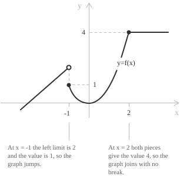
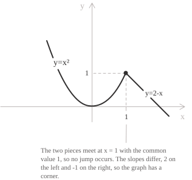
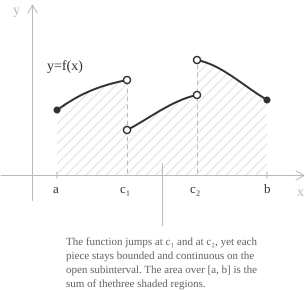

## Definition of a piecewise function

A [function](../functions/) is defined piecewise when its [domain](../determining-the-domain-of-a-function/) is split into separate parts and a different formula is assigned to each part. For a [finite partition](../sets/), let $D \subseteq \mathbb{R}$ and let $D_1, D_2, \ldots, D_n$ be non-empty subsets of $D$ satisfying two conditions:

$$
\begin{align}
D &= D_1 \cup D_2 \cup \cdots \cup D_n \\[6pt]
D_i \cap D_j &= \varnothing \ \text{for}\ i \neq j
\end{align}
$$

If each $f_k \colon D_k \to \mathbb{R}$ is a function, the piecewise function $f \colon D \to \mathbb{R}$ is written as:

$$
f(x) =
\begin{cases}
f_1(x) & \text{if } x \in D_1 \\[6pt]
f_2(x) & \text{if } x \in D_2 \\[6pt]
\ \vdots \\[6pt]
f_n(x) & \text{if } x \in D_n
\end{cases}
$$

The two conditions on the sets $D_k$ make $f$ well-defined. The union covers $D,$ so $f$ has a value at every point of its domain. Pairwise disjointness makes that value unique. Each $f_k$ is a piece of $f.$ When the sets $D_k$ are intervals, the boundary points at which the formula changes are the junction points.

> The subsets $D_k$ are usually [intervals](../intervals/), but nothing in the definition requires this. The [Dirichlet function](../dirichlet-function/) is defined piecewise with $D_1 = \mathbb{Q}$ and $D_2 = \mathbb{R} \setminus \mathbb{Q}.$

- - -

The following function has three pieces and two junction points at $x = -1$ and $x = 2.$ Its definition is:

$$
f(x) =
\begin{cases}
x + 3 & \text{if } x < -1 \\[6pt]
x^2 & \text{if } -1 \le x \le 2 \\[6pt]
4 & \text{if } x > 2
\end{cases}
$$

The three conditions describe the sets $(-\infty, -1),$ $[-1, 2]$ and $(2, +\infty).$ Their union is $\mathbb{R}$ and no two of them share a point, so $f$ is defined on the whole real line and the value at each point is unambiguous. Both endpoints $x = -1$ and $x = 2$ belong to the second piece, since the inequality $-1 \le x \le 2$ is not strict at either end.

## Evaluating a piecewise function and reading its graph

To compute $f(x_0)$ we first decide which condition the number $x_0$ satisfies, then we apply the corresponding formula. For the function above:

$$
\begin{align}
f(-4) &= -4 + 3 = -1 \\[6pt]
f(-1) &= (-1)^2 = 1 \\[6pt]
f(2) &= 2^2 = 4 \\[6pt]
f(5) &= 4
\end{align}
$$

The first line uses the piece $x + 3$ because $-4 < -1.$ The second and third lines use the piece $x^2,$ since both $-1$ and $2$ satisfy $-1 \le x \le 2.$ The last line uses the constant piece, because $5 > 2.$

The same piece-by-piece method determines the range. The linear piece takes all values in $(-\infty, 2),$ the quadratic piece takes all values in $[0, 4],$ and the constant piece takes the single value $4.$ The union of these three sets is $(-\infty, 4].$

- - -

We draw the graph one piece at a time and restrict each formula to the set where it applies. A filled dot marks an endpoint included in a piece, and an open dot marks an endpoint excluded from that piece.

At $x = -1,$ the linear piece has the excluded endpoint $(-1, 2),$ marked by an open dot. The quadratic piece contains $(-1, 1),$ since $f(-1) = 1.$ At $x = 2,$ the quadratic piece contains $(2, 4),$ and the constant piece approaches the same point from the right. The graph is continuous there.

## Continuity at the junction points

On the interior of each piece the function equals a single formula. [Polynomials](../polynomials/) are [continuous](../continuous-functions/) wherever they are defined, and the same holds for the elementary functions that usually appear as pieces. If each formula is continuous on the interval assigned to it, only the junction points require separate continuity checks.

Suppose that the pieces are defined on adjacent intervals, and let $x_0$ be a junction point in the interior of the domain. The function $f$ is continuous at $x_0$ when the two one-sided [limits](../limits/) and the value at the point all agree:

$$\lim_{x \to x_0^-} f(x) = \lim_{x \to x_0^+} f(x) = f(x_0)$$

The left limit is computed with the formula valid immediately to the left of $x_0,$ the right limit with the formula valid immediately to the right. This equality requires both one-sided limits to exist and be finite, the two limits to be equal, and their common value to equal $f(x_0).$

At $x_0 = -1,$ the criterion gives the following limits:

$$
\begin{align}
\lim_{x \to -1^-} f(x) &= \lim_{x \to -1^-} (x + 3) = 2 \\[6pt]
\lim_{x \to -1^+} f(x) &= \lim_{x \to -1^+} x^2 = 1
\end{align}
$$

Both limits are finite and different, so $f$ has a [jump discontinuity](../discontinuities-of-real-functions/) at $x = -1$ of amplitude $|2 - 1| = 1.$ At $x = 2,$ the computation gives equal one-sided limits:

$$
\begin{align}
\lim_{x \to 2^-} f(x) &= \lim_{x \to 2^-} x^2 = 4 \\[6pt]
\lim_{x \to 2^+} f(x) &= \lim_{x \to 2^+} 4 = 4
\end{align}
$$

The two limits coincide and their common value equals $f(2) = 4,$ so $f$ is continuous at $x = 2.$ A piecewise function can therefore be continuous at some junction points and discontinuous at others.

## Choosing a parameter that makes a function continuous

When one of the pieces contains an unknown constant, the continuity criterion becomes an equation in that constant. Consider the function:

$$
g(x) =
\begin{cases}
x^2 & \text{if } x \le 1 \\[6pt]
a - x & \text{if } x > 1
\end{cases}
$$

For every value of $a,$ each formula is continuous on the interior of its interval. Only the junction at $x = 1$ requires a separate check. At this point we compute the two one-sided limits and the value of the function:

$$
\begin{align}
\lim_{x \to 1^-} g(x) &= \lim_{x \to 1^-} x^2 = 1 \\[6pt]
g(1) &= 1^2 = 1 \\[6pt]
\lim_{x \to 1^+} g(x) &= \lim_{x \to 1^+} (a - x) = a - 1
\end{align}
$$

The left limit already agrees with the value of the function, so continuity holds exactly when the right limit takes the same value. This requirement gives a [linear equation](../linear-equations/):

$$a - 1 = 1 \Longrightarrow a = 2$$

With $a = 2$ the function is continuous on $\mathbb{R},$ and for every other value of the constant it has a jump at $x = 1.$

Both pieces approach the common point $(1, 1),$ so the graph has no break at the junction. Their slopes at the junction are different, so the graph has a corner even though the function is continuous.

## Differentiability at the junction points

Continuity at a junction point does not by itself imply differentiability there. The relevant quantities are the one-sided [derivatives](../derivatives/), defined by one-sided limits of the [difference quotient](../difference-quotient/):

$$
\begin{align}
f'_-(x_0) &= \lim_{h \to 0^-} \frac{f(x_0 + h) - f(x_0)}{h} \\[6pt]
f'_+(x_0) &= \lim_{h \to 0^+} \frac{f(x_0 + h) - f(x_0)}{h}
\end{align}
$$

The function is differentiable at $x_0$ when both one-sided derivatives exist, are finite, and are equal. Their common value is then $f'(x_0).$

For the function $g$ with $a = 2,$ the left-hand quotient uses the piece $x^2,$ because $h < 0$ places the point $1 + h$ to the left of the junction:

$$
\begin{align}
\frac{g(1 + h) - g(1)}{h} &= \frac{(1 + h)^2 - 1}{h} \\[6pt]
&= \frac{2h + h^2}{h} \\[6pt]
&= 2 + h
\end{align}
$$

Letting $h \to 0^-$ gives $g'_-(1) = 2.$ The right-hand quotient uses the piece $2 - x,$ since $h > 0$ places the point $1 + h$ to the right of the junction:

$$
\begin{align}
\frac{g(1 + h) - g(1)}{h} &= \frac{(2 - (1 + h)) - 1}{h} \\[6pt]
&= \frac{-h}{h} \\[6pt]
&= -1
\end{align}
$$

Letting $h \to 0^+$ gives $g'_+(1) = -1.$ The two one-sided derivatives are finite and different, so $g$ is not differentiable at $x = 1,$ where the graph has a [corner point](../points-of-non-differentiability/). Away from the junction each piece is differentiated by the usual rules:

$$
g'(x) =
\begin{cases}
2x & \text{if } x < 1 \\[6pt]
-1 & \text{if } x > 1
\end{cases}
$$

Once continuity at $x_0$ has been established, one can differentiate the two adjacent formulas and compare the one-sided limits of their derivatives. This shortcut is valid when each formula is differentiable on the corresponding open interval and both derivative limits exist and are finite. The function is differentiable at the junction exactly when these limits are equal. Without continuity the comparison does not establish differentiability, since a function with a jump has no derivative at the jump regardless of how its pieces behave.

## Standard piecewise-defined functions

Several standard functions have piecewise definitions, including the [absolute value](../absolute-value-function/):

$$
|x| =
\begin{cases}
x & \text{if } x \ge 0 \\[6pt]
-x & \text{if } x < 0
\end{cases}
$$

Both pieces tend to $0$ as $x$ approaches the origin, so $|x|$ is continuous at $x = 0.$ The one-sided derivatives are $-1$ on the left and $1$ on the right, so the function has a corner at the origin and no derivative there.

The [sign function](../sign-function/) has three pieces, with different constant values to the left and right of the origin:

$$
\mathrm{sgn}(x) =
\begin{cases}
-1 & \text{if } x < 0 \\[6pt]
0 & \text{if } x = 0 \\[6pt]
1 & \text{if } x > 0
\end{cases}
$$

The one-sided limits at $0$ are $-1$ and $1,$ so the function jumps by $2$ and is discontinuous at the origin. The middle piece consists of the single point $x = 0,$ so a piece need not be an interval of positive length.

- - -

The floor function assigns to each real number the greatest [integer](../integers/) that does not exceed it. Its pieces are the intervals $[n, n + 1),$ where $n \in \mathbb{Z}.$ More explicitly:

$$\lfloor x \rfloor = n \ \text{for}\ n \le x < n + 1$$

Here the partition has [countably many](../cardinality-and-countable-sets/) pieces rather than finitely many. The same partition principle applies to the family of intervals $[n, n + 1),$ indexed by $n \in \mathbb{Z},$ since each real number lies in exactly one such interval. At an integer $n$ the left limit is $n - 1$ and the right limit is $n,$ so the floor function has a jump of amplitude $1$ at every integer and is continuous from the right there. On each open interval $(n, n + 1)$ it is constant, hence differentiable with zero derivative.

## Piecewise continuous functions

Continuity is sufficient but not necessary for Riemann integrability. Piecewise continuity is a weaker sufficient hypothesis. Fix an increasing list of points $c_0 < c_1 < \cdots < c_n,$ which cuts $[c_0, c_n]$ into the $n$ closed subintervals $[c_{i-1}, c_i].$ Let $f$ be a function whose domain contains $[c_0, c_n]$ with the possible exception of some of the points $c_i.$ We call $f$ piecewise continuous on $[c_0, c_n]$ when its restriction to each open subinterval $(c_{i-1}, c_i)$ has a continuous extension $F_i$ to the corresponding closed subinterval $[c_{i-1}, c_i].$

Since $F_i$ is continuous up to and including both endpoints, the corresponding one-sided limits of $f$ exist and are finite. The [Weierstrass theorem](../weierstrass-theorem/) implies that each $F_i$ is bounded. The definition imposes no condition on the values $f(c_i),$ and $f$ may be undefined at some of these points.

Equivalently, $f$ is piecewise continuous on a closed bounded interval when it is continuous except at finitely many points, has finite left and right limits at each exceptional interior point, and has the appropriate finite one-sided limit at an exceptional endpoint. Each discontinuity is removable or a jump. The function $1/x$ on $[-1, 1]$ is excluded because its one-sided limits at the origin are infinite.

We may assign arbitrary real values at any points $c_i$ where $f$ is undefined. The resulting function is bounded because the functions $F_i$ are bounded and only finitely many point values are added. It is [Riemann integrable](../riemann-integrability-criteria/) because it has only finitely many discontinuities. Its [definite integral](../definite-integrals/) does not depend on these values and can be computed as the sum of the integrals of the auxiliary functions over the corresponding subintervals:

$$\int_{c_0}^{c_n} f(x) \ dx = \sum_{i=1}^{n} \int_{c_{i-1}}^{c_i} F_i(x) \ dx$$

Each term on the right is the integral of a continuous function over a closed bounded interval, so it exists. Changing a function at finitely many points leaves its Riemann integral unchanged, so the values at the points $c_i$ do not affect the formula.

## Integrating a piecewise function

To integrate a piecewise function, we split the interval at the junction points, integrate each piece with its own formula, and add the results. Consider the function:

$$
h(x) =
\begin{cases}
x + 1 & \text{if } 0 \le x < 2 \\[6pt]
6 - x & \text{if } 2 \le x \le 4
\end{cases}
$$

The one-sided limits at $x = 2$ are $3$ from the left and $4$ from the right, so $h$ has a jump there and is not continuous on $[0, 4].$ The formulas $x + 1$ and $6 - x$ extend continuously to $[0, 2]$ and $[2, 4],$ respectively, so $h$ is piecewise continuous and the integral over $[0, 4]$ splits at the junction:

$$\int_0^4 h(x) \ dx = \int_0^2 (x + 1) \ dx + \int_2^4 (6 - x) \ dx$$

We evaluate the two integrals separately. The first one is:

$$
\begin{align}
\int_0^2 (x + 1) \ dx &= \left[ \frac{x^2}{2} + x \right]_0^2 \\[6pt]
&= (2 + 2) - 0 \\[6pt]
&= 4
\end{align}
$$

The second one is:

$$
\begin{align}
\int_2^4 (6 - x) \ dx &= \left[ 6x - \frac{x^2}{2} \right]_2^4 \\[6pt]
&= (24 - 8) - (12 - 2) \\[6pt]
&= 6
\end{align}
$$

Adding the two contributions gives the value of the integral:

$$\int_0^4 h(x) \ dx = 4 + 6 = 10$$

- - -

For an absolute value, we first determine where the expression inside the bars changes sign and split the interval at those points. On the interval $[-1, 2]$ the quantity $x$ changes sign at the origin, so $|x|$ equals $-x$ on $[-1, 0]$ and $x$ on $[0, 2].$ The integral therefore splits at the origin:

$$
\begin{align}
\int_{-1}^{2} |x| \ dx &= \int_{-1}^{0} (-x) \ dx + \int_{0}^{2} x \ dx \\[6pt]
&= \left[ -\frac{x^2}{2} \right]_{-1}^{0} + \left[ \frac{x^2}{2} \right]_{0}^{2} \\[6pt]
&= \frac{1}{2} + 2 \\[6pt]
&= \frac{5}{2}
\end{align}
$$

The origin is the junction point, and the two triangular regions it separates contribute $1/2$ and $2$ to the [total area](../finding-areas-by-integration/).
