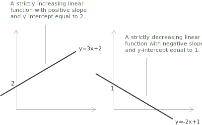
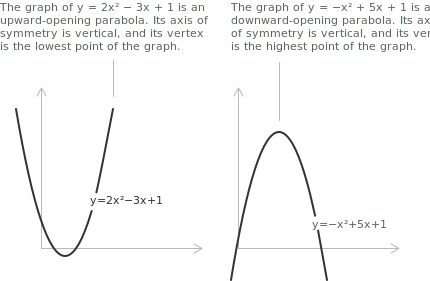
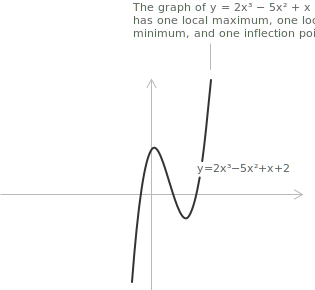

## Definition

A polynomial function is a [function](../functions/) built from [polynomials](../polynomials/), written in the form:

$$
f(x) = a_n x^n + a_{n-1} x^{n-1} + \dotsb + a_1 x + a_0
$$

Here $n$ is a non-negative [integer](../integers/) and the coefficients $a_0, a_1, \ldots, a_n$ are [real numbers](../properties-of-real-numbers/) with $a_n \neq 0.$ The integer $n$ is the degree of the polynomial function and $a_n$ is the leading coefficient. The term $a_0$ is the constant term, and it equals the value of the function at the origin, since $f(0) = a_0.$

Polynomial functions are the simplest class of real functions. They are defined for every real number, they have derivatives of all orders, and their graphs are smooth curves without corners, cusps, or discontinuities of any kind. They generalize the linear, quadratic, and cubic functions, and many quantities in applications are related by polynomial expressions.

## Properties

The [domain](../determining-the-domain-of-a-function/) of any polynomial function is the entire real line $\mathbb{R},$ since the expression $a_n x^n + \dotsb + a_0$ involves only addition and multiplication of real numbers, neither of which restricts the input. The range depends on the degree and on the sign of the leading coefficient $a_n,$ and it may be all of $\mathbb{R}$ or an [interval](../intervals/) of the form $[m, +\infty)$ or $(-\infty, M].$

The following properties hold for every polynomial function, regardless of its degree.

+ Domain: $\mathbb{R}$
+ A polynomial function is [continuous](../continuous-functions/) over all of $\mathbb{R}.$
+ A polynomial function is differentiable over all of $\mathbb{R},$ with [derivatives](../derivatives/) of every order.
+ A non-constant polynomial function has no vertical, horizontal, or oblique [asymptotes](../asymptotes/) distinct from its own graph, since it is defined and finite for every finite value of $x,$ and diverges to infinity as $|x| \to +\infty.$
+ The graph of a polynomial function has no corners, cusps, or [discontinuities](../discontinuities-of-real-functions/).

## Degree 1: linear functions

A polynomial function of degree 1 takes the form:

$$
f(x) = mx + q
$$

where $m \neq 0$ is the slope and $q$ is the y-intercept. Its graph is a straight line. The function is [strictly increasing](../increasing-and-decreasing-functions/) when $m > 0$ and strictly decreasing when $m < 0.$

+ Domain: $\mathbb{R}$
+ Range: $\mathbb{R}$
+ Monotonicity: strictly monotone over $\mathbb{R}$
+ The function is bijective from $\mathbb{R}$ to $\mathbb{R}.$
+ It has no maximum or minimum points.

The graphs below show degree 1 polynomial functions. Each is a straight line, and the sign of the slope determines whether the function is strictly increasing or strictly decreasing.

The graph confirms the properties of a degree 1 function. Since each line is defined for every real value of $x,$ the domain is all of $\mathbb{R},$ and the curve is continuous, with no breaks or discontinuities. The slope is constant, so the first derivative equals $m$ at every point and the second derivative is zero throughout, which means the graph has no concavity and no turning points. The range is again all of $\mathbb{R},$ since the line rises or falls without bound at both ends.

## Degree 2: quadratic functions

A polynomial function of degree 2 takes the form:

$$
f(x) = ax^2 + bx + c
$$

where $a \neq 0.$ Its graph is a [parabola](../parabola/) with a vertical axis of symmetry. The vertex of the parabola is located at:

$$
x_v = -\frac{b}{2a}, \qquad y_v = f(x_v) = c - \frac{b^2}{4a}
$$

The sign of $a$ fixes the concavity of the graph. When $a > 0$ the parabola opens upward, the function is [convex](../convexity-and-concavity-of-functions/), and the vertex is a global minimum. When $a < 0$ the parabola opens downward, the function is concave, and the vertex is a global maximum.

+ Domain: $\mathbb{R}$
+ Range: $\left[ y_v, +\infty \right)$ if $a > 0$; $\left( -\infty, y_v \right]$ if $a < 0$
+ The function is not monotone over all of $\mathbb{R},$ but it is strictly monotone on each of the two half-lines separated by the vertex.

The graphs below show degree 2 polynomial functions for the two signs of the leading coefficient $a.$

Each graph shows the vertex as the single turning point, where the range reaches its bound $y_v$ and the two branches meet the axis of symmetry $x = x_v.$

## Degree 3: cubic functions

A polynomial function of degree 3 takes the form:

$$
f(x) = ax^3 + bx^2 + cx + d
$$

where $a \neq 0.$ Unlike the quadratic case, a cubic function has no [global maximum or minimum](../maximum-minimum-and-inflection-points/), since its values cover all of $\mathbb{R}.$ Its limits at infinity follow the sign of $a:$

$$
\begin{align}
\lim_{x \to -\infty} f(x) &= -\infty \quad \text{if } a > 0 \\[6pt]
\lim_{x \to +\infty} f(x) &= +\infty \quad \text{if } a > 0
\end{align}
$$

When $a < 0$ both limits are reversed. The number of stationary points of a cubic is controlled by the quantity $b^2 - 3ac.$ When $b^2 - 3ac < 0$ the derivative has no real roots and the function has no stationary points; when $b^2 - 3ac = 0$ it has a single stationary point of inflection; when $b^2 - 3ac > 0$ it has two distinct stationary points, a local maximum and a local minimum.

+ Domain: $\mathbb{R}$
+ Range: $\mathbb{R}$
+ The function is bijective from $\mathbb{R}$ to $\mathbb{R}$ if and only if it has no local extrema, equivalently when its derivative does not change sign.
+ It has either zero or two turning points, together with exactly one [inflection point](../maximum-minimum-and-inflection-points/).

Every cubic graph is symmetric under a rotation of $180^\circ$ about its inflection point, whatever the values of the coefficients.

The graph below shows a degree 3 polynomial function with two turning points.

The graph runs from one infinite end to the other, so the range is all of $\mathbb{R}.$ The local maximum and the local minimum are the two turning points, and the inflection point between them is the centre of the $180^\circ$ rotational symmetry.

> The sections that follow hold for every degree, so a separate treatment of quartics, quintics, and higher functions is not needed. The bounds on intercepts, turning points, and inflection points, together with the end behavior, already describe their graphs. Finding the roots is a different matter, since explicit formulas in terms of radicals exist only up to degree four, and the general case is treated for [polynomial equations](../polynomial-equations/).

## End behavior

The end behavior of a polynomial function is determined by its leading term $a_n x^n.$ As $|x|$ grows without bound, the lower-degree terms become negligible in comparison, and $f(x)$ approaches the behavior of the power function $a_n x^n.$ Writing

$$
f(x) = a_n x^n \left( 1 + \frac{a_{n-1}}{a_n x} + \dotsb + \frac{a_0}{a_n x^n} \right)
$$

shows the reason. For large $|x|$ each fraction inside the parentheses tends to zero, so the leading term dictates the sign and the magnitude of $f(x).$ The result depends on two parameters, the parity of $n$ and the sign of $a_n.$

When the degree is even, $x^n$ is non-negative for all $x,$ so both ends of the graph point in the same vertical direction. When the degree is odd, $x^n$ changes sign with $x,$ and the two ends point in opposite directions.

| Degree $n$ | $a_n$ | $\lim_{x \to -\infty} f(x)$ | $\lim_{x \to +\infty} f(x)$ | $x \to -\infty$ | $x \to +\infty$ |
| ---------- | ----- | --------------------------- | --------------------------- | --------------- | --------------- |
| even       | $>0$  | $+\infty$                   | $+\infty$                   | $\nwarrow$      | $\nearrow$      |
| even       | $<0$  | $-\infty$                   | $-\infty$                   | $\swarrow$      | $\searrow$      |
| odd        | $>0$  | $-\infty$                   | $+\infty$                   | $\swarrow$      | $\nearrow$      |
| odd        | $<0$  | $+\infty$                   | $-\infty$                   | $\nwarrow$      | $\searrow$      |

The leading term therefore predicts the qualitative shape of the curve at large scale without a complete study of the function.

## Symmetry

A polynomial function may be symmetric with respect to the y-axis or to the origin, depending on the parity of the degrees of its terms.

+ A polynomial function is [even](../even-and-odd-functions/) if all of its terms have even degree, so that $f(-x) = f(x)$ for all $x.$ Its graph is symmetric with respect to the y-axis.
+ A polynomial function is odd if all of its terms have odd degree, so that $f(-x) = -f(x)$ for all $x.$ Its graph is symmetric with respect to the origin.

Most polynomial functions are neither even nor odd, since they contain terms of mixed parity. For instance, $f(x) = x^3 + x^2$ is neither even nor odd.

## Roots and intersections with the axes

A root of a polynomial function is a value $\alpha \in \mathbb{R}$ such that $f(\alpha) = 0.$ Geometrically, the real roots are the points where the graph crosses or touches the x-axis. [The Fundamental Theorem of Algebra](../roots-of-a-polynomial/) guarantees that every non-constant polynomial has exactly $n$ roots in $\mathbb{C},$ counted with multiplicity. Over $\mathbb{R}$ fewer roots may be present, since some can occur in complex conjugate pairs. Each real root corresponds to a factor, with $\alpha$ a root exactly when $(x-\alpha)$ divides $f(x),$ so a real polynomial function [factors](../factoring-polynomials-ac-method/) into linear factors and irreducible quadratics, where each quadratic comes from a conjugate pair.

The number of real roots is bounded by the degree. A polynomial function of degree $n$ has at most $n$ distinct real roots, so its graph meets the x-axis in at most $n$ points. When the degree is odd, the two ends of the graph run toward $-\infty$ and $+\infty,$ so the curve crosses the x-axis at least once, and the function has at least one real root.

A root $\alpha$ has multiplicity $k$ if $(x-\alpha)^k$ divides $f(x)$ but $(x-\alpha)^{k+1}$ does not. The multiplicity fixes the local behavior of the graph near the root.

+ If $k$ is odd, the graph crosses the x-axis at $x = \alpha.$
+ If $k$ is even, the graph is tangent to the x-axis at $x = \alpha$ and does not cross it.

Near the root the function behaves like $c(x-\alpha)^k,$ so a larger multiplicity makes the graph flatter against the x-axis at $x = \alpha,$ with closer contact before it crosses or turns away.

The y-intercept is always $(0, a_0),$ since $f(0) = a_0.$

## Stationary points and turning points

The stationary points of a polynomial function are the values of $x$ where the [derivative](../derivatives/) vanishes, $f'(x) = 0.$ A stationary point is either a turning point, where the function changes between increasing and decreasing, or a stationary point of inflection, where the curve flattens without changing direction.

If $f$ has degree $n,$ then $f'$ has degree $n-1$ and $f''$ has degree $n-2.$ The equation $f'(x) = 0$ has at most $n-1$ real solutions, so the graph of a polynomial function of degree $n$ has at most $n-1$ stationary points. The same count applied to the second derivative bounds the inflection points. Since $f''(x) = 0$ has at most $n-2$ real solutions, the graph has at most $n-2$ inflection points.

A lower bound comes from the roots. By [Rolle's theorem](../rolle-theorem/), between two consecutive real roots of $f$ there is at least one root of $f',$ hence at least one stationary point. A polynomial function with $r$ distinct real roots therefore has at least $r-1$ stationary points, and when all $n$ roots are real and simple the $n-1$ roots of $f'$ are real as well and lie one in each gap between them.

When the degree $n$ is even, the derivative $f'$ has odd degree $n-1.$ Its graph runs from $-\infty$ to $+\infty,$ so $f'$ changes sign at least once, and the function has at least one turning point. A polynomial function of even degree always has a turning point, which matches the fact that its graph bends back from the common direction of its two ends.

## Derivative and integral of a polynomial function

The [derivative](../derivatives/) of a polynomial function is computed term by term with the power rule. For the monomial $a_k x^k$ the rule gives:

$$
\frac{d}{dx}\left( a_k x^k \right) = k a_k x^{k-1}
$$

Applying this to the full polynomial yields:

$$
f'(x) = n a_n x^{n-1} + (n-1) a_{n-1} x^{n-2} + \dotsb + a_1
$$

The derivative is a polynomial of degree $n-1,$ and the constant term disappears, since the derivative of a constant is zero. A polynomial function is infinitely differentiable over $\mathbb{R},$ and differentiation can be repeated until the zero polynomial is reached.

- - -

The [indefinite integral](../indefinite-integrals/) of a polynomial function is computed by applying the power rule for integration to each term:

$$
\int x^k \ dx = \frac{x^{k+1}}{k+1} + c
$$

Integrating the full polynomial gives:

$$
\int f(x) \ dx = \frac{a_n}{n+1} x^{n+1} + \frac{a_{n-1}}{n} x^n + \dotsb + \frac{a_1}{2} x^2 + a_0 x + c
$$

where $c \in \mathbb{R}$ is the constant of integration. The result is a polynomial of degree $n+1.$
