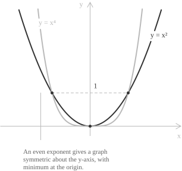
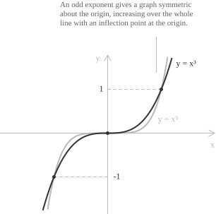
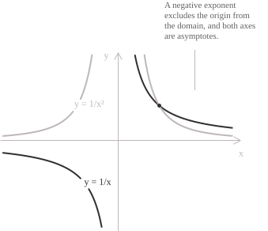
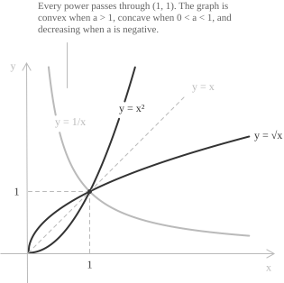

## Definition

A power function is a [function](../functions/) of the form:

$$f(x) = x^a \qquad a \in \mathbb{R}$$

The exponent $a$ is a fixed [real number](../real-numbers/) and the variable is the base. In an [exponential function](../exponential-function/) $g(x) = b^x,$ the base $b > 0$ is fixed and the variable $x$ is the exponent. The condition $b \neq 1$ excludes the constant case. For an arbitrary real exponent the [power](../powers/) is defined through the [natural logarithm](../logarithms/) and the exponential function:

$$x^a := e^{a\ln x} \qquad x > 0$$

Every power function is defined on the half-line $(0, +\infty),$ regardless of the real exponent. Whether the definition extends to $x \leq 0$ depends on the value of $a.$

A constant factor gives the more general form $f(x) = kx^a$ with $k \neq 0.$ Its [absolute value](../absolute-value/) $|k|$ rescales the vertical coordinates, and a negative value of $k$ also reflects the graph across the $x$-axis. The domain remains unchanged.

## Domain

The [domain](../determining-the-domain-of-a-function/) depends on the type of exponent. A [rational](../rational-numbers/) exponent must first be written in lowest terms as $p/q,$ because the reduced denominator determines whether negative bases are admissible.

[class="table-1 -right"]

| Exponent $a$                                  | Domain                       |
| :-------------------------------------------- | :--------------------------- |
| positive integer                              | $\mathbb{R}$                 |
| negative integer                              | $\mathbb{R} \setminus \{0\}$ |
| $p/q$ in lowest terms, $q$ odd, $p > 0$       | $\mathbb{R}$                 |
| $p/q$ in lowest terms, $q$ odd, $p < 0$       | $\mathbb{R} \setminus \{0\}$ |
| $p/q$ in lowest terms, $q$ even, $p > 0$      | $[0, +\infty)$               |
| $p/q$ in lowest terms, $q$ even, $p < 0$      | $(0, +\infty)$               |
| [irrational](../irrational-numbers/), $a > 0$ | $[0, +\infty)$               |
| irrational, $a < 0$                           | $(0, +\infty)$               |
[/class]

The reduction to lowest terms cannot be skipped. The exponents $2/6$ and $1/3$ denote the same rational number, and only the reduced form gives the power at a negative base. Reading the reduced exponent as a cube root gives $(-8)^{1/3} = \sqrt[3]{-8} = -2,$ while reading the unreduced one as $\sqrt[6]{(-8)^2}$ would give $2.$ The two readings agree for $x \geq 0,$ and the definition of a real power at a negative base uses the reduced fraction. The same caution applies to the [radicals](../radicals/) treated in [irrational functions](../irrational-functions/).

The exponent $a = 0$ is a separate case. The identity $x^0 = 1$ holds for every $x \neq 0,$ so the power function reduces to the constant $1$ on $\mathbb{R} \setminus \{0\},$ and the value at the origin depends on the convention adopted for $0^0.$

## Even natural exponents

Let $f(x) = x^n$ with $n$ an even positive integer. The domain is $\mathbb{R}$ and the range is $[0, +\infty),$ since an even power of a real number is never negative.

+ Domain: $\mathbb{R}$
+ Range: $[0, +\infty)$
+ The function is [even](../even-and-odd-functions/), so its graph is symmetric about the $y$-axis.
+ [Monotonicity](../increasing-and-decreasing-functions/): strictly decreasing on $(-\infty, 0]$ and strictly increasing on $[0, +\infty)$
+ The origin is the [minimum point](../maximum-minimum-and-inflection-points/), with $f(0) = 0.$
+ The graph is [convex](../convexity-and-concavity-of-functions/) over $\mathbb{R}.$
+ The function is [continuous](../continuous-functions/) and differentiable over $\mathbb{R}.$

The [limits](../limits/) at the two ends of the domain coincide:

$$\lim_{x \to -\infty} x^n = \lim_{x \to +\infty} x^n = +\infty$$

Every graph of this family passes through $(-1, 1),$ $(0, 0)$ and $(1, 1).$ If $m > n$ are even positive integers, then $x^m < x^n$ for $0 < |x| < 1,$ while $x^m > x^n$ for $|x| > 1.$ The case $n = 2$ is the [parabola](../parabola/) $y = x^2.$

An even power is not injective on $\mathbb{R},$ because $f(-x) = f(x).$ Restricted to $[0, +\infty)$ it becomes a bijection onto $[0, +\infty),$ and its [inverse](../inverse-function/) there is the root $y = \sqrt[n]{x}.$

## Odd natural exponents

Let $f(x) = x^n$ with $n$ an odd integer greater than one. The exponent $n = 1$ gives the identity function $y = x,$ whose graph is the bisector of the first and third quadrants.

+ Domain: $\mathbb{R}$
+ Range: $\mathbb{R}$
+ The function is odd, so its graph is symmetric about the origin.
+ Monotonicity: strictly increasing over $\mathbb{R}$
+ The function is bijective from $\mathbb{R}$ to $\mathbb{R}.$
+ The graph is concave on $(-\infty, 0]$ and convex on $[0, +\infty).$
+ The origin is an inflection point with horizontal tangent.

The limits at the two ends of the domain have opposite signs:

$$\lim_{x \to -\infty} x^n = -\infty \qquad \lim_{x \to +\infty} x^n = +\infty$$

Since $n - 1$ is even and positive, the derivative $nx^{n-1}$ is positive on both sides of the origin and vanishes at the origin. Thus the origin is a [stationary point](../maximum-minimum-and-inflection-points/) but not an extremum. Since the function is a bijection from $\mathbb{R}$ onto $\mathbb{R},$ its inverse $y = \sqrt[n]{x}$ is defined on the whole line, unlike the even case.

## Negative integer exponents

Let $f(x) = x^{-n} = 1/x^n$ with $n$ a positive integer. Since the denominator vanishes at the origin, the domain is $\mathbb{R} \setminus \{0\}.$ The function has no zeros because its numerator is $1.$

The function $x^{-n}$ has the same parity as $x^n,$ because $(-x)^{-n} = (-1)^n x^{-n}.$ When $n$ is even the function is even, its range is $(0, +\infty),$ and the two branches both lie above the $x$-axis. The function increases on $(-\infty, 0)$ and decreases on $(0, +\infty),$ and both branches are convex. When $n$ is odd the function is odd, its range is $\mathbb{R} \setminus \{0\},$ and the branches occupy opposite quadrants. The function decreases on each branch, and it is concave on $(-\infty, 0)$ and convex on $(0, +\infty).$

> A function that decreases on each branch need not be decreasing on its disconnected domain. The function $f(x) = 1/x$ decreases on $(-\infty, 0)$ and on $(0, +\infty),$ yet $-1 < 1$ while $f(-1) = -1 < 1 = f(1).$ A decreasing function must reverse every inequality between points of its domain, but $1/x$ does not reverse this inequality for points on different branches.

The case $n = 1$ gives $y = 1/x,$ the rectangular [hyperbola](../hyperbola/) of equation $xy = 1.$ It is the basic model of a simple pole in the study of [rational functions](../rational-functions/).

The limits that determine the [asymptotes](../asymptotes/) are:

$$
\begin{align}
\lim_{x \to 0^{+}} x^{-n} &= +\infty \\[6pt]
\lim_{x \to \pm\infty} x^{-n} &= 0
\end{align}
$$

The line $x = 0$ is a vertical asymptote and the line $y = 0$ is a horizontal asymptote. The one-sided limit at the origin from the left equals $+\infty$ when $n$ is even and $-\infty$ when $n$ is odd.

## Rational and real exponents

On the half-line $(0, +\infty)$ the power $x^a$ is defined for every real exponent. All the graphs pass through $(1, 1),$ since $1^a = 1$ for every $a.$

The sign of the exponent controls the monotonicity, and the limits at the two ends of the half-line follow from $x^a = e^{a\ln x}$:

$$
\lim_{x \to 0^{+}} x^{a} =
\begin{cases}
0 & \text{if } a > 0 \\[6pt]
+\infty & \text{if } a < 0
\end{cases}
\qquad
\lim_{x \to +\infty} x^{a} =
\begin{cases}
+\infty & \text{if } a > 0 \\[6pt]
0 & \text{if } a < 0
\end{cases}
$$

For $a > 0$ the function increases from $0$ to $+\infty$ and extends continuously to $x = 0$ by setting $0^a = 0.$ For $a < 0$ it decreases from $+\infty$ to $0.$ For $a = 0$ it is constant.

Two exponents can be compared at a fixed base. If $a < b,$ then

$$x^{a} > x^{b} \quad \text{for } 0 < x < 1, \qquad x^{a} < x^{b} \quad \text{for } x > 1$$

The order reverses as $x$ passes through $1$ because $x^{b}/x^{a} = x^{b-a}$ with $b - a > 0,$ and a positive power of $x$ is smaller than $1$ when $0 < x < 1$ and larger than $1$ when $x > 1.$

For $0 < a < 1,$ the graph is concave, while for $a > 1$ it is convex. The square root $y = x^{1/2}$ belongs to the first group and $y = x^{2}$ to the second. The two curves are reflections of each other across the bisector $y = x,$ since they are mutually inverse on $[0, +\infty).$

## Symmetry

For an integer exponent $n,$ we have

$$(-x)^{n} = (-1)^{n}x^{n}$$

The factor $(-1)^n$ equals $1$ for even $n$ and $-1$ for odd $n,$ so $x^n$ is an [even function](../even-and-odd-functions/) exactly when $n$ is even and an odd function exactly when $n$ is odd.

A rational exponent $p/q$ in lowest terms with $q$ odd admits negative bases, and the same computation applies with $(-1)^{p/q} = (-1)^{p}.$ The function is even when $p$ is even and odd when $p$ is odd. When $q$ is even, or when the exponent is irrational, the domain contains no negative number and the question of symmetry does not arise.

## Derivative

On $(0, +\infty)$ the derivative formula holds for every real exponent. Writing $x^a = e^{a\ln x}$ and applying the [chain rule](../chain-rule/) gives

$$
\begin{align}
\frac{d}{dx}x^{a} &= e^{a\ln x}\frac{a}{x} \\[6pt]
&= x^{a}\frac{a}{x} \\[6pt]
&= ax^{a-1}
\end{align}
$$

For positive integer exponents the formula holds on $\mathbb{R},$ while for negative integer exponents it holds on $\mathbb{R} \setminus \{0\}.$ For $a = 0,$ the [derivative](../derivatives/) is zero wherever the function is defined. For $a \neq 0,$ the derivative is a constant multiple of the power function with exponent $a - 1.$

The [second derivative](../higher-order-derivatives/) determines the concavity on the half-line:

$$\frac{d^{2}}{dx^{2}}x^{a} = a(a-1)x^{a-2}$$

Since $x^{a-2} > 0$ for $x > 0,$ the sign of the second derivative is the sign of $a(a-1).$ The product is positive for $a < 0$ and for $a > 1,$ where the graph is convex, and negative for $0 < a < 1,$ where the graph is concave. The exponents $a = 0$ and $a = 1$ give straight lines, whose second derivative vanishes.

The first derivative also describes the graph near the origin when $a > 0.$ As $x \to 0^{+},$ the quantity $ax^{a-1}$ tends to $0$ for $a > 1$ and to $+\infty$ for $0 < a < 1.$ The graph therefore meets the origin with a horizontal tangent in the first case and with a vertical half-tangent in the second. In the second case the right difference quotient diverges, so the continuous extension has a [point of non-differentiability](../points-of-non-differentiability/) at the origin.

## Integral

For $a \neq -1,$ differentiating $x^{a+1}/(a+1)$ gives $x^a.$ Hence the [indefinite integral](../indefinite-integrals/) on $(0, +\infty)$ is:

$$\int x^{a} \ dx = \frac{x^{a+1}}{a+1} + c \qquad a \neq -1$$

When $a = -1,$ the denominator in the preceding expression vanishes. The primitive in that case is the logarithm:

$$\int \frac{1}{x} \ dx = \ln|x| + c$$

## Comparison of growth rates

Two power functions with positive exponents both diverge at infinity, and the function with the larger exponent grows faster. For $0 < a < b$:

$$\lim_{x \to +\infty}\frac{x^{a}}{x^{b}} = \lim_{x \to +\infty}x^{a-b} = 0$$

The quotient is a power with negative exponent, so it tends to zero, which means $x^a$ is [negligible](../little-o-notation/) with respect to $x^b.$ Positive powers can also be compared with [logarithmic](../logarithmic-function/) and exponential functions. For every $a > 0$ and every $c > 1$:

$$\ln x = o(x^{a}) \qquad x^{a} = o(c^{x}) \qquad x \to +\infty$$

A logarithm grows more slowly than every positive power, and every positive power grows more slowly than every exponential with base greater than one.

## Power function and exponential function

Power and exponential functions have different scaling laws. For a power function on $(0, +\infty),$ multiplying the input by a factor $\lambda > 0$ multiplies the output by a factor that depends on $\lambda$ alone:

$$f(\lambda x) = (\lambda x)^{a} = \lambda^{a}f(x)$$

For an exponential function $g(x) = c^x$ with $c > 0$ and $c \neq 1,$ adding $h$ to the input multiplies the output by $c^h$:

$$g(x + h) = c^{x+h} = c^{h}g(x)$$

A power function turns a fixed ratio of inputs into a fixed ratio of outputs, while an exponential function turns a fixed difference of inputs into a fixed ratio of outputs. The area of a square as a function of the length of its side is a power law, while a population that multiplies by a fixed factor over equal intervals obeys an exponential law.

## Example

We study the function

$$f(x) = x^{5/3} = \sqrt[3]{x^{5}}$$

The exponent $5/3$ is in lowest terms with odd denominator and positive numerator, so the domain is $\mathbb{R}.$ The numerator is odd, hence $f$ is an odd function and its graph is symmetric about the origin. The only zero is $x = 0.$

- - -

For $x \neq 0,$ we have $f(x) = x\sqrt[3]{x^2},$ and the [product rule](../differentiation-rules/) and chain rule give

$$
\begin{align}
f'(x) &= \sqrt[3]{x^2} + \frac{2x^2}{3(x^2)^{2/3}} \\[6pt]
&= \frac{5}{3}x^{2/3} \\[6pt]
&= \frac{5}{3}\sqrt[3]{x^2}
\end{align}
$$

The cube root of a square is positive for every $x \neq 0,$ so $f'$ is positive on both half-lines. At the origin the [difference quotient](../difference-quotient/) is

$$f'(0) = \lim_{h \to 0}\frac{h^{5/3}}{h} = \lim_{h \to 0}h^{2/3} = 0$$

The graph therefore has a horizontal tangent at the origin. The function is strictly increasing on each half-line, and $f(x) < 0$ for $x < 0,$ while $f(0) = 0$ and $f(x) > 0$ for $x > 0.$ These facts show that $f$ is strictly increasing over $\mathbb{R}.$ Since the derivative does not change sign, the origin is a stationary point but not an extremum.

- - -

For $x \neq 0,$ the second derivative is

$$f''(x) = \frac{10}{9}x^{-1/3} = \frac{10}{9\sqrt[3]{x}}$$

It is negative for $x < 0$ and positive for $x > 0,$ so the graph is concave on $(-\infty, 0)$ and convex on $(0, +\infty).$ The second derivative is undefined at $x = 0,$ but its sign changes there, so the origin is an inflection point with horizontal tangent.

- - -

The limits at the ends of the domain are

$$\lim_{x \to -\infty}f(x) = -\infty \qquad \lim_{x \to +\infty}f(x) = +\infty$$

Since $f$ is continuous, these limits and the [intermediate value theorem](../intermediate-value-theorem/) show that its range is $\mathbb{R}.$ The function is strictly increasing, so it is a bijection from $\mathbb{R}$ onto $\mathbb{R}.$ Its inverse is the power function with reciprocal exponent:

$$f^{-1}(x) = x^{3/5}$$

Since $x^{5/3}/x = x^{2/3}$ tends to $+\infty$ as $x \to \pm\infty,$ the graph has no oblique asymptote. The endpoint limits above also rule out horizontal asymptotes.
