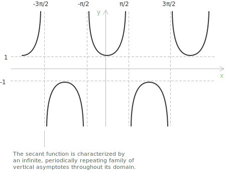

## Introduction

> The geometric construction of the secant from the [unit circle](../unit-circle/) is developed in [secant and cosecant](../secant-and-cosecant/). Here, the secant is treated as a real [function](../functions/) of a real variable.

The secant function $f(x) = \sec(x)$ assigns to each angle $x,$ measured in [radians](../angles-and-angular-measure/), the reciprocal of its [cosine](../cosine-function/) value, defined wherever $\cos(x) \neq 0.$ Its graph is a periodic curve with period $2\pi$ and has vertical [asymptotes](../asymptotes/) where the cosine of $x$ vanishes, at $x = \pi/2 + k\pi$ with $k \in \mathbb{Z}.$ The [domain](../determining-the-domain-of-a-function/) is the set of all real numbers except these points, and the range is $(-\infty, -1] \cup [1, +\infty).$

The secant is the reciprocal of the cosine, so it stays bounded where the cosine is near $\pm 1$ and grows without bound as the cosine approaches zero:

$$\sec(x) = \frac{1}{\cos(x)}$$

Because the cosine never exceeds $1$ in absolute value, its reciprocal never falls between $-1$ and $1,$ and each branch reaches a single extremum of $1$ or $-1$ where the cosine equals $\pm 1$ before diverging toward the neighbouring asymptotes.

## Properties

The following properties of the secant function follow from its definition as the reciprocal of the cosine.

+ [Domain](../determining-the-domain-of-a-function/): $\{\ x \in \mathbb{R} \mid x \neq \frac{\pi}{2} + k\pi \ \text{ for all } k \in \mathbb{Z} \ \}$
+ Range: $y \in (-\infty, -1] \cup [1, +\infty)$
+ Periodicity: periodic in $x$ with period $2\pi$
+ Parity: [even](../even-and-odd-functions/), with $\sec(-x) = \sec(x)$
+ The graph has vertical [asymptotes](../asymptotes/) at $x = \frac{\pi}{2} + k\pi$ with $k \in \mathbb{Z}$

## Relation with the tangent

The secant and the [tangent](../tangent-function/) are tied by a [Pythagorean identity](../pythagorean-identity/). Dividing $\sin^2(x) + \cos^2(x) = 1$ by $\cos^2(x)$ and using the reciprocal definitions gives:

$$\sec^2(x) = 1 + \tan^2(x)$$

The two functions share the same vertical asymptotes, and the secant grows together with the tangent. The relation recurs in the derivatives and integrals of the reciprocal trigonometric functions.

## Limits, derivatives, and integrals of the secant function

Near the origin the cosine reaches its maximum, so the secant takes its least positive value:

$$\lim_{x \to 0} \sec(x) = 1$$

The behaviour near the first vertical asymptote is described by one-sided limits. As $x$ approaches $\pi/2$ from the left the cosine is positive and tends to zero, so the function grows without bound,

$$\lim_{x \to \frac{\pi}{2}^-} \sec(x) = +\infty$$

while from the right the cosine is negative and the values diverge to negative infinity,

$$\lim_{x \to \frac{\pi}{2}^+} \sec(x) = -\infty$$

The function is [continuous](../continuous-functions/) and differentiable on its domain. Its [derivative](../derivatives/) is:

$$\frac{d}{dx}\sec(x) = \sec(x)\tan(x)$$

The [indefinite integral](../indefinite-integrals/) is:

$$\int \sec(x) \ dx = \ln\left|\sec(x) + \tan(x)\right| + c$$

> A broader treatment of trigonometric integrals, with the transformation and substitution techniques for the more complex cases, is given in [trigonometric function integrals](../integral-of-trigonometric-functions/).

The secant function can also be written using [imaginary](../complex-numbers/) numbers. With $e^{ix}$ the [exponential function](../exponential-function/) of base $e$ and $i$ the imaginary unit, [Euler's formula](../eulers-formula/) gives:

$$\sec(x) = \frac{2}{e^{ix} + e^{-ix}}$$
