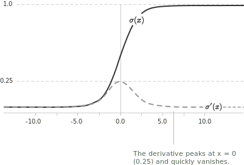
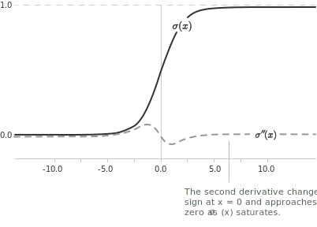

## Definition

The sigmoid function is a real-valued [function](../functions/) of a real variable that takes values strictly between $0$ and $1,$ approaching each extreme [asymptotically](../asymptotes/). It maps the real line smoothly onto the [unit interval](../intervals/) and is used in analysis and machine learning. It is defined by:

$$\sigma(x) = \frac{1}{1 + e^{-x}}$$

Multiplying numerator and denominator by $e^x$ gives the equivalent form:

$$\sigma(x) = \frac{e^x}{e^x + 1}$$

+ The [domain](../determining-the-domain-of-a-function/) is $\mathbb{R},$ while the range is the open interval $(0,1).$
+ The function is strictly increasing on $\mathbb{R},$ since its [derivative](../derivatives/) is always positive, and is therefore bijective from $\mathbb{R}$ onto $(0,1).$
+ The function has no local extrema and exactly one [inflection point](../maximum-minimum-and-inflection-points/) at $(0, \frac{1}{2}).$
+ The [limits](../limits/) at infinity are $\lim_{x \to -\infty} \sigma(x) = 0$ and $\lim_{x \to +\infty} \sigma(x) = 1.$

> The S-shaped curve corresponds to three regimes: slow growth for very negative values of $x,$ a rapid transition near the origin, and saturation for very positive values.

## Properties of the sigmoid function

The function satisfies a symmetry relation with respect to the origin:

$$\sigma(-x) = 1 - \sigma(x)$$

Direct substitution verifies this identity, which implies that the graph of $\sigma$ is symmetric about the point $(0, \frac{1}{2}).$ The value at the origin is:

$$\sigma(0) = \frac{1}{1 + e^{0}} = \frac{1}{2}$$

The limits at the extremes of the real line are:

$$\lim_{x \to -\infty} \sigma(x) = 0 \qquad \lim_{x \to +\infty} \sigma(x) = 1$$

The lines $y = 0$ and $y = 1$ are therefore [horizontal asymptotes](../asymptotes/) of the graph.

## Derivative of the sigmoid function

The derivative can be expressed in terms of the function itself:

$$\sigma'(x) = \sigma(x)(1 - \sigma(x))$$

We verify the identity by direct computation. Writing $\sigma(x) = (1 + e^{-x})^{-1}$ and applying the [chain rule](../chain-rule/) gives:

$$\sigma'(x) = \frac{e^{-x}}{(1 + e^{-x})^2}$$

Writing the numerator as $(1 + e^{-x}) - 1$ separates the expression into a product:

$$
\begin{align}
\sigma'(x) &= \frac{1}{1 + e^{-x}} \cdot \frac{e^{-x}}{1 + e^{-x}} \\[6pt]
&= \sigma(x)(1 - \sigma(x))
\end{align}
$$

Since $\sigma(x) \in (0, 1)$ for every $x \in \mathbb{R},$ the derivative is strictly positive, which confirms that the function is [strictly increasing](../increasing-and-decreasing-functions/). The derivative attains its maximum at $x = 0,$ where $\sigma'(0) = \frac{1}{4}.$

## Second derivative and concavity

The [second derivative](../higher-order-derivatives/) is obtained by differentiating $\sigma'(x) = \sigma(x)(1 - \sigma(x)).$ Applying the [product rule](../differentiation-rules/) and substituting the expression for $\sigma'(x)$ gives:

$$
\begin{align}
\sigma''(x) &= \sigma'(x)(1 - \sigma(x)) - \sigma(x)\sigma'(x) \\[6pt]
&= \sigma'(x)(1 - 2\sigma(x)) \\[6pt]
&= \sigma(x)(1 - \sigma(x))(1 - 2\sigma(x))
\end{align}
$$

The sign of $\sigma''(x)$ depends only on the factor $1 - 2\sigma(x),$ since $\sigma(x)(1 - \sigma(x)) > 0$ for all $x \in \mathbb{R}.$ Because $\sigma$ is strictly increasing and $\sigma(0) = \frac{1}{2},$ the factor $1 - 2\sigma(x)$ is positive for $x < 0$ and negative for $x > 0.$

The function is therefore [concave upward](../convexity-and-concavity-of-functions/) on $(-\infty, 0)$ and concave downward on $(0, +\infty).$ The point $x = 0$ is an inflection point, where $\sigma''(0) = 0$ and the concavity changes sign.

## Relation to the logistic function

The sigmoid function is the special case of the logistic function with growth rate equal to $1$ and inflection point at the origin. The general logistic function is:

$$f(x) = \frac{L}{1 + e^{-k(x - x_0)}}$$

Here $L$ denotes the upper asymptotic value, $k$ the growth rate, and $x_0$ the inflection point. The standard sigmoid function corresponds to $L = 1,$ $k = 1,$ and $x_0 = 0.$

The derivative identity $\sigma'(x) = \sigma(x)(1 - \sigma(x))$ shows that $\sigma$ is a solution of the logistic differential equation $y' = y(1 - y).$ The right-hand side is smooth, so the initial condition $y(0) = \frac{1}{2}$ determines $\sigma$ as the unique solution. The general logistic function solves $y' = ky\left(1 - \dfrac{y}{L}\right)$ in the same way.

## Limit to the step function

For the scaled sigmoid $\sigma(kx) = \dfrac{1}{1 + e^{-kx}},$ a larger $k$ compresses the transition around the origin while the asymptotic values $0$ and $1$ stay fixed. As $k \to +\infty,$ the function converges pointwise to the Heaviside step function:

$$
\lim_{k \to +\infty} \sigma(kx) =
\begin{cases}
0 & x < 0 \\[6pt]
\dfrac{1}{2} & x = 0 \\[6pt]
1 & x > 0
\end{cases}
$$

At the origin the limit equals $\frac{1}{2},$ since $\sigma(0) = \frac{1}{2}$ for every $k.$ The scaled sigmoid is therefore a smooth approximation of the step function, with the discontinuity recovered only in the limit.

## Relation to the hyperbolic tangent

The sigmoid function and the [hyperbolic tangent](../hyperbolic-tangent-and-cotangent/) $\tanh$ satisfy the identity:

$$\sigma(x) = \frac{1 + \tanh\left(\dfrac{x}{2}\right)}{2}$$

An equivalent form is:

$$\tanh(x) = 2\sigma(2x) - 1$$

The two functions differ by a vertical translation and a rescaling. The sigmoid maps $\mathbb{R}$ onto $(0, 1),$ while the hyperbolic tangent maps $\mathbb{R}$ onto $(-1, 1).$ Both are S-shaped and saturate at the extremes.

## The sigmoid as a distribution function

The sigmoid function is [continuous](../continuous-functions/), strictly increasing, and satisfies $\lim_{x \to -\infty} \sigma(x) = 0$ and $\lim_{x \to +\infty} \sigma(x) = 1.$ These are the defining properties of a cumulative distribution function, and $\sigma$ is the distribution function of the standard logistic distribution. Its density is the derivative:

$$\sigma'(x) = \sigma(x)(1 - \sigma(x)) = \frac{e^{-x}}{(1 + e^{-x})^2}$$

The density is [even](../even-and-odd-functions/), since $\sigma'(-x) = \sigma'(x)$ follows from the symmetry $\sigma(-x) = 1 - \sigma(x),$ and it is bell-shaped with its maximum at the origin. The inverse of $\sigma$ is then the quantile function of this distribution.

## Inverse of the sigmoid function

Since the sigmoid function is strictly monotone, it admits an [inverse](../inverse-function/) defined on $(0, 1).$ This inverse is the logit function:

$$\sigma^{-1}(p) = \ln\left(\frac{p}{1-p}\right)$$

The argument of the [logarithm](../logarithms/) is the odds ratio. The logit function maps a probability $p \in (0,1)$ to the corresponding value on the log-odds scale.

## Example

Consider computing the value of the sigmoid function at $x = 2$ and checking that its derivative there agrees with the formula $\sigma'(x) = \sigma(x)(1 - \sigma(x)).$ The value of the function is:

$$\sigma(2) = \frac{1}{1 + e^{-2}}$$

Since $e^{-2} \approx 0.1353,$ we obtain:

$$\sigma(2) \approx \frac{1}{1.1353} \approx 0.8808$$

Applying the derivative formula gives:

$$\sigma'(2) = \sigma(2)(1 - \sigma(2)) \approx 0.8808 \cdot 0.1192 \approx 0.1050$$

The derivative of the sigmoid function at $x = 2$ is approximately $0.1050.$ Since $\sigma(2) \approx 0.88$ lies close to the upper asymptote, the function changes slowly there and the derivative is small.
