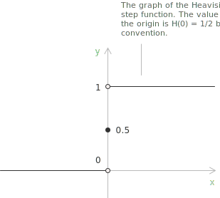

## Introduction to the sign function

The sign function assigns to each real number its sign, disregarding its magnitude. The function is defined as follows:

$$
\mathrm{sgn}(x) =
\begin{cases}
-1 & \text{if } x < 0 \\[6pt]
0 & \text{if } x = 0 \\[6pt]
1 & \text{if } x > 0
\end{cases}
\quad \forall \ x \in \mathbb{R}
$$

The function returns $-1$ for negative values, $0$ when $x = 0,$ and $1$ for positive values. It does not quantify the magnitude of $x$ but indicates the position of $x$ relative to zero. Applying the definition we have:

$$
\mathrm{sgn}(-7) = -1 \qquad \mathrm{sgn}(0) = 0 \qquad \mathrm{sgn}(4) = 1
$$

- - -

The graph of $y = \mathrm{sgn}(x)$ consists of two horizontal rays and one isolated point. The ray on $y = -1$ extends over all $x < 0,$ the ray on $y = 1$ extends over all $x > 0,$ and the isolated point at the origin $(0, 0)$ lies on $y = 0.$ The two rays approach but do not intersect the y-axis.

The sign function is an [odd function](../even-and-odd-functions/) because it satisfies the identity:

$$
\mathrm{sgn}(-x) = -\mathrm{sgn}(x) \quad \forall \ x \in \mathbb{R}
$$

The sign function is one of the simplest examples of a discontinuous function. It appears in absolute values, piecewise definitions, distribution theory, and differential equations.

## Properties

+ [Domain](../determining-the-domain-of-a-function/): $\mathbb{R}.$
+ Range: $\{-1,\ 0,\ 1\}.$
+ The function is [odd](../even-and-odd-functions/), since $\mathrm{sgn}(-x) = -\mathrm{sgn}(x).$
+ The function has exactly one root at $x = 0,$ since $\mathrm{sgn}(x) = 0$ only when $x = 0.$
+ The function is constant on $(-\infty, 0)$ and on $(0, +\infty),$ so it never decreases on either piece, which makes it [non-decreasing](../increasing-and-decreasing-functions/) over $\mathbb{R}.$
+ The function has a [jump discontinuity](../discontinuities-of-real-functions/) at $x = 0$ and is [continuous](../continuous-functions/) everywhere else.
+ The function is not differentiable at $x = 0.$ It is differentiable, with zero [derivative](../derivatives/), at every other point.
+ The function is multiplicative, since $\mathrm{sgn}(xy) = \mathrm{sgn}(x)\mathrm{sgn}(y)$ for all $x, y \in \mathbb{R}.$ Restricted to $\mathbb{R} \setminus \{0\},$ it is a homomorphism from the multiplicative group $(\mathbb{R}^*, \cdot)$ onto $\{-1, 1\}.$

The two one-sided limits at the origin are:

$$
\begin{align}
\lim_{x \to 0^-} \mathrm{sgn}(x) &= -1 \\[6pt]
\lim_{x \to 0^+} \mathrm{sgn}(x) &= 1
\end{align}
$$

Since the two one-sided limits differ, the two-sided limit does not exist:

$$\lim_{x \to 0} \mathrm{sgn}(x)$$

## Limits at infinity

As $x$ moves away from the origin in either direction, the sign function stays at a constant value:

$$
\begin{align}
\lim_{x \to -\infty} \mathrm{sgn}(x) &= -1 \\[6pt]
\lim_{x \to +\infty} \mathrm{sgn}(x) &= 1
\end{align}
$$

These follow from the fact that $\mathrm{sgn}(x) = -1$ for all $x < 0$ and $\mathrm{sgn}(x) = 1$ for all $x > 0,$ so the function value does not change as $x$ moves further from zero.

## Derivative and integral

On each of the two open half-lines where the sign function is constant, its [derivative](../derivatives/) is zero:

$$
\frac{d}{dx} \mathrm{sgn}(x) = 0 \quad \text{for } x \neq 0
$$

At $x = 0$ the derivative does not exist because the function is discontinuous there. In the sense of distributions, however, the derivative of the sign function is:

$$
\frac{d}{dx} \mathrm{sgn}(x) = 2\delta(x)
$$

$\delta(x)$ is the Dirac delta, a generalised function that is zero everywhere except at the origin and whose total integral over the real line equals one.

> The Dirac delta can be pictured as a spike of unit area concentrated at a single point.

This distributional identity records a jump of amplitude $2$ at the origin, since:

$$
\begin{align}
\lim_{x \to 0^-} \mathrm{sgn}(x) &= -1 \\[6pt]
\lim_{x \to 0^+} \mathrm{sgn}(x) &= 1
\end{align}
$$

The jump from $-1$ to $1$ accounts for the factor $2$ preceding the Dirac delta.

- - -

The [indefinite integral](../indefinite-integrals/) of the sign function, computed away from the origin, gives back the [absolute value](../absolute-value-function/):

$$
\int \mathrm{sgn}(x) \ dx = |x| + c
$$

This agrees with the fact that the derivative of $|x|$ equals $\mathrm{sgn}(x)$ wherever the former is differentiable.

## Relationship with the absolute value function

A direct algebraic relationship connects the sign function and the [absolute value](../absolute-value-function/). For any $x \neq 0,$ the following identity holds:

$$
\mathrm{sgn}(x) = \frac{x}{|x|}
$$

This agrees with the definition: when $x > 0,$ the ratio $x/|x| = x/x = 1.$ When $x < 0,$ the ratio $x/|x| = x/(-x) = -1.$ The formula is undefined at $x = 0,$ so the value $\mathrm{sgn}(0) = 0$ is assigned separately by convention.

Conversely, the absolute value can be written in terms of the sign function:

$$
|x| = x \cdot \mathrm{sgn}(x)
$$

This identity holds for all $x \in \mathbb{R},$ including $x = 0,$ where both sides are zero. The two identities show that $|x|$ and $\mathrm{sgn}(x)$ are complementary, since the absolute value keeps magnitude and omits sign, whereas the sign function keeps sign and omits magnitude.

- - -

Two further identities arise from this relationship. The first writes any real number as the product of its magnitude and its sign:

$$
x = |x| \cdot \mathrm{sgn}(x)
$$

The second uses the equality $|x| = \sqrt{x^2},$ valid for all $x \in \mathbb{R},$ and gives an alternative representation of the sign function for $x \neq 0$:

$$
\mathrm{sgn}(x) = \frac{x}{\sqrt{x^2}}
$$

## Relationship with the Heaviside step function

The [Heaviside step function](../heaviside-function/) $H(x)$ is defined as:

$$
H(x) =
\begin{cases}
0 & \text{if } x < 0 \\[6pt]
\dfrac{1}{2} & \text{if } x = 0 \\[8pt]
1 & \text{if } x > 0
\end{cases}
$$

The sign function and the Heaviside step function are related by a linear transformation:

$$
\mathrm{sgn}(x) = 2H(x) - 1
$$

Equivalently, we have:

$$
H(x) = \frac{1 + \mathrm{sgn}(x)}{2}
$$

Converting between these representations can simplify calculations. The Heaviside function maps $(-\infty, 0)$ to $0$ and $(0, +\infty)$ to $1,$ and may therefore be read as a shifted and rescaled form of the sign function.
