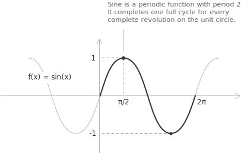

## Introduction

The geometric construction of the sine from the [unit circle](../unit-circle/) is developed in [sine and cosine](../sine-and-cosine/). Here the sine is treated as a real [function](../functions/) of a real variable.

The sine function $f(x) = \sin(x)$ assigns to each angle $x,$ measured in [radians](../angles-and-angular-measure/), its corresponding [sine](../sine-and-cosine/) value. Its graph is a periodic wave with period $2\pi$ and amplitude $1,$ oscillating between $-1$ and $1.$ The function has all real numbers in its [domain](../determining-the-domain-of-a-function/), and its range is the [interval](../intervals/) $[-1, 1].$

Together with the [cosine function](../cosine-function/), the sine models periodic phenomena. In simple [harmonic motion](../simple-harmonic-motion/) the displacement of a mass on a spring or of a pendulum varies sinusoidally with time, and the [velocity](../velocity/), as its derivative, is sinusoidal as well.

## Properties

The following properties of the sine function follow from its definition on the unit circle.

+ [Domain](../determining-the-domain-of-a-function/): $x \in \mathbb{R}$
+ Range: $-1 \leq y \leq 1$
+ Periodicity: periodic in $x$ with period $2\pi$
+ Parity: [odd](../even-and-odd-functions/), with $\sin(-x) = -\sin(x)$
+ Monotonicity: increasing where $\cos(x) > 0$ and decreasing where $\cos(x) < 0,$ on alternating intervals of length $\pi.$
+ Roots: $x = n\pi$ with $n \in \mathbb{Z}$
+ The only [integer](../integers/) value among the roots is $x = 0,$ since $n\pi$ is [irrational](../irrational-numbers/) for every $n \neq 0.$
+ [Maximum and minimum points](../maximum-minimum-and-inflection-points/): the maximum value $1$ is reached at $x = \dfrac{\pi}{2} + 2k\pi$ and the minimum value $-1$ at $x = \dfrac{3\pi}{2} + 2k\pi,$ with $k \in \mathbb{Z}.$

## Limits, derivatives, and integrals of the sine function

A [remarkable limit](../remarkable-limits/) involving the sine function describes its behaviour in a neighbourhood of the origin and is used to compute its derivative. As $x$ approaches zero, $\sin(x)$ becomes increasingly close to $x$ when both are measured in radians, so near the origin the sine curve is almost indistinguishable from the line $y = x.$ This is expressed by:

$$\lim_{x \to 0} \frac{\sin(x)}{x} = 1$$

The function $\sin(x)$ is [continuous](../continuous-functions/) and differentiable for every real value of $x.$ Its [derivative](../derivatives/) is:

$$\frac{d}{dx}\sin(x) = \cos(x)$$

Differentiating again, each successive derivative follows from the previous one, and after four steps the function returns to itself:

$$
\begin{align}
\frac{d^2}{dx^2}\sin(x) &= -\sin(x) \\[6pt]
\frac{d^3}{dx^3}\sin(x) &= -\cos(x) \\[6pt]
\frac{d^4}{dx^4}\sin(x) &= \sin(x)
\end{align}
$$

The derivatives repeat with period four, so the $n$-th derivative has the closed form:

$$\frac{d^n}{dx^n}\sin(x) = \sin\left(x + \frac{n\pi}{2}\right)$$

Since the derivative of $-\cos(x)$ is $\sin(x),$ the [indefinite integral](../indefinite-integrals/) of the sine function is:

$$\int \sin(x) \ dx = -\cos(x) + c$$

> A broader treatment of trigonometric integrals, with the transformation and substitution techniques for the more complex cases, is given in [trigonometric function integrals](../integral-of-trigonometric-functions/).

The sine function can also be written using [imaginary](../complex-numbers/) numbers. With $e^{ix}$ the [exponential function](../exponential-function/) of base $e$ and $i$ the imaginary unit, [Euler's formula](../eulers-formula/) gives:

$$\sin(x) = \frac{e^{ix} - e^{-ix}}{2i}$$

## Monotonicity and convexity

The sine function increases where the derivative $\cos(x)$ is positive and decreases where it is negative. Within each period the intervals of increase and decrease are:

$$
\begin{align}
\text{increase:} \quad & \left(-\frac{\pi}{2} + 2k\pi, \frac{\pi}{2} + 2k\pi\right) \\[6pt]
\text{decrease:} \quad & \left(\frac{\pi}{2} + 2k\pi, \frac{3\pi}{2} + 2k\pi\right)
\end{align}
$$

In both cases $k \in \mathbb{Z},$ and the endpoints of these intervals are the maximum and minimum points.

The second derivative determines [convexity and concavity](../convexity-and-concavity-of-functions/). It is:

$$\frac{d^2}{dx^2}\sin(x) = -\sin(x)$$

The graph is concave where $\sin(x) > 0$ and convex where $\sin(x) < 0.$ The two behaviours meet at the [inflection points](../maximum-minimum-and-inflection-points/) $x = n\pi$ with $n \in \mathbb{Z},$ where the second derivative vanishes and changes sign. These coincide with the roots of the function.

## Maclaurin series

The Maclaurin series of a function is its [Taylor series](../taylor-series/) centred at the origin, a [power series](../power-series/) whose partial sums approximate the function near $x = 0$ and are used to compute its values and to evaluate [limits](../limits/) and integrals. For the sine function the series converges for every [real number](../real-numbers/):

$$\sin(x) = \sum_{n=0}^{\infty} \frac{(-1)^n x^{2n+1}}{(2n+1)!} = x - \frac{x^3}{3!} + \frac{x^5}{5!} - \frac{x^7}{7!} + \cdots$$

Only odd powers appear, in agreement with the sine being an odd function. Keeping the first term gives the approximation $\sin(x) \approx x$ for small $x,$ which recovers the limit $\dfrac{\sin(x)}{x} \to 1$ as $x \to 0.$
