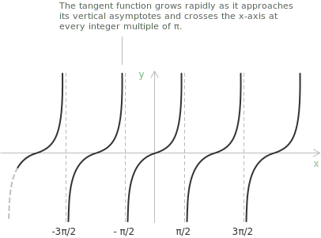

## Introduction

> The geometric construction of the tangent from the [unit circle](../unit-circle/) is developed in [tangent and cotangent](../tangent-and-cotangent/). Here, the tangent is treated as a real [function](../functions/) of a real variable.

The tangent function $f(x) = \tan(x)$ assigns to each angle $x,$ measured in [radians](../angles-and-angular-measure/), its corresponding [tangent](../tangent-and-cotangent/) value. Its graph is a periodic curve with period $\pi$ and has vertical [asymptotes](../asymptotes/) where the cosine of $x$ vanishes, at $x = \pi/2 + k\pi$ with $k \in \mathbb{Z}.$ The [domain](../determining-the-domain-of-a-function/) is the set of all real numbers except these points, and the range is all of $\mathbb{R}.$

The tangent is the ratio of [sine and cosine](../sine-and-cosine/) so it varies slowly where both change smoothly and grows or decreases without bound as the cosine approaches zero:

$$\tan(x) = \frac{\sin(x)}{\cos(x)}$$

 Near the origin the curve is almost a straight line, with $\tan(x)$ close to $x$ for small $x,$ and it steepens as $x$ approaches the first discontinuity.

## Properties

The following properties of the tangent function follow from its definition as the ratio of sine to cosine.

+ [Domain](../determining-the-domain-of-a-function/): $\{\ x \in \mathbb{R} \mid x \neq \frac{\pi}{2} + k\pi \ \text{ for all } k \in \mathbb{Z} \ \}$
+ Range: $y \in \mathbb{R}$
+ Periodicity: periodic in $x$ with period $\pi$
+ Parity: [odd](../even-and-odd-functions/), with $\tan(-x) = -\tan(x)$
+ Monotonicity: increasing on each interval $\left(-\frac{\pi}{2} + k\pi, \frac{\pi}{2} + k\pi\right)$ with $k \in \mathbb{Z}$
+ Roots: $x = n\pi$ with $n \in \mathbb{Z}$
+ The only [integer](../integers/) value among the roots is $x = 0,$ since $n\pi$ is [irrational](../irrational-numbers/) for every $n \neq 0.$

## Limits, derivatives, and integrals of the tangent function

A [remarkable limit](../remarkable-limits/) describes the tangent in a neighbourhood of the origin:

$$\lim_{x \to 0} \frac{\tan(x)}{x} = 1$$

The behaviour near the first vertical asymptote is described by one-sided limits. As $x$ approaches $\pi/2$ from the left the cosine is positive and tends to zero, so the function grows without bound,

$$\lim_{x \to \frac{\pi}{2}^-} \tan(x) = +\infty$$

while from the right the cosine is negative and the values diverge to negative infinity,

$$\lim_{x \to \frac{\pi}{2}^+} \tan(x) = -\infty$$

The function is [continuous](../continuous-functions/) and differentiable on its domain. Its [derivative](../derivatives/) is:

$$\frac{d}{dx}\tan(x) = \sec^2(x)$$

The [indefinite integral](../indefinite-integrals/) is:

$$\int \tan(x) \ dx = -\ln|\cos(x)| + c$$

> A broader treatment of trigonometric integrals, with the transformation and substitution techniques for the more complex cases, is given in [trigonometric function integrals](../integral-of-trigonometric-functions/).

The tangent function can also be written using [imaginary](../complex-numbers/) numbers. With $e^{ix}$ the [exponential function](../exponential-function/) of base $e$ and $i$ the imaginary unit, [Euler's formula](../eulers-formula/) gives:

$$\tan(x) = \frac{e^{ix} - e^{-ix}}{i\left(e^{ix} + e^{-ix}\right)}$$

## Inverse function

On its whole domain the tangent is not injective, because the period $\pi$ makes it repeat every value in each branch. Restricted to the open interval $\left(-\frac{\pi}{2}, \frac{\pi}{2}\right),$ where it is continuous and strictly increasing, the tangent is a bijection onto $\mathbb{R}$ and admits an [inverse function](../inverse-function/), the [arctangent](../arctangent-and-arccotangent/):

$$\arctan : \mathbb{R} \to \left(-\frac{\pi}{2}, \frac{\pi}{2}\right)$$

On this restricted domain $\arctan(\tan(x)) = x,$ and $\tan(\arctan(y)) = y$ for every real $y.$
