## Vertical translations

This chapter covers transformations of [functions of a real variable](../functions/), a series of operations on the value of a function or its argument that change the original graph through, for example, a translation or a rotation. If we consider a general function $f(x),$ for example, one possible transformation is given by the expression $f(x)+2,$ which translates the graph of $f(x)$ vertically. Another transformation is given by the expression $f(x+2),$ which produces a horizontal translation of the original graph. To show how these transformations work in practice, consider the following [quadratic polynomial function](../polynomial-function/), whose graph is a [parabola](../parabola/) with vertex at $(1,1),$ and let $P(u,v)$ be an arbitrary point on the graph of $f.$

$$
f(x)=(x-1)^2+1 \tag{1}
$$

As a first transformation, consider a function $g$ obtained by adding a real constant $k$ to the values of $f.$

$$
g(x)=f(x)+k \tag{2}
$$

At the point with [x-coordinate](../the-cartesian-coordinate-plane/) $u,$ we have $g(u)=f(u)+k=v+k,$ so the point is mapped as follows:

$$
P(u,v)\longmapsto P^\prime(u,v+k)
$$

If $k>0,$ the graph moves upward, whereas if $k<0,$ it moves downward by $|k|.$ This gives a vertical translation of the graph of the original function $f,$ applied to all its points. For a concrete example, consider $(1)$ and add a constant $k=2$ to obtain:

$$
g(x)=f(x)+2=(x-1)^2+3
$$

The graph of $g$ is the same parabola as the graph of $f,$ translated upward by $2$ units:

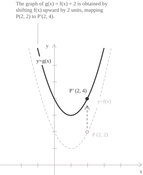

If we instead subtract $2$ from $(1),$ we obtain:

$$
g(x)=f(x)-2=(x-1)^2-1
$$

In this case, the vertex of the parabola given by $g$ is $(1,-1),$ and the point $(2,2)$ becomes $(2,0).$ The graph has therefore moved downward by $2$ units:

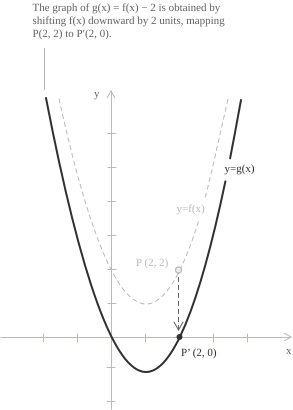

A vertical translation therefore leaves the [domain](../determining-the-domain-of-a-function/) of the function obtained from the general transformation in $(2)$ unchanged, since it does not modify the arguments to which $f$ is applied.

## Vertical stretches and compressions

We now examine what happens when a function $f$ is multiplied by a positive number $a \gt 0$ to obtain a new function $g$ satisfying the following identity:

$$
g(x)=af(x) \tag{3}
$$

Since $g(u)=af(u)=av,$ each point on the graph of $f$ is transformed according to the rule:

$$
P(u,v)\longmapsto P^\prime(u,av)
$$

There are two possible cases. When $a>1,$ the graph of $g$ is a vertical stretch of the original graph, whereas if $0<a<1,$ it is a vertical compression. For example, with $a=2,$ equation $(1)$ becomes:

$$
g(x)=2f(x)=2(x-1)^2+2
$$

The vertex $(1,1)$ moves to $(1,2),$ and the point $(2,2)$ moves to $(2,4).$ The y-coordinates double. The vertex moves upward by one unit, while the second point moves upward by two units, so this change is different from a translation.

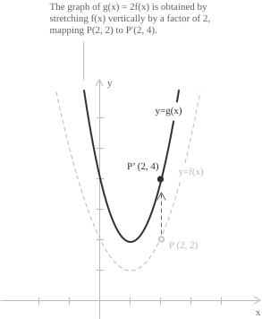

If we instead set $a=1/2,$ we have the second case, and from $(1)$ we obtain:

$$
g(x)=\frac{1}{2}f(x)=\frac{1}{2}(x-1)^2+\frac{1}{2}
$$

The vertex becomes $(1,1/2),$ and the point $(2,2)$ becomes $(2,1).$ The distances from the x-axis are halved, and the graph is compressed vertically.

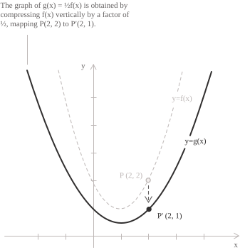

As with a vertical translation, a vertical stretch or compression leaves the domain of the function obtained from the general transformation in $(3)$ unchanged.

## Reflection across the x-axis

We now examine what happens to the graph when we change the sign of the original function to obtain a new function $g$ given by the following identity:

$$
g(x)=-f(x) \tag{4}
$$

Under $(4),$ each point on the graph keeps its x-coordinate while its y-coordinate changes sign. This transformation therefore produces a reflection across the $x$-axis, with the following relation holding for every point:

$$
P(u,v)\longmapsto P^\prime(u,-v)
$$

Returning to our example in $(1),$ transforming $f$ according to $(4)$ gives:

$$
g(x)=-(x-1)^2-1
$$

The vertex moves to $(1,-1),$ the point $(2,2)$ becomes $(2,-2),$ and the parabola opens downward.

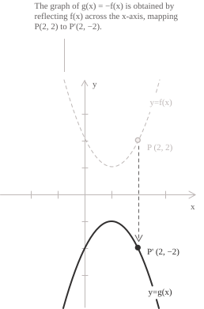

## Horizontal translations

We now modify the argument of $f$ by introducing a constant $h \in \mathbb{R}$ to obtain a transformed function $g$ given by:

$$
g(x)=f(x-h) \tag{5}
$$

Each point is mapped to the graph of the transformed function as follows:

$$
P (u,v)\longmapsto P^{\prime}(u+h,v)
$$

If $h>0,$ the graph shifts to the right by $h$ units; if $h$ is negative, it shifts to the left. For example, to translate the parabola three units to the right, we write $(5)$ as follows:

$$
\begin{align}
g(x) &= f(x-3) \\[6pt]
     &= ((x-3)-1)^2+1 \\[6pt]
     &= (x-4)^2+1
\end{align}
$$

The vertex moves from $(1,1)$ to $(4,1),$ and the point $(2,2)$ becomes $(5,2).$ In other words, all the x-coordinates of points on the graph increase by three units, while their y-coordinates remain unchanged.

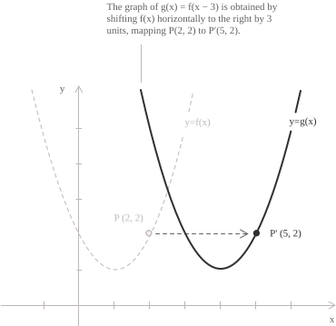

To move the parabola to the left instead, we use the following relation:

$$
\begin{align}
g(x) &= f(x+3) \\[6pt]
     &= ((x+3)-1)^2+1 \\[6pt]
     &= (x+2)^2+1
\end{align}
$$

In this case, the vertex becomes $(-2,1),$ and the point $(2,2)$ becomes $(-1,2).$ A useful observation is that a horizontal translation also shifts the domain, so if $f$ is defined on $[1,5],$ the function $f(x-3)$ is defined when $x-3\in[1,5],$ that is, on $[4,8].$

## Horizontal stretches and compressions

We now examine what happens when we multiply the argument in $(1)$ by a positive number $b \gt 0.$ The transformed function $g$ is given by the following identity:

$$
g(x)=f(bx) \tag{6}
$$

The relation between points on the graph of $(1)$ and those on the transformed graph $(6)$ becomes:

$$
P(u,v)\longmapsto P^{\prime}\left(\frac{u}{b},v\right) \tag{7}
$$

The factor by which distances from the y-axis are multiplied is $1/b.$ If $b>1,$ these distances decrease and we have a horizontal compression, whereas if $0<b<1,$ the distances increase and we have a horizontal stretch. For example, substituting $2x$ for the argument in $(1)$ gives:

$$
g(x)=f(2x)=(2x-1)^2+1
$$

The vertex $(1,1)$ moves to $(1/2,1),$ and the point $(2,2)$ becomes $(1,2).$ The x-coordinates are therefore halved, in agreement with the ratio $u/b$ in $(7),$ and the graph is compressed toward the y-axis:

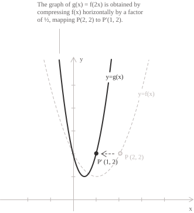

If we instead substitute $x/2$ for the argument in $(1),$ we have:

$$
g(x)=f\left(\frac{x}{2}\right)=\left(\frac{x}{2}-1\right)^2+1
$$

In this case, the vertex of the parabola becomes $(2,1),$ and the point $(2,2)$ becomes $(4,2).$ The x-coordinates therefore double, and the graph undergoes a horizontal stretch, as shown in the following figure.

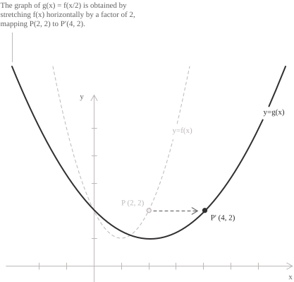

These transformations preserve the [range](../functions/) of the function, while the domain becomes the set of all $x$ for which $bx$ belongs to the original domain. For example, if the domain of $f$ is $[2,6],$ the domain of $f(2x)$ is $[1,3],$ while the domain of $f(x/2)$ is $[4,12].$

## Reflection across the y-axis

Consider substituting $-x$ for the argument in $(1).$ The transformed function $g$ is given by the following relation:

$$
g(x)=f(-x) \tag{8}
$$

Each point on the graph of $f$ is then transformed as follows:

$$
P(u,v)\longmapsto P^{\prime}(-u,v)
$$

The points are reflected across the y-axis, so applying $(8)$ to the function in $(1)$ gives:

$$
\begin{align}
g(x) &= f(-x) \\[6pt]
     &= (-x-1)^2+1 \\[6pt]
     &= (x+1)^2+1
\end{align}
$$

The vertex moves from $(1,1)$ to $(-1,1)$ in the graph of $g,$ and the point $(2,2)$ becomes $(-2,2).$ In general, the domain is reflected about zero to obtain the domain of $g,$ so a domain $[r,s]$ becomes $[-s,-r].$

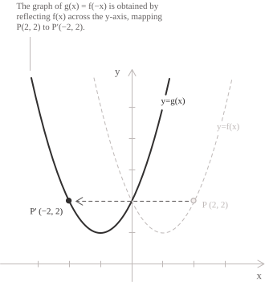

If $f$ is an [even function](../even-and-odd-functions/), the reflected graph of $g$ coincides with the original graph, since $f(-x)=f(x).$ Thus, for a parabola given by $y=x^2,$ the transformed graph would be unchanged.

## Symmetry about the origin

Applying the preceding reflections changes the signs of both coordinates of each point to give the graph of the transformed function $g,$ as follows:

$$
P(u,v)\longmapsto P^{\prime}(-u,-v)
$$

This produces central symmetry about the origin, so the graph of $g$ is a half-turn rotation of the graph of $f$ in the plane. The corresponding function is therefore:

$$
g(x)=-f(-x) \tag{9}
$$

For the parabola in $(1),$ formula $(9)$ gives $g(x)=-(x+1)^2-1.$ In this case, the vertex moves to $(-1,-1),$ and the point $(2,2)$ moves to $(-2,-2).$ Furthermore, the line segment joining each point on the graph of $f$ to its corresponding point on the graph of $g$ has its midpoint exactly at the origin.

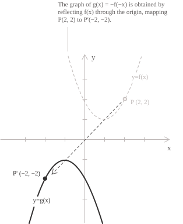

It is interesting that the order in which the two reflections are applied does not matter, because each changes a different coordinate, so reversing their order produces the same final graph of the transformed function $g.$ If $f$ is an [odd function](../even-and-odd-functions/), applying this transformation leaves the graph unchanged, since $-f(-x)=f(x).$

## Combined transformations

All the transformations discussed so far can be combined in a single formula, with parameters $a\neq0,$ $b\neq0$ and $k.$

$$
g(x)=af\bigl(b(x-h)\bigr)+k \tag{10}
$$

To find the point corresponding to $(u,v),$ where $v=f(u),$ we set the argument of $f$ equal to $u$ and obtain:

$$
b(x-h)=u\qquad\Longrightarrow\qquad x=h+\frac{u}{b}
$$

This gives the complete rule relating points on the graphs of $f$ and $g.$

$$
P(u,v)\longmapsto P^{\prime}\left(h+\frac{u}{b},av+k\right) \tag{11}
$$

We can interpret $(11)$ as a sequence of operations on the points, in the following order:

+ We divide the x-coordinates by $b.$ The horizontal scale factor is $1/|b|,$ and if $b<0,$ this also introduces a reflection across the y-axis.
+ We add $h$ to the resulting x-coordinates, translating the graph horizontally.
+ We multiply the y-coordinates by $a.$ The vertical scale factor is $|a|,$ and if $a<0,$ this also introduces a reflection across the x-axis.
+ Finally, we add $k$ to the resulting y-coordinates, translating the graph vertically.

We can rewrite the argument in $(10)$ in the form $bx+c.$ Expanding $b(x-h)=bx-bh$ gives $c=-bh,$ or equivalently $h=-c/b.$ Substituting this value into the new x-coordinate in $(11),$ we have:

$$
h+\frac{u}{b}=-\frac{c}{b}+\frac{u}{b}=\frac{u-c}{b}
$$

Thus, for the function in $(10),$ rule $(11)$ can be written as:

$$
P(u,v)\longmapsto P^{\prime}\left(\frac{u-c}{b},av+k\right) \tag{12}
$$

Formulas $(11)$ and $(12)$ are therefore equivalent. To describe how the domain and range of the transformed function change, we return to the form in $(10)$ and denote by $D$ the domain of $f,$ the set of arguments for which it is defined, and by $I=f(D)$ its range, the set of values it takes. The function $g$ is defined when the argument $b(x-h)$ belongs to $D.$ If $u$ is an element of $D,$ solving $b(x-h)=u$ gives $x=h+u/b.$ The new domain therefore consists of all the x-coordinates obtained in this way:

$$
D_g=\left\{\ h+\frac{u}{b}\ \middle|\ u\in D\ \right\}
$$

To determine how the range of the transformed function $g$ changes, we consider the values of the function instead. We multiply each value $v$ taken by $f$ by $a$ and add $k,$ obtaining $av+k.$ The set of all these results is the range of $g,$ denoted by $g(D_g).$

$$
g(D_g)=\{\ av+k\mid v\in I\ \}
$$

For example, consider the function $f(x)=\sqrt{x},$ which we know is defined for $x\geq0,$ and construct its transformed function as follows:

$$
g(x)=3-2\sqrt{4-2x} \tag{13}
$$

We first identify the parameters by rewriting $(13)$ as:

$$
g(x)=-2f\bigl(-2(x-2)\bigr)+3
$$

The parameters are therefore $a=-2,$ $b=-2,$ $h=2$ and $k=3,$ and the correspondence between points given by $(11)$ becomes:

$$
P(u,v)\longmapsto P^{\prime}\left(2-\frac{u}{2},3-2v\right)
$$

We now choose a few points on the graph of $f$ and obtain the following transformations:

| Point on the graph of $f$ | New x-coordinate | New y-coordinate | Point on the graph of $g$ |
| ------------------------ | ------------- | -------------- | ------------------------ |
| $(0,0)$                  | $2$           | $3$            | $(2,3)$                  |
| $(1,1)$                  | $3/2$         | $1$            | $(3/2,1)$                |
| $(4,2)$                  | $0$           | $-1$           | $(0,-1)$                 |

The starting point of the [square root graph](../irrational-functions/) moves from $(0,0)$ to $(2,3),$ and the transformed branch extends to the left and downward. The figure directly compares the original square root graph with the resulting graph of $g.$

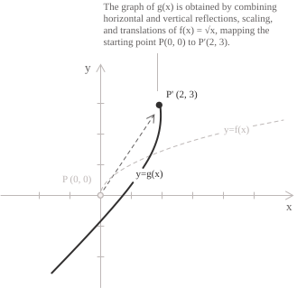

We now check the domain and range of $g.$ For the domain, the expression under the square root in $g$ must be greater than or equal to zero:

$$
4-2x\geq0\qquad\Longleftrightarrow\qquad x\leq2
$$

The domain is therefore $(-\infty,2].$ For the range of $g,$ observe that $\sqrt{4-2x}$ takes all nonnegative values; multiplying these by $-2$ and adding $3,$ the transformation parameters in $(13),$ gives:

$$
\begin{align}
D_g &= (-\infty,2] \\[6pt]
g(D_g) &= (-\infty,3]
\end{align}
$$

## Absolute value of the function

In addition to the transformations already discussed, another common transformation is obtained by taking the [absolute value](../absolute-value-function/) of the function $f.$

$$
g(x)=|f(x)| \tag{14}
$$

As we know, the absolute value function can be expressed as follows:

$$
|f(x)|=
\begin{cases}
f(x) & \text{if }f(x)\geq0 \\[6pt]
-f(x) & \text{if }f(x)<0
\end{cases}
$$

When we take the absolute value, points above the x-axis remain in place, while those below it are reflected upward so that the range contains only nonnegative values. For example, consider the function $f(x)=x^2-2,$ which is negative for $-\sqrt{2}<x<\sqrt{2}$ and nonnegative outside this interval. Under this transformation, the point $(0,-2)$ on the graph of $f$ becomes $(0,2),$ while points with positive y-coordinates remain unchanged. As the graph below shows, the central part of the parabola is reflected upward:

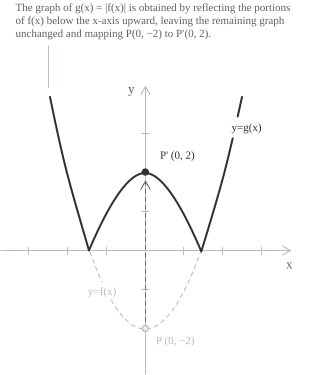

Note that this transformation reflects only the points with negative y-coordinates, rather than the entire graph.

- - -

When the absolute value is applied to the argument, the situation changes, and the function $g$ is expressed by the following identity:

$$
g(x)=f(|x|)
$$

For $x\geq0,$ we have $|x|=x,$ so we use the value $f(x).$ For $x<0,$ we have $|x|=-x,$ so we use $f(-x).$ This gives:

$$
f(|x|)=
\begin{cases}
f(x) & \text{if }x\geq0 \\[6pt]
f(-x) & \text{if }x<0
\end{cases}
$$

We can illustrate the resulting graph of $g$ with an example. Again transforming $(1),$ we apply the absolute value to the argument and obtain:

$$
g(x)=(|x|-1)^2+1
$$

The left half of the original parabola is replaced by the mirror image of the right half, giving the graph shown below:

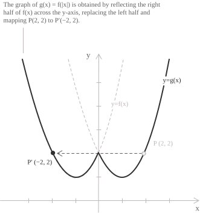

To find the domain of $g(x)=f(|x|),$ we must check that $f$ is defined at $|x|.$ Suppose, for example, that $f$ has domain $[1,4].$ We can evaluate $g(x)$ only when $1\leq|x|\leq4,$ so the domain of $g$ is:

$$
D_g=[-4,-1]\cup[1,4]
$$

For the range of $g,$ observe that $|x|$ is always nonnegative, so $g$ takes only the values that $f$ takes at arguments greater than or equal to zero. For example, the function $f(x)=x,$ defined on $\mathbb{R},$ takes all real values. After the transformation, we obtain $g(x)=|x|,$ which takes only nonnegative values. In this case, the domain remains $\mathbb{R},$ while the range changes from $\mathbb{R}$ to $[0,+\infty).$
