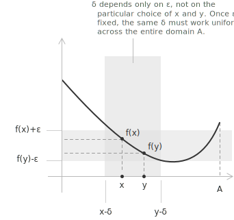

## Introduction

[Ordinary continuity](../continuous-functions/) describes the local behaviour of a [function](../functions/), where small changes in the input near each point produce small changes in the output. This property can depend on the specific point, and in many contexts a stronger form of continuity is required to control oscillations consistently across the entire [domain](../determining-the-domain-of-a-function/). Uniform continuity addresses this need by requiring a single tolerance for input variations to apply everywhere in the set.

This stability property leads to several consequences:

+ A uniformly continuous function on a dense subset extends continuously to the closure of that subset.
+ Uniformly continuous functions map [Cauchy sequences](../cauchy-sequence/) to Cauchy sequences.
+ Uncontrolled oscillations are prevented whenever the domain is compact.

> Oscillation is the variation in the output values of a function over a given region, that is, how much the function rises and falls within a small portion of the domain. For example, the function $\sin(1/x)$ near the origin exhibits infinitely many oscillations within any small interval, which makes its behaviour difficult to control.

## Definition

Consider a function $f : A \subset \mathbb{R} \to \mathbb{R}$. The function is uniformly continuous on $A$ if, for every $\varepsilon > 0$, there exists a $\delta > 0$ such that for all $x, y \in A$ the following implication holds:

$$
|x - y| < \delta \to |f(x) - f(y)| < \varepsilon
$$

The essential feature of this definition is that $\delta$ depends solely on $\varepsilon$, and not on the particular points $x$ and $y$. The same $\delta$ must be valid for every pair of points in the domain.

The graph shows the global nature of the condition. The same $\delta$ controls the function's variation throughout the domain, so whenever $|x - y| < \delta$, it follows that $|f(x) - f(y)| < \varepsilon$ for all $x, y \in A$.

- - -

The distinction between [continuity](../continuous-functions/) and uniform continuity is clarified by comparing the standard definition of continuity at a point $x_0$. A function is continuous at $x_0$ if, for every $\varepsilon > 0$, there exists a $\delta > 0$, which may depend on $x_0$, such that:

$$
|x - x_0| < \delta \to |f(x) - f(x_0)| < \varepsilon
$$

The distinction lies in the dependence of $\delta$:

+ For ordinary continuity, $\delta$ may vary with each point in the domain.
+ For uniform continuity, a single value of $\delta$ is valid for all points in the set.

## Heine–Cantor theorem

The Heine–Cantor theorem establishes the conditions under which continuity implies uniform continuity. On compact sets, the local property of continuity suffices to guarantee a single global control parameter $\delta$ applicable to the entire domain.

Let $K \subset \mathbb{R}$ be a compact set. If a function $f : K \to \mathbb{R}$ is continuous on $K$, then it is uniformly continuous on $K$. Since compactness in $\mathbb{R}$ is equivalent to being closed and bounded, the theorem admits the following equivalent formulation: if $f : [a,b] \to \mathbb{R}$ is continuous on a closed and bounded interval $[a,b]$, then $f$ is uniformly continuous on $[a,b]$.

> The theorem identifies compactness as the structural property of the domain that prevents local continuity from degenerating into purely pointwise behaviour and guarantees instead a global form of regularity.

## Sequential characterization

Uniform continuity can be equivalently formulated in terms of [sequences](../sequences/). A function $f : A \to \mathbb{R}$ is uniformly continuous on $A$ if and only if, for every pair of sequences $(x_n)$ and $(y_n)$ in $A$ that satisfy $|x_n - y_n| \to 0$, we also have:

$$
|f(x_n) - f(y_n)| \to 0
$$

This formulation shows that uniformly continuous functions preserve infinitesimal closeness between sequences, which is also why they map [Cauchy sequences](../cauchy-sequence/) to Cauchy sequences.

> This criterion is particularly useful for establishing that a function is not uniformly continuous, as shown in Example 1.

## Example 1

Consider the function $f(x) = x^2$ on $\mathbb{R}$. This function is continuous everywhere, since it is a [polynomial](../polynomials/), but it is not uniformly continuous on $\mathbb{R}$. The reason is that the function grows ever faster as $|x|$ increases: for points far from the origin, even a small variation in $x$ produces a large variation in $f(x)$, and no single $\delta$ can control this behaviour across the whole real line.

The failure of uniform continuity on $\mathbb{R}$ can be made precise through the sequential characterization. Consider the sequences $x_n = n + \frac{1}{n}$ and $y_n = n$. Their difference tends to zero:

$$|x_n - y_n| = \frac{1}{n} \to 0$$

The difference between the images of these sequences, however, does not:

$$|f(x_n) - f(y_n)| = \left(n + \frac{1}{n}\right)^2 - n^2 = 2 + \frac{1}{n^2} \to 2$$

Since $|f(x_n) - f(y_n)|$ does not tend to zero, the function fails the sequential criterion, so it is not uniformly continuous on $\mathbb{R}$.

By contrast, when the function is restricted to a closed and bounded interval $[a, b]$, it becomes uniformly continuous. The interval is compact, so the Heine–Cantor theorem applies and the growth of the function is bounded over the finite domain.

## Example 2

Consider the function $f(x) = 1/x$ on the open interval $(0, 1)$. The interval is bounded but not closed, so it is not compact and the Heine–Cantor theorem does not apply. The function is continuous at every point of $(0, 1)$, yet it is not uniformly continuous there. As $x$ approaches $0$, the function grows without bound, and its variation over a fixed small displacement becomes arbitrarily large near the left endpoint.

The sequential characterization makes the failure precise. Consider the sequences $x_n = \frac{1}{n}$ and $y_n = \frac{1}{n+1}$, both lying in $(0, 1)$. Their difference tends to zero:

$$|x_n - y_n| = \frac{1}{n} - \frac{1}{n+1} = \frac{1}{n(n+1)} \to 0$$

The difference between the images, however, equals one for every $n$:

$$|f(x_n) - f(y_n)| = |n - (n+1)| = 1$$

Since $|f(x_n) - f(y_n)|$ does not tend to zero, the function is not uniformly continuous on $(0, 1)$. The contrast with Example 1 isolates two distinct mechanisms: there the domain was unbounded, while here the domain is bounded and uniform continuity fails because the function itself grows without bound near the boundary.

- - -

These examples clarify the relationship between continuity and uniform continuity. In general:

+ Continuity does not imply uniform continuity. A function may be continuous at every point of its domain without admitting a single global $\delta$ that works for all pairs of points.
+ Uniform continuity is the stronger condition. If a function is uniformly continuous on $A$, then it is necessarily continuous at every point of $A$.

Uniform continuity is a property of the function together with its domain, not of the formula alone. The map $x \mapsto x^2$ is uniformly continuous on every bounded interval $[a, b]$ and fails to be so on $\mathbb{R}$, even though the rule defining it is the same.

## Lipschitz continuity

A particular form of uniform continuity is Lipschitz continuity. A function $f : A \subset \mathbb{R} \to \mathbb{R}$ is Lipschitz continuous on $A$ if there exists a constant $L > 0$, called a Lipschitz constant, such that for all $x, y \in A$:

$$
|f(x) - f(y)| \le L |x - y|
$$

This condition maps nearby points to nearby values and establishes a global linear bound on the function's oscillation, since the variation of the output is proportional to the variation of the input. The same constant $L$ must work everywhere on the domain. The implication for uniform continuity follows directly: given any $\varepsilon > 0$, selecting $\delta = \varepsilon / L$ guarantees that:

$$
|x - y| < \delta \to |f(x) - f(y)| \le L |x - y| < L \delta = \varepsilon
$$

Therefore, every Lipschitz continuous function is uniformly continuous.

The converse does not hold in general. A function may be uniformly continuous without satisfying any global linear bound of this form, so Lipschitz continuity is a strictly stronger condition, as Example 3 shows.

A useful criterion links Lipschitz continuity to [differentiability](../derivatives/). If a function $f$ is differentiable on an interval and its derivative is bounded, that is, there exists $M > 0$ such that for all $x$ in the interval:

$$
|f'(x)| \le M
$$

then, by the [mean value theorem](../lagrange-theorem/), $f$ is Lipschitz continuous with constant $L = M$. For any two points $x, y$ in the interval, there exists $c$ between them such that:

$$
f(x) - f(y) = f'(c)(x - y)
$$

Taking [absolute values](../absolute-value/) yields $|f(x) - f(y)| \leq M|x - y|$, which is the Lipschitz condition with constant $L = M$.

> Geometrically, Lipschitz continuity restricts the steepness of the graph. The slopes of all secant lines are uniformly bounded in magnitude by $L$, so the function cannot oscillate more rapidly than a fixed linear rate.

## Example 3

The function $f(x) = \sqrt{x}$ on $[0, 1]$ is uniformly continuous but not Lipschitz continuous. The interval is compact and the function is continuous, so the Heine–Cantor theorem guarantees uniform continuity on $[0, 1]$. The function is not Lipschitz continuous because its rate of change is unbounded near the origin.

Suppose a Lipschitz constant $L$ existed, so that $|\sqrt{x} - \sqrt{y}| \le L|x - y|$ for all $x, y \in [0, 1]$. Choosing $y = 0$ reduces this to $\sqrt{x} \le Lx$ for every $x \in (0, 1]$. Since $x > 0$, we divide both sides by $x$, which gives:

$$\frac{1}{\sqrt{x}} \le L$$

The left side grows without bound as $x \to 0^+$, so no finite $L$ can satisfy the inequality for every $x$. The function is therefore uniformly continuous without being Lipschitz continuous, which confirms that Lipschitz continuity is strictly stronger than uniform continuity.

## Example 4

> The Heine–Cantor theorem guarantees uniform continuity whenever the [domain](../determining-the-domain-of-a-function/) is compact. Compactness is sufficient but not necessary, however, and uniform continuity can also hold on domains that are not compact. This example illustrates that situation.

Consider the function $f(x) = \sin(x)$ defined on the entire real line $\mathbb{R}$. The domain is unbounded and not compact, so uniform continuity is not guaranteed a priori and must be verified directly.

Given $\varepsilon > 0$ and arbitrary $x, y \in \mathbb{R}$, the goal is to find a single $\delta > 0$, depending only on $\varepsilon$, such that $|x - y| < \delta$ implies $|\sin(x) - \sin(y)| < \varepsilon$. Applying the [sum-to-product identity](../trigonometric-identities/) gives:

$$|\sin(x) - \sin(y)| = 2\left|\cos\!\left(\frac{x+y}{2}\right)\sin\!\left(\frac{x-y}{2}\right)\right|$$

Since $|\cos(\cdot)| \leq 1$ everywhere, this simplifies to:

$$|\sin(x) - \sin(y)| \leq 2\left|\sin\!\left(\frac{x-y}{2}\right)\right|$$

Applying the standard inequality $|\sin(t)| \leq |t|$, valid for all $t \in \mathbb{R}$, gives:

$$|\sin(x) - \sin(y)| \leq 2 \cdot \frac{|x - y|}{2} = |x - y|$$

This is the Lipschitz condition with constant $L = 1$, holding for every pair of points in $\mathbb{R}$ without restriction. Selecting $\delta = \varepsilon$, whenever $|x - y| < \delta$ we obtain:

$$|\sin(x) - \sin(y)| \leq |x - y| < \delta = \varepsilon$$

Here $\delta$ depends solely on $\varepsilon$, so $f$ is uniformly continuous on $\mathbb{R}$.

> The underlying reason is geometric: the [sine function](../sine-function/) oscillates indefinitely, but its oscillations remain bounded in amplitude and its slope never exceeds one in absolute value, since $|f'(x)| = |\cos(x)| \leq 1$ everywhere. This global bound on the rate of change prevents the uncontrolled growth observed in Example 1 and ensures that a uniform $\delta$ is attainable across the entire real line.
