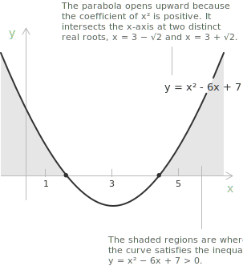
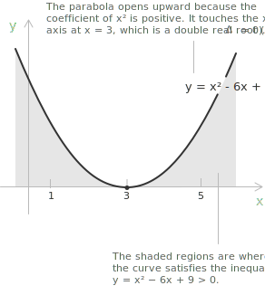
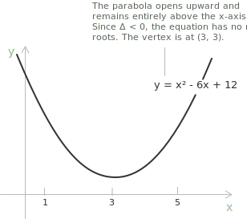

## From inequality to curve

A [quadratic inequality](../quadratic-inequalities/) in standard form is given by:

$$ax^2 + bx + c > 0, \quad a \neq 0$$

The same form, with the symbol $>$ replaced by $<$, $\geq$, or $\leq$, governs every case. A geometric reading becomes possible once the left-hand side is regarded as the output of a function of $x$, that is, once we introduce a second variable.

$$y = ax^2 + bx + c$$

The pairs $(x, y)$ that satisfy this relation form a [parabola](../parabola/) in the Cartesian plane, and the inequality $ax^2 + bx + c > 0$ asks for the values of $x$ at which the output $y$ is positive. The algebraic problem of finding where the polynomial is positive is therefore translated into the geometric problem of locating the regions of the horizontal axis above which the parabola lies. The shape and position of the parabola are governed by the three coefficients.

+ The coefficient $a$ controls the direction and the width of the curve. Its sign decides whether the parabola opens upward or downward, while larger values of $|a|$ make the graph narrower and smaller values make it wider.
+ The coefficient $b$, acting together with $a$, fixes the horizontal location of the axis of symmetry and therefore of the vertex, whose abscissa is $-b/2a$.
+ The constant term $c$ gives the height at which the curve crosses the vertical axis, since setting $x = 0$ yields $y = c$.

> A full account of the parabola as a curve, including its focus and directrix, belongs to the dedicated entry on [parabolas](../parabola/). The discussion here is limited to the geometric content carried by the inequality and its solution set.

## Sign of the quadratic as a region of the plane

The points of the plane at which the parabola $y = ax^2 + bx + c$ lies above the horizontal axis are exactly those whose abscissas satisfy the strict inequality $ax^2 + bx + c > 0$, and the points at which it lies below the axis are those whose abscissas satisfy $ax^2 + bx + c < 0$. The points at which the parabola meets the axis correspond to the roots of the associated [quadratic equation](../quadratic-equations/), where the expression vanishes.

This correspondence gives the solution set of a quadratic inequality a direct geometric counterpart. The solution of the strict inequality is the projection onto the horizontal axis of the portion of the parabola lying strictly above or strictly below the axis, while the solution of the non-strict inequality also includes the points of intersection with the axis. The position of the parabola relative to the horizontal axis therefore encodes the entire solution set of the inequality.

## The discriminant as a geometric criterion

The number of intersections of the parabola with the horizontal axis is governed by the [discriminant](../quadratic-formula/) of the associated quadratic equation.

$$\Delta = b^2 - 4ac$$

Three cases arise according to its sign, and each produces a distinct geometric configuration that determines the structure of the solution set of the inequality.

- - -

**Case 1.** When $\Delta > 0$, the parabola crosses the horizontal axis at two distinct points $x_1$ and $x_2$, with $x_1 < x_2$. The curve lies on one side of the axis between the roots and on the opposite side outside the interval $(x_1, x_2)$.

When $a > 0$, the parabola opens upward and is therefore positive on the two outer intervals $(-\infty, x_1)$ and $(x_2, +\infty)$, and negative on the inner interval $(x_1, x_2)$. The solution of $ax^2 + bx + c > 0$ is the union of the two outer intervals, while the solution of $ax^2 + bx + c < 0$ is the inner interval.

When $a < 0$, the parabola opens downward and the signs on the three intervals are reversed: positive on $(x_1, x_2)$ and negative on the two outer intervals.

- - -

**Case 2.** When $\Delta = 0$, the parabola is tangent to the horizontal axis at a single point, the vertex, whose abscissa is the unique root $x_0$ of multiplicity two. The curve touches the axis at this point and stays on the same side everywhere else, keeping the sign of the leading coefficient $a$ throughout the real line, except at $x_0$ where the expression vanishes.

When $a > 0$, the expression is positive for every $x \neq x_0$ and equal to zero at $x_0$. The solution of $ax^2 + bx + c > 0$ is the set $\mathbb{R} \setminus \{x_0\}$, while the solution of $ax^2 + bx + c \geq 0$ is all of $\mathbb{R}$. The corresponding inequalities $ax^2 + bx + c < 0$ and $ax^2 + bx + c \leq 0$ have respectively the empty set and the singleton $\{x_0\}$ as solution sets.

When $a < 0$, the roles of the four cases are exchanged accordingly.

- - -

**Case 3.** When $\Delta < 0$, the parabola does not meet the horizontal axis at all and lies entirely on one side of it. The expression keeps the sign of the leading coefficient $a$ for every real $x$, with no exceptions.

When $a > 0$, the parabola lies strictly above the horizontal axis and the expression is strictly positive for every $x$. The solution of $ax^2 + bx + c > 0$ is all of $\mathbb{R}$, while the solution of $ax^2 + bx + c < 0$ is the empty set.

When $a < 0$, the parabola lies strictly below the axis and the signs are reversed: the expression is strictly negative everywhere, so $ax^2 + bx + c < 0$ has solution $\mathbb{R}$ and $ax^2 + bx + c > 0$ has empty solution set.

## Vertex and symmetry

Every parabola of the form $y = ax^2 + bx + c$ is symmetric with respect to the vertical line $x = -\frac{b}{2a}$, which is the axis of symmetry, and the vertex is the point of the parabola lying on this axis. Its coordinates are:

$$V = \left(-\frac{b}{2a}, -\frac{\Delta}{4a}\right)$$

The vertex is a minimum when $a > 0$ and a maximum when $a < 0$. The sign of the ordinate $-\frac{\Delta}{4a}$, combined with the sign of $a$, determines whether the vertex lies above, on, or below the horizontal axis, which is precisely what fixes the structure of the solution set of the inequality.

+ When $a > 0$ and the vertex lies below the axis, the parabola opens upward and crosses the axis at two distinct points, producing the configuration of Case 1.
+ When $a > 0$ and the vertex lies on the axis, the parabola is tangent to the axis at the vertex, producing the configuration of Case 2.
+ When $a > 0$ and the vertex lies above the axis, the parabola lies entirely above the axis, producing the configuration of Case 3.

The two distinct roots, when they exist, are placed symmetrically about the axis of symmetry. Writing them through the [quadratic formula](../quadratic-formula/) gives the following.

$$x_{1, 2} = -\frac{b}{2a} \pm \frac{\sqrt{\Delta}}{2a}$$

The common term $-\frac{b}{2a}$ is the abscissa of the axis of symmetry, so the midpoint of the two intersection points coincides with the foot of the axis. The distance of each root from the axis is $\frac{\sqrt{\Delta}}{2|a|}$, which collapses to zero exactly when $\Delta = 0$, the case in which the two intersections merge into the point of tangency.

## The reading rule for the solution set

Combining the previous observations gives a practical reading rule for the solution set of a quadratic inequality. Once the roots and the sign of the leading coefficient are known, the solution can be obtained by inspection of the geometric configuration, without further algebraic manipulation.

The rule depends on the orientation of the parabola, encoded in the sign of $a$, and on the direction of the inequality. With $a > 0$ and two distinct real roots $x_1 < x_2$, the polynomial is positive outside the interval $[x_1, x_2]$ and negative inside it, and the solution of each inequality follows the obvious convention.

+ Solution of $ax^2 + bx + c > 0$: the union $(-\infty, x_1) \cup (x_2, +\infty)$.
+ Solution of $ax^2 + bx + c \geq 0$: the union $(-\infty, x_1] \cup [x_2, +\infty)$.
+ Solution of $ax^2 + bx + c < 0$: the interval $(x_1, x_2)$.
+ Solution of $ax^2 + bx + c \leq 0$: the interval $[x_1, x_2]$.

When $a < 0$, the parabola opens downward and the solution sets of the four inequalities are exchanged in pairs: the solution of $ax^2 + bx + c > 0$ becomes the inner interval and the solution of $ax^2 + bx + c < 0$ becomes the union of the two outer intervals. The same exchange applies to the non-strict versions.

> A practical procedure for any quadratic inequality consists of three steps: compute the discriminant and the roots when they exist, determine the orientation of the parabola from the sign of $a$, then read the solution set from the position of the parabola relative to the horizontal axis. The procedure is graphical in nature and avoids the construction of a sign chart, which is more appropriate for the [factorisation method](../factoring-quadratic-equations/) and for [polynomial inequalities of higher degree](../polynomial-inequalities/).
