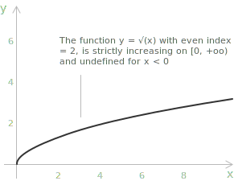

## Definition

An irrational inequality is an inequality in which the unknown appears under a [radical](../radicals/) sign or is raised to a fractional [exponent](../powers/). More precisely, it is an inequality, strict or non-strict and in either direction, in which at least one term contains an expression of the type $\sqrt[n]{f(x)}$ or equivalently $f(x)^{p/q}$ with $p$, $q$ integers and $q \geq 2$. As with [irrational equations](../irrational-equations/), the presence of radicals imposes constraints on the [domain](../determining-the-domain-of-a-function/), and these constraints interact non-trivially with the direction of the inequality.

The central difficulty that distinguishes irrational inequalities from their equation counterparts is that raising both sides to a power is a monotone operation only under specific sign conditions:

+ When both sides are non-negative, the inequality is preserved under even-power exponentiation.
+ When both sides are non-positive, even-power exponentiation reverses the direction of the inequality.
+ When the sign of one side is indeterminate, the operation is not justified at all, and the inequality must first be split into sub-cases according to the sign of that side.

> In practice, solving irrational inequalities requires careful control of admissible values, since algebraic transformations may introduce extraneous solutions that must be checked against the original inequality.

## Even-index radicals versus odd-index radicals

The behaviour of an irrational inequality depends on whether the index $n$ of the radical is even or odd, and this distinction shapes the entire solution strategy. When the index is odd, the function $\sqrt[n]{x}$ is defined and strictly increasing on the whole real line, provided one adopts the real-valued convention which uses the [sign function](../sign-function/):

$$\sqrt[n]{x} = \mathrm{sign}(x) \cdot |x|^{1/n}$$

which extends the odd root to negative arguments. Under this convention, $\sqrt[3]{-8} = -2$ and more generally the odd-index radical is the inverse of the odd-power function $t \mapsto t^n$. As a consequence we have:

$$\sqrt[n]{f(x)} \leq \sqrt[n]{g(x)}
 \Longleftrightarrow 
f(x) \leq g(x)$$

without any additional domain conditions, since the function is monotone on all of $\mathbb{R}$. The same equivalence holds for strict inequalities. The odd-index case is therefore the simpler one, and it mirrors the treatment of odd-index irrational equations.

As an illustration of the odd-index case, consider the following inequality.

$$\sqrt[3]{x} \geq x$$

Because the cube root is increasing on the whole real line, cubing both sides is an equivalence and requires no condition on the sign of either member. The inequality is therefore equivalent to $x \geq x^3$, that is $x^3 - x \leq 0$. Factoring the left-hand side gives $x(x-1)(x+1) \leq 0$, and a [sign analysis](../sign-analysis-in-inequalities/) of this product yields the solution.

$$(-\infty, -1] \cup [0, 1]$$

The right-hand side may be negative without affecting the argument, which is precisely the feature that distinguishes the odd-index case from the even-index one treated below.

- - -

When the index is even, the situation is more delicate. The function $\sqrt[n]{x}$ is defined only for non-negative arguments, and its range is restricted to non-negative values. This means that any inequality of the form $\sqrt[n]{f(x)} \leq g(x)$ with $n$ even carries implicit constraints. 

The radicand must be non-negative, and, depending on the sign of $g(x)$, the inequality may be satisfied trivially or may need to be squared. The even-index case therefore splits into sub-cases according to the sign of the right-hand side.

## General forms and solution strategies

The most frequently encountered irrational inequalities involving a square root are outlined below. Each type necessitates a specific method of solution. For the inequality of the form:
 
$$\sqrt{f(x)} \leq g(x)$$

the solution proceeds as follows. If $g(x) < 0$, the inequality has no solution at that point, since a square root is always non-negative. If $g(x) \geq 0$, both sides are non-negative and squaring preserves the direction of the inequality. The full condition is therefore the following [system of inequalities](../systems-of-inequalities/).

$$\begin{cases} f(x) \geq 0 \\[6pt] g(x) \geq 0 \\[6pt] f(x) \leq \bigl(g(x)\bigr)^2 \end{cases}$$

> None of the three conditions can be dropped. In particular, $f(x) \leq \bigl(g(x)\bigr)^2$ does not imply $g(x) \geq 0$, since a negative value of $g(x)$ produces a positive square.

- - -

For the following case one must distinguish two sub-cases:

$$\sqrt{f(x)} \geq g(x)$$

When $g(x) < 0$, the inequality is automatically satisfied for every $x$ in the domain of $\sqrt{f(x)}$, since the left-hand side is non-negative and therefore always greater than a negative quantity. This sub-case corresponds to the system below.

$$\begin{cases} f(x) \geq 0 \\[6pt] g(x) < 0 \end{cases}$$

When $g(x) \geq 0$, both sides are non-negative and one may square, obtaining the following system.

$$\begin{cases} g(x) \geq 0 \\[6pt] f(x) \geq \bigl(g(x)\bigr)^2 \end{cases}$$

In the second system the condition $f(x) \geq 0$ is automatically satisfied, because $f(x) \geq \bigl(g(x)\bigr)^2$ already forces the radicand to be non-negative. The complete solution is then the union of the solution sets of the two systems.

- - -

For the inequality of the form: 

$$\sqrt{f(x)} \leq \sqrt{g(x)}$$ 

since both sides are non-negative wherever they are defined, squaring is always admissible when both radicands are non-negative, and the system reduces to the following.

$$\begin{cases} f(x) \geq 0 \\[6pt] f(x) \leq g(x) \end{cases}$$

The condition $g(x) \geq 0$ does not need to be written explicitly, since it follows from $g(x) \geq f(x) \geq 0$. Including it is not an error, but the reduced system is sufficient.

- - -

When the inequality is strict, the same schemes apply with strict comparisons in the squared condition. One detail deserves attention, in the form $\sqrt{f(x)} < g(x)$ the condition on the right-hand side becomes $g(x) > 0$, because a square root, being non-negative, cannot be strictly smaller than zero. Symmetrically, for $\sqrt{f(x)} > g(x)$ the first sub-case becomes $g(x) < 0$ together with $f(x) \geq 0$, while in the case $g(x) \geq 0$ the squared condition reads $f(x) > \bigl(g(x)\bigr)^2$.

Solving an irrational inequality follows the same foundational principle as solving an irrational equation, namely one eliminates the radical by raising both sides to the appropriate power, and then analyses the resulting algebraic inequality together with the domain conditions imposed by the radical. The key difference is that the direction of the inequality must be monitored carefully at each step, since squaring is a monotone operation only on the non-negative reals.

## Typical solution steps

Regardless of the specific form of the inequality, the solution process follows a consistent sequence of steps.

+ Determine the domain imposed by the radicals.
+ Analyse the sign of the non-radical side.
+ Square only when both sides are non-negative.
+ Solve the resulting algebraic inequality.
+ Intersect with the domain conditions.

> Each step depends on the previous one: skipping the domain analysis or ignoring the sign of the right-hand side are the two most common sources of error in solving irrational inequalities.

## Example 1

Consider the following inequality:

$$\sqrt{2x - 1} \leq x - 2$$

The left-hand side is defined only when the radicand is non-negative, so the first condition to impose is $2x - 1 \geq 0$, that is $x \geq \frac{1}{2}$. Since the square root is always non-negative, the right-hand side must also be non-negative for the inequality to be satisfiable, which requires $x - 2 \geq 0$, that is $x \geq 2$. 

Under these two conditions both sides are non-negative, and squaring both sides is a valid operation that preserves the direction of the inequality. The problem reduces to the following system.

$$\begin{cases} x \geq \dfrac{1}{2} \\[6pt] x \geq 2 \\[6pt] 2x - 1 \leq (x-2)^2 \end{cases}$$

Expanding the right-hand side of the third inequality gives $(x-2)^2 = x^2 - 4x + 4$, so the inequality becomes $2x - 1 \leq x^2 - 4x + 4$, that is $x^2 - 6x + 5 \geq 0$. The [roots](../roots-of-a-polynomial/) of the associated [quadratic equation](../quadratic-equations/) $x^2 - 6x + 5 = 0$ are $x = 1$ and $x = 5$, so the associated [quadratic inequality](../quadratic-inequalities/) is non-negative outside the interval $[1, 5]$, giving $x \leq 1$ or $x \geq 5$.

We now intersect the three conditions. The first two require $x \geq 2$, and the third requires $x \leq 1$ or $x \geq 5$. Within the region $x \geq 2$, only the part $x \geq 5$ survives. Representing the conditions on the real line gives the following picture.

[shortcode="intervals"]
| | $1/2$ | $1$ | $2$ | $5$ | |
|---|---|---|---|---|---|
| | sign+l-c | | | | |
| | | | sign+l-c | | |
| | | sign+r-c  | | sign+l-c | |
| | | | | sign+l-c-h | |
[/shortcode]

The highlighted row represents the intersection of the conditions, that is, the set of values of $x$ for which all the conditions are simultaneously satisfied.

The solution is therefore the interval $[5, +\infty)$.

## Example 2

Consider the following inequality:

$$\sqrt{x^2 - 3x} \geq x - 1$$

The [domain](../determining-the-domain-of-a-function/) requires $x^2 - 3x \geq 0$, that is $x(x-3) \geq 0$, which holds for $x \leq 0$ or $x \geq 3$. One now distinguishes two sub-cases according to the sign of the right-hand side.

The first case is $x - 1 < 0$, that is $x < 1$. In this region the right-hand side is negative and the left-hand side is non-negative, so the inequality is automatically satisfied. The contribution of this sub-case is the intersection of $x < 1$ with the domain $x \leq 0$ or $x \geq 3$, which gives $x \leq 0$.

The second case is $x - 1 \geq 0$, that is $x \geq 1$. Both sides are non-negative and squaring is admissible. The inequality becomes $x^2 - 3x \geq (x-1)^2 = x^2 - 2x + 1$, that is $-3x \geq -2x + 1$, hence $-x \geq 1$, giving $x \leq -1$. This must be intersected with $x \geq 1$, and the intersection is empty, so the second sub-case contributes no solutions.

Collecting the two sub-cases, the complete solution is $(-\infty, 0]$. Representing the conditions on the real line gives the following picture.

[shortcode="intervals"]
| | $0$ | $1$ | $3$ | |
|---|---|---|---|---|
| | sign+r-c | | sign+l-c | |
| | sign+r-c | | | |
| | | sign+p-c | | |
| | sign+r-c-h | | | |
[/shortcode]

The highlighted row represents the intersection of the conditions, that is, the set of values of $x$ for which all the conditions are simultaneously satisfied.

The solution is therefore the interval $(-\infty, 0]$.

## Example 3

Consider the following inequality:

$$\sqrt{x^2 - x - 6} \leq \sqrt{2x + 2}$$

Since both sides involve square roots, both radicands must be non-negative. The domain conditions are $x^2 - x - 6 \geq 0$ and $2x + 2 \geq 0$. The first factors as $(x-3)(x+2) \geq 0$, giving $x \leq -2$ or $x \geq 3$. The second gives $x \geq -1$. The intersection of these two conditions is $x \geq 3$.

Since both sides are non-negative on the domain, squaring is admissible and the inequality is equivalent to $x^2 - x - 6 \leq 2x + 2$, that is $x^2 - 3x - 8 \leq 0$. The roots of $x^2 - 3x - 8 = 0$ are as follows.

$$x = \frac{3 \pm \sqrt{9 + 32}}{2} = \frac{3 \pm \sqrt{41}}{2}$$

Since $\sqrt{41} \approx 6.40$, the roots are approximately $x \approx -1.70$ and $x \approx 4.70$. The quadratic is non-positive between the roots, so the inequality holds for:

 $$\frac{3 - \sqrt{41}}{2} \leq x \leq \frac{3 + \sqrt{41}}{2}$$

Representing the conditions on the real line gives the following picture.

[shortcode="intervals"]
| | $-2$ | $\frac{3-\sqrt{41}}{2}$ | $-1$ | $3$ | $\frac{3+\sqrt{41}}{2}$ | |
|---|---|---|---|---|---|---|
| | sign+r-c | | |  sign+l-c |  | |
| |  | |sign+l-c |   | | |
| | | sign+l-c | | | | |
| | | sign+l-in-c | sign+s | | sign+r-in-c | |
| | | | | sign+l-in-c-h | sign+r-in-c-h | |
[/shortcode]

The highlighted row represents the intersection of the conditions, that is, the set of values of $x$ for which all the conditions are simultaneously satisfied. The solution is therefore the closed interval: 

$$\left[3, \dfrac{3 + \sqrt{41}}{2}\right]$$

## Example 4

We now consider a more general situation in which the right-hand side contains a [real parameter](../equations-with-parameters/) $k$. The structure of the solution set depends on the value of $k$, and a complete discussion requires a case analysis. Consider the following inequality.

$$\sqrt{x + 4} \leq k$$

The domain requires $x + 4 \geq 0$, that is $x \geq -4$. The behaviour of the solution then depends on the sign of $k$.

If $k < 0$, the right-hand side is negative while the left-hand side is always non-negative, so the inequality is never satisfied. There is no solution.

If $k = 0$, the inequality reduces to $\sqrt{x + 4} \leq 0$. Since the square root is always non-negative, the only possibility is $\sqrt{x + 4} = 0$, that is $x = -4$. The solution is the single point $\{-4\}$.

If $k > 0$, both sides are non-negative and squaring is admissible. The inequality becomes $x + 4 \leq k^2$, that is $x \leq k^2 - 4$. Intersecting with the domain $x \geq -4$, the solution is the following closed interval.

$$-4 \leq x \leq k^2 - 4$$

This interval is non-empty whenever $k^2 - 4 \geq -4$, that is whenever $k^2 \geq 0$, which is always true. Representing the solution on the real line for the case $k > 0$ gives the following picture.

[field_math]
| | $-4$ | $k^2-4$ | |
|---|---|---|---|
| | sign+l-in-c |sign+r-in-c  | |
| | sign+l-in-c-h | sign+r-in-c-h | |
[/field_math]

Note that as $k \to 0^+$ the right endpoint $k^2 - 4$ approaches $-4$ from the right, and the interval shrinks to the single point $\{-4\}$, consistently with the case $k = 0$. The solution is therefore the closed interval:

$$[-4, k^2 - 4]$$

## Nested radicals

A further level of complexity arises when radicals are nested, as in inequalities of the form:

$$\sqrt{a + \sqrt{f(x)}} \leq g(x)$$ 

In such cases the procedure described above must be applied iteratively. One first isolates the outer radical and squares, then addresses the inner radical by repeating the same analysis. At each step the domain conditions accumulate, and the intersection of all of them must be carried through to the final solution. The same monotonicity considerations apply at every level of nesting.

As an illustration, consider the following inequality.

$$\sqrt{2 + \sqrt{x}} \leq 2$$

The inner radical requires $x \geq 0$, and under this condition the outer radicand $2 + \sqrt{x}$ is automatically positive, so no further domain restriction arises. The right-hand side is the positive constant $2$, hence both sides are non-negative and squaring is admissible. 

The inequality becomes $2 + \sqrt{x} \leq 4$, that is $\sqrt{x} \leq 2$. Both sides of this inner inequality are again non-negative, so a second squaring is admissible and yields $x \leq 4$. Intersecting with the domain condition $x \geq 0$, the solution is the closed interval $[0, 4]$.
