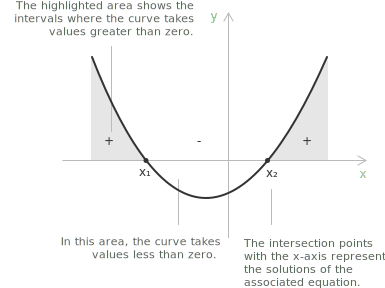
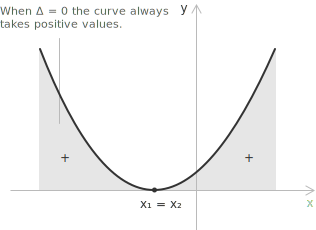
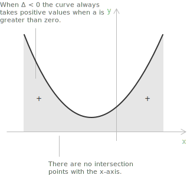
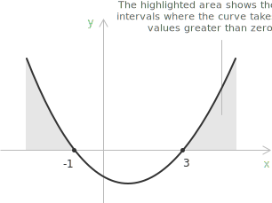
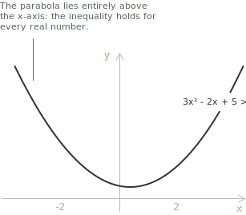

## Introduction

A quadratic inequality, or [inequality](../inequalities/) of degree two, is a second-degree [polynomial](../polynomials/) inequality in one variable, the natural extension of a [linear inequality](../linear-inequalities/) to the second degree. Its standard form presents the same organization of terms as a [quadratic equation](../quadratic-equations/), but the equal sign is replaced by one of the relations $>$, $<$, $\geq$, or $\leq$.

A quadratic inequality in standard form is the relation:

$$ax^2 + bx + c > 0 \quad \text{with} \quad a \neq 0$$

where $a$, $b$, $c$ are real coefficients and $x$ is the unknown.

+ $a$ is the coefficient of the quadratic term $x^2$, $b$ the coefficient of the linear term $x$, and $c$ the constant term.
+ When $a = 0$ the expression is no longer of second degree, and the inequality degenerates into the linear inequality $bx + c > 0$, or into a comparison between constants when $b = 0$ as well.

Quadratic inequalities that are not already in standard form can be brought to it by moving all terms to one side, so that the right-hand side becomes zero. The inequality $x^2 + 3 < 2x + 1$, for instance, is rewritten as $x^2 - 2x + 2 < 0$ before any of the methods discussed in this entry is applied.

## The nature of quadratic inequality solutions

The solution to a quadratic inequality is typically a range of values rather than a single value. Depending on the sign of the discriminant of the associated equation, on the sign of the leading coefficient, and on the direction of the inequality, the solution set may take one of the following forms:

+ a single bounded interval, open or closed at its endpoints,
+ the union of two unbounded intervals,
+ a single point, when the inequality is satisfied only at the vertex of the parabola,
+ the whole real line $\mathbb{R}$, when the inequality holds for every real value,
+ the real line with one point removed, when only the vertex of the parabola fails to satisfy the inequality,
+ the empty set, when the inequality is never satisfied.

Each of the following sections analyzes one of these configurations in detail and connects it to the geometric behavior of the parabola.

## Resolution method

The first step in solving a quadratic inequality is to determine the solutions of the associated second-degree equation. From the position of these solutions on the real line, and from the sign of the leading coefficient, the values that satisfy the inequality are read off. Two widely used methods give access to the solutions of the quadratic equation, the [quadratic formula](../quadratic-formula/) and the [factorization method](../factoring-quadratic-equations/).

> The quadratic formula provides the solutions of any quadratic equation in a systematic way, while the factorization method writes the quadratic polynomial as a product of linear factors whose roots can be read directly from the factorization.

- - -

Given an inequality in standard form, the associated quadratic equation is obtained by setting the polynomial equal to zero.

$$ax^2 + bx + c = 0$$

The real [roots](../roots-of-a-polynomial/) of the associated equation partition the real line into subintervals on which the quadratic polynomial has constant sign. By determining the sign of the expression on each of these intervals, we identify the values that satisfy the inequality.

In the discussion of the three cases that follow, we assume $a > 0$, so that the corresponding parabola opens upward. The case $a < 0$ is recovered by multiplying both sides of the inequality by $-1$, which reverses the direction of the inequality. The reversal of the sign is one of the most frequent sources of error in handling inequalities, so it is useful to make the transformation explicit. If $a < 0$, the inequality $ax^2 + bx + c > 0$ becomes $-ax^2 - bx - c < 0$, whose leading coefficient $-a$ is positive.

> When the coefficients depend on a parameter, the sign of the quadratic expression is governed by the discriminant viewed as a function of that parameter, and the intervals of positivity or negativity shift accordingly. A complete discussion of this situation is provided in the dedicated entry on [quadratic equations with parameters](../quadratic-equations-with-parameters/).

## Solutions when $\Delta > 0$

When $\Delta > 0$, the associated equation has two distinct real roots, which we label $x_1$ and $x_2$ with the convention $x_1 < x_2$. The two roots divide the real line into three subintervals, and on each of these the quadratic polynomial has  constant sign. Since $a > 0$, the parabola opens upward and crosses the $x$-axis at $x_1$ and $x_2$, so the expression is negative on the inner interval $(x_1, x_2)$ and positive on the two outer intervals $(-\infty, x_1)$ and $(x_2, +\infty)$.

The solution sets of the four possible inequalities follow directly from this distribution of signs.

$$\begin{align}
ax^2 + bx + c > 0 &\iff x < x_1 \lor x > x_2 \\[6pt]
ax^2 + bx + c \geq 0 &\iff x \leq x_1 \lor x \geq x_2 \\[6pt]
ax^2 + bx + c < 0 &\iff x_1 < x < x_2 \\[6pt]
ax^2 + bx + c \leq 0 &\iff x_1 \leq x \leq x_2
\end{align}$$

The roots themselves are the points at which the expression vanishes, so they belong to the solution set precisely when the inequality is non-strict.

## Solutions when $\Delta = 0$

When $\Delta = 0$, the associated equation has a single real root of multiplicity two, that is $x_1 = x_2$. The parabola, opening upward, is tangent to the $x$-axis at this root and lies strictly above the axis at every other point, so the quadratic polynomial is zero at the double root and strictly positive elsewhere.

The solution sets of the four possible inequalities follow accordingly.

$$\begin{align}
ax^2 + bx + c > 0 &\iff x \neq x_1 \\[6pt]
ax^2 + bx + c \geq 0 &\iff x \in \mathbb{R} \\[6pt]
ax^2 + bx + c < 0 &\iff \text{no real solution} \\[6pt]
ax^2 + bx + c \leq 0 &\iff x = x_1
\end{align}$$

## Solutions when $\Delta < 0$

When $\Delta < 0$, the associated equation has [complex roots](../quadratic-equations-with-complex-solutions/) and no real solutions. The parabola, opening upward, does not intersect the $x$-axis and lies strictly above it for every real $x$, so the quadratic polynomial is strictly positive on the whole real line.

The solution sets of the four possible inequalities are then immediate.

$$\begin{align}
ax^2 + bx + c > 0 &\iff x \in \mathbb{R} \\[6pt]
ax^2 + bx + c \geq 0 &\iff x \in \mathbb{R} \\[6pt]
ax^2 + bx + c < 0 &\iff \text{no real solution} \\[6pt]
ax^2 + bx + c \leq 0 &\iff \text{no real solution}
\end{align}$$

## Example 1

Solve the quadratic inequality

$$2x^2 + 5x - 3 > 0$$

The first step is to write the associated quadratic equation by setting the polynomial equal to zero.

$$2x^2 + 5x - 3 = 0$$

Applying the [quadratic formula](../quadratic-formula/) gives the following.

$$\begin{align}
x_{1,2} &= \frac{-5 \pm \sqrt{5^2 - 4 \cdot 2 \cdot (-3)}}{2 \cdot 2} \\[6pt]
&= \frac{-5 \pm \sqrt{25 + 24}}{4} \\[6pt]
&= \frac{-5 \pm 7}{4}
\end{align}$$

Following the convention $x_1 < x_2$, the two roots are

$$\begin{align}
x_1 &= \frac{-5 - 7}{4} = -3 \\[6pt]
x_2 &= \frac{-5 + 7}{4} = \frac{1}{2}
\end{align}$$

- - -

The inequality is of the form $ax^2 + bx + c > 0$ with $a > 0$ and $\Delta > 0$, so its solution set consists of the two outer intervals determined by the roots.

[shortcode="intervals"]
|     | $-3$         | $1/2$           |     |
|:----|------------|---------------|-----|
|     | sign+r-o-h | sign+l-o-h    |     |
[/shortcode]

The solution set is therefore the union of the two unbounded intervals to the left of $-3$ and to the right of $1/2$.

$$x < -3 \lor x > \frac{1}{2} \quad\text{or}\quad x \in (-\infty, -3) \cup \left(\frac{1}{2}, +\infty\right)$$

If instead the inequality had been $2x^2 + 5x - 3 < 0$, the solution set would have been the inner interval between the two roots.

[shortcode="intervals"]
|     | $-3$            | $1/2$           |     |
|:----|---------------|---------------|-----|
|     | sign+l-c      |               |     |
|     |               | sign+r-o      |     |
|     | sign+l-in-o-h | sign+r-in-o-h |     |
[/shortcode]

In this case the values satisfying the inequality lie in the open interval $\left(-3, 1/2\right)$.

## Sign analysis

Another useful method for solving inequalities is [sign analysis](../sign-analysis-in-inequalities/), which determines the intervals on which a given expression is positive, negative, or zero by studying the sign of each factor separately. Consider, for instance, the following inequality.

$$x^2 - 2x - 3 > 0$$

The polynomial can be [factored](../factoring-polynomials-ac-method/) as the product of two linear factors.

$$(x - 3)(x + 1) > 0$$

A product of two factors is positive when both factors share the same sign and negative when they have opposite signs. To apply this rule, we study the sign of each factor on the real line by solving the two associated linear inequalities.

$$\begin{align}
x + 1 &> 0 \iff x > -1 \\[6pt]
x - 3 &> 0 \iff x > 3
\end{align}$$

The two values $x = -1$ and $x = 3$ partition the real line into three subintervals, on each of which both factors have constant sign. The sign table below summarizes the resulting distribution.

[class="table-sign"]

|                        |                  |      $$-1$$      |      $$3$$       |     |
| :--------------------: | :--------------: | :--------------: | :--------------: | --- |
|        $$x + 1$$       | $\boldsymbol{-}$ | $\boldsymbol{+}$ | $\boldsymbol{+}$ |     |
|        $$x - 3$$       | $\boldsymbol{-}$ | $\boldsymbol{-}$ | $\boldsymbol{+}$ |     |
| $$(x + 1)(x - 3)$$     | $\boldsymbol{+}$ | $\boldsymbol{-}$ | $\boldsymbol{+}$ |     |
[/class]

> A complete treatment of this method, including products of more than two factors and rational expressions, is available in the dedicated entry on [sign analysis](../sign-analysis-in-inequalities/).

The product is positive on the two outer intervals, where the factors share the same sign, and negative on the central interval, where they have opposite signs. The original inequality is therefore satisfied for

$$x < -1 \lor x > 3 \quad\text{or}\quad x \in (-\infty, -1) \cup (3, +\infty)$$

The sign table reaches the result by studying the sign of each linear factor obtained from the factorization, without invoking the [quadratic formula](../quadratic-formula/). The roots of the polynomial are still used, since they are precisely the values at which each factor vanishes, but here they are read off the factored form rather than computed from the discriminant.

## Example 2

Consider the following inequality, in which the discriminant determines the form of the solution set.

$$3x^2 - 2x + 5 > 0$$

The discriminant of the associated equation $3x^2 - 2x + 5 = 0$ is

$$\Delta = (-2)^2 - 4 \cdot 3 \cdot 5 = 4 - 60 = -56$$

Since $\Delta < 0$ and the leading coefficient $a = 3 > 0$, the parabola opens upward and does not intersect the $x$-axis.

The quadratic expression is therefore strictly positive for every real value of $x$, and the solution set is the whole real line $\mathbb{R}$.
