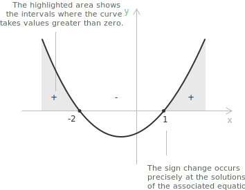

## What is sign analysis

Sign analysis of inequalities is a method for determining the intervals in which a given expression is positive, negative, or zero. This approach is especially valuable for solving [polynomial](../polynomial-inequalities/) and [rational inequalities](../rational-inequalities/) and for analysing the behaviour of functions within specified [domains](../determining-the-domain-of-a-function/).

The sign of a product is determined by whether the number of negative factors is even or odd. A product is positive if the number of negative factors is even, and negative if the number of negative factors is odd. For two factors the rule reads:

$$\begin{align}
(+)\times(+) &= + \\[6pt]
(+)\times(-) &= - \\[6pt]
(-)\times(+) &= - \\[6pt]
(-)\times(-) &= +
\end{align}$$

Consider the following simple [quadratic inequality](../quadratic-inequalities/):

$$x^2 + x - 2 > 0$$

We need to determine the range of x values that satisfy the inequality. First, we can [factor the polynomial](../factoring-polynomials-ac-method/) in the form:

$$(x - 1)(x + 2) > 0$$

According to the product rule, the expression is positive when the two factors have the same sign, that is, when both are positive or both are negative. To track where this happens, we study the sign of each factor separately:

$$\begin{align}
&x - 1 > 0 \iff x > 1 \\[6pt]
&x + 2 > 0 \iff x > -2
\end{align}$$

The values $x = 1$ and $x = -2$ divide the real line into disjoint intervals. Since the expression is [continuous](../continuous-functions/) and can change sign only at its zeros, its sign remains constant within each interval. These values are then marked on a number line, with $+$ and $-$ indicating the sign on each interval.

[class="table-sign"]

|             |      | $$-2$$      | $$1$$  |   
|:-----------:|:------------------:|:------------:|:----------------:|
| $x - 1 > 0$ | $\boldsymbol{-}$ | $\boldsymbol{-}$ | $\boldsymbol{+}$ |
| $x + 2 > 0$  | $\boldsymbol{-}$ | $\boldsymbol{+}$ | $\boldsymbol{+}$ |
| $(x - 1)(x+2) > 0$ | $\boldsymbol{+}$ | $\boldsymbol{-}$ | $\boldsymbol{+}$ |
[/class]

Each entry in the last row is obtained by multiplying the signs of the two factors in the corresponding interval. The intervals that satisfy the initial inequality $(x - 1)(x + 2) > 0$ are:

$$x < -2 \quad \text{or} \quad x > 1$$

In interval notation, the solution set is:

$$(-\infty, -2) \cup (1, +\infty)$$

> If the inequality is non-strict, the zeros of the expression belong to the solution. For the inequality $x^2 + x - 2 \geq 0$ the procedure is identical, but since the inequality is satisfied also when the expression equals zero, the zeros $x = -2$ and $x = 1$ are included in the solution set $(-\infty, -2] \cup [1, +\infty)$.

An equivalent way to fill in the sign chart is the test-point method. Since the sign of the expression is constant on each interval, it suffices to evaluate the expression at a single point chosen inside the interval. For instance, substituting $x = 0$ into $(x-1)(x+2)$ gives $(-1)(2) = -2 < 0$, which confirms that the expression is negative on the whole interval $(-2, 1)$.

## Systematic procedure for sign analysis

In general, sign analysis of inequalities follows a systematic procedure that applies consistently to any polynomial or rational expression.

+ Rewrite the inequality in the form $f(x) > 0$ (or $< 0$, $\geq 0$, $\leq 0$), with zero on the right-hand side.
+ Factor $f(x)$ into a product or quotient of linear or irreducible factors. For rational inequalities, analyse the numerator and denominator independently.
+ Find the zeros of each factor. Zeros of the denominator never belong to the solution and must be marked on the number line with an open circle.
+ Arrange the zeros in ascending order along the real line, thereby partitioning $\mathbb{R}$ into disjoint intervals. For each interval, determine the sign of each factor.
+ Combine the signs for each interval using the product rule: the overall sign is positive if the number of negative factors is even and negative if it is odd. Factors with even multiplicity do not produce a sign change at their corresponding zero.
+ Identify the intervals where the overall sign fulfils the original inequality. For strict inequalities, exclude zeros from the solution; for non-strict inequalities, include them. Always exclude zeros of the denominator.
+ Present the solution using set notation, combining disjoint intervals with $\cup$.

## Geometric representation

When the inequality is of the form $ax^2 + bx + c \ge 0$ or $ax^2 + bx + c > 0$ with $a > 0$, and the corresponding [quadratic equation](../quadratic-equations/) $ax^2 + bx + c = 0$ has two distinct real solutions $x_1 < x_2$, we have:

$$\begin{align}
&x \leq x_1 \lor x \geq x_2  &&\text{for} \quad ax^2+bx+c \geq 0 \\[6pt]
&x < x_1 \lor x > x_2  &&\text{for} \quad ax^2+bx+c > 0
\end{align}$$

The condition $a > 0$ corresponds to a parabola opening upward, which is positive outside the interval determined by its roots and negative between them. If $a < 0$, multiplying both sides of the inequality by $-1$ and reversing the inequality sign reduces the problem to the previous case.

If a function $f(x)$ is [continuous](../continuous-functions/) on an interval $[a,b]$ and $f(a)$ and $f(b)$ have opposite signs, then by the Intermediate Value Theorem there exists at least one point $c \in (a,b)$ such that $f(c) = 0$.

> In other words, for a [continuous function](../continuous-functions/), a change of sign occurs only by crossing a zero of the function, which is a point where $f(x) = 0$. In the example shown above, the change of sign occurs precisely at the solutions of the equation associated with the inequality, namely $x = -2$ and $x = 1$.

## Example 1

The same approach can be applied to solving rational inequalities of the type:

$$\frac{N(x)}{D(x)} > 0$$

The sign rule for a quotient is the same as for a product, so we study the sign of the numerator and the sign of the denominator separately. The quotient is positive on the intervals where the two signs are concordant (both positive or both negative) and negative where they are discordant (one positive, the other negative). The zeros of the denominator must always be excluded, since the expression is undefined there.

Consider the following rational inequality:

$$\frac{2x - 3}{1 - x} > 0$$

We study the sign of the numerator and of the denominator separately by solving $N(x) > 0$ and $D(x) > 0$:

$$\begin{align}
&2x - 3 > 0 \iff x > \frac{3}{2} \\[6pt]
&1 - x > 0 \iff x < 1
\end{align}$$

By representing the signs on the number line, we have:

[class="table-sign"]

|                      |                  |      $$1$$       |     $$3/2$$      |
| :------------------: | :--------------: | :--------------: | :--------------: |
|        $N(x)$        | $\boldsymbol{-}$ | $\boldsymbol{-}$ | $\boldsymbol{+}$ |
|        $D(x)$        | $\boldsymbol{+}$ | $\boldsymbol{-}$ | $\boldsymbol{-}$ |
| $\dfrac{N(x)}{D(x)}$ | $\boldsymbol{-}$ | $\boldsymbol{+}$ | $\boldsymbol{-}$ |

[/class]

The interval of positivity that satisfies our initial inequality is therefore:

$$x \in \left(1, \dfrac{3}{2}\right)$$

> Even if the inequality were non-strict, the point $x = 1$ would remain excluded, because it is a zero of the denominator and the expression is undefined there. The point $x = \frac{3}{2}$, a zero of the numerator, would instead be included.

## Example 2

Consider the following inequality, which involves a factor with even multiplicity:

$$(x - 1)^2(x + 3) > 0$$

The zeros are $x = 1$ (with multiplicity $2$) and $x = -3$ (with multiplicity $1$). They partition the real line into three intervals:

[class="table-sign"]

|                |                  |      $$-3$$      |      $$1$$       |
| :------------: | :--------------: | :--------------: | :--------------: |
|   $(x-1)^2$    | $\boldsymbol{+}$ | $\boldsymbol{+}$ | $\boldsymbol{+}$ |
|    $x + 3$     | $\boldsymbol{-}$ | $\boldsymbol{+}$ | $\boldsymbol{+}$ |
| $(x-1)^2(x+3)$ | $\boldsymbol{-}$ | $\boldsymbol{+}$ | $\boldsymbol{+}$ |
[/class]

The factor $(x-1)^2$ is always non-negative and equals zero only at $x = 1$. As a result, the sign of the product is determined entirely by the factor $(x+3)$, and no sign change occurs at $x = 1$. The overall sign transitions from $-$ to $+$ only at $x = -3$, where the factor $(x+3)$ changes sign.

The solution to the inequality is therefore:

$$x \in (-3, 1) \cup (1, +\infty)$$

> The point $x = 1$ is excluded because the inequality is strict and $f(1) = 0$, even though no sign change occurs there.