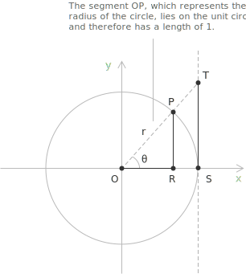
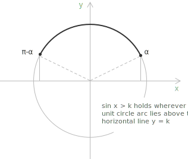
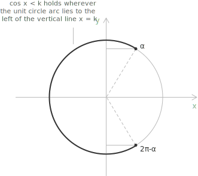
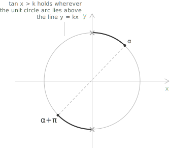

## Introduction

A trigonometric inequality is an inequality in which the unknown appears as the argument of one or more trigonometric functions. Unlike algebraic inequalities, the solution set is typically an infinite union of intervals, a consequence of the periodic nature of the functions involved. This page covers the three fundamental cases, involving [sine and cosine](../sine-and-cosine/) and [tangent](../tangent-and-cotangent/), and then examines how more complex expressions can be reduced to these standard forms.

- - -

The method for solving trigonometric inequalities is based on a geometric interpretation of the [unit circle](../unit-circle/). Given the point determined by the [angle](../angles-and-angular-measure/) $x$ on the unit circle:

+ $\sin x$ is the vertical coordinate of the point (segment $\overline{PR}$).
+ $\cos x$ is the horizontal coordinate of the point (segment $\overline{OR}$).
+ $\tan x$ is the ratio of the two coordinates, represented geometrically by the ordinate of the point where the line through the origin and the point meets the vertical line tangent to the circle at $(1, 0)$, (segment $\overline{ST}$).

Determining where these quantities are greater or less than a specified value constitutes the geometric approach to solving such inequalities. Since sine and cosine are periodic with period $2\pi$, and tangent with period $\pi$, solutions identified within a single period must be generalised to the entire real line by adding integer multiples of the relevant period.

## Inequalities involving sine

Consider an inequality of the form below, where $k$ is a real constant.

$$\sin x > k$$

Two extreme cases can be settled immediately. When $k \geq 1$ the inequality has no solution, since $\sin x \leq 1$ for all $x$; when $k < -1$ it is satisfied by every real number, since $\sin x \geq -1$. The relevant case is therefore $-1 \leq k < 1$.

The first step is to locate the [reference angle](../reduction-formulas-and-reference-angles/) $\alpha = \arcsin k$, which lies in $[-\pi/2, \pi/2]$ and is the same angle that solves the associated [trigonometric equation](../trigonometric-equations/) $\sin x = k$. On the unit circle, the condition $\sin x > k$ is satisfied on the arc where the vertical coordinate exceeds $k$. This arc runs counterclockwise from $\alpha$ to $\pi - \alpha$.

The solution within one period is therefore the open interval $(\alpha, \pi - \alpha)$, and the general solution on $\mathbb{R}$ is the following.

$$\alpha + 2n\pi < x < \pi - \alpha + 2n\pi$$

$$n \in \mathbb{Z}$$

For the non-strict version $\sin x \geq k$, the endpoints are included and the intervals become closed. In this case the value $k = 1$ is also admissible, and the solution set degenerates to the isolated points $x = \pi/2 + 2n\pi$.

The reverse inequality $\sin x < k$ is solved by the same construction, the solution being the complementary arc, which within one period is the open interval $(\pi - \alpha, 2\pi + \alpha)$.

- - -

For example, find all real solutions to the following inequality:

$$\sin x > \frac{\sqrt{3}}{2}$$

The reference angle is $\arcsin(\sqrt{3}/2) = \pi/3$. Since the sine function exceeds $\sqrt{3}/2$ on the arc between $\pi/3$ and $\pi - \pi/3 = 2\pi/3$, the general solution is:

$$\frac{\pi}{3} + 2n\pi < x < \frac{2\pi}{3} + 2n\pi$$

$$n \in \mathbb{Z}$$

> A practical remark: solving trigonometric inequalities in closed form requires familiarity with the principal values of sine and cosine at the standard angles $\pi/6$, $\pi/4$, $\pi/3$, and $\pi/2$. Without this, the step from $\arcsin(\sqrt{3}/2)$ to $\pi/3$ is not immediate.

## Inequalities involving cosine

An inequality of the form below is handled similarly, though the relevant arc on the unit circle is now symmetric about the horizontal axis.

$$\cos x < k$$

When $k \leq -1$ the inequality has no solution, since $\cos x \geq -1$ for all $x$; when $k > 1$ it holds for every real number. For $-1 < k \leq 1$, let $\alpha = \arccos k$, which lies in $[0, \pi)$. The condition $\cos x < k$ is satisfied where the horizontal coordinate of the unit circle point falls below $k$, which occurs on the arc running counterclockwise from $\alpha$ to $2\pi - \alpha$.

The general solution is stated as follows:

$$\alpha + 2n\pi < x < 2\pi - \alpha + 2n\pi$$

$$n \in \mathbb{Z}$$

Each interval is centred at $\pi + 2n\pi$ and has radius $\pi - \alpha$, so the solution admits the compact equivalent form $|x - \pi - 2n\pi| < \pi - \alpha$.

The reverse inequality $\cos x > k$ is satisfied on the arc symmetric about the positive horizontal axis, namely $-\alpha + 2n\pi < x < \alpha + 2n\pi$.

- - -

For example, determine the solution set of the inequality below:

$$\cos x \leq -\frac{1}{2}$$

The [reference angle](../reduction-formulas-and-reference-angles/) is $\arccos(-1/2) = 2\pi/3$. Since the inequality is non-strict, the solution in each period is the closed interval $[2\pi/3, 4\pi/3]$, and the general solution on $\mathbb{R}$ is the following.

$$\frac{2\pi}{3} + 2n\pi \leq x \leq \frac{4\pi}{3} + 2n\pi$$

$$n \in \mathbb{Z}$$

> As with the sine case discussed above, solving cosine inequalities in closed form requires familiarity with the principal values of cosine at the standard angles $\pi/6$, $\pi/4$, $\pi/3$, and $\pi/2$. Without this, the step from $\arccos(-1/2)$ to $2\pi/3$ is not immediate.

## Inequalities involving tangent

The tangent function has period $\pi$ and is strictly increasing on each interval of the form $(-\pi/2 + n\pi, \pi/2 + n\pi)$, on which it takes every real value. As a consequence, no restriction on $k$ is needed, and within each such interval the inequality reduces to a straightforward comparison with the reference angle $\arctan k$, which lies in $(-\pi/2, \pi/2)$.

Consider the following inequality:

$$\tan x > k$$

The general solution is:

$$\arctan k + n\pi < x < \frac{\pi}{2} + n\pi$$

$$n \in \mathbb{Z}$$

The upper bound $\pi/2 + n\pi$ is a vertical asymptote and is therefore always excluded, regardless of whether the inequality is strict or not. The reverse inequality $\tan x < k$ is satisfied on the remaining part of each branch, namely $-\pi/2 + n\pi < x < \arctan k + n\pi$.

- - -

For example, solve the inequality stated below:

$$\tan x \leq -1$$

The reference angle is $\arctan(-1) = -\pi/4$. Since [tangent](../tangent-and-cotangent/) is increasing on each branch, the condition $\tan x \leq -1$ is satisfied from the left endpoint of each branch up to and including $-\pi/4$. The general solution is the following.

$$-\frac{\pi}{2} + n\pi < x \leq -\frac{\pi}{4} + n\pi$$

$$n \in \mathbb{Z}$$

The left endpoint is excluded because the tangent function is not defined there.

## Reducible inequalities

Many trigonometric inequalities do not appear in standard form but can be reduced to one of the cases above through algebraic manipulation or the application of trigonometric identities.

Consider the inequality below, in which the sine function appears inside a linear expression.

$$2\sin x - \sqrt{2} \geq 0$$

Isolating the sine function gives $\sin x \geq \sqrt{2}/2$. This is now in standard form with $k = \sqrt{2}/2$ and reference angle $\pi/4$, so the general solution is the following.

$$\frac{\pi}{4} + 2n\pi \leq x \leq \frac{3\pi}{4} + 2n\pi$$

$$n \in \mathbb{Z}$$

- - -

A second class of reducible inequalities arises when the argument of the trigonometric function is not simply $x$ but a linear expression in $x$. Consider the following inequality:

$$\sin\!\left(2x - \frac{\pi}{3}\right) > \frac{1}{2}$$

Introducing the substitution $t = 2x - \pi/3$, the inequality becomes:

$$\sin t > \frac{1}{2}$$

The reference angle is $\arcsin(1/2) = \pi/6$, so the solution in $t$ is:

$$\frac{\pi}{6} + 2n\pi < t < \frac{5\pi}{6} + 2n\pi$$

Substituting back $t = 2x - \pi/3$, we can write:

$$\frac{\pi}{6} + 2n\pi < 2x - \frac{\pi}{3} < \frac{5\pi}{6} + 2n\pi$$

Adding $\pi/3$ throughout gives:

$$\frac{\pi}{2} + 2n\pi < 2x < \frac{7\pi}{6} + 2n\pi$$

Dividing every term by $2$, which scales all expressions uniformly without altering the direction of the inequalities, one obtains the following.

$$\frac{\pi}{4} + n\pi < x < \frac{7\pi}{12} + n\pi$$

$$n \in \mathbb{Z}$$

The solutions recur with period $\pi$ rather than $2\pi$, consistent with the fact that the function $\sin(2x - \pi/3)$ has period $\pi$.

- - -

A third reduction technique applies when the inequality is [quadratic](../quadratic-equations/) in a trigonometric function. Consider the following:

$$2\cos^2 x - \cos x - 1 > 0$$

Setting $u = \cos x$, this becomes the [quadratic inequality](../quadratic-inequalities/):

$$2u^2 - u - 1 > 0$$

[Factoring](../factoring-polynomials-ac-method/) yields $(2u + 1)(u - 1) > 0$, which holds when $u < -1/2$ or $u > 1$. Since $\cos x \leq 1$ for all real $x$, the condition $\cos x > 1$ is never satisfied.

The inequality therefore reduces to $\cos x < -1/2$, which is the standard cosine case with reference angle $2\pi/3$, giving the following.

$$\frac{2\pi}{3} + 2n\pi < x < \frac{4\pi}{3} + 2n\pi$$

$$n \in \mathbb{Z}$$

## Reduction through the Pythagorean identity

A more involved reduction arises when the inequality contains both $\sin x$ and $\cos^2 x$, making a direct substitution impossible without first applying a [trigonometric identity](../trigonometric-identities/). Consider the following inequality:

$$\cos^2 x - \sin x - 1 > 0$$

Replacing $\cos^2 x$ with $1 - \sin^2 x$ via the [Pythagorean identity](../pythagorean-identity/) reduces the expression to a single trigonometric function. The inequality becomes the following.

$$1 - \sin^2 x - \sin x - 1 > 0$$

Simplifying, one obtains $-\sin^2 x - \sin x > 0$, or equivalently $\sin^2 x + \sin x < 0$. Setting $u = \sin x$, this becomes:

$$u^2 + u < 0$$

which factors as:

$$u(u + 1) < 0$$

This holds when $-1 < u < 0$, that is, when $-1 < \sin x < 0$. The condition $\sin x < 0$ is satisfied within one period on the open interval $(\pi, 2\pi)$, while the condition $\sin x > -1$ excludes the point $x = 3\pi/2$, where $\sin x = -1$ and the strict inequality fails.

The general solution is therefore the following.

$$\pi + 2n\pi < x < 2\pi + 2n\pi, \quad x \neq \frac{3\pi}{2} + 2n\pi, \quad n \in \mathbb{Z}$$

## Homogeneous inequalities reduced to tangent

A further technique applies to inequalities that are homogeneous in $\sin x$ and $\cos x$, meaning that every term has the same total degree in the two functions. Consider the following inequality, in which both terms have degree two:

$$\sin^2 x - \sin x \cos x < 0$$

Dividing by $\cos^2 x$ converts a homogeneous inequality of degree two into an inequality in $\tan x$ alone. Since $\cos^2 x > 0$ wherever $\cos x \neq 0$, the division preserves the direction of the inequality on each branch of the tangent. The points where $\cos x = 0$, namely $x = \pi/2 + n\pi$, must be examined separately, because there the division is not permitted. At these points $\sin^2 x = 1$ and $\sin x \cos x = 0$, so the left-hand side equals $1$ and the strict inequality fails; these points are therefore not solutions and can be excluded from the outset.

Dividing through by $\cos^2 x$, the inequality becomes the following.

$$\frac{\sin x}{\cos x}\left(\frac{\sin x}{\cos x} - 1\right) < 0$$

Setting $u = \tan x$, this reduces to the algebraic inequality $u(u - 1) < 0$, which holds when $0 < u < 1$, that is, when $0 < \tan x < 1$. This is a system of two standard tangent inequalities to be solved simultaneously within each branch of the tangent function. The inequality $\tan x > 0$ is satisfied on the following interval:

$$\left(n\pi, \frac{\pi}{2} + n\pi\right)$$

The inequality $\tan x < 1$ is satisfied on the following interval:

$$\left(-\frac{\pi}{2} + n\pi, \frac{\pi}{4} + n\pi\right)$$

Taking the intersection within each branch, the general solution is the following.

$$n\pi < x < \frac{\pi}{4} + n\pi$$

$$n \in \mathbb{Z}$$

As a quick verification, the point $x = \pi/8$ belongs to the solution set, and indeed $\sin(\pi/8) > 0$ while $\sin(\pi/8) - \cos(\pi/8) < 0$, so the product is negative as required.

## Systems of trigonometric inequalities

A system of trigonometric inequalities, like any [system of inequalities](../systems-of-inequalities/), consists of two or more inequalities that must be satisfied simultaneously. The solution set is the intersection of the individual solution sets, computed period by period.

- - -

For example, solve the system formed by the two inequalities below:

$$\begin{cases}
\sin x \geq 0 \\[6pt]
\cos x < \dfrac{1}{2}
\end{cases}$$

The first inequality, $\sin x \geq 0$, is satisfied for each $n \in \mathbb{Z}$ on:

$$[2n\pi, \pi + 2n\pi]$$

The second inequality, $\cos x < 1/2$, has reference angle $\arccos(1/2) = \pi/3$, and is satisfied on:

$$\left(\frac{\pi}{3} + 2n\pi, \frac{5\pi}{3} + 2n\pi\right)$$

To find the intersection, it suffices to work within a single period, say $[0, 2\pi)$. The first condition restricts attention to $[0, \pi]$. The second condition on this interval is satisfied where $x > \pi/3$. The intersection within one period is therefore $(\pi/3, \pi]$, and the general solution is the following.

$$\frac{\pi}{3} + 2n\pi < x \leq \pi + 2n\pi$$

$$n \in \mathbb{Z}$$
