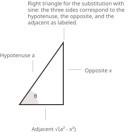

## Come funziona la sostituzione trigonometrica

La sostituzione trigonometrica è un metodo per calcolare [integrali](../indefinite-integrals/) che contengono [radici quadrate](../radicals/) di espressioni quadratiche. Alcune forme algebriche diventano più semplici da trattare quando vengono riscritte mediante le [identità pitagoriche](../pythagorean-identity/) della trigonometria. Il metodo consiste in un cambio di variabile $x = \phi(\theta)$ scelto in modo che l'espressione quadratica sotto radice si trasformi nel quadrato di una funzione trigonometrica della nuova variabile.

Con opportune manipolazioni algebriche, molti integrali del calcolo elementare si possono ricondurre a una delle seguenti forme canoniche, con $a > 0:$

$$\sqrt{a^2 - x^2} \qquad \sqrt{x^2 + a^2} \qquad \sqrt{x^2 - a^2}$$

Affinché il radicale assuma valori reali, la variabile $x$ deve appartenere al dominio corrispondente:

+ $\sqrt{a^2 - x^2}$ richiede $x \in [-a, a].$
+ $\sqrt{x^2 + a^2}$ è definita per ogni $x \in \mathbb{R}.$
+ $\sqrt{x^2 - a^2}$ richiede $x \in (-\infty, -a] \cup [a, +\infty).$

Queste restrizioni determinano il dominio dell'integranda e l'intervallo ammissibile per l'[angolo](../angles-and-angular-measure/) ausiliario $\theta$ introdotto nella sostituzione. In particolare, la scelta dell'[intervallo](../intervals/) di $\theta$ garantisce che le funzioni trigonometriche inverse siano ben definite e permette di trattare correttamente i valori assoluti che compaiono estraendo le radici quadrate. A ciascuna di queste espressioni corrisponde un'identità pitagorica:

$$1 - \sin^2\theta = \cos^2\theta$$

$$1 + \tan^2\theta = \sec^2\theta$$

$$\sec^2\theta - 1 = \tan^2\theta$$

> In ciascun caso, la sostituzione viene scelta in modo che l'espressione sotto radice, dopo aver raccolto il fattore costante, coincida con il primo membro di una di queste identità. Il radicale si trasforma così in un'espressione priva di radici. Gli integrali di funzioni razionali di $\sin x$ e $\cos x$ si trattano invece generalmente con la [sostituzione di Weierstrass](../the-weierstrass-substitution/), che trasforma le espressioni trigonometriche in funzioni razionali di una nuova variabile.

- - -

Nella pratica, l'espressione sotto radice raramente si presenta già in una delle tre forme canoniche. Un passaggio preliminare frequente consiste nel riscrivere un'espressione quadratica generale $ax^2 + bx + c$ in una forma riconducibile a uno dei casi standard, mediante il [completamento del quadrato](../completing-the-square/). Per esempio, completando il quadrato, $x^2 + 4x + 5$ diventa $(x + 2)^2 + 1,$ che ha la forma $u^2 + a^2$ con $u = x + 2$ e $a = 1.$ Una volta riscritta l'espressione quadratica, una semplice sostituzione $u = x + k$ riconduce l'integrale a uno dei tre casi descritti di seguito, al quale si può applicare la sostituzione trigonometrica appropriata.

> Riconoscere questo passaggio preliminare permette spesso di individuare la sostituzione necessaria. Quando l'integranda non corrisponde immediatamente a una forma nota, il completamento del quadrato consente di riconoscere il caso da applicare.

## Dalle sostituzioni alla geometria

Dal punto di vista geometrico, queste sostituzioni si possono interpretare come parametrizzazioni di [sezioni coniche](../introduction-to-conics/). La corrispondenza tra ciascuna identità pitagorica e la curva che descrive è la seguente.

+ L'identità $\sin^2\theta + \cos^2\theta = 1$ corrisponde alla [circonferenza unitaria](../unit-circle/) ed è alla base del caso $\sqrt{a^2 - x^2}.$
+ Le identità $1 + \tan^2\theta = \sec^2\theta$ e $\sec^2\theta - 1 = \tan^2\theta$ sono legate alla geometria dell'[iperbole](../hyperbola/) $x^2 - y^2 = a^2$ e sono alla base delle forme $\sqrt{x^2 + a^2}$ e $\sqrt{x^2 - a^2}.$

La sostituzione trigonometrica ammette quindi un'interpretazione geometrica come riparametrizzazione di curve quadratiche.

## La forma $\sqrt{a^2 - x^2}$

Quando l'integranda contiene un'espressione della forma $\sqrt{a^2 - x^2},$ la sostituzione trigonometrica appropriata si basa sull'identità pitagorica $1 - \sin^2\theta = \cos^2\theta,$ che deriva dalla relazione fondamentale tra [seno e coseno](../sine-and-cosine/). Poniamo:

$$x = a\sin\theta$$

Questa sostituzione permette di riscrivere l'espressione algebrica sotto radice in termini di una [funzione](../functions/) trigonometrica. Differenziando entrambi i membri rispetto a $\theta,$ otteniamo:

$$dx = a\cos\theta \ d\theta$$

Sostituendo $x = a\sin\theta$ nell'espressione del radicale, si ha:

$$\sqrt{a^2 - x^2} = \sqrt{a^2 - a^2\sin^2\theta}$$

Raccogliendo $a^2$ nell'espressione sotto radice, otteniamo:

$$\sqrt{a^2(1 - \sin^2\theta)}$$

L'identità $1 - \sin^2\theta = \cos^2\theta$ consente di riscrivere questa espressione come:

$$\sqrt{a^2\cos^2\theta} = a\sqrt{\cos^2\theta} = a|\cos\theta|$$

Per eliminare il valore assoluto senza ambiguità, si restringe abitualmente l'angolo $\theta$ all'intervallo:

$$\theta \in \left[-\frac{\pi}{2}, \frac{\pi}{2}\right]$$

Su questo intervallo vale $\cos\theta \geq 0.$ Con tale restrizione, il valore assoluto non è più necessario e il radicale si semplifica come segue:

$$\sqrt{a^2 - x^2} = a\cos\theta$$

Tornando alla variabile originaria $x,$ le relazioni che derivano dalla sostituzione si possono scrivere esplicitamente come:

$$\sin\theta = \frac{x}{a} \qquad \cos\theta = \frac{\sqrt{a^2 - x^2}}{a}$$

L'angolo si può esprimere mediante l'[arcoseno](../arcsine-function/):

$$\theta = \arcsin\left(\frac{x}{a}\right)$$

Queste relazioni permettono di esprimere il risultato dell'integrazione interamente in funzione della variabile originaria.

> Un'interpretazione geometrica può essere utile. Per $0 < x < a,$ se $\sin\theta = x/a,$ un [triangolo rettangolo](../right-triangle-trigonometry/) con ipotenusa $a,$ cateto opposto $x$ e cateto adiacente $\sqrt{a^2 - x^2}$ descrive le identità utilizzate.

Le corrispondenze standard per $\sqrt{a^2 - x^2}$ sono le seguenti:

+ Forma del radicale: $\sqrt{a^2 - x^2}$
+ Sostituzione: $x = a\sin\theta$
+ Identità utilizzata: $1 - \sin^2\theta = \cos^2\theta$

## Interpretazione geometrica

Nelle sostituzioni trigonometriche è spesso utile visualizzare la relazione tra $\theta$ e $x$ mediante un triangolo rettangolo. Ricavando i valori delle funzioni trigonometriche direttamente dai lati del triangolo, si evita di dover determinare esplicitamente $\theta.$

Dalla relazione $x = a\sin\theta,$ per $0 < x < a,$ si costruisce un triangolo rettangolo con i seguenti lati:

+ Ipotenusa $a$
+ Cateto opposto $x$
+ Cateto adiacente $\sqrt{a^2 - x^2}$

Poiché $\sin\theta = x/a,$ segue che $\cos\theta = \sqrt{a^2 - x^2}/a.$ Questa rappresentazione geometrica permette di riscrivere tutte le funzioni trigonometriche di $\theta$ direttamente in termini di $x.$ Le identità algebriche restano valide anche per valori negativi di $x,$ tenendo conto dei segni delle funzioni trigonometriche.

> La stessa costruzione si applica alle altre due forme standard. Per $\sqrt{x^2 + a^2},$ con $x > 0,$ il triangolo ha cateto opposto $x,$ cateto adiacente $a$ e ipotenusa $\sqrt{x^2 + a^2};$ per $\sqrt{x^2 - a^2},$ con $x > a,$ l'ipotenusa è $x,$ il cateto adiacente è $a$ e il cateto opposto è $\sqrt{x^2 - a^2}.$ In ciascun caso il triangolo si costruisce direttamente a partire dalla sostituzione e guida il ritorno alla variabile originaria.

## Esempio 1

Calcoliamo il seguente integrale:

$$\int \sqrt{a^2 - x^2} \ dx \qquad (a > 0)$$

Poiché l'integranda contiene l'espressione $\sqrt{a^2 - x^2},$ introduciamo la sostituzione trigonometrica:

$$x = a\sin\theta \qquad \theta \in \left[-\frac{\pi}{2}, \frac{\pi}{2}\right]$$

In questo modo possiamo applicare l'identità $1 - \sin^2\theta = \cos^2\theta,$ con $\cos\theta \geq 0$ sull'intervallo scelto. Differenziando la sostituzione, otteniamo:

$$dx = a\cos\theta \ d\theta$$

Il radicale si riscrive come:

$$\sqrt{a^2 - x^2} = \sqrt{a^2 - a^2\sin^2\theta} = a\sqrt{1 - \sin^2\theta} = a\cos\theta$$

Sostituendo nell'integrale le espressioni ottenute, si ha:

$$
\begin{align}
\int \sqrt{a^2 - x^2} \ dx &= \int (a\cos\theta)(a\cos\theta \ d\theta) \\[6pt]
                          &= a^2 \int \cos^2\theta \ d\theta
\end{align}
$$

Per integrare $\cos^2\theta,$ utilizziamo la [formula di duplicazione](../reduction-formulas-and-reference-angles/) nella forma:

$$\cos^2\theta = \frac{1 + \cos 2\theta}{2}$$

Otteniamo quindi:

$$a^2 \int \cos^2\theta \ d\theta = \frac{a^2}{2}\int (1 + \cos 2\theta) \ d\theta$$

Integrando termine a termine, si ricava:

$$\frac{a^2}{2}\theta + \frac{a^2}{4}\sin 2\theta + c$$

Per tornare alla variabile $x,$ dalla sostituzione $x = a\sin\theta$ ricaviamo:

$$\theta = \arcsin\left(\frac{x}{a}\right)$$

Per esprimere $\sin 2\theta$ in termini di $x,$ utilizziamo l'identità $\sin 2\theta = 2\sin\theta\cos\theta$ e le relazioni:

$$\sin\theta = \frac{x}{a} \qquad \cos\theta = \frac{\sqrt{a^2 - x^2}}{a}$$

Si ottiene così:

$$\sin 2\theta = 2 \cdot \frac{x}{a} \cdot \frac{\sqrt{a^2 - x^2}}{a} = \frac{2x\sqrt{a^2 - x^2}}{a^2}$$

Sostituendo queste espressioni nella primitiva, abbiamo:

$$\frac{a^2}{2}\theta + \frac{a^2}{4}\sin 2\theta = \frac{a^2}{2}\arcsin\left(\frac{x}{a}\right) + \frac{x}{2}\sqrt{a^2 - x^2}$$

Il risultato è dunque:

$$\int \sqrt{a^2 - x^2} \ dx = \frac{x}{2}\sqrt{a^2 - x^2} + \frac{a^2}{2}\arcsin\left(\frac{x}{a}\right) + c$$

> L'integrale è stato ricondotto a una forma trigonometrica, calcolato mediante identità note e infine riscritto interamente in termini della variabile originaria $x.$

## La forma $\sqrt{x^2 + a^2}$

Quando l'integranda contiene un'espressione della forma $\sqrt{x^2 + a^2},$ conviene utilizzare una sostituzione basata sulla seguente identità pitagorica:

$$1 + \tan^2\theta = \sec^2\theta$$

Questa identità lega la [tangente](../tangent-and-cotangent/) e la [secante](../secant-and-cosecant/). Poniamo $x = a\tan\theta$ per riscrivere l'espressione quadratica sotto radice in termini di una funzione trigonometrica. Differenziando entrambi i membri rispetto a $\theta,$ otteniamo:

$$dx = a\sec^2\theta \ d\theta$$

Sostituendo $x = a\tan\theta$ nell'espressione del radicale, si ha:

$$\sqrt{x^2 + a^2} = \sqrt{a^2\tan^2\theta + a^2}$$

Raccogliendo $a^2$ nell'espressione sotto radice, otteniamo:

$$\sqrt{a^2(\tan^2\theta + 1)}$$

L'identità $1 + \tan^2\theta = \sec^2\theta$ consente di riscrivere questa espressione come:

$$\sqrt{a^2\sec^2\theta} = a\sqrt{\sec^2\theta} = a|\sec\theta|$$

Per eliminare il valore assoluto senza ambiguità, restringiamo l'angolo $\theta$ all'intervallo:

$$\theta \in \left(-\frac{\pi}{2}, \frac{\pi}{2}\right)$$

Su questo intervallo vale $\cos\theta > 0$ e quindi $\sec\theta > 0.$ Con tale restrizione, il radicale si semplifica come segue:

$$\sqrt{x^2 + a^2} = a\sec\theta$$

Tornando alla variabile originaria $x,$ le relazioni che derivano dalla sostituzione si possono scrivere esplicitamente come:

$$\tan\theta = \frac{x}{a} \qquad \sec\theta = \frac{\sqrt{x^2 + a^2}}{a} \qquad \theta = \arctan\left(\frac{x}{a}\right)$$

> Per $x > 0,$ dalla relazione $\tan\theta = x/a$ si può costruire un triangolo rettangolo in cui il cateto adiacente ha lunghezza $a,$ il cateto opposto ha lunghezza $x$ e l'ipotenusa, per il [teorema di Pitagora](../pythagorean-theorem/), ha lunghezza $\sqrt{x^2 + a^2}.$ Il triangolo descrive geometricamente la sostituzione e chiarisce perché il radicale si riduca a una funzione trigonometrica.

Le corrispondenze standard per $\sqrt{x^2 + a^2}$ sono le seguenti:

+ Forma del radicale: $\sqrt{x^2 + a^2}$
+ Sostituzione: $x = a\tan\theta$
+ Identità utilizzata: $1 + \tan^2\theta = \sec^2\theta$

## Esempio 2

Calcoliamo il seguente integrale:

$$\int \frac{dx}{\sqrt{x^2 + a^2}} \qquad (a > 0)$$

Poiché l'integranda contiene $\sqrt{x^2 + a^2},$ introduciamo la sostituzione trigonometrica:

$$x = a\tan\theta \qquad \theta \in \left(-\frac{\pi}{2}, \frac{\pi}{2}\right)$$

In questo modo possiamo applicare l'identità $1 + \tan^2\theta = \sec^2\theta,$ con $\sec\theta > 0$ sull'intervallo scelto. Differenziando la sostituzione, otteniamo:

$$dx = a\sec^2\theta \ d\theta$$

Il radicale si riscrive come:

$$
\begin{align}
\sqrt{x^2 + a^2} &= \sqrt{a^2\tan^2\theta + a^2} \\[6pt]
                 &= a\sqrt{\tan^2\theta + 1} \\[6pt]
                 &= a\sec\theta
\end{align}
$$

Sostituendo nell'integrale le espressioni ottenute, si ha:

$$\int \frac{dx}{\sqrt{x^2 + a^2}} = \int \frac{a\sec^2\theta}{a\sec\theta} \ d\theta = \int \sec\theta \ d\theta$$

Per calcolare $\int \sec\theta \ d\theta,$ moltiplichiamo l'integranda per $(\sec\theta + \tan\theta)/(\sec\theta + \tan\theta),$ in modo da ottenere al numeratore la derivata del denominatore:

$$
\begin{align}
\int \sec\theta \ d\theta &= \int \frac{\sec\theta(\sec\theta + \tan\theta)}{\sec\theta + \tan\theta} \ d\theta \\[6pt]
                          &= \int \frac{\sec^2\theta + \sec\theta\tan\theta}{\sec\theta + \tan\theta} \ d\theta
\end{align}
$$

Ponendo $u = \sec\theta + \tan\theta,$ otteniamo $du = (\sec^2\theta + \sec\theta\tan\theta) \ d\theta.$ Il numeratore, insieme al differenziale $d\theta,$ coincide quindi con $du$ e l'integrale si riduce a:

$$\int \frac{du}{u} = \ln|u| + c = \ln|\sec\theta + \tan\theta| + c$$

Per tornare alla variabile $x,$ utilizziamo le relazioni:

$$\tan\theta = \frac{x}{a} \qquad \sec\theta = \frac{\sqrt{x^2 + a^2}}{a}$$

Otteniamo così:

$$\ln|\sec\theta + \tan\theta| + c = \ln\left|\frac{\sqrt{x^2 + a^2} + x}{a}\right| + c$$

Poiché $\sqrt{x^2 + a^2} > |x|$ per ogni $x \in \mathbb{R},$ la quantità $\sqrt{x^2 + a^2} + x$ è strettamente positiva e possiamo eliminare il valore assoluto. Inoltre, per le proprietà del logaritmo, si ha:

$$\ln\left|\frac{\sqrt{x^2 + a^2} + x}{a}\right| = \ln\left(\sqrt{x^2 + a^2} + x\right) - \ln a$$

Il termine $\ln a$ è una costante che può essere assorbita in $c.$ Il risultato è dunque:

$$\int \frac{dx}{\sqrt{x^2 + a^2}} = \ln\left(\sqrt{x^2 + a^2} + x\right) + c$$

> L'integrale è stato ricondotto a una forma trigonometrica, calcolato mediante una manipolazione della secante e infine riscritto interamente in termini della variabile originaria $x.$

## La forma $\sqrt{x^2 - a^2}$

Quando l'integranda contiene un'espressione della forma $\sqrt{x^2 - a^2},$ la sostituzione si basa sulla seguente identità pitagorica:

$$\sec^2\theta - 1 = \tan^2\theta$$

Questa identità equivale alla relazione fondamentale $1 + \tan^2\theta = \sec^2\theta.$ Poniamo:

$$x = a\sec\theta$$

La sostituzione permette di riscrivere l'espressione quadratica sotto radice in termini di funzioni trigonometriche. Differenziando entrambi i membri rispetto a $\theta,$ otteniamo:

$$dx = a\sec\theta\tan\theta \ d\theta$$

Sostituendo $x = a\sec\theta$ nell'espressione del radicale, si ha:

$$\sqrt{x^2 - a^2} = \sqrt{a^2\sec^2\theta - a^2}$$

Raccogliendo $a^2$ sotto radice, otteniamo:

$$\sqrt{a^2(\sec^2\theta - 1)}$$

L'identità $\sec^2\theta - 1 = \tan^2\theta$ consente di riscrivere questa espressione come:

$$\sqrt{a^2\tan^2\theta} = a\sqrt{\tan^2\theta} = a|\tan\theta|$$

La presenza del valore assoluto dipende dal fatto che il segno di $\tan\theta$ varia con il dominio scelto per $\theta.$ Supponendo $x \geq a,$ una restrizione conveniente è:

$$\theta \in \left[0, \frac{\pi}{2}\right)$$

Su questo intervallo valgono $\sec\theta \geq 1$ e $\tan\theta \geq 0.$ Con tale restrizione, il radicale si semplifica come segue:

$$\sqrt{x^2 - a^2} = a\tan\theta$$

> Quando $x \leq -a,$ la restrizione corrispondente è $\theta \in \left(\frac{\pi}{2}, \pi\right],$ per cui $\sec\theta \leq -1$ e $\tan\theta \leq 0;$ in questo caso vale $|\tan\theta| = -\tan\theta.$ In molti esercizi si assume $x \geq a$ e si lavora sull'intervallo $\left[0, \frac{\pi}{2}\right).$

- - -

Tornando alla variabile originaria $x,$ sempre nell'ipotesi $x \geq a,$ le relazioni che derivano dalla sostituzione si possono scrivere esplicitamente come:

$$\sec\theta = \frac{x}{a} \qquad \tan\theta = \frac{\sqrt{x^2 - a^2}}{a}$$

Equivalentemente, su un dominio opportuno, l'angolo stesso si può esprimere mediante una funzione trigonometrica inversa:

$$\theta = \mathrm{arcsec}\left(\frac{x}{a}\right)$$

In molti casi, tuttavia, è sufficiente riscrivere $\tan\theta$ e $\sec\theta$ direttamente in termini di $x$ e $\sqrt{x^2 - a^2},$ senza determinare esplicitamente $\theta.$

> L'interpretazione geometrica deriva direttamente dalla relazione $\sec\theta = x/a.$ Per $x > a,$ si può costruire un [triangolo rettangolo](../right-triangle-trigonometry/) in cui l'ipotenusa ha lunghezza $x,$ il cateto adiacente ha lunghezza $a$ e il cateto opposto, per il teorema di Pitagora, ha lunghezza $\sqrt{x^2 - a^2}.$ Questo triangolo descrive geometricamente la sostituzione e permette di ricavare i valori di $\sec\theta$ e $\tan\theta$ direttamente dai lati, senza determinare esplicitamente $\theta.$

## Esempio 3

Calcoliamo il seguente integrale:

$$\int \frac{dx}{\sqrt{x^2 - a^2}} \qquad (a > 0, \ x > a)$$

Poiché l'integranda contiene $\sqrt{x^2 - a^2},$ introduciamo la sostituzione trigonometrica:

$$x = a\sec\theta \qquad \theta \in \left(0, \frac{\pi}{2}\right)$$

In questo modo possiamo applicare l'identità $\sec^2\theta - 1 = \tan^2\theta,$ con $\tan\theta > 0$ sull'intervallo scelto. L'estremo $\theta = 0$ è escluso perché corrisponde a $x = a,$ dove l'integranda non è definita. Differenziando la sostituzione, otteniamo:

$$dx = a\sec\theta\tan\theta \ d\theta$$

Il radicale si riscrive come:

$$
\begin{align}
\sqrt{x^2 - a^2} &= \sqrt{a^2\sec^2\theta - a^2} \\[6pt]
                 &= a\sqrt{\sec^2\theta - 1} \\[6pt]
                 &= a\tan\theta
\end{align}
$$

Sostituendo nell'integrale le espressioni ottenute, si ha:

$$\int \frac{dx}{\sqrt{x^2 - a^2}} = \int \frac{a\sec\theta\tan\theta}{a\tan\theta} \ d\theta = \int \sec\theta \ d\theta$$

Calcolando $\int \sec\theta \ d\theta$ come nell'Esempio 2, otteniamo:

$$\int \sec\theta \ d\theta = \ln|\sec\theta + \tan\theta| + c$$

Per tornare alla variabile $x,$ utilizziamo le relazioni:

$$\sec\theta = \frac{x}{a} \qquad \tan\theta = \frac{\sqrt{x^2 - a^2}}{a}$$

Otteniamo così:

$$\ln|\sec\theta + \tan\theta| + c = \ln\left|\frac{x + \sqrt{x^2 - a^2}}{a}\right| + c$$

Poiché $x > a > 0$ e $\sqrt{x^2 - a^2} \geq 0,$ la quantità $x + \sqrt{x^2 - a^2}$ è strettamente positiva e possiamo eliminare il valore assoluto. Inoltre, per le proprietà del logaritmo, si ha:

$$\ln\left(\frac{x + \sqrt{x^2 - a^2}}{a}\right) = \ln\left(x + \sqrt{x^2 - a^2}\right) - \ln a$$

Il termine $\ln a$ è una costante che può essere assorbita in $c.$ Il risultato è dunque:

$$\int \frac{dx}{\sqrt{x^2 - a^2}} = \ln\left(x + \sqrt{x^2 - a^2}\right) + c$$

> La dimostrazione segue gli stessi passaggi dell'Esempio 2. In entrambi i casi, la sostituzione riconduce l'integrale a $\int \sec\theta \ d\theta.$ La differenza riguarda il ritorno alla variabile originaria, nel quale le espressioni di $\sec\theta$ e $\tan\theta$ in termini di $x$ riflettono la geometria delle due diverse forme del radicale.

## Esempio 4

Negli esempi precedenti, il radicale era già scritto in una delle tre forme canoniche. Nella pratica, l'espressione quadratica sotto radice è spesso un trinomio generale, e la sostituzione si riconosce solo dopo aver completato il quadrato. Consideriamo il seguente integrale:

$$\int \frac{dx}{\sqrt{x^2 + 4x + 5}}$$

L'espressione sotto radice non è ancora in forma canonica. Il primo passo consiste nel completare il quadrato:

$$x^2 + 4x + 5 = (x + 2)^2 + 1$$

Questa riscrittura mostra che il radicale ha la forma $\sqrt{u^2 + a^2}$ con $u = x + 2$ e $a = 1.$ Introduciamo la sostituzione ausiliaria:

$$u = x + 2 \qquad du = dx$$

L'integrale si trasforma quindi in:

$$\int \frac{dx}{\sqrt{x^2 + 4x + 5}} = \int \frac{du}{\sqrt{u^2 + 1}}$$

L'integrale a destra ha esattamente la forma canonica trattata nell'Esempio 2, con $a = 1.$ Applicando la sostituzione trigonometrica $u = \tan\theta$ con $\theta \in \left(-\frac{\pi}{2}, \frac{\pi}{2}\right),$ lo stesso procedimento dà:

$$\int \frac{du}{\sqrt{u^2 + 1}} = \ln\left(\sqrt{u^2 + 1} + u\right) + c$$

Sostituendo nuovamente $u = x + 2,$ otteniamo il risultato nella variabile originaria:

$$\int \frac{dx}{\sqrt{x^2 + 4x + 5}} = \ln\left(\sqrt{x^2 + 4x + 5} + x + 2\right) + c$$

> Il passaggio determinante è il completamento iniziale del quadrato, che permette di riconoscere la forma canonica nell'espressione quadratica generale. Una volta riscritto il radicale come $\sqrt{u^2 + a^2},$ il problema si riduce a un caso già risolto e la sostituzione trigonometrica si applica come in precedenza.

## Procedura per scegliere la sostituzione

La seguente procedura descrive l'applicazione della sostituzione trigonometrica a un integrale che contiene la radice quadrata di un'espressione quadratica.

+ Esaminare l'espressione sotto radice. Quando l'espressione quadratica non è in forma canonica, completare il quadrato per riscriverla nella forma $u^2 \pm a^2$ oppure $a^2 - u^2,$ raccogliendo eventuali fattori costanti, e introdurre la sostituzione ausiliaria $u = x + k$ per ottenere un radicale standard.
+ Identificare la forma canonica e scegliere la sostituzione trigonometrica corrispondente, ossia $x = a\sin\theta$ per $\sqrt{a^2 - x^2},$ $x = a\tan\theta$ per $\sqrt{x^2 + a^2}$ e $x = a\sec\theta$ per $\sqrt{x^2 - a^2}.$
+ Differenziare la sostituzione per esprimere $dx$ in termini di $d\theta$ e applicare l'identità pitagorica appropriata, in modo che il radicale si riduca a una sola funzione trigonometrica sull'intervallo scelto per $\theta.$
+ Calcolare l'integrale trigonometrico ottenuto. Nel caso di un integrale definito, trasformare gli estremi di integrazione secondo la sostituzione, come descritto nella pagina sull'[integrazione per sostituzione](../integration-by-substitution/).
+ Per un integrale indefinito, tornare alla variabile originaria $x$ mediante le relazioni ricavate dal triangolo rettangolo o dalla funzione trigonometrica inversa.

> Quando l'integranda è una [funzione razionale](../rational-functions/) di $x,$ anziché un'espressione contenente la radice quadrata di un polinomio di secondo grado, si utilizzano la [scomposizione in fratti semplici](../partial-fraction-decomposition/) e le tecniche descritte nella pagina sugli [integrali di funzioni razionali](../integral-of-rational-functions/). Per le funzioni razionali di $\sin x$ e $\cos x,$ la [sostituzione di Weierstrass](../the-weierstrass-substitution/) fornisce un metodo sistematico.
