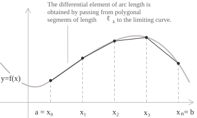

## Dai segmenti agli archi di curva

La nozione di lunghezza è immediata per un segmento, poiché due punti distinti nel piano determinano un'unica retta e la distanza euclidea fornisce una misura univoca. Quando il percorso fra due punti segue il grafico di una funzione anziché un segmento, l'idea intuitiva di misurare un filo disposto lungo la curva deve essere tradotta in una definizione analitica precisa. La costruzione è la stessa su cui si fonda l'[integrale definito](../definite-integrals/), si approssima la curva con oggetti più semplici di cui si conosce la lunghezza e si affina poi l'approssimazione mediante un procedimento di limite.

Consideriamo una funzione $f(x)$ definita e [continuamente derivabile](../continuous-functions/) su un intervallo chiuso $[a, b].$ L'arco del grafico compreso fra i punti di ascissa $a$ e $b$ è una curva nel piano, e vogliamo associargli un numero reale che ne misuri la lunghezza. A questo scopo inscriviamo nella curva una spezzata, ne calcoliamo la lunghezza e affiniamo l'approssimazione aggiungendo vertici la cui distanza in ascissa tende a zero.

## Approssimazione mediante spezzate ed elemento differenziale

Definizione 1. Sia $P = \{\ x_0, x_1, \dots, x_n \ \}$ una [partizione](../riemann-integrability-criteria/) dell'intervallo $[a, b]$ tale che:

$$a = x_0 < x_1 < \cdots < x_n = b$$

A ogni punto di suddivisione associamo il punto $(x_k, f(x_k))$ sul grafico della funzione. Congiungendo i punti consecutivi con segmenti otteniamo una spezzata inscritta nella curva, la cui lunghezza totale è la somma delle distanze euclidee fra vertici consecutivi. La lunghezza del segmento di indice $k$ è data da:

$$\ell_k = \sqrt{(x_k - x_{k-1})^2 + (f(x_k) - f(x_{k-1}))^2}$$

Poiché $f$ è derivabile su $[x_{k-1}, x_k],$ il [teorema di Lagrange](../lagrange-theorem/) garantisce l'esistenza di un punto $\xi_k$ nell'intervallo aperto $(x_{k-1}, x_k)$ tale che:

$$f(x_k) - f(x_{k-1}) = f'(\xi_k)(x_k - x_{k-1})$$

Sostituendo questa identità nell'espressione di $\ell_k$ e raccogliendo $(x_k - x_{k-1})^2$ sotto il radicale otteniamo:

$$\ell_k = \sqrt{1 + [f'(\xi_k)]^2}(x_k - x_{k-1})$$

La lunghezza totale della spezzata inscritta è quindi una somma di Riemann della funzione $\sqrt{1 + [f'(x)]^2}$ relativa alla partizione $P.$ Quando l'ampiezza massima degli intervalli della partizione tende a zero, questa somma converge a un integrale definito, purché la funzione integranda sia [integrabile secondo Riemann](../riemann-integrability-criteria/).

## Lunghezza di un arco in forma cartesiana

La costruzione precedente conduce alla definizione della lunghezza per le curve espresse come grafici di funzioni nel piano cartesiano. Sia $f$ una funzione con [derivata](../derivatives/) continua sull'[intervallo](../intervals/) chiuso $[a, b].$ La lunghezza dell'arco del grafico di $f$ da $x = a$ a $x = b$ è definita da:

$$L = \int_a^b \sqrt{1 + [f'(x)]^2} \ dx \tag{1}$$

L'ipotesi di continuità di $f'$ su $[a, b]$ garantisce la continuità della funzione integranda e quindi la sua integrabilità secondo Riemann. Una funzione la cui derivata sia soltanto limitata, ma non continua, può comunque avere un grafico di lunghezza ben definita. In questo caso la dimostrazione elementare appena presentata non si applica direttamente, e la discussione richiede il quadro più generale delle curve rettificabili.

> L'espressione $\sqrt{1 + [f'(x)]^2} \ dx$ è detta elemento di lunghezza d'arco e si indica solitamente con $ds.$ Esprime la lunghezza infinitesima della curva associata a un incremento infinitesimo $dx$ della variabile indipendente e soddisfa l'identità $ds^2 = dx^2 + dy^2,$ che corrisponde al teorema di Pitagora applicato al triangolo infinitesimo di cateti $dx$ e $dy = f'(x) \ dx.$

## Esempio 1

Calcoliamo la lunghezza dell'arco di parabola descritto dalla funzione $f(x) = x^2$ sull'intervallo $[0, 1].$ La derivata della funzione è:

$$f'(x) = 2x$$

Sostituendo nella formula $(1),$ la lunghezza dell'arco si esprime come:

$$L = \int_0^1 \sqrt{1 + 4x^2} \ dx$$

La funzione integranda ha la forma $\sqrt{1 + (2x)^2},$ che suggerisce la sostituzione iperbolica $2x = \sinh t.$ Il differenziale si trasforma secondo la relazione:

$$2 \ dx = \cosh t \ dt$$

Si ha quindi $dx = \tfrac{1}{2}\cosh t \ dt.$ L'identità iperbolica $1 + \sinh^2 t = \cosh^2 t$ permette di semplificare il radicale in $\cosh t.$ L'integrale diventa pertanto:

$$L = \int_0^{\mathrm{arsinh} 2} \cosh t \cdot \frac{1}{2}\cosh t \ dt = \frac{1}{2}\int_0^{\mathrm{arsinh} 2} \cosh^2 t \ dt$$

Applicando l'identità $\cosh^2 t = \tfrac{1}{2}(1 + \cosh 2t),$ otteniamo la primitiva:

$$\int \cosh^2 t \ dt = \frac{1}{2}t + \frac{1}{4}\sinh 2t + c$$

Valutando agli estremi e usando $\sinh 2t = 2\sinh t \cosh t,$ insieme alle relazioni $\sinh(\mathrm{arsinh} 2) = 2$ e $\cosh(\mathrm{arsinh} 2) = \sqrt{5},$ ricaviamo il risultato in forma chiusa:

$$L = \frac{1}{4}\mathrm{arsinh} 2 + \frac{\sqrt{5}}{2}$$

La lunghezza dell'arco di parabola fra l'origine e il punto $(1, 1)$ è dunque uguale a $\tfrac{\sqrt{5}}{2} + \tfrac{1}{4}\ln(2 + \sqrt{5}),$ poiché il [seno iperbolico inverso](../hyperbolic-sine-function/) ammette la rappresentazione [logaritmica](../logarithms/) $\mathrm{arsinh} u = \ln(u + \sqrt{1 + u^2}).$

> L'integrale precedente può essere calcolato anche mediante una [sostituzione trigonometrica](../trigonometric-substitution-for-integrals/) della forma $2x = \tan \theta,$ che riduce il radicale a $\sec \theta$ e conduce a un'espressione equivalente in forma chiusa.

## Lunghezza di un arco in forma parametrica

Diverse curve che si incontrano in geometria e in fisica, fra cui circonferenze, ellissi, cicloidi e spirali, non possono essere descritte come grafici di un'unica funzione. Per queste curve introduciamo una variabile ausiliaria, detta parametro, ed esprimiamo le due coordinate del punto mobile come funzioni di essa. Il punto descrive la curva mentre il parametro varia in un intervallo reale. La descrizione cartesiana si ritrova nel caso particolare in cui il parametro coincide con l'ascissa.

Consideriamo una curva piana descritta dalla parametrizzazione:

$$\begin{cases} x = x(t) \\[6pt] y = y(t) \end{cases} \quad t \in [\alpha, \beta]$$

Le funzioni $x(t)$ e $y(t)$ sono continuamente derivabili sull'intervallo $[\alpha, \beta].$ Ripetiamo la costruzione mediante spezzate rispetto a una partizione dell'intervallo del parametro. La corda che congiunge i punti associati a due valori consecutivi $t_{k-1}$ e $t_k$ ha lunghezza:

$$\ell_k = \sqrt{[x(t_k) - x(t_{k-1})]^2 + [y(t_k) - y(t_{k-1})]^2}$$

Applicando il teorema di Lagrange separatamente a $x$ e a $y$ e passando al limite quando l'ampiezza massima degli intervalli della partizione tende a zero, otteniamo la formula della lunghezza d'arco in forma parametrica:

$$L = \int_\alpha^\beta \sqrt{[x'(t)]^2 + [y'(t)]^2} \ dt \tag{2}$$

Sotto la radice quadrata riconosciamo il quadrato del modulo del vettore velocità associato alla parametrizzazione. Questa osservazione suggerisce un'interpretazione cinematica della formula. Se interpretiamo il parametro $t$ come tempo, la quantità $\sqrt{[x'(t)]^2 + [y'(t)]^2}$ è il modulo della velocità istantanea di un punto che si muove lungo la curva, e il suo integrale sull'intervallo di tempo fornisce la distanza percorsa.

> Una curva ammette in generale molte parametrizzazioni distinte, ma la lunghezza dell'arco dipende soltanto dall'immagine geometrica della curva sul tratto percorso, purché la parametrizzazione sia regolare e iniettiva. Questa invarianza rispetto alla riparametrizzazione esprime il carattere geometrico intrinseco della lunghezza.

## Relazione fra le due formulazioni

La formula cartesiana è un caso particolare di quella parametrica. Scegliendo il parametro $t = x,$ la parametrizzazione si riduce a:

$$\begin{cases} x(t) = t \\[6pt] y(t) = f(t) \end{cases}$$

Si ha quindi $x'(t) = 1$ e $y'(t) = f'(t).$ Sostituendo queste espressioni nella formula $(2)$ si ottiene la formula $(1).$ La rappresentazione parametrica è dunque più generale e rimane applicabile in presenza di tangenti verticali o di autointersezioni, situazioni che la formulazione cartesiana non consente di trattare direttamente.

## Esempio 2

Calcoliamo la lunghezza di una [circonferenza](../circumference/) di raggio $r$ e centro nell'origine, usando la rappresentazione parametrica:

$$\begin{cases} x(t) = r\cos t \\[6pt] y(t) = r\sin t \end{cases} \quad t \in [0, 2\pi]$$

Le derivate delle funzioni parametriche sono:

$$x'(t) = -r\sin t \qquad y'(t) = r\cos t$$

Sostituendo nella formula parametrica della lunghezza d'arco e usando l'identità trigonometrica fondamentale $\sin^2 t + \cos^2 t = 1,$ la funzione integranda si semplifica come segue:

$$\sqrt{[x'(t)]^2 + [y'(t)]^2} = \sqrt{r^2\sin^2 t + r^2\cos^2 t} = r$$

Resta quindi da integrare una funzione costante sull'intervallo $[0, 2\pi],$ ottenendo:

$$L = \int_0^{2\pi} r \ dt = 2\pi r$$

La circonferenza ha dunque lunghezza $2\pi r.$

> La formula parametrica restituisce l'espressione della lunghezza di una circonferenza. Questo accordo fornisce una verifica della coerenza della costruzione sviluppata sopra.

## Esempio 3

Consideriamo la cicloide generata da un punto su una circonferenza di raggio $r$ che rotola senza strisciare lungo una retta. La parametrizzazione usuale di un arco completo della cicloide è:

$$\begin{cases} x(t) = r(t - \sin t) \\[6pt] y(t) = r(1 - \cos t) \end{cases} \quad t \in [0, 2\pi]$$

Le derivate delle componenti parametriche sono:

$$x'(t) = r(1 - \cos t) \qquad y'(t) = r\sin t$$

Sommando i quadrati di queste due componenti e usando le [identità](../trigonometric-identities/) $1 - \cos t = 2\sin^2(t/2)$ e $\sin t = 2\sin(t/2)\cos(t/2),$ la funzione integranda si riduce a un'espressione più semplice. Un calcolo diretto dà:

$$
\begin{align}
[x'(t)]^2 + [y'(t)]^2 &= r^2(1 - \cos t)^2 + r^2\sin^2 t \\[6pt]
                      &= 2r^2(1 - \cos t)
\end{align}
$$

Applicando nuovamente la formula di bisezione, l'espressione diventa $4r^2\sin^2(t/2),$ la cui radice quadrata è $2r |\sin(t/2)|.$ Poiché $t/2 \in [0, \pi]$ sull'intervallo di integrazione, il seno è non negativo e possiamo eliminare il valore assoluto. L'integrale della lunghezza d'arco si riduce quindi a:

$$L = \int_0^{2\pi} 2r\sin(t/2) \ dt$$

Una primitiva di $\sin(t/2)$ è $-2\cos(t/2),$ e la valutazione agli estremi dà:

$$
\begin{align}
L &= 2r\bigl[-2\cos(t/2)\bigr]_0^{2\pi} \\[6pt]
  &= 2r(-2\cos\pi + 2\cos 0) \\[6pt]
  &= 2r(2 + 2) \\[6pt]
  &= 8r
\end{align}
$$

La lunghezza di un arco completo della cicloide è dunque uguale a otto volte il raggio della circonferenza che rotola. Il risultato fu dimostrato da Christopher Wren nel 1658. La lunghezza è un multiplo intero del raggio, e in questo caso una curva trascendente conduce a un valore algebrico.

## Condizioni e limiti di applicabilità

Le formule ottenute si basano sull'ipotesi che le derivate coinvolte esistano e siano continue su tutto l'intervallo di integrazione. Quando questa regolarità viene meno in punti isolati, l'integrale può spesso essere interpretato come un [integrale improprio](../improper-integrals/), e la lunghezza dell'arco può ancora risultare finita. Esistono invece curve continue di lunghezza infinita. Gli esempi classici provengono dalla geometria frattale, fra cui il fiocco di neve di Koch. Per queste curve le formule elementari non sono applicabili e si ricorre alla teoria generale delle curve rettificabili, nella quale la lunghezza è definita direttamente come l'[estremo superiore](../supremum-and-infimum/) delle lunghezze di tutte le spezzate inscritte.

> Una curva si dice rettificabile quando questo estremo superiore è finito. Le curve continuamente derivabili su un intervallo chiuso e limitato sono rettificabili, e per esse l'estremo superiore coincide con il valore calcolato dalle formule integrali. La classe delle curve rettificabili è strettamente più ampia di quella delle curve di classe $C^1$ e fornisce il quadro per la formulazione generale della nozione di lunghezza. Quando l'integrale della lunghezza d'arco non può essere calcolato in forma chiusa, il suo valore può comunque essere approssimato mediante l'[integrazione numerica](../numerical-integration/).
