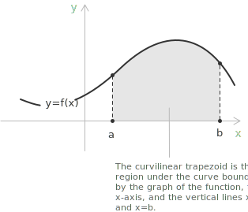
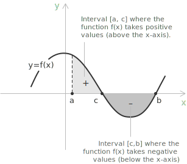

## Area under a function: from curve to integral

Consider a [function](../functions/) $f(x)$ defined on a [closed interval](../intervals/) $[a, b]$, with $a < b$. If $f(x)$ is [continuous](../continuous-functions/) and nonnegative on $[a, b]$, its graph, the $x$-axis, and the vertical lines $x = a$ and $x = b$ bound a curvilinear trapezoid. The area of this region is given by the definite integral:

$$\int_{a}^{b} f(x) \ dx$$

The standard formulas of elementary geometry do not apply directly to a general curvilinear trapezoid, because one of its boundaries is a curve rather than a straight segment. The area of the curvilinear trapezoid can be approximated by dividing the interval $[a, b]$ into $n$ subintervals of equal width:

$$\Delta x = \frac{b - a}{n}$$

Over each subinterval, the region is approximated by a rectangle, and the sum of the areas of these rectangles provides an estimate of the total area.

Write the partition points as $x_i = a + i\Delta x,$ for $i=0,\ldots,n.$ Then $x_0=a$ and $x_n=b,$ and the $i$-th subinterval is $[x_{i-1},x_i].$ Denoting by $m_i$ and $M_i$ the infimum and supremum of $f(x)$ on this subinterval, the lower and upper sums are defined as:

$$s_n^{-} = \sum_{i=1}^{n} m_i \Delta x \qquad s_n^{+} = \sum_{i=1}^{n} M_i \Delta x$$

The lower sum $s_n^{-}$ approximates the area from below, while the upper sum $s_n^{+}$ approximates it from above.

The data for the lower and upper rectangles follow the same pattern on every subinterval:

| Rectangle |   Subinterval   | Lower height | Upper height |  Lower area   |  Upper area   |
| :-------: | :-------------: | :----------: | :----------: | :-----------: | :-----------: |
|    $1$    |   $[x_0,x_1]$   |    $m_1$     |    $M_1$     | $m_1\Delta x$ | $M_1\Delta x$ |
|    $2$    |   $[x_1,x_2]$   |    $m_2$     |    $M_2$     | $m_2\Delta x$ | $M_2\Delta x$ |
|    $3$    |   $[x_2,x_3]$   |    $m_3$     |    $M_3$     | $m_3\Delta x$ | $M_3\Delta x$ |
| $\vdots$  |    $\vdots$     |   $\vdots$   |   $\vdots$   |   $\vdots$    |   $\vdots$    |
|    $i$    | $[x_{i-1},x_i]$ |    $m_i$     |    $M_i$     | $m_i\Delta x$ | $M_i\Delta x$ |
| $\vdots$  |    $\vdots$     |   $\vdots$   |   $\vdots$   |   $\vdots$    |   $\vdots$    |
|    $n$    | $[x_{n-1},x_n]$ |    $m_n$     |    $M_n$     | $m_n\Delta x$ | $M_n\Delta x$ |

For a bounded function $f(x)$ on $[a, b]$, the lower and upper sums approach each other as the partition is refined precisely when $f(x)$ is Riemann integrable. For the uniform partitions considered here, both sums then converge to the same [limit](../limits/) as $n$ tends to infinity:

$$\lim_{n \to \infty} s_n^{-} = \lim_{n \to \infty} s_n^{+} = I$$

The value $I$ is the definite integral of $f(x)$ over $[a, b]$:

$$I = \int_{a}^{b} f(x) \ dx$$

This approach through lower and upper Darboux sums gives a characterization of [Riemann integrability](../riemann-integrability-criteria/). The values $a$ and $b$ are the lower and upper limits of integration, and $f(x)$ is the integrand. The notation $f(x) \ dx$ is suggested by the area $f(x)\Delta x$ of each approximating rectangle. The symbol $dx$ identifies $x$ as the integration variable and records the limiting role of the subinterval widths.

## Computing definite integrals

If $f(x)$ is continuous on $[a, b]$ and $F(x)$ is any [antiderivative](../indefinite-integrals/) of $f(x)$, then the definite integral is given by the difference of the antiderivative at the endpoints:

$$\int_{a}^{b} f(x) \ dx = F(b) - F(a)$$

The two quantities appearing in this expression have the following meaning:

+ $F(x)$ is continuous on $[a, b]$, differentiable on $(a, b)$, and satisfies $F'(x) = f(x)$ for every $x \in (a, b)$.
+ $F(b)$ and $F(a)$ are the values of the antiderivative evaluated at the upper and lower limits of integration.

This formula is the conclusion of the second [Fundamental Theorem of Calculus](../fundamental-theorem-of-calculus/). The first part of the theorem establishes that the function obtained by integrating from a fixed point to a variable endpoint is differentiable, with derivative equal to the integrand. Define the accumulation function by:

$$F(x) = \int_{a}^{x} f(t) \ dt$$

For every $x \in (a, b)$, this function satisfies $F'(x) = f(x)$, which makes differentiation and integration mutually inverse operations in a precise sense. Both results are treated in detail on the dedicated page on the [Fundamental Theorem of Calculus](../fundamental-theorem-of-calculus/).

## Properties

When the two endpoints of integration coincide, the integral vanishes:

$$\int_{a}^{a} f(x) \ dx = 0$$

The identity follows directly from the definition: an interval of zero width contributes no area. Reversing the limits of integration changes the sign of the integral:

$$\int_{a}^{b} f(x) \ dx = -\int_{b}^{a} f(x) \ dx$$

This reflects the oriented nature of the definite integral: traversing the interval in the opposite direction reverses the sign of the accumulated area. If $f(x) = k$ is constant on $[a, b]$, its integral is the constant value multiplied by the length of the interval:

$$\int_{a}^{b} k \ dx = k(b - a)$$

A constant factor can be moved outside the integral sign:

$$\int_{a}^{b} kf(x) \ dx = k \int_{a}^{b} f(x) \ dx$$

The integral is additive over sums of functions:

$$\int_{a}^{b} (f(x) + g(x)) \ dx = \int_{a}^{b} f(x) \ dx + \int_{a}^{b} g(x) \ dx$$

Together, the previous two properties make the definite integral a linear operator. The integral is also additive over adjacent intervals: for any three points $a$, $b$, $c$ in the domain of $f$, the following identity holds:

$$\int_{a}^{c} f(x) \ dx = \int_{a}^{b} f(x) \ dx + \int_{b}^{c} f(x) \ dx$$

If $f(x) \leq g(x)$ for every $x \in [a, b]$, the same inequality propagates to the integrals:

$$\int_{a}^{b} f(x) \ dx \leq \int_{a}^{b} g(x) \ dx$$

> This is the comparison property of integrals. The vertical difference $g(x) - f(x)$ is nonnegative throughout the interval, so its integral is also nonnegative.

## Mean value theorem for integrals

If $f(x)$ is continuous on $[a, b]$, then there exists at least one point $c \in (a, b)$ such that:

$$\int_{a}^{b} f(x) \ dx = f(c)(b - a)$$

The value $f(c)$ is the average value of the function over the interval. Geometrically, the theorem asserts the existence of a rectangle with base $b - a$ and height $f(c)$ whose oriented area equals the definite integral. The theorem guarantees the existence of such a point without providing a method to locate it. Solving for $f(c)$, the average value of $f$ over $[a, b]$ can be written as:

$$f(c) = \frac{1}{b - a} \int_{a}^{b} f(x) \ dx$$

> The mean value theorem for integrals is the integral counterpart of [Lagrange's mean value theorem](../lagrange-theorem/). The differential statement guarantees a point where the instantaneous rate of change equals the average rate of change, while the integral statement guarantees a point where the function value equals the average value over the interval.

## Example 1

Compute the following definite integral:

$$\int_{0}^{3} (3x - x^2) \ dx$$

Applying linearity and moving the constant factor outside the first integral gives:

$$3\int_{0}^{3} x \ dx - \int_{0}^{3} x^2 \ dx$$

The antiderivative of each term follows from the power rule discussed in the page on [indefinite integrals](../indefinite-integrals/):

$$F(x) = \frac{3x^2}{2} - \frac{x^3}{3}$$

Evaluating $F(3) - F(0)$ yields:

$$
\begin{align}
F(3) - F(0) &= \left(\frac{3 \cdot 9}{2} - \frac{27}{3}\right) - \left(\frac{3 \cdot 0}{2} - \frac{0}{3}\right) \\[6pt]
            &= \frac{27}{2} - 9 \\[6pt]
            &= \frac{27 - 18}{2} \\[6pt]
            &= \frac{9}{2}
\end{align}
$$

The area of the region bounded by the graph of $f(x) = 3x - x^2$ and the $x$-axis over $[0, 3]$ is therefore:

$$\int_{0}^{3} (3x - x^2) \ dx = \frac{9}{2}$$

> When an antiderivative is not immediately recognizable, techniques such as [integration by substitution](../integration-by-substitution/) and [integration by parts](../integration-by-parts/) may produce it. If no elementary antiderivative exists, the definite integral may require numerical methods or special functions.

## Example 2

Compute the following definite integral:

$$\int_{0}^{\pi} (x + \sin x) \ dx$$

> The integrand combines a polynomial term with a trigonometric function. The relevant antiderivatives are collected on the page on [integrals of trigonometric functions](../integral-of-trigonometric-functions/).

Applying linearity, the integral splits as:

$$\int_{0}^{\pi} x \ dx + \int_{0}^{\pi} \sin x \ dx$$

The antiderivative of each term gives:

$$F(x) = \frac{x^2}{2} - \cos x$$

Evaluating $F(\pi) - F(0)$ yields:

$$
\begin{align}
F(\pi) - F(0) &= \left(\frac{\pi^2}{2} - \cos\pi\right) - \left(\frac{0}{2} - \cos 0\right) \\[6pt]
              &= \left(\frac{\pi^2}{2} + 1\right) - (0 - 1) \\[6pt]
              &= \frac{\pi^2}{2} + 2
\end{align}
$$

The area of the region bounded by the graph of $f(x) = x + \sin x$ and the $x$-axis over $[0, \pi]$ is:

$$\int_{0}^{\pi} (x + \sin x) \ dx = \frac{\pi^2}{2} + 2$$

## Example 3

Compute the area under the exponential curve $f(x)=e^{2x}$ over $[0,2]$ directly from right-endpoint Riemann sums. Divide $[0,2]$ into $n$ subintervals of equal width. The width and the right endpoint of the $k$-th subinterval are:

$$\Delta x = \frac{2}{n} \qquad x_k = \frac{2k}{n}$$

The function $f(x)=e^{2x}$ is increasing, so the right-endpoint rectangles give upper sums. The height of the $k$-th rectangle is:

$$f(x_k) = e^{2x_k} = e^{4k/n}$$

Hence the sum of the rectangle areas is:

$$R_n = \sum_{k=1}^{n} f(x_k)\Delta x = \frac{2}{n}\sum_{k=1}^{n} e^{4k/n}$$

Set $q_n=e^{4/n}.$ The terms $e^{4k/n}=q_n^k$ form a finite [geometric progression](../geometric-sequence/), with $q_n^n=e^4.$ The finite-sum formula gives:

$$
\begin{align}
R_n &= \frac{2}{n}\sum_{k=1}^{n}q_n^k \\[6pt]
    &= \frac{2}{n}\frac{q_n(q_n^n-1)}{q_n-1} \\[6pt]
    &= \frac{2q_n(e^4-1)}{n(q_n-1)}
\end{align}
$$

As $n$ tends to infinity, $q_n$ tends to $1.$ Applying the [remarkable limit](../remarkable-limits/) for the exponential function gives:

$$
\lim_{n \to \infty}n(q_n-1)
= \lim_{n \to \infty}4\left(\frac{e^{4/n}-1}{4/n}\right)
= 4
$$

Taking the limit of the upper sums gives the definite integral:

$$
\int_{0}^{2}e^{2x} \ dx
= \lim_{n \to \infty}R_n
= \frac{e^4-1}{2}
$$

Since $e^{2x}$ is positive on $[0,2],$ this integral is the geometric area under the curve, approximately $26.799.$

## Handling definite integrals with positive and negative areas

The interpretation of the definite integral as an area holds when $f(x) \geq 0$ throughout $[a, b]$. When $f(x)$ changes sign within the interval, the integral assigns a negative value to the portions of the region lying below the $x$-axis, and the result is an oriented area rather than a purely geometric one.

To recover the geometric area, the interval $[a, b]$ is divided into subintervals over which $f(x)$ maintains constant sign. If $f(x) \geq 0$ on $[a, c]$ and $f(x) \leq 0$ on $[c, b]$, additivity gives the oriented integral:

$$\int_{a}^{b} f(x) \ dx = \int_{a}^{c} f(x) \ dx + \int_{c}^{b} f(x) \ dx$$

The geometric area is obtained by changing the sign of the negative contribution:

$$S = \int_{a}^{c} f(x) \ dx - \int_{c}^{b} f(x) \ dx = \int_{a}^{b} |f(x)| \ dx$$

For an [even function](../even-and-odd-functions/), symmetry about the $y$-axis implies that the contributions from $[-a, 0]$ and $[0, a]$ are equal. Hence:

$$\int_{-a}^{a} f(x) \ dx = 2\int_{0}^{a} f(x) \ dx$$

For an [odd function](../even-and-odd-functions/), symmetry about the origin implies that the contributions from $[-a, 0]$ and $[0, a]$ are equal in magnitude but opposite in sign. Hence:

$$\int_{-a}^{a} f(x) \ dx = 0$$

In both cases, the geometric area enclosed between the graph of $f(x)$ and the $x$-axis over $[-a, a]$ is obtained by integrating the [absolute value](../absolute-value/) of the function. Since $|f(x)|$ is even whenever $f(x)$ is even or odd, the area is:

$$S = 2\int_{0}^{a} |f(x)| \ dx$$

If $f(x)$ is even and nonnegative on $[0, a]$, this formula reduces to:

$$S = 2\int_{0}^{a} f(x) \ dx$$

Further examples of geometric area calculations are given on the page on [finding areas by integration](../finding-areas-by-integration/).

## Improper integrals

The construction developed so far assumes that the interval $[a, b]$ is finite and that $f(x)$ remains bounded throughout. Both conditions can fail in practice: integration over unbounded intervals or over functions that become unbounded near an endpoint or an interior point occurs naturally in many problems.

The standard [Riemann integral](../riemann-integrability-criteria/) does not cover these cases directly. The remedy is to replace the problematic bound with a parameter and pass to a limit. Suppose that $f(x)$ is Riemann integrable on every interval $[a, t]$ with $t > a$. The integral over an unbounded interval is defined by:

$$\int_{a}^{+\infty} f(x) \ dx = \lim_{t \to +\infty} \int_{a}^{t} f(x) \ dx$$

When the limit exists and is finite, the integral is said to converge; otherwise it diverges. The systematic treatment is given on the dedicated page on [improper integrals](../improper-integrals/).
