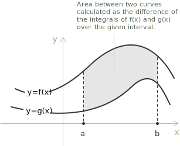
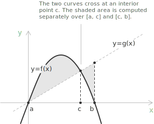
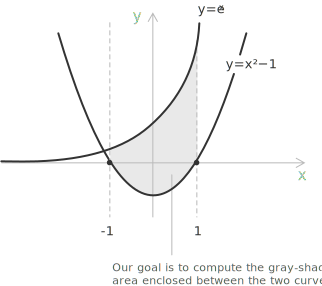

## Area between two curves using definite integrals

The page on [definite integrals](../definite-integrals/) introduced the integral as the oriented area between the graph of a function and the $x$-axis. The same construction extends to regions bounded by two curves. Let $f(x)$ and $g(x)$ be two [continuous functions](../continuous-functions/) defined on the [interval](../intervals/) $[a, b]$, with $f(x) \geq g(x)$ for every $x \in [a, b]$, and suppose their graphs enclose a region. The area of this region is given by:

$$A = \int_a^b [f(x) - g(x)] \ dx \tag{1}$$

> Since both $f$ and $g$ are continuous on $[a, b]$, their difference $f(x) - g(x)$ is also continuous on the same interval. A continuous function on a closed and bounded interval is [Riemann-integrable](../riemann-integrability-criteria/), and therefore the area between the two curves is well defined.

- - -

Consider the gray-shaded region between the curves $f(x)$ and $g(x)$:

The area $A$ is the difference between the area under the curve $f(x)$ and the area under the curve $g(x)$:

$$A = \int_a^b f(x) \ dx - \int_a^b g(x) \ dx$$

By the linearity of the integral, recalled in the page on [indefinite integrals](../indefinite-integrals/), this rewrites as equation $(1)$.

## Areas between intersecting curves

So far the assumption $f(x) \geq g(x)$ was imposed throughout the interval $[a, b]$. In many cases, however, the interval itself is not given: the two curves determine it, and the first step is to find where they meet. The intersection points are obtained by solving $f(x) = g(x)$, and the solutions become the limits of integration.

Once the interval is known, the two curves can cross inside it, meaning that $f(x)$ and $g(x)$ swap their relative position at some interior point $c$. When this happens, the integrand $f(x) - g(x)$ changes sign, and a single integral over $[a, b]$ would cause the contributions above and below the $x$-axis to cancel, producing an incorrect result.

- - -

The correct procedure is to split the interval at each crossing point and integrate separately over each subinterval, always subtracting the lower curve from the upper one:

$$A = \int_{a}^{c} [f(x) - g(x)] \ dx + \int_{c}^{b} [g(x) - f(x)] \ dx$$

A compact way to write this without tracking which curve is on top is:

$$A = \int_{a}^{b} |f(x) - g(x)| \ dx$$

The [absolute value](../absolute-value/) guarantees that each piece of area is counted as positive, regardless of which [function](../functions/) is larger on a given subinterval.

> The formula $A = \int_a^b |f(x) - g(x)| \ dx$ is valid provided that all intersection points of the two curves are included among the limits of integration. The absolute value ensures that the difference between the two functions is always taken as positive, so that no portion of the enclosed region cancels out when the curves swap their relative position.

## Example 1

Find the area enclosed between the curves $y_1 = e^x$ and $y_2 = x^2 - 1$ over the interval $x \in [-1, 1]$. The graphical situation is the following:

Applying equation $(1)$, the area is obtained from the definite integral:

$$A = \int_{-1}^{1} \left[ e^x - (x^2 - 1) \right] \ dx$$

- - -

Expanding the bracket and integrating term by term gives:

$$
\begin{align}
A &= \int_{-1}^{1} \left[ e^x - x^2 + 1 \right] \ dx \\[6pt]
  &= \left[ e^x - \frac{x^3}{3} + x \right]_{-1}^{1} \\[6pt]
  &= \left( e - \frac{1}{3} + 1 \right) - \left( e^{-1} + \frac{1}{3} - 1 \right) \\[6pt]
  &= e - \frac{1}{e} + \frac{4}{3}
\end{align}
$$

The area between the two curves is therefore:

$$A = e - \frac{1}{e} + \frac{4}{3}$$

## Example 2

Find the area of the region enclosed between the curves $f(x) = x^3 - 3x$ and $g(x) = x$. The interval is not given. The first step is to find where the two curves intersect, setting $f(x) = g(x)$:

$$
\begin{align}
x^3 - 3x &= x \\[6pt]
x^3 - 4x &= 0 \\[6pt]
x(x^2 - 4) &= 0
\end{align}
$$

The solutions are $x = -2$, $x = 0$, and $x = 2$. These three values are the limits of integration.

- - -

Since the curves cross at $x = 0$, the relative order of $f$ and $g$ must be checked in each subinterval. Evaluating at $x = -1$:

$$
\begin{align}
f(-1) &= (-1)^3 - 3(-1) = 2 \\[6pt]
g(-1) &= -1
\end{align}
$$

So $f(x) \geq g(x)$ on $[-2, 0]$. By symmetry, $g(x) \geq f(x)$ on $[0, 2]$.

- - -

The integral splits accordingly:

$$A = \int_{-2}^{0} [f(x) - g(x)] \ dx + \int_{0}^{2} [g(x) - f(x)] \ dx$$

$$A = \int_{-2}^{0} (x^3 - 4x) \ dx + \int_{0}^{2} (4x - x^3) \ dx$$

- - -

The first integral evaluates as:

$$
\begin{align}
\int_{-2}^{0} (x^3 - 4x) \ dx &= \left[ \frac{x^4}{4} - 2x^2 \right]_{-2}^{0} \\[6pt]
  &= 0 - \left(\frac{16}{4} - 2 \cdot 4\right) \\[6pt]
  &= 0 - (4 - 8) \\[6pt]
  &= 4
\end{align}
$$

The second integral evaluates as:

$$
\begin{align}
\int_{0}^{2} (4x - x^3) \ dx &= \left[ 2x^2 - \frac{x^4}{4} \right]_{0}^{2} \\[6pt]
  &= \left(2 \cdot 4 - \frac{16}{4}\right) - 0 \\[6pt]
  &= 8 - 4 \\[6pt]
  &= 4
\end{align}
$$

The total area is:

$$A = 4 + 4 = 8$$

The symmetry of the result is not a coincidence: $f(x) = x^3 - 3x$ is an [odd function](../even-and-odd-functions/), and the two regions are mirror images of each other across the origin.

## Decision procedure

The following stepwise procedure summarises the application of the area formula to a generic pair of curves.

+ Identify the two functions $f(x)$ and $g(x)$ and the interval $[a, b]$ over which the area is to be computed. If the interval is not given, solve $f(x) = g(x)$ to locate the intersection points; the smallest and largest solutions become the endpoints of integration.
+ Check the relative position of the two curves on $[a, b]$. Evaluate $f(x) - g(x)$ at a test point in each subinterval to determine which curve is on top.
+ When the curves do not cross inside the interval, apply the standard formula:

$$A = \int_a^b [f(x) - g(x)] \ dx$$

+ When the curves cross at an interior point $c$, split the integral and subtract the lower curve from the upper one on each subinterval:

$$A = \int_a^c [f(x) - g(x)] \ dx + \int_c^b [g(x) - f(x)] \ dx$$

+ Evaluate each definite integral using an [antiderivative](../indefinite-integrals/) of the integrand. When the antiderivative is not elementary, the method of [integration by substitution](../integration-by-substitution/) or [integration by parts](../integration-by-parts/) provides the appropriate tools.

> The same construction generalises to regions bounded by more than two curves and to regions described as functions of $y$ rather than of $x$. In every case the underlying idea is the same: the area is the integral of the difference between the upper and lower boundary of the region.
