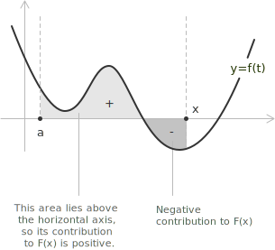

## Introduction

The Fundamental Theorem of Calculus establishes the relationship between [differentiation](../derivatives/) and [integration](../indefinite-integrals/). These two operations arise from different motivations: differentiation describes instantaneous variation, while integration measures accumulated quantity. The theorem shows that, under suitable regularity assumptions, they are inverse processes. The result is traditionally divided into two complementary statements:

+ The First Fundamental Theorem of Calculus
+ The Second Fundamental Theorem of Calculus

> The First Fundamental Theorem guarantees that every continuous function on a closed interval admits an antiderivative, constructed explicitly via integration. The Second expresses the practical consequence: the [definite integral](../definite-integrals/) of a function over an interval can be computed directly from any of its antiderivatives, evaluated at the endpoints.

## The First Fundamental Theorem of Calculus

Let $f$ be [continuous](../continuous-functions/) on a [closed interval](../intervals/) $[a, b]$. Define the function:

$$F(x) = \int_a^x f(t) \ dt$$

for $x \in [a, b]$. Then $F$ is continuous on $[a, b]$, differentiable on $(a, b)$, and:

$$F'(x) = f(x)$$

This statement asserts that the function defined by accumulation of area from a fixed lower bound up to a variable upper limit is differentiable, and its derivative coincides with the original integrand. To justify the result, consider the [difference quotient](../difference-quotient/):

$$\frac{F(x + h) - F(x)}{h} = \frac{1}{h} \left( \int_a^{x + h} f(t) \ dt - \int_a^x f(t) \ dt \right)$$

[Definite integrals](../definite-integrals/) satisfy the additivity property over adjacent intervals:

$$\int_a^b f(t) \ dt + \int_b^c f(t) \ dt = \int_a^c f(t) \ dt$$

Applying this property to the difference quotient gives:

$$\frac{F(x + h) - F(x)}{h} = \frac{1}{h} \int_x^{x + h} f(t) \ dt$$

Since $f$ is continuous on $[x, x + h]$, the mean value theorem for integrals, discussed in the page on [definite integrals](../definite-integrals/), guarantees the existence of a point $c$ between $x$ and $x + h$ such that:

$$\int_x^{x + h} f(t) \ dt = f(c) h$$

Hence:

$$\frac{F(x + h) - F(x)}{h} = f(c)$$

As $h \to 0$, the point $c \to x$. By continuity of $f$, it follows that:

$$\lim_{h \to 0} \frac{F(x + h) - F(x)}{h} = f(x)$$

which proves $F'(x) = f(x)$. Conceptually, accumulation produces a function whose instantaneous rate of change recovers the original integrand. From a geometric point of view, the First Fundamental Theorem interprets the function:

$$F(x) = \int_a^x f(t) \ dt$$

as accumulated signed area. The derivative $F'(x)$ represents the instantaneous rate at which this area grows: when $f(x) > 0$ the area increases, and when $f(x) < 0$ it decreases.

> As $x$ moves to the right, the accumulated area evolves continuously, increasing where $f(t)$ is positive and decreasing where $f(t)$ is negative, so the local behaviour of the curve determines how $F(x)$ changes.

## Extension to variable limits of integration

The First Fundamental Theorem covers the case in which the upper limit of integration coincides with the variable $x$ and the lower limit is a constant. A natural generalisation arises when both limits depend on $x$ through differentiable functions $a(x)$ and $b(x)$. Consider the function:

$$\Phi(x) = \int_{a(x)}^{b(x)} f(t) \ dt$$

where $f$ is continuous on an [interval](../intervals/) containing the range of $a(x)$ and $b(x)$, and both $a(x)$ and $b(x)$ are differentiable. The derivative of $\Phi$ is given by:

$$\Phi'(x) = f(b(x)) b'(x) - f(a(x)) a'(x)$$

This identity is often called the Leibniz rule for differentiation under the integral sign in its simplest form. It reduces to the First Fundamental Theorem when $a(x) = a$ is constant and $b(x) = x$, since in that case $a'(x) = 0$ and $b'(x) = 1$. To justify the formula, fix a constant $c$ in the domain of $f$ and decompose the integral using the additivity property over adjacent intervals:

$$\int_{a(x)}^{b(x)} f(t) \ dt = \int_c^{b(x)} f(t) \ dt - \int_c^{a(x)} f(t) \ dt$$

Define the auxiliary function:

$$F(u) = \int_c^u f(t) \ dt$$

By the First Fundamental Theorem, $F'(u) = f(u)$. The original function can then be written as:

$$\Phi(x) = F(b(x)) - F(a(x))$$

Applying the [chain rule](../the-derivative-of-a-composite-function/) to each term yields:

$$\Phi'(x) = F'(b(x)) b'(x) - F'(a(x)) a'(x) = f(b(x)) b'(x) - f(a(x)) a'(x)$$

which is the stated formula. As an application, consider the function:

$$\Phi(x) = \int_{x}^{x^2} \sin(t^2) \ dt$$

The integrand $\sin(t^2)$ is continuous on all of $\mathbb{R}$, and both limits of integration are differentiable functions of $x$. The lower limit is $a(x) = x$, with derivative $a'(x) = 1$. The upper limit is $b(x) = x^2$, with derivative $b'(x) = 2x$. Applying the Leibniz rule:

$$\Phi'(x) = \sin\!\left((x^2)^2\right) \cdot 2x - \sin(x^2) \cdot 1 = 2x \sin(x^4) - \sin(x^2)$$

The integrand $\sin(t^2)$ admits no elementary antiderivative, yet the derivative of the integral is expressed in closed form through the Leibniz rule alone.

> The Leibniz rule expresses a principle of conservation: the rate of change of an accumulated quantity equals the rate at which area enters through the moving upper boundary, minus the rate at which area leaves through the moving lower boundary. Each boundary contributes the integrand evaluated at that point, weighted by the speed of the boundary itself.

## The Second Fundamental Theorem of Calculus

Let $f$ be continuous on $[a, b]$, and suppose $F$ is any [antiderivative](../indefinite-integrals/) of $f$, meaning that $F'(x) = f(x)$ on $[a, b]$. Then:

$$\int_a^b f(x) \ dx = F(b) - F(a)$$

This second statement converts the evaluation of a definite integral into the computation of a difference of antiderivative values. To see the structural connection with the first part, define:

$$G(x) = \int_a^x f(t) \ dt$$

From the First Fundamental Theorem, $G'(x) = f(x)$. Since both $F$ and $G$ have the same derivative, their difference is constant:

$$F(x) = G(x) + c$$

Evaluating at $x = a$ gives:

$$F(a) = G(a) + c$$

Because $G(a) = 0$, the constant is $c = F(a)$, and therefore:

$$G(x) = F(x) - F(a)$$

Setting $x = b$ yields:

$$\int_a^b f(x) \ dx = G(b) = F(b) - F(a)$$

The definite integral measures the net change of any primitive over the interval. The Second Fundamental Theorem has a geometric side worth pausing on. Given a continuous function $f$ on $[a, b]$ and any antiderivative $F$, the definite integral measures the net signed area between the graph of $f$ and the horizontal axis. The theorem states that this area equals $F(b) - F(a)$, the net change in $F$ across the interval.

The construction does not require reconstructing the area piece by piece. The antiderivative $F$ already carries that information inside it, accumulated continuously. Evaluating it at the two endpoints and taking the difference is enough. The entire geometry of the curve between $a$ and $b$ collapses into a single arithmetic operation.

## Beyond continuity

The two versions of the Fundamental Theorem stated above rely on the assumption that the integrand $f$ is continuous on the closed interval $[a, b]$. This hypothesis is sufficient, but a weaker condition suffices for several of the conclusions. The discussion that follows examines which properties of the accumulation function survive when continuity is relaxed to mere Riemann integrability.

Let $f$ be [Riemann-integrable](../riemann-integrability-criteria/) on $[a, b]$, and define the accumulation function:

$$F(x) = \int_a^x f(t) \ dt$$

The function $F$ is well defined for every $x \in [a, b]$. Since $f$ is Riemann-integrable, it is in particular bounded on the interval. Let $M$ denote an upper bound for $|f|$ on $[a, b]$. For any two points $x_1, x_2 \in [a, b]$ with $x_1 < x_2$, the standard estimate on the definite integral gives:

$$|F(x_2) - F(x_1)| = \left| \int_{x_1}^{x_2} f(t) \ dt \right| \leq M (x_2 - x_1)$$

The inequality holds with $|x_2 - x_1|$ in place of $x_2 - x_1$ by symmetry. The function $F$ is therefore Lipschitz continuous on $[a, b]$ with Lipschitz constant $M$, and Lipschitz continuity implies ordinary continuity on the closed interval. Continuity of $F$ is preserved without any regularity assumption on $f$ beyond integrability.

Differentiability of $F$ is more delicate. At every point $x_0 \in (a, b)$ where $f$ is continuous, the argument used in the proof of the First Fundamental Theorem applies without modification, and the identity $F'(x_0) = f(x_0)$ holds. At a point of [discontinuity](../discontinuities-of-real-functions/) of $f$, the difference quotient of $F$ need not converge, and differentiability may fail.

To make this phenomenon explicit, consider the sign function restricted to the interval $[-1, 1]$:

$$
f(t) = \begin{cases} -1 & \text{if } t < 0 \\[6pt] 0 & \text{if } t = 0 \\[6pt] 1 & \text{if } t > 0 \end{cases}
$$

The function $f$ is Riemann-integrable on $[-1, 1]$, since the single discontinuity at $t = 0$ does not affect integrability. The accumulation function is computed from the left endpoint $-1$. For $x \in [-1, 0)$ the integrand equals $-1$ on the entire interval of integration, and:

$$F(x) = \int_{-1}^{x} (-1) \ dt = -x - 1$$

For $x \in [0, 1]$ the integration splits at $0$, so that:

$$F(x) = \int_{-1}^{0} (-1) \ dt + \int_{0}^{x} 1 \ dt = -1 + x$$

The two expressions agree at $x = 0$, where both yield $F(0) = -1$, and the resulting function admits the compact form $F(x) = |x| - 1$. The function $F$ is continuous on the entire interval $[-1, 1]$, confirming the conclusion drawn from the Lipschitz estimate. At every point $x \neq 0$, the derivative $F'(x)$ exists and coincides with $f(x)$, in agreement with the First Fundamental Theorem applied locally. At the origin, the left and right derivatives of $F$ take the values $-1$ and $+1$ respectively, so $F$ is not differentiable at $x = 0$, which is precisely the point of discontinuity of $f$.

The Second Fundamental Theorem admits a generalisation in the same spirit. Suppose $f$ is Riemann-integrable on $[a, b]$, and suppose there exists a function $F$ that is continuous on $[a, b]$, differentiable on $(a, b)$, and satisfies $F'(x) = f(x)$ at every point of $(a, b)$. Then the formula:

$$\int_a^b f(x) \ dx = F(b) - F(a)$$

remains valid. The hypothesis is satisfied, for instance, by piecewise continuous integrands for which an antiderivative can be defined consistently on the closed interval by piecing together the antiderivatives of the continuous branches.

> Continuity of the integrand is the simplest sufficient condition for the Fundamental Theorem. The general principle underlying the result can be phrased in terms of regularity: integration raises regularity by one degree. A bounded Riemann-integrable integrand produces a Lipschitz primitive, a continuous integrand produces a differentiable primitive, and an integrand of class $C^k$ produces a primitive of class $C^{k + 1}$.

## Example 1

Consider the following integral:

$$\int_0^1 3x^2 \ dx$$

An antiderivative of $3x^2$ is $F(x) = x^3$. By the Second Fundamental Theorem:

$$\int_0^1 3x^2 \ dx = F(1) - F(0) = 1^3 - 0^3 = 1$$

The area under the curve $3x^2$ over the interval $[0, 1]$ is therefore exactly $1$, obtained through the evaluation of an antiderivative at the endpoints, without any geometric argument.

As a second illustration, define:

$$H(x) = \int_1^x \ln t \ dt$$

Note that $H(1) = 0$, since the integral over a degenerate interval is zero. Since $\ln t$ is continuous for $t > 0$, the function $H$ is defined for $x > 0$, and the First Fundamental Theorem implies:

$$H'(x) = \ln x$$

The derivative of the accumulation function recovers the integrand exactly, confirming that integration and differentiation are inverse operations in the precise sense established by the theorem.

## Example 2

Apply the First Fundamental Theorem of Calculus to find the following derivative:

$$\frac{d}{dx} \int_1^x e^{-t^2} \ dt$$

The integrand $f(t) = e^{-t^2}$ is a continuous function on all of $\mathbb{R}$, the lower limit of integration is the constant $1$, and the upper limit is the variable $x$. This is the setting of the First Fundamental Theorem: if $F(x) = \int_a^x f(t) \ dt$, then $F'(x) = f(x)$. Applying this directly:

$$\frac{d}{dx} \int_1^x e^{-t^2} \ dt = e^{-x^2}$$

The result follows immediately from the theorem, with no integration required.

> The derivative of the accumulation function recovers the integrand evaluated at $x$. The function $e^{-t^2}$ has no closed-form antiderivative in terms of elementary functions, yet the First Fundamental Theorem allows the derivative of the integral to be written down without ever computing it explicitly. The same integral, considered as a definite integral over a fixed interval, has to be evaluated through [numerical integration](../numerical-integration/).
