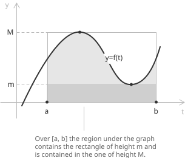
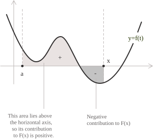

## Memories that never fade

I have no official statistics at hand to back up what I am about to say, but I would venture that two theorems stay forever in the mind of anyone who takes up a course of study in the sciences. The first is the [Pythagorean theorem](../pythagorean-theorem/), recited by heart from an early age like a litany, until it settles indelibly into the neocortex, where long-term memory is believed to be stored. The sum of the areas of the squares built on the legs equals the area of the square built on the hypotenuse. Short, simple, and the formula is not even needed to understand it. In the Italian school system it turns up at around twelve years of age and is presented as a mere tool for solving [right triangles](../right-triangle-trigonometry/). One has to wait for secondary school (for the lucky ones) or, more often, for university to grasp its actual power and its many applications.

The second theorem is usually encountered much later, around the age of eighteen. I am referring to the fundamental theorem of calculus, one of the foundational results of mathematical analysis. Put simply, it links [differentiation](../derivatives/) and [integration](../indefinite-integrals/), making each the inverse of the other under suitable hypotheses.

To be pedantic about it, the theorem has two statements, known as the first and the second fundamental theorem of calculus. The first says that every continuous function on a closed interval has an antiderivative. The second states that the definite integral of a function equals the difference between the values of any of its antiderivatives at the endpoints.

## Introducing the estimates

Before presenting the theorem, though, a digression is needed on a prerequisite for its proof, which rests on an estimate valid when the integrand is continuous on a closed and bounded interval. Consider a function $f$ continuous on $[a, b]$ with $a < b.$ By the [extreme value theorem](../weierstrass-theorem/), $f$ has a minimum and a maximum at the points $t_m, t_M \in [a, b].$ We denote these values by:

$$m = f(t_m) \qquad M = f(t_M)$$

Every value of $f$ on the interval therefore lies between these two numbers, so $m \leq f(t) \leq M$ for every $t \in [a, b].$ Applying the comparison property of [definite integrals](../definite-integrals/) we obtain the following relation:

$$m(b - a) \leq \int_a^b f(t) \ dt \leq M(b - a) \tag{1}$$

When $f$ is nonnegative, since $f(t)$ never drops below $m$ and never rises above $M,$ its integral must lie between the areas of the rectangles with base $b-a$ and heights $m$ and $M.$ In the figure, the rectangle of height $m$ is contained in the region between the graph and the horizontal axis, and that region is in turn contained in the rectangle of height $M.$

> The heights of the two rectangles are the minimum and the maximum of $f,$ attained at the points $t_m,t_M \in [a,b].$ In the figure both points lie inside the interval, but either one may coincide with an endpoint.

- - -

We now take a step forward and consider a bounded, [Riemann-integrable](../riemann-integrability-criteria/) function. Such a function satisfies inequality $(1)$, with $m$ and $M$ replaced by the [infimum and the supremum](../supremum-and-infimum/) of $f$ on the interval. Continuity has two consequences.

The first concerns the sign of the integral, that is, if $f(t) > 0$ for every $t \in [a, b],$ then $m$ is a value of $f$ and is therefore necessarily positive. Hence:

$$0 < m(b - a) \leq \int_a^b f(t) \ dt \tag{2}$$

The second consequence concerns the average value of $f.$ Dividing $(1)$ by $b - a > 0$ we obtain:

$$m \leq \frac{1}{b - a} \int_a^b f(t) \ dt \leq M$$

The middle quantity is the average value of $f$ on $[a, b].$ Since this average lies between $m$ and $M,$ the [intermediate value theorem](../intermediate-value-theorem/) applied to $f$ on the interval with endpoints $t_m$ and $t_M$ gives a point $c$ at which $f(c)$ is exactly equal to the average:

$$\int_a^b f(t) \ dt = f(c)(b - a)$$

This identity is also known as the [mean value theorem for integrals](../mean-value-theorem-for-integrals/). It will be used in the proof of the first theorem to rewrite the difference quotient of the accumulation function as a value of $f$ and to show that its derivative is indeed the integrand.

## The first fundamental theorem of calculus

We now come to the heart of the first theorem. Consider a function $f$ that is [continuous](../continuous-functions/) on a [closed interval](../intervals/) $[a, b].$ For $x \in [a, b],$ we define the accumulation function $F$ by:

$$F(x) = \int_a^x f(t) \ dt$$

The function $F$ is continuous on $[a, b],$ differentiable on $(a, b),$ and satisfies:

$$F'(x) = f(x)$$

At $a$ and at $b$ the same identity holds for the right derivative and for the left derivative, respectively. From here on we set out the proof, which is not trivial but not out of reach either. To begin with, to prove continuity we put $K = \max\{|m|, |M|\},$ where $m$ and $M$ are the extreme values introduced in the previous section. In this way $|f(t)| \leq K$ on $[a, b].$ Since $-K \leq f(t) \leq K$ on $[a, b],$ inequality $(1)$ applied to the interval with endpoints $x$ and $y$ gives, for every $x,y\in[a,b]:$

$$|F(y) - F(x)| = \left|\int_x^y f(t) \ dt\right| \leq K|y - x| \tag{3}$$

So $F$ is [Lipschitz continuous](../uniform-continuity/) on $[a, b]$ with constant $K,$ meaning that the difference between the values $F$ takes at two points never exceeds $K$ times the distance between those points. To prove the identity for the derivative, we now fix $x \in (a, b)$ and consider the [difference quotient](../difference-quotient/) for $h \neq 0$ such that $x + h \in [a, b]:$

$$\frac{F(x + h) - F(x)}{h} = \frac{1}{h} \left( \int_a^{x + h} f(t) \ dt - \int_a^x f(t) \ dt \right)$$

[Definite integrals](../definite-integrals/) satisfy additivity over adjacent intervals, so we can write:

$$\int_a^b f(t) \ dt + \int_b^c f(t) \ dt = \int_a^c f(t) \ dt$$

The difference quotient therefore becomes:

$$\frac{F(x + h) - F(x)}{h} = \frac{1}{h} \int_x^{x + h} f(t) \ dt$$

The mean value theorem for integrals shown above (here is what it was for) gives a point $c_h$ between $x$ and $x + h$ such that:

$$\int_x^{x + h} f(t) \ dt = f(c_h) h$$

The difference quotient is then:

$$\frac{F(x + h) - F(x)}{h} = f(c_h)$$

Since $c_h$ lies between $x$ and $x + h,$ it tends to $x$ as $h \to 0.$ By the continuity of $f$ we obtain:

$$\lim_{h \to 0} \frac{F(x + h) - F(x)}{h} = f(x)$$

So $F'(x) = f(x).$ Any fixed point $d \in [a, b]$ can be used as the base point. We define:

$$F_d(x) = \int_d^x f(t) \ dt$$

By additivity, $F_d(x)=F(x)-F(d).$ Since $F(d)$ is constant with respect to $x,$ the functions $F_d$ and $F$ have the same derivative. For $d=a$ we recover the accumulation function $F$ defined earlier.

Recall from the definition of the integral that the value $F(x)$ is the [signed area](../finding-areas-by-integration/) accumulated from $a$ to $x.$ Its derivative, on the other hand, is the rate at which that area changes. When $f(x) > 0$ the area increases, and when $f(x) < 0$ it decreases.

> In the figure above, the shaded signed area is our $F(x),$ which increases where $f$ is positive and decreases where $f$ is negative.

## Extension to variable limits of integration

As we have just seen, in the previous theorem the lower limit is constant and the upper limit is given by the variable $x.$ Suppose instead that $a$ and $b$ are differentiable functions and that $f$ is continuous on an [interval](../intervals/) containing their ranges. This topic is usually covered in more advanced analysis courses, but it is worth presenting here all the same. We define:

$$\Phi(x) = \int_{a(x)}^{b(x)} f(t) \ dt$$

The derivative of $\Phi$ is:

$$\Phi'(x) = f(b(x)) b'(x) - f(a(x)) a'(x) \tag{4}$$

This identity is the simplest form of the Leibniz rule for differentiation under the integral sign. If $a(x) = a$ is constant and $b(x) = x,$ the formula becomes $\Phi'(x) = f(x)$ because $a'(x) = 0$ and $b'(x) = 1,$ and we recover the first fundamental theorem. To prove the formula we fix a constant $c$ in the domain of $f$ and use additivity over adjacent intervals:

$$\int_{a(x)}^{b(x)} f(t) \ dt = \int_c^{b(x)} f(t) \ dt - \int_c^{a(x)} f(t) \ dt$$

We now define an auxiliary function $F(u)$ by the following expression:

$$F(u) = \int_c^u f(t) \ dt$$

By the first fundamental theorem, $F'(u) = f(u)$ must hold. From the definition of $F$ it follows that:

$$\Phi(x) = F(b(x)) - F(a(x))$$

The [chain rule](../chain-rule/) gives:

$$
\begin{align}
\Phi'(x) &= F'(b(x))b'(x) - F'(a(x))a'(x) \\[6pt]
         &= f(b(x))b'(x) - f(a(x))a'(x)
\end{align}
$$

This proves formula $(4)$. To make the mechanism clearer, consider for example:

$$\Phi(x) = \int_{x}^{x^2} \sin(t^2) \ dt$$

The integrand $\sin(t^2)$ is continuous on $\mathbb{R}$ because it is the [composition](../composite-functions/) of the [sine function](../sine-function/) with the polynomial $t^2.$ Both limits are differentiable. The lower limit $a(x) = x$ has derivative $a'(x) = 1,$ and the upper limit $b(x) = x^2$ has derivative $b'(x) = 2x.$ The Leibniz rule gives:

$$
\begin{align}
\Phi'(x) &= \sin\!\left((x^2)^2\right) \cdot 2x - \sin(x^2) \cdot 1 \\[6pt]
         &= 2x \sin(x^4) - \sin(x^2)
\end{align}
$$

The integrand $\sin(t^2)$ has no [elementary antiderivative](../integration-strategies/), but the Leibniz rule gives the derivative of the integral in closed form.

## The second fundamental theorem of calculus

We now turn to the second theorem and consider a function $f$ continuous on $[a, b],$ and suppose that $F,$ its antiderivative, is continuous on $[a, b],$ differentiable on $(a, b),$ and satisfies $F'(x) = f(x)$ for every $x \in (a, b).$ In this case:

$$\int_a^b f(x) \ dx = F(b) - F(a)$$

As mentioned at the outset, the second statement says that the definite integral is the change in any antiderivative over the interval of integration. We now define a new function $G(x)$:

$$G(x) = \int_a^x f(t) \ dt$$

By the first fundamental theorem, $G'(x) = f(x).$ Since $F$ and $G$ have the same derivative, the [mean value theorem](../lagrange-theorem/) implies that their difference is constant:

$$F(x) = G(x) + c$$

Evaluating at $x = a$ we obtain:

$$F(a) = G(a) + c$$

Since $G(a) = 0,$ the constant is $c = F(a),$ and therefore:

$$G(x) = F(x) - F(a)$$

For $x = b$ this identity becomes:

$$\int_a^b f(x) \ dx = G(b) = F(b) - F(a)$$

So, for a continuous function $f,$ the definite integral is the [net signed area](../finding-areas-by-integration/) between its graph and the horizontal axis. By the theorem, that area is the change $F(b) - F(a)$ in any antiderivative $F.$

## A word on continuity

Continuity of $f$ is a sufficient condition for both statements above. When $f$ is only Riemann-integrable, the accumulation function keeps some of these properties, but not all of them.

For instance, let $f$ be [Riemann-integrable](../riemann-integrability-criteria/) on $[a, b],$ and define the accumulation function:

$$F(x) = \int_a^x f(t) \ dt$$

The function $F$ is defined for every $x \in [a, b].$ A Riemann-integrable function is bounded, so $|f|$ has an upper bound $K$ on $[a, b].$ Here $f$ need not have a minimum or a maximum. For $u, v \in [a, b]$ with $u < v,$ applying estimate $(3)$ to the interval $[u, v]$ we obtain:

$$|F(v) - F(u)| = \left| \int_{u}^{v} f(t) \ dt \right| \leq K (v - u)$$

By symmetry the same estimate holds with $|v - u|.$ So $F$ is Lipschitz continuous on $[a, b]$ with Lipschitz constant $K,$ and in particular it is continuous. Differentiability depends on the local behavior of $f.$ We fix a point $x_0 \in (a, b)$ where $f$ is continuous, and let $\varepsilon > 0.$ Since $f$ is continuous at $x_0,$ we choose $\delta > 0$ so that the following inequality holds whenever $|t - x_0| < \delta:$

$$|f(t) - f(x_0)| < \varepsilon$$

If $0 < |h| < \delta$ and $x_0 + h \in [a, b],$ then:

$$
\begin{align}
\left|\frac{F(x_0 + h) - F(x_0)}{h} - f(x_0)\right|
&= \left|\frac{1}{h}\int_{x_0}^{x_0 + h} (f(t) - f(x_0)) \ dt\right| \\[6pt]
&\leq \frac{1}{|h|}\int_{\min\{x_0,x_0+h\}}^{\max\{x_0,x_0+h\}} |f(t) - f(x_0)| \ dt \\[6pt]
&< \varepsilon
\end{align}
$$

So $F'(x_0) = f(x_0).$ This proof requires continuity only at $x_0,$ whereas the mean value theorem for integrals used above requires continuity on the whole interval of integration. The same reasoning gives the derivative when $x_0$ is an endpoint. At a point of [discontinuity](../discontinuities-of-real-functions/) of $f,$ the difference quotient of $F$ may fail to converge, and differentiability may be lost.

Consider for example the [sign function](../sign-function/) on $[-1, 1]:$

$$
f(t) = \begin{cases} -1 & \text{if } t < 0 \\[6pt] 0 & \text{if } t = 0 \\[6pt] 1 & \text{if } t > 0 \end{cases}
$$

The function $f$ is Riemann-integrable on $[-1, 1]$ because it is bounded and has a single discontinuity. Taking $-1$ as the base point, when $x \in [-1, 0)$ the integrand equals $-1$ on the whole interval of integration, so:

$$F(x) = \int_{-1}^{x} (-1) \ dt = -x - 1$$

For $x \in [0, 1]$ the interval of integration crosses $0,$ so additivity gives:

$$F(x) = \int_{-1}^{0} (-1) \ dt + \int_{0}^{x} 1 \ dt = -1 + x$$

Both expressions give $F(0) = -1,$ so $F(x) = |x| - 1$ on $[-1, 1].$ This is the [absolute value function](../absolute-value-function/) shifted downward by $1.$ The function $F$ is continuous on this interval. For $x \neq 0$ its derivative exists and equals $f(x).$ At the origin the left derivative is $-1$ and the right derivative is $1,$ so $F$ has a [point of non-differentiability](../points-of-non-differentiability/) exactly where $f$ has its only discontinuity.

The theorem admits further extensions and applications, which lie outside the scope of this discussion.

## Example 1

We now apply the fundamental theorem of calculus in two concrete cases, first to evaluate a definite integral from a known antiderivative, and then to build an antiderivative from an accumulation function. As an example, we compute the following simple integral:

$$\int_0^1 3x^2 \ dx$$

An antiderivative of $3x^2$ is $F(x) = x^3.$ By the second fundamental theorem:

$$\int_0^1 3x^2 \ dx = F(1) - F(0) = 1^3 - 0^3 = 1$$

So the area under the curve $3x^2$ over $[0, 1]$ is $1.$

- - -

We now consider the [logarithmic function](../logarithmic-function/) and evaluate:

$$H(x) = \int_1^x \ln t \ dt$$

The value $H(1)$ is $0$ because an integral over a degenerate interval is zero. Since $\ln t$ is continuous for $t > 0,$ the function $H$ is defined for $x > 0.$ The first fundamental theorem gives:

$$H'(x) = \ln x$$

So $H$ is an antiderivative of $\ln x$ on $(0, +\infty)$ with $H(1) = 0.$

## Example 2

We now consider an integrand with no elementary antiderivative. The first fundamental theorem still allows us to compute the derivative of the corresponding accumulation function:

$$\frac{d}{dx} \int_1^x e^{-t^2} \ dt$$

The integrand $f(t) = e^{-t^2}$ is the [exponential function](../exponential-function/) composed with $-t^2,$ so it is continuous on $\mathbb{R}.$ The lower limit is constant and the upper limit is $x.$ The first fundamental theorem gives:

$$\frac{d}{dx} \int_1^x e^{-t^2} \ dt = e^{-x^2}$$

No elementary antiderivative is needed here, since $e^{-t^2}$ has none, but the derivative written above is explicit. A definite integral of this function can be approximated [numerically](../numerical-integration/) or expressed through the [error function](../gaussian-function/) $\mathrm{erf},$ defined by:

$$\mathrm{erf}(x) = \frac{2}{\sqrt{\pi}}\int_0^x e^{-t^2} \ dt$$

## The infinitesimal formulation

For those who wish to go further, the fundamental theorem of calculus also admits an infinitesimal formulation within nonstandard analysis. Let $x$ be a real point interior to the domain, and let the same symbols denote the natural extensions of $F$ and $f$ to the hyperreals. If, for every nonzero infinitesimal $\Delta x$ with $x+\Delta x$ in the domain, the difference quotient is finite and its standard part does not depend on $\Delta x,$ then $F$ is differentiable at $x$ and:

$$F'(x) = \mathrm{st}\!\left(\frac{F(x + \Delta x) - F(x)}{\Delta x}\right)$$

By the transfer principle, when $\Delta x > 0$ and $m$ and $M$ are the minimum and the maximum of $f$ on the interval with endpoints $x$ and $x+\Delta x,$ estimate $(1)$ becomes:

$$m\Delta x \leq F(x + \Delta x) - F(x) \leq M\Delta x$$

After division by $\Delta x,$ the difference quotient lies between $m$ and $M,$ which by the continuity of $f$ are infinitely close to $f(x).$ For $\Delta x < 0$ the same conclusion follows on reversing the endpoints of the integral. The standard part of the difference quotient is therefore $f(x)$ for every nonzero infinitesimal $\Delta x,$ from which $F'(x) = f(x).$

>  For the curious, a text based on this formulation is [Elementary Calculus: An Infinitesimal Approach](https://people.math.wisc.edu/~hkeisler/calc.html) by H. Jerome Keisler, whose second edition of 1986 treats the fundamental theorem in section 4.2.
