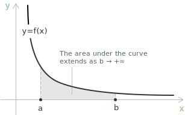
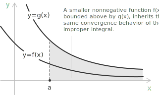

## Definition

Improper integrals are [integrals](../indefinite-integrals/) in which either the interval of integration is unbounded, or the integrand becomes unbounded at one or more points, or both. In elementary calculus, the [definite integral](../definite-integrals/):

$$\int_a^b f(x) \ dx$$

is defined under the assumption that the interval $[a, b]$ is bounded and that the function $f$ is [continuous](../continuous-functions/), or at least integrable, on that interval. Many problems lead beyond these restrictions. An [unbounded interval](../intervals/) of integration, such as $(a, +\infty)$, or a function that becomes unbounded at one or more points of the interval, both fall outside the classical setting. In these cases, the integral is called improper, and its meaning is not immediate: it must be defined through a limiting process.

> Improper integrals do not enlarge the class of [Riemann integrable](../riemann-integrability-criteria/) functions. They reinterpret problematic situations through limits of ordinary integrals. Convergence is a global property: it depends on how the function behaves near infinity or near a singularity, and not only on its local behaviour.

- - -

The need for a limiting process becomes clear when the [Fundamental Theorem of Calculus](../fundamental-theorem-of-calculus/) is applied directly to the following integral:

$$\int_{-1}^{1} \frac{1}{x^2} \ dx$$

A direct calculation gives $\left[-x^{-1}\right]_{-1}^{1} = -2$, which is clearly wrong. The integrand is strictly positive, so the integral cannot be negative. The issue is that $1/x^2$ has a singularity at $x = 0$, which lies inside the interval, and the Fundamental Theorem does not apply in this situation. This example shows that extending integration beyond its classical domain requires more than mechanical computation: it requires a definition built on limits.

> Blindly applying the Fundamental Theorem of Calculus to an improper integral can produce results that are mathematically nonsensical, not merely inaccurate.

## Improper integrals over unbounded intervals

Suppose $f$ is continuous on $[a, +\infty)$. The integral:

$$\int_a^{+\infty} f(x) \ dx$$

is defined as the [limit](../limits/):

$$\int_a^{+\infty} f(x) \ dx := \lim_{b \to +\infty} \int_a^b f(x) \ dx$$

provided that this limit exists and is finite. The integration is carried out up to a finite upper bound $b$, and $b$ is then allowed to grow without bound.

+ When the limit exists and is finite, the integral is said to converge: the area under the curve accumulates to a well-defined value despite the unbounded domain.
+ When the limit does not exist or is infinite, the integral diverges: no finite value can be assigned to it.

- - -

The same idea applies when the lower limit is $-\infty$. For an integral of the form:

$$\int_{-\infty}^b f(x) \ dx$$

the definition is symmetric:

$$\int_{-\infty}^b f(x) \ dx := \lim_{a \to -\infty} \int_a^b f(x) \ dx$$

For integrals over the entire real line, neither endpoint is finite, so a single limit no longer suffices. The integral is split at an arbitrary point $c$ and each half is handled separately:

$$\int_{-\infty}^{+\infty} f(x) \ dx = \int_{-\infty}^c f(x) \ dx + \int_c^{+\infty} f(x) \ dx$$

for some real $c$, provided that both integrals converge separately. The result does not depend on the choice of $c$.

## Example 1

Compute the following integral:

$$\int_1^{+\infty} \frac{1}{x^2} \ dx$$

Following the definition, the infinite upper limit is replaced by a finite bound $b$ and the resulting ordinary integral is computed:

$$\int_1^b \frac{1}{x^2} \ dx = \int_1^b x^{-2} \ dx = \left[ -x^{-1} \right]_1^b = -\frac{1}{b} + 1$$

It remains to take the limit as $b \to +\infty$. As $b$ grows without bound, the term $1/b$ vanishes, and:

$$\lim_{b \to +\infty} \left(1 - \frac{1}{b}\right) = 1$$

The limit exists and is finite, so:

$$\int_1^{+\infty} \frac{1}{x^2} \ dx = 1$$

and the integral converges to $1$.

## Example 2

Consider now a case where the limit fails to be finite. The integral:

$$\int_1^{+\infty} \frac{1}{x} \ dx$$

looks structurally similar to the previous one, but the behaviour is fundamentally different. A direct computation gives:

$$\int_1^b \frac{1}{x} \ dx = \left[ \ln x \right]_1^b = \ln b$$

Taking the limit as $b \to +\infty$:

$$\lim_{b \to +\infty} \ln b = +\infty$$

The limit does not exist as a finite value, and therefore the integral diverges.

## Improper integrals with infinite discontinuities

A second type of improper integral occurs when $f$ is unbounded at some point in the interval. Suppose $f$ is continuous on $(a, b]$ but becomes unbounded as $x \to a^+$. The integral is defined as:

$$\int_a^b f(x) \ dx := \lim_{t \to a^+} \int_t^b f(x) \ dx$$

provided that the limit exists and is finite. Symmetrically, if $f$ is continuous on $[a, b)$ but becomes unbounded as $x \to b^-$:

$$\int_a^b f(x) \ dx := \lim_{t \to b^-} \int_a^t f(x) \ dx$$

If the singularity occurs at an interior point $c \in (a, b)$, the integral is split at $c$:

$$\int_a^b f(x) \ dx = \int_a^c f(x) \ dx + \int_c^b f(x) \ dx$$

provided that both integrals converge separately.

## Example 3

To illustrate the case of an infinite discontinuity, consider an integral whose integrand blows up at one of the endpoints:

$$\int_0^1 \frac{1}{\sqrt{x}} \ dx$$

The function $1/\sqrt{x}$ is unbounded as $x \to 0^+$, so this is an improper integral of the second type. Following the definition, the singularity is removed by introducing a lower bound $t > 0$ and then taking the limit as $t \to 0^+$:

$$\int_0^1 \frac{1}{\sqrt{x}} \ dx := \lim_{t \to 0^+} \int_t^1 x^{-1/2} \ dx$$

The antiderivative is:

$$\int x^{-1/2} \ dx = 2x^{1/2} + c$$

Evaluating over $[t, 1]$:

$$\int_t^1 x^{-1/2} \ dx = 2 - 2\sqrt{t}$$

Taking the limit as $t \to 0^+$:

$$\lim_{t \to 0^+} (2 - 2\sqrt{t}) = 2$$

The limit exists and is finite, so the integral converges and equals $2$.

## The $p$-integral test

A fundamental reference example is the family of integrals:

$$\int_1^{+\infty} \frac{1}{x^p} \ dx \tag{1}$$

where $p$ is a real parameter. The behaviour of this integral depends entirely on $p$, and the result serves as a benchmark for comparing more complex integrands. For $p \neq 1$:

$$\int_1^b x^{-p} \ dx = \left[ \frac{x^{1-p}}{1-p} \right]_1^b = \frac{b^{1-p} - 1}{1 - p}$$

Taking the limit as $b \to +\infty$ produces three cases:

[class="table-1"]

|         |                       |                              |
| ------- | --------------------- | ---------------------------- |
| $p > 1$ | $b^{1-p} \to 0$       | converges to $\dfrac{1}{p - 1}$ |
| $p = 1$ | $\ln b \to +\infty$   | diverges                     |
| $p < 1$ | $b^{1-p} \to +\infty$ | diverges                     |

[/class]

In summary, the integral $(1)$ converges if and only if $p > 1$. An analogous result holds near the origin. For the integral:

$$\int_0^1 \frac{1}{x^p} \ dx \tag{2}$$

the singularity is at $x = 0$, and the roles are reversed. The integral $(2)$ converges if and only if $p < 1$.

> The $p$-integral test illustrates a fundamental principle: the convergence of an improper integral is governed by the rate at which the integrand decays or blows up. What ultimately matters is not the exact form of the function, but its asymptotic behaviour near infinity or near the singular point. For this reason, [powers](../powers/) of $x$ serve as natural comparison models in a wide range of convergence arguments.

## Convergence and comparison

Directly computing an improper integral is not always feasible and often not even necessary. In many situations, the relevant question is not the exact value of the integral, but only whether it converges or diverges. Comparison principles make it possible to answer this question by looking at how the integrand behaves, rather than by finding its antiderivative.

The most immediate tool is the direct comparison test. Suppose $0 \leq f(x) \leq g(x)$ for all $x \geq a$:

+ If $\int_a^{+\infty} g(x) \ dx$ converges, so does $\int_a^{+\infty} f(x) \ dx$.
+ If $\int_a^{+\infty} f(x) \ dx$ diverges, so does $\int_a^{+\infty} g(x) \ dx$.

> The reasoning is simple: when a larger function accumulates only a finite area, a smaller one certainly cannot do worse; conversely, when a smaller function already forces the area to grow without bound, a larger one has no hope of staying finite.

A pointwise bound is not always easy to establish, and this is where the limit comparison test becomes useful. If $f(x), g(x) > 0$ and:

$$\lim_{x \to +\infty} \frac{f(x)}{g(x)} = L \qquad 0 < L < +\infty$$

then $\int_a^{+\infty} f(x) \ dx$ and $\int_a^{+\infty} g(x) \ dx$ either both converge or both diverge. When two functions are asymptotically equivalent, convergence of one implies convergence of the other, and the same holds for divergence. The reference of choice is almost always a [power](../powers/) $1/x^p$, whose behaviour is fully characterised by the $p$-integral test.

## Decision procedure

When faced with an improper integral, the following sequence of checks usually settles the question of convergence quickly.

+ Identify the source of impropriety: an unbounded interval, an unbounded integrand at an endpoint, or a singularity at an interior point.
+ If a closed-form antiderivative is available, apply the definition through a limit: replace the infinite bound or the singular endpoint with a parameter and take the limit. The integral converges when the limit is finite and diverges otherwise.
+ If no antiderivative is available and a pointwise bound $0 \leq f(x) \leq g(x)$ holds for a reference $g$ with known convergence behaviour, apply the direct comparison test.
+ If a pointwise bound is not available, choose a reference function $1/x^p$ that captures the asymptotic behaviour of the integrand and apply the limit comparison test.
+ When the singularity sits at an interior point, split the integral at that point and analyse each half separately, requiring convergence of both pieces.

## Example 4

To illustrate the limit comparison test, consider the integral:

$$\int_1^{+\infty} \frac{1}{x^2 + 1} \ dx$$

Finding an explicit antiderivative is possible here, since the result involves $\arctan x$, but the point of the example is different: the aim is to establish convergence without computing the integral, purely by comparing asymptotic rates. For large $x$, the term $+1$ in the denominator becomes negligible relative to $x^2$, so the integrand behaves like $1/x^2$. To make this precise, the relevant limit is:

$$\lim_{x \to +\infty} \frac{\dfrac{1}{x^2 + 1}}{\dfrac{1}{x^2}} = \lim_{x \to +\infty} \frac{x^2}{x^2 + 1} = 1$$

The limit is finite and strictly positive. By the limit comparison test, the two integrals:

$$\int_1^{+\infty} \frac{1}{x^2 + 1} \ dx \qquad \int_1^{+\infty} \frac{1}{x^2} \ dx$$

either both converge or both diverge. Since the latter converges by the $p$-integral test with $p = 2 > 1$, the integral:

$$\int_1^{+\infty} \frac{1}{x^2 + 1} \ dx$$

converges as well.

## Example 5

To illustrate the direct comparison test, consider the integral:

$$\int_2^{+\infty} \frac{\cos^2 x}{x^2} \ dx$$

Since $0 \leq \cos^2 x \leq 1$ for all $x$, the integrand satisfies:

$$0 \leq \frac{\cos^2 x}{x^2} \leq \frac{1}{x^2}$$

The function $1/x^2$ is integrable on $[2, +\infty)$, and by the $p$-integral test with $p = 2 > 1$, the integral:

$$\int_2^{+\infty} \frac{1}{x^2} \ dx$$

converges. By the direct comparison test, the integral:

$$\int_2^{+\infty} \frac{\cos^2 x}{x^2} \ dx$$

converges as well.

## Absolute convergence

Consider an improper integral of the form:

$$\int_a^{+\infty} f(x) \ dx$$

The integral is said to converge absolutely when the integral of the absolute value also converges:

$$\int_a^{+\infty} |f(x)| \ dx < +\infty$$

Absolute convergence implies convergence. If $\int_a^{+\infty} |f(x)| \ dx$ is finite, then $\int_a^{+\infty} f(x) \ dx$ converges as well. The converse does not hold. The integral:

$$\int_1^{+\infty} \frac{\sin x}{x} \ dx$$

converges through [integration by parts](../integration-by-parts/), while:

$$\int_1^{+\infty} \frac{|\sin x|}{x} \ dx$$

diverges. An integral that converges but fails to converge absolutely is said to converge conditionally.

> When the analytical evaluation of an improper integral is unavailable, the convergence question can sometimes be settled by the comparison tests above, while the value itself may be estimated through [numerical integration](../numerical-integration/) applied to a truncated interval.
