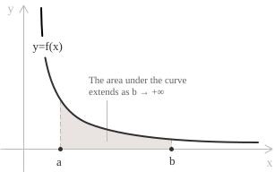
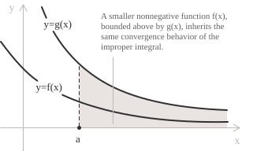

## Definition

An improper integral is a [definite integral](../definite-integrals/) for which the interval of integration is unbounded, the integrand is unbounded at one or more points, or both. In elementary calculus, the definite integral is written as:

$$\int_a^b f(x) \ dx$$

Its usual definition assumes that the interval $[a,b]$ is bounded and the function $f$ is [continuous](../continuous-functions/), or at least [Riemann integrable](../riemann-integrability-criteria/), on that interval. An [unbounded interval](../intervals/), such as $(a,+\infty),$ or an unbounded integrand falls outside these hypotheses. The integral is then defined through one or more limits.

> An improper integral is a limit of ordinary Riemann integrals. Convergence must be checked separately at every improper endpoint or singular point.

- - -

A formal application of the [Fundamental Theorem of Calculus](../fundamental-theorem-of-calculus/) to the following expression gives an invalid result:

$$\int_{-1}^{1} \frac{1}{x^2} \ dx$$

The calculation $\left[-x^{-1}\right]_{-1}^{1}=-2$ is invalid because $1/x^2$ is unbounded at $x=0,$ and the Fundamental Theorem does not apply across that point. Since the integrand is positive, a negative value already reveals the error. After the interval is split at $0,$ both one-sided improper integrals diverge to $+\infty.$

## Improper integrals over unbounded intervals

Suppose $f$ is Riemann integrable on every interval $[a,t]$ with $t>a.$ The improper integral over $[a,+\infty)$ is defined by the [limit](../limits/):

$$\int_a^{+\infty} f(x) \ dx := \lim_{t \to +\infty} \int_a^t f(x) \ dx$$

Each ordinary integral has a finite upper bound $t,$ and the definition takes the limit as $t\to+\infty.$

+ When the limit exists and is finite, the integral converges.
+ When the limit does not exist as a finite real number, the integral diverges.

- - -

The same idea applies when the lower limit is $-\infty.$ Suppose $f$ is Riemann integrable on every interval $[t,b]$ with $t<b.$ The corresponding definition is:

$$\int_{-\infty}^b f(x) \ dx := \lim_{t \to -\infty} \int_t^b f(x) \ dx$$

Suppose $f$ is Riemann integrable on every bounded interval. For an integral over the entire real line, neither endpoint is finite, so a single limit does not suffice. Choose any point $c$ and define:

$$\int_{-\infty}^{+\infty} f(x) \ dx := \int_{-\infty}^c f(x) \ dx + \int_c^{+\infty} f(x) \ dx$$

The improper integral over the real line converges only when both integrals on the right converge separately. In that case, the result does not depend on the choice of $c.$

## Example 1

Compute the following integral:

$$\int_1^{+\infty} \frac{1}{x^2} \ dx$$

For $t>1,$ the ordinary integral is:

$$\int_1^t \frac{1}{x^2} \ dx = \int_1^t x^{-2} \ dx = \left[ -x^{-1} \right]_1^t = -\frac{1}{t} + 1$$

Since $1/t\to0$ as $t\to+\infty,$ the defining limit is:

$$\lim_{t \to +\infty} \left(1 - \frac{1}{t}\right) = 1$$

The limit is finite, so the improper integral converges to $1.$

## Example 2

The analogous integral with exponent $1$ is:

$$\int_1^{+\infty} \frac{1}{x} \ dx$$

For $t>1,$ the ordinary integral is:

$$\int_1^t \frac{1}{x} \ dx = \left[ \ln x \right]_1^t = \ln t$$

Its defining limit is:

$$\lim_{t \to +\infty} \ln t = +\infty$$

The limit is infinite, so the integral diverges.

## Improper integrals with infinite discontinuities

A second type of improper integral occurs when $f$ is unbounded at some point in the interval. Suppose $f$ becomes unbounded as $x \to a^+$ but is Riemann integrable on every interval $[t,b]$ with $a<t<b.$ The improper integral is defined by:

$$\int_a^b f(x) \ dx := \lim_{t \to a^+} \int_t^b f(x) \ dx$$

The improper integral converges when the limit exists and is finite. Symmetrically, suppose $f$ becomes unbounded as $x \to b^-$ but is Riemann integrable on every interval $[a,t]$ with $a<t<b.$ The corresponding definition is:

$$\int_a^b f(x) \ dx := \lim_{t \to b^-} \int_a^t f(x) \ dx$$

Suppose $c\in(a,b)$ is the only singular point, and $f$ is Riemann integrable on every interval $[a,t]$ with $a<t<c$ and every interval $[s,b]$ with $c<s<b.$ The definition uses two independent one-sided limits:

$$
\int_a^b f(x) \ dx
:=\lim_{t\to c^-}\int_a^t f(x) \ dx
+\lim_{s\to c^+}\int_s^b f(x) \ dx
$$

The improper integral converges only when both one-sided limits exist and are finite.

If an integral has several improper endpoints or singular points, choose regular cut points so that each one-sided piece has a single source of impropriety. The original integral converges if and only if every piece converges.

## Example 3

The integrand in the following integral is unbounded at the lower endpoint:

$$\int_0^1 \frac{1}{\sqrt{x}} \ dx$$

Since $1/\sqrt{x}$ is unbounded as $x\to0^+,$ the definition uses a lower bound $t>0$ and the limit as $t\to0^+$:

$$\int_0^1 \frac{1}{\sqrt{x}} \ dx := \lim_{t \to 0^+} \int_t^1 x^{-1/2} \ dx$$

The antiderivative is:

$$\int x^{-1/2} \ dx = 2x^{1/2} + C$$

For $t>0,$ the ordinary integral is:

$$\int_t^1 x^{-1/2} \ dx = 2 - 2\sqrt{t}$$

The defining limit is:

$$\lim_{t \to 0^+} (2 - 2\sqrt{t}) = 2$$

The limit exists and is finite, so the integral converges and equals $2.$

## The $p$-integral test

The $p$-integral test classifies the family:

$$\int_1^{+\infty} \frac{1}{x^p} \ dx \tag{1}$$

The parameter $p$ is real, and convergence depends on its value. When $p\neq1,$ the ordinary integral is:

$$\int_1^b x^{-p} \ dx = \left[ \frac{x^{1-p}}{1-p} \right]_1^b = \frac{b^{1-p} - 1}{1 - p}$$

Taking the limit as $b \to +\infty$ produces three cases:

[class="table-1"]

|         |                       |                              |
| ------- | --------------------- | ---------------------------- |
| $p > 1$ | $b^{1-p} \to 0$       | converges to $\dfrac{1}{p - 1}$ |
| $p = 1$ | $\ln b \to +\infty$   | diverges                     |
| $p < 1$ | $b^{1-p} \to +\infty$ | diverges                     |

[/class]

The integral $(1)$ converges if and only if $p>1.$ The corresponding integral near the origin is:

$$\int_0^1 \frac{1}{x^p} \ dx \tag{2}$$

At the origin, the endpoint behaviour is reversed. The integrand is singular at $x=0$ only when $p>0,$ while the integral $(2)$ converges if and only if $p<1.$

> These [power functions](../powers/) are the reference cases for the comparison tests below.

## Convergence and comparison

Comparison tests determine convergence without an antiderivative or the exact value of the integral.

The direct comparison test uses a pointwise bound. Suppose $f$ and $g$ are Riemann integrable on every bounded subinterval of $[a,+\infty)$ and $0\leq f(x)\leq g(x)$ for all $x\geq a$:

+ If $\int_a^{+\infty} g(x) \ dx$ converges, so does $\int_a^{+\infty} f(x) \ dx.$
+ If $\int_a^{+\infty} f(x) \ dx$ diverges, so does $\int_a^{+\infty} g(x) \ dx.$

> For every $b>a,$ the inequality $0\leq f\leq g$ gives $0\leq\int_a^b f(x) \ dx\leq\int_a^b g(x) \ dx.$ Passing to the limit proves the first implication, and the second follows by contraposition.

The limit comparison test replaces a pointwise bound with an asymptotic ratio. Suppose $f$ and $g$ are positive and Riemann integrable on every bounded subinterval of $[a,+\infty),$ and their ratio has the limit:

$$\lim_{x \to +\infty} \frac{f(x)}{g(x)} = L \qquad 0 < L < +\infty$$

Then $\int_a^{+\infty} f(x) \ dx$ and $\int_a^{+\infty} g(x) \ dx$ either both converge or both diverge. Equivalently, $f(x)\sim Lg(x)$ as $x\to+\infty;$ asymptotic equivalence of $f$ and $g$ is the special case $L=1.$ Taking $g(x)=1/x^p$ reduces the question to the $p$-integral test.

The degenerate values of $L$ give one-sided implications:

+ If $L=0$ and $\int_a^{+\infty} g(x) \ dx$ converges, then $\int_a^{+\infty} f(x) \ dx$ converges.
+ If $L=+\infty$ and $\int_a^{+\infty} g(x) \ dx$ diverges, then $\int_a^{+\infty} f(x) \ dx$ diverges.

If $f$ and $g$ are positive and Riemann integrable on every compact interval on one side of a finite point $c,$ the same conclusions hold for the corresponding one-sided improper integrals when $x\to c^+$ or $x\to c^-.$ The standard power model is $1/|x-c|^p,$ whose integral on either side of $c$ converges if and only if $p<1.$

## Decision procedure

To test convergence, use the following checks.

+ Identify every source of impropriety, including an unbounded interval, an unbounded integrand at an endpoint, and each singularity at an interior point.
+ If an antiderivative is available, apply the definition to each improper piece. [L'Hôpital's rule](../hopital-rule/) may help with an indeterminate quotient when its hypotheses are satisfied.
+ For a nonnegative integrand, use the direct comparison test when a pointwise bound by a reference function is available.
+ If a pointwise bound is unavailable and the integrand is eventually positive, use the limit comparison test when its ratio to a reference function has one of the limits described above. Common models are $1/x^p$ at infinity and $1/|x-c|^p$ near a finite singular point.
+ Split an integral with several sources of impropriety into one-sided pieces and require every piece to converge.

## Example 4

Consider the integral:

$$\int_1^{+\infty} \frac{1}{x^2 + 1} \ dx$$

The integrand has the antiderivative $\arctan x,$ but comparison proves convergence without evaluating the improper integral. The comparison ratio is:

$$\lim_{x \to +\infty} \frac{\dfrac{1}{x^2 + 1}}{\dfrac{1}{x^2}} = \lim_{x \to +\infty} \frac{x^2}{x^2 + 1} = 1$$

The ratio tends to $1,$ so the two integrals converge or diverge together:

$$\int_1^{+\infty} \frac{1}{x^2 + 1} \ dx \qquad \int_1^{+\infty} \frac{1}{x^2} \ dx$$

The second integral converges by the $p$-integral test because $p=2>1.$ Hence the first integral converges.

## Example 5

Consider the integral:

$$\int_2^{+\infty} \frac{\cos^2 x}{x^2} \ dx$$

Since $0 \leq \cos^2 x \leq 1$ for all $x,$ the integrand satisfies:

$$0 \leq \frac{\cos^2 x}{x^2} \leq \frac{1}{x^2}$$

Since $p=2>1,$ the $p$-integral test gives:

$$\int_2^{+\infty} \frac{1}{x^2} \ dx<+\infty$$

The direct comparison test then gives:

$$\int_2^{+\infty} \frac{\cos^2 x}{x^2} \ dx<+\infty$$

Hence the original integral converges.

## Example 6

For fixed $\beta>0,$ determine the values of $\alpha\in\mathbb{R}$ for which the following integral converges:

$$I_{\alpha,\beta}:=\int_0^{+\infty}\frac{x^\alpha}{1+x^\beta} \ dx$$

The endpoint $+\infty$ is improper for every $\alpha,$ and $0$ is a singular endpoint when $\alpha<0.$ Splitting at $1$ gives two independent integrals:

$$I_{\alpha,\beta}=\int_0^1\frac{x^\alpha}{1+x^\beta} \ dx+\int_1^{+\infty}\frac{x^\alpha}{1+x^\beta} \ dx$$

Near the origin, comparison with $x^\alpha$ follows from:

$$\lim_{x\to0^+}\frac{\dfrac{x^\alpha}{1+x^\beta}}{x^\alpha}=\lim_{x\to0^+}\frac{1}{1+x^\beta}=1$$

The first integral converges if and only if $\alpha>-1.$ At infinity, the comparison function is $x^{\alpha-\beta}$ because:

$$\lim_{x\to+\infty}\frac{\dfrac{x^\alpha}{1+x^\beta}}{x^{\alpha-\beta}}=\lim_{x\to+\infty}\frac{x^\beta}{1+x^\beta}=1$$

The second integral converges if and only if $\alpha-\beta<-1,$ or equivalently $\alpha<\beta-1.$ Both pieces therefore converge if and only if:

$$-1<\alpha<\beta-1$$

The integral diverges for every other value of $\alpha.$

## Absolute convergence

Consider an improper integral of the form:

$$\int_a^{+\infty} f(x) \ dx$$

The integral converges absolutely when the integral of the absolute value converges:

$$\int_a^{+\infty} |f(x)| \ dx < +\infty$$

Absolute convergence implies convergence, but the converse does not hold. For example:

$$\int_1^{+\infty} \frac{\sin x}{x} \ dx$$

[Integration by parts](../integration-by-parts/) shows that this integral converges. The integral of its absolute value is:

$$\int_1^{+\infty} \frac{|\sin x|}{x} \ dx$$

The second integral diverges. An integral that converges but fails to converge absolutely is said to converge conditionally.

> Suppose $f$ is Riemann integrable on every bounded subinterval of $[a,+\infty).$ The function $f$ is Lebesgue integrable on $[a,+\infty)$ if and only if its improper integral converges absolutely, and the two values then coincide. Thus $\int_1^{+\infty}\sin x/x \ dx$ converges as an improper integral, but $x\mapsto\sin x/x$ is not Lebesgue integrable on $[1,+\infty)$ because the integral of $|\sin x|/x$ diverges.

> If no analytic value is available, [numerical integration](../numerical-integration/) on a truncated interval requires a separate bound for the omitted tail.
