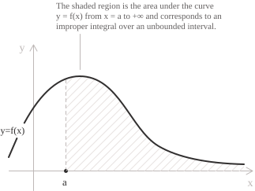

## Integrals over unbounded intervals

So far we have analysed [indefinite integrals](../indefinite-integrals/) and [definite](../definite-integrals) ones, describing both the antiderivatives of the most common analytic functions and the main rules of integration. In simple terms, indefinite integrals have no limits of integration, while definite ones are always evaluated within a bounded [interval](../intervals/), for example $[a,b]$. In this last case we came across integrals such as this one:

$$\int_{a}^{b} f(x) \ dx = F(b) - F(a) \tag{1}$$

When $f$ is continuous on $[a,b]$ and $F$ is an antiderivative of $f,$ the fundamental theorem of calculus gives $(1).$ The integral is obtained by evaluating $F$ at the endpoints $a$ and $b.$ Geometrically, it is the signed area between the graph of $f$ and the $x$ axis over $[a,b].$ Regions above the axis contribute positively, while regions below it contribute negatively.

This way of proceeding has a non-trivial limitation: it works only when the two endpoints enclose a bounded interval. More precisely, recalling the [Riemann integrability criteria](../riemann-integrability-criteria), the interval on which the integral is defined must be bounded, and $f$ must be bounded.

What happens when one of these hypotheses fails and one of the limits of integration is $+\infty$ or $-\infty?$ We would find ourselves in a case of this kind:

$$\int_{a}^{+\infty} f(x) \ dx$$

Since $+\infty$ is not a real number, the expression $F(+\infty)$ cannot be evaluated as an ordinary endpoint value.

 

Such expressions are handled by means of [limits](../limits/). More precisely, an improper integral is defined as the limit of proper Riemann integrals over bounded intervals, as the following sections show.

## Improper integrals over unbounded intervals

Suppose $f$ is Riemann integrable on every interval $[a,t]$ with $t>a.$ The improper integral over $[a,+\infty)$ is defined by the [limit](../limits/):

$$\int_a^{+\infty} f(x) \ dx := \lim_{t \to +\infty} \int_a^t f(x) \ dx$$

The upper endpoint is therefore set equal to a finite number $t,$ and the limit as $t\to+\infty$ is determined.

+ When the limit exists and is finite, the integral converges.
+ When the limit equals $+\infty$ or $-\infty,$ the integral diverges to $+\infty$ or $-\infty,$ respectively.
+ When the limit does not exist, the improper integral diverges.

- - -

The same process can be repeated when the lower endpoint is $-\infty.$ Suppose in this case that $f$ is Riemann integrable on every interval $[t,b]$ with $t<b.$ The corresponding definition of the improper integral is:

$$\int_{-\infty}^b f(x) \ dx := \lim_{t \to -\infty} \int_t^b f(x) \ dx$$

A third case has lower endpoint $-\infty$ and upper endpoint $+\infty,$ so a single limit does not suffice. Choose any point $c$ and define:

$$\int_{-\infty}^{+\infty} f(x) \ dx := \int_{-\infty}^c f(x) \ dx + \int_c^{+\infty} f(x) \ dx$$

The improper integral converges only when both integrals on the right converge separately, and in that case the result does not depend on the choice of $c.$

## Example 1

To illustrate a very frequent case study, let us compute the following improper integral:

$$\int_1^{+\infty} \frac{1}{x^2} \ dx$$

For $b>1,$ the proper Riemann integral is:

$$\int_1^b \frac{1}{x^2} \ dx = \int_1^b x^{-2} \ dx = \left[ -x^{-1} \right]_1^b = -\frac{1}{b} + 1$$

Since $1/b\to0$ as $b\to+\infty,$ the limit defining the integral is:

$$\lim_{b \to +\infty} \left(1 - \frac{1}{b}\right) = 1$$

This limit is finite and therefore the improper integral converges to $1.$

## Example 2

Let us now consider the analogous case with exponent equal to $1$ in the denominator:

$$\int_1^{+\infty} \frac{1}{x} \ dx$$

For $b>1,$ the integral becomes:

$$\int_1^b \frac{1}{x} \ dx = \left[ \ln x \right]_1^b = \ln b$$

The limit defining it is:

$$\lim_{b \to +\infty} \ln b = +\infty$$

This limit is infinite, hence the integral diverges.

## Improper integrals with unbounded integrands

A second type of improper integral occurs when $f$ is unbounded at some point of the interval. Suppose $f$ is unbounded in every right-hand neighbourhood of $a$ but is Riemann integrable on every interval $[t,b]$ with $a<t<b.$ The improper integral is defined by:

$$\int_a^b f(x) \ dx := \lim_{t \to a^+} \int_t^b f(x) \ dx$$

The improper integral converges when the limit exists and is finite. Similarly, suppose $f$ is unbounded in every left-hand neighbourhood of $b$ but is Riemann integrable on every interval $[a,t]$ with $a<t<b.$ The corresponding definition is:

$$\int_a^b f(x) \ dx := \lim_{t \to b^-} \int_a^t f(x) \ dx$$

Suppose $c\in(a,b)$ is the only singular point and that $f$ is Riemann integrable on every interval $[a,t]$ with $a<t<c$ and on every interval $[s,b]$ with $c<s<b.$ The definition employs two independent one-sided limits:

$$
\int_a^b f(x) \ dx
:=\lim_{t\to c^-}\int_a^t f(x) \ dx
+\lim_{s\to c^+}\int_s^b f(x) \ dx
$$

The improper integral converges only when both one-sided limits exist and are finite.

If an integral has several improper endpoints or several singular points, regular cut points are chosen so that every one-sided piece has a single source of impropriety. In these cases, the original integral converges if and only if every piece of the integral converges.

## Example 3

The integrand of the following integral is unbounded at the lower endpoint:

$$\int_0^1 \frac{1}{\sqrt{x}} \ dx$$

Since $1/\sqrt{x}$ is unbounded as $x\to0^+,$ the definition uses a lower endpoint $t>0$ and the limit as $t\to0^+$:

$$\int_0^1 \frac{1}{\sqrt{x}} \ dx := \lim_{t \to 0^+} \int_t^1 x^{-1/2} \ dx$$

The antiderivative is:

$$\int x^{-1/2} \ dx = 2x^{1/2} + C$$

For $t>0,$ the proper Riemann integral is:

$$\int_t^1 x^{-1/2} \ dx = 2 - 2\sqrt{t}$$

The limit defining the integral is:

$$\lim_{t \to 0^+} (2 - 2\sqrt{t}) = 2$$

The limit exists and is finite, hence the integral converges and equals $2.$

## The $p$-integral test

The $p$-integral test classifies the family of integrals of the type:

$$\int_1^{+\infty} \frac{1}{x^p} \ dx \tag{2}$$

The parameter $p$ is a real number and convergence in this case depends on its value. When $p\neq1,$ the proper Riemann integral is:

$$\int_1^b x^{-p} \ dx = \left[ \frac{x^{1-p}}{1-p} \right]_1^b = \frac{b^{1-p} - 1}{1 - p}$$

Passing to the limit as $b \to +\infty$ produces three cases:

[class="table-1"]

|         |                       |                              |
| ------- | --------------------- | ---------------------------- |
| $p > 1$ | $b^{1-p} \to 0$       | converges to $\dfrac{1}{p - 1}$ |
| $p = 1$ | $\ln b \to +\infty$   | diverges                     |
| $p < 1$ | $b^{1-p} \to +\infty$ | diverges                     |

[/class]

Integral $(2)$ converges if and only if $p>1.$ The corresponding integral near the origin is:

$$\int_0^1 \frac{1}{x^p} \ dx \tag{3}$$

At the origin the behaviour at the endpoint is reversed. The integrand is singular at $x=0$ only when $p>0,$ while integral $(3)$ converges if and only if $p<1.$

> These [power functions](../powers/) are the reference cases for the comparison tests presented below.

## Convergence and comparison tests

Comparison tests can establish convergence without finding an antiderivative or evaluating the integral exactly. The two tests used below are the direct comparison test and the limit comparison test.

The direct comparison test uses a pointwise bound. Suppose $f$ and $g$ are Riemann integrable on every bounded subinterval of $[a,+\infty)$ and that $0\leq f(x)\leq g(x)$ for every $x\geq a$:

+ If $\int_a^{+\infty} g(x) \ dx$ converges, then $\int_a^{+\infty} f(x) \ dx$ converges as well.
+ If $\int_a^{+\infty} f(x) \ dx$ diverges, then $\int_a^{+\infty} g(x) \ dx$ diverges as well.

The limit comparison test replaces the pointwise bound with an asymptotic ratio. Suppose $f$ and $g$ are positive and Riemann integrable on every bounded subinterval of $[a,+\infty),$ and that their ratio has the limit:

$$\lim_{x \to +\infty} \frac{f(x)}{g(x)} = L \qquad 0 < L < +\infty$$

Then $\int_a^{+\infty} f(x) \ dx$ and $\int_a^{+\infty} g(x) \ dx$ either both converge or both diverge.

Equivalently $f(x)\sim Lg(x)$ as $x\to+\infty;$ asymptotic equivalence of $f$ and $g$ is the special case $L=1.$ Choosing $g(x)=1/x^p$ reduces the question to the $p$-integral test.

The degenerate values of $L$ give implications in one direction only:

+ If $L=0$ and $\int_a^{+\infty} g(x) \ dx$ converges, then $\int_a^{+\infty} f(x) \ dx$ converges.
+ If $L=+\infty$ and $\int_a^{+\infty} g(x) \ dx$ diverges, then $\int_a^{+\infty} f(x) \ dx$ diverges.

If $f$ and $g$ are positive and Riemann integrable on every compact interval lying to the right of a finite point $c,$ the same conclusions hold for the corresponding improper integrals as $x\to c^+.$ The analogous statement holds on the left as $x\to c^-.$ The reference power model is $1/|x-c|^p,$ whose integral on each side of $c$ converges if and only if $p<1.$

## A practical convergence strategy

The following steps organize the convergence analysis.

+ First, locate every source of impropriety, including each infinite endpoint, each endpoint at which the integrand is unbounded, and each interior singularity.
+ Split an integral with several sources of impropriety into one-sided pieces so that each piece has a single source of impropriety.
+ If an antiderivative is available, the definition must be applied to each piece of the improper integral. [De l'Hôpital's rule](../hopital-rule/) can help with an indeterminate quotient when its hypotheses are satisfied.
+ For a non-negative integrand, the direct comparison test can be used when a pointwise bound by a reference function is available.
+ If the pointwise bound is unavailable and the integrand is eventually positive, the limit comparison test can be used when its ratio to a reference function has one of the limits described above. The usual models are $1/x^p$ at infinity and $1/|x-c|^p$ near a finite singular point.

## Example 4

Let us consider the following integral:

$$\int_1^{+\infty} \frac{1}{x^2 + 1} \ dx$$

The integrand has antiderivative $\arctan x,$ but comparison proves convergence without computing the improper integral. The comparison ratio is:

$$\lim_{x \to +\infty} \frac{\dfrac{1}{x^2 + 1}}{\dfrac{1}{x^2}} = \lim_{x \to +\infty} \frac{x^2}{x^2 + 1} = 1$$

The ratio tends to $1,$ hence the two integrals converge or diverge together:

$$\int_1^{+\infty} \frac{1}{x^2 + 1} \ dx \qquad \int_1^{+\infty} \frac{1}{x^2} \ dx$$

The second integral converges by the $p$-integral test because $p=2>1.$ Consequently the first one converges as well.

## Example 5

Let us consider the following integral:

$$\int_2^{+\infty} \frac{\cos^2 x}{x^2} \ dx$$

Since $0 \leq \cos^2 x \leq 1$ for every $x,$ the integrand satisfies:

$$0 \leq \frac{\cos^2 x}{x^2} \leq \frac{1}{x^2}$$

Since $p=2>1,$ the $p$-integral test gives:

$$\int_2^{+\infty} \frac{1}{x^2} \ dx<+\infty$$

The direct comparison test then gives:

$$\int_2^{+\infty} \frac{\cos^2 x}{x^2} \ dx<+\infty$$

The original integral converges.

## Example 6

With $\beta>0$ fixed, let us determine the values of $\alpha\in\mathbb{R}$ for which the following integral converges:

$$I_{\alpha,\beta}:=\int_0^{+\infty}\frac{x^\alpha}{1+x^\beta} \ dx$$

The endpoint $+\infty$ is improper for every $\alpha,$ while $0$ is a singular endpoint when $\alpha<0.$ Splitting at $1$ gives two independent integrals:

$$I_{\alpha,\beta}=\int_0^1\frac{x^\alpha}{1+x^\beta} \ dx+\int_1^{+\infty}\frac{x^\alpha}{1+x^\beta} \ dx$$

Near the origin the comparison with $x^\alpha$ follows from:

$$\lim_{x\to0^+}\frac{\dfrac{x^\alpha}{1+x^\beta}}{x^\alpha}=\lim_{x\to0^+}\frac{1}{1+x^\beta}=1$$

The first integral converges if and only if $\alpha>-1.$ At infinity the comparison function is $x^{\alpha-\beta}$ because:

$$\lim_{x\to+\infty}\frac{\dfrac{x^\alpha}{1+x^\beta}}{x^{\alpha-\beta}}=\lim_{x\to+\infty}\frac{x^\beta}{1+x^\beta}=1$$

The second integral converges if and only if $\alpha-\beta<-1,$ that is $\alpha<\beta-1.$ Both pieces therefore converge if and only if:

$$-1<\alpha<\beta-1$$

For every other value of $\alpha$ the integral diverges.

## Absolute convergence

Let us consider an improper integral of the form:

$$\int_a^{+\infty} f(x) \ dx$$

The integral converges absolutely when the integral of the absolute value converges:

$$\int_a^{+\infty} |f(x)| \ dx < +\infty$$

Absolute convergence implies convergence, but the converse does not hold. For example:

$$\int_1^{+\infty} \frac{\sin x}{x} \ dx$$

[Integration by parts](../integration-by-parts/) shows that this integral converges. The integral of its absolute value is:

$$\int_1^{+\infty} \frac{|\sin x|}{x} \ dx$$

The second integral diverges. An integral that converges without converging absolutely is said to [converge conditionally](../convergence-tests-for-improper-integrals/).

> Suppose $f$ is Riemann integrable on every bounded subinterval of $[a,+\infty).$ The function $f$ is Lebesgue integrable on $[a,+\infty)$ if and only if its improper integral converges absolutely, and the two values then coincide. Thus $\int_1^{+\infty}\sin x/x \ dx$ converges as an improper integral, but $x\mapsto\sin x/x$ is not Lebesgue integrable on $[1,+\infty)$ because the integral of $|\sin x|/x$ diverges.
