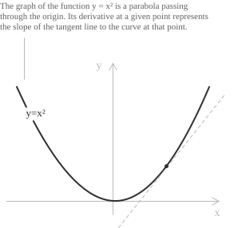
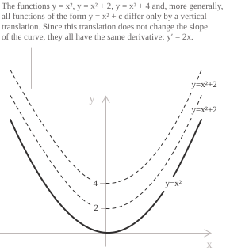

## A friendly introduction to integrals

Integrals have a terrible reputation among secondary school students and those in the early years of university. When students first encounter them, they regard them as mathematical objects marked by an intrinsic complexity that makes them, to put it mildly, hostile.
And that is true, at least in part.
Take, for instance, the following [definite integral](../definite-integrals/) over the interval $[+\infty, -\infty],$ known as the Gaussian integral:

$$
\int_{-\infty}^{+\infty} e^{-x^2}\,dx = \sqrt{\pi}
$$

At first sight it may look like a harmless object, but anyone who tries to evaluate it with the elementary methods of integration gets nowhere. The commonly accepted story has it that Gauss solved it around the age of thirty, so, at least until that age, you may consider yourselves excused if you are unable to determine its value.
Another integral to regard with reverent awe is Dirichlet's, simple in form but extremely difficult to evaluate:

$$
\int_{0}^{\infty} \frac{\sin x}{x}\,dx = \frac{\pi}{2}
$$

Fortunately, most of us are not in the running for a _Fields Medal_ and nurse more modest ambitions. For this reason, the integrals we will encounter over the course of our studies are, for the most part, within the reach of any willing student (unless they have the misfortune of running into a particularly sadistic professor along the way).

The good news is that a large share of these integrals can be evaluated using mechanical procedures and a pinch of intuition, which can be developed only through [a great deal of practice](learning-mathematics.md) with the main rules of integration and the typical shortcuts that save a significant number of steps.

- - -

In the following paragraphs I will give a rigorous definition of integrals, in particular of the indefinite ones, which are the subject of this entry and are essential for introducing their [definite](../definite-integrals) counterparts. First, though, I prefer to offer an intuitive preamble, starting from the notion of differentiation, which, as we will see later when we discuss _primitives_, is the inverse operation of integration.

Consider a simple function $y=x^2$. Its graph is a [parabola](parabola.md) passing through the origin. We know, from the study of the rules of differentiation, that its derivative is unique and equal to $y'=2x$ and that, for each value of $x$, it gives the slope of the line tangent to the graph at that point. For instance, for $x=2$ we obtain $y'(2)=2 \cdot 2 = 4.$ This means that the line tangent to the parabola at the point $(2,4)$ has slope exactly equal to $4$.

Let us now examine the opposite case, in which we are given a derivative, for instance $y'=2x,$ and we want to compute its primitive $y.$ Having seen the process in the opposite direction, by analogy and without any rule of integration at hand, we might state that its primitive is $y=x^2.$

The trouble is that this answer is incomplete because one term is missing.

While a function $y$ has a single derivative $y',$ a given derivative has infinitely many primitives, which differ by a constant $c.$ In the case $y'=2x,$ the correct answer would therefore have been $y=x^2 + c.$ The reason is simple, yet it is surprising how many students, even experienced ones, cannot explain it immediately. The graph will make everything clearer. If you imagine translating the graph of $y=x^2$ along the y-axis, you will obtain infinitely many graphs of the same form, corresponding to functions that differ only in the constant term.

Vertical translation, in fact, does not change the slope of the curve in any way. The functions $y=x^2$, $y=x^2+1$, $y=x^2-3$ and, more generally, all the functions of the form $y=x^2+c$ therefore have exactly the same derivative, $y'=2x$.

It is precisely this simple geometric observation that explains why a function has a single derivative, while the same function can have infinitely many primitives, all differing from one another by a constant.

To close this preamble, remember the following fundamental distinction: the indefinite integral determines the family of primitives of a given derivative, while the definite integral, the subject of its own entry, computes the area between a curve and the x-axis within a given interval. The following paragraphs list the main primitives and the properties of integrals. To your misfortune, you will have to learn them all by heart (I mean every single one), a necessary condition for having any chance of correctly carrying out the computations of the more complex integrals we will meet later on.

I will leave you with Feynman's path integral below, one of the fundamental tools of quantum mechanics and quantum field theory. It is, of course, well beyond our reach.

$$
\langle x_f,t_f \mid x_i,t_i\rangle
=
\int_{x(t_i)=x_i}^{x(t_f)=x_f}
\mathcal{D}x(t)\,
\exp\left(\frac{i}{\hbar}S[x(t)]\right)
$$

Keep it in mind all the same, if only as a warning of what may lie ahead.

## Primitives

Every differentiable function has a unique [derivative](../derivatives/). The inverse problem is to determine whether a given function $f$ is the derivative of some function $F$. Any such function $F$ is a primitive (or antiderivative) of $f$. Let $I$ be an open [interval](../intervals/). A differentiable function $F\colon I \to \mathbb{R}$ is a primitive of $f\colon I \to \mathbb{R}$ when the following identity holds:

$$F'(x) = f(x) \qquad \forall x \in I$$

Not every function has a primitive on a given interval. [Continuity](../continuous-functions/) is sufficient. Every continuous function on an open interval $I$ has a primitive on $I$. For example, $F(x) = x^3$ is a primitive of $f(x) = 3x^2$. Its derivative is:

$$\frac{d}{dx} x^3 = 3x^2$$

A function need not be continuous to have a primitive. The following function is differentiable on $\mathbb{R}:$

$$
F(x) :=
\begin{cases}
x^2\sin(1/x) & \text{if } x \neq 0 \\[6pt]
0 & \text{if } x = 0
\end{cases}
$$

For $x \neq 0,$ its derivative is $F'(x) = 2x\sin(1/x) - \cos(1/x).$ At the origin, the derivative is:

$$F'(0) = \lim_{h \to 0}\frac{h^2\sin(1/h)}{h} = \lim_{h \to 0}h\sin(1/h) = 0$$

Thus $f := F'$ has $F$ as a primitive on $\mathbb{R},$ but $f$ is not continuous at $0$ because $\cos(1/x)$ has no limit as $x \to 0.$

By [Darboux's theorem](../darboux-theorem/), every derivative has the intermediate value property. Hence a function with a jump discontinuity, such as the [Heaviside step function](../heaviside-function/), has no primitive on any open interval containing the point of discontinuity.

- - -

Unlike derivatives, primitives are not unique. Since the derivative of any constant is zero, the functions $x^3$, $x^3 + 5$, and $x^3 - \frac{1}{2}$ are all primitives of $3x^2$. More generally, if $F(x)$ is a primitive of $f(x)$ on an interval $I$, then so is $F(x) + c$ for any $c \in \mathbb{R}$. The derivative of $F(x) + c$ is:

$$\frac{d}{dx}[F(x) + c] = F'(x) = f(x)$$

Conversely, any two primitives of the same function on an interval differ by a constant. If $F_1(x)$ and $F_2(x)$ are both primitives of $f(x)$ on $I$, then their difference has zero derivative:

$$\frac{d}{dx}[F_1(x) - F_2(x)] = F_1'(x) - F_2'(x) = f(x) - f(x) = 0$$

By [Lagrange's theorem](../lagrange-theorem/), a function with zero derivative on an interval is constant. Hence $F_1(x) - F_2(x) = c$ for some $c \in \mathbb{R}$.

## The indefinite integral

Suppose that $f$ has a primitive $F$ on an open interval $I$. The indefinite integral of $f$ on $I$ is the family of all its primitives. This family has the form $F(x) + c$, where $c \in \mathbb{R}$. We write this family as:

$$\int f(x) \ dx = F(x) + c \qquad c \in \mathbb{R}$$

Every member of this family has derivative $f$:

$$\frac{d}{dx}[F(x) + c] = f(x)$$

Equivalently, the integral of $F'$ is the family of functions $F + c.$

$$\int F'(x) \ dx = F(x) + c \qquad c \in \mathbb{R}$$

The [Fundamental Theorem of Calculus](../fundamental-theorem-of-calculus/) relates primitives to definite integrals.

- - -

Find the primitive of $f(x) = 3x$ whose graph passes through the point $(2, 1)$. Every primitive has the form:

$$F(x) = \int 3x \ dx = \frac{3}{2}x^2 + c$$

Since the graph passes through $(2, 1)$, the constant must satisfy $F(2) = 1$:

$$
\begin{align}
\frac{3}{2}(2)^2 + c &= 1 \\[6pt]
6 + c &= 1 \\[6pt]
c &= -5
\end{align}
$$

The unique primitive satisfying the given condition is:

$$F(x) = \frac{3}{2}x^2 - 5$$

More generally, let $F_0$ be a primitive of $f$ on an open interval $I,$ and choose $x_0 \in I$ and $y_0 \in \mathbb{R}.$ Every primitive has the form $F_0 + c.$ The condition $F(x_0) = y_0$ is equivalent to $c = y_0 - F_0(x_0),$ so exactly one primitive has the prescribed value:

$$F(x) = F_0(x) + y_0 - F_0(x_0)$$

The graphs of the functions $F_0 + c$ are vertical translations of the graph of $F_0.$ Exactly one of these graphs passes through a prescribed point $(x_0, y_0).$

## Linearity properties

Suppose that $f$ and $g$ have primitives $F$ and $G$ on the same interval. Since $(F + G)' = f + g$, every primitive of $f + g$ has the form $F + G + c$:

$$\int [f(x) + g(x)] \ dx = F(x) + G(x) + c \qquad c \in \mathbb{R} \tag{1}$$

For every $k \in \mathbb{R}$, the identity $(kF)' = kf$ shows that every primitive of $kf$ has the form $kF + c$:

$$\int kf(x) \ dx = kF(x) + c \qquad k, c \in \mathbb{R} \tag{2}$$

These formulas are the linearity rules for indefinite integrals. They reduce the integral of a linear combination to primitives of its individual terms.

- - -

Compute the integral of $f(x) = 3x^2 + 2x$. By linearity, the integral is the sum of two terms, and the power rule applies to each:

$$\int (3x^2 + 2x) \ dx = \int 3x^2 \ dx + \int 2x \ dx$$

The two terms have constants $c_1$ and $c_2$, whose sum is another arbitrary constant $c$. Hence the integral is:

$$\int (3x^2 + 2x) \ dx = x^3 + x^2 + c \qquad c \in \mathbb{R}$$

- - -

Compute the integral of $f(x) = 5\sin(x)$. Since $5$ is constant, property $(2)$ gives:

$$\int 5\sin(x) \ dx = 5 \int \sin(x) \ dx$$

A primitive of $\sin(x)$ is $-\cos(x)$. Therefore, the integral is:

$$\int 5\sin(x) \ dx = -5\cos(x) + c \qquad c \in \mathbb{R}$$

## Integral of a power function

For every real exponent $a \neq -1$, the [power function](../power-function/) $x^a$ has the following indefinite integral on $(0, +\infty)$:

$$\int x^a \ dx = \frac{x^{a+1}}{a+1} + c$$

When $a = -1$, the denominator is zero, so the formula is undefined. For this exponent, the primitive is logarithmic and has a separate formula. Compute the following integral:

$$\int (3x^4 + 5x^2) \ dx$$

Linearity and the power rule give:

$$\int (3x^4 + 5x^2) \ dx = 3 \int x^4 \ dx + 5 \int x^2 \ dx = 3 \cdot \frac{x^5}{5} + 5 \cdot \frac{x^3}{3} + c$$

Thus, the integral is:

$$\int (3x^4 + 5x^2) \ dx = \frac{3}{5}x^5 + \frac{5}{3}x^3 + c \qquad c \in \mathbb{R}$$

- - -

For $x > 0$, compute the following integral:

$$\int \left(4x^3 - \frac{3}{\sqrt{x}} + 2\cos x\right) \ dx$$

Linearity gives three terms:

$$\int 4x^3 \ dx - \int 3x^{-1/2} \ dx + \int 2\cos x \ dx$$

By the power rule, $x^4$ is a primitive of $4x^3$. Since $1/\sqrt{x} = x^{-1/2}$ for $x > 0$, $6\sqrt{x}$ is a primitive of $3x^{-1/2}$. Finally, $2\sin x$ is a primitive of $2\cos x$. Their signed sum is:

$$\int \left(4x^3 - \frac{3}{\sqrt{x}} + 2\cos x\right) \ dx = x^4 - 6\sqrt{x} + 2\sin x + c$$

> Differentiating $x^4 - 6\sqrt{x} + 2\sin x + c$ term by term gives the original integrand.

## The logarithmic integral

For $a = -1$, the denominator in the power-rule formula is zero. On each open interval contained in $\mathbb{R} \setminus \{0\}$, the corresponding integral is the [natural logarithm](../logarithms/) of the [absolute value](../absolute-value/):

$$\int \frac{1}{x} \ dx = \ln |x| + c$$

The function $\ln|x|$ has derivative $1/x$ for every $x \neq 0$. The absolute value is needed because $\ln x$ is defined only for $x > 0$, whereas $1/x$ is also defined for $x < 0$.

> The identity $\int \frac{1}{x} \ dx = \ln|x| + c$ holds separately on $(-\infty, 0)$ and on $(0, +\infty)$. On each interval the arbitrary constant may take a different value, so the most general antiderivative of $1/x$ on its full domain is not a single expression $\ln|x| + c$ with one constant, but a piecewise family with independent constants on the two components.

## Fundamental integration rules

The table lists the two linearity identities, the power rule for $a \neq -1$, and the logarithmic case $a = -1$.

[class="table-1"]

|                  |                                                                                                   |
| ---------------- | ------------------------------------------------------------------------------------------------- |
| Linearity        | $$\int (f(x) + g(x)) \ dx = F(x) + G(x) + c \qquad F'=f,\quad G'=g,\quad c \in \mathbb{R}$$    |
| Linearity        | $$\int kf(x) \ dx = kF(x) + c \qquad F'=f,\quad k,c \in \mathbb{R}$$                         |
| Power rule       | $$\int x^a \ dx = \dfrac{x^{a+1}}{a+1} + c \qquad a \in \mathbb{R}\setminus\{-1\},\quad x > 0$$ |
| Logarithmic case | $$\int \dfrac{1}{x} \ dx = \ln \lvert x \rvert + c$$                                          |
[/class]

## Common integrals

The table lists basic indefinite integrals. The derivative of each right-hand side is the corresponding integrand. The entry on the [arctangent function](../arctangent-function/) derives the inverse-trigonometric case and its definite-integral consequences.

[class="table-1 -right"]

|                                                                       |                                                  |
| --------------------------------------------------------------------- | ------------------------------------------------ |
| $$\int \frac{1}{x} \ dx = \ln \lvert x \rvert + c$$                   | [more](../integral-of-rational-functions/)       |
| $$\int a^x \ dx = \frac{a^x}{\ln a} + c \qquad a > 0,\quad a \neq 1$$ | [more](../integral-of-the-exponential-function/) |
| $$\int \sin x \ dx = -\cos x + c$$                                    | [more](../integral-of-trigonometric-functions/)  |
| $$\int \cos x \ dx = \sin x + c$$                                     | [more](../integral-of-trigonometric-functions/)  |
| $$\int \frac{1}{\sin^2 x} \ dx = -\cot x + c$$                        | [more](../integral-of-trigonometric-functions/)  |
| $$\int \frac{1}{\cos^2 x} \ dx = \tan x + c$$                         | [more](../integral-of-trigonometric-functions/)  |
| $$\int \sec^2 x \ dx = \tan x + c$$                                   | [more](../integral-of-trigonometric-functions/)  |
| $$\int \sec x \tan x \ dx = \sec x + c$$                              | [more](../integral-of-trigonometric-functions/)  |
| $$\int \csc^2 x \ dx = -\cot x + c$$                                  | [more](../integral-of-trigonometric-functions/)  |
| $$\int \csc x \cot x \ dx = -\csc x + c$$                             | [more](../integral-of-trigonometric-functions/)  |
| $$\int \frac{1}{1 + x^2} \ dx = \arctan x + c$$                       |                                                  |
| $$\int \frac{1}{\sqrt{1 - x^2}} \ dx = \arcsin x + c$$                |                                                  |

[/class]

The page on [integration strategies](../integration-strategies/) examines the structure of common integrands and explains how to choose among direct integration, substitution, integration by parts, and algebraic or trigonometric reduction.

> The identities above hold on any interval where the integrand is defined and continuous. [Integration by substitution](../integration-by-substitution/) and [integration by parts](../integration-by-parts/) apply to some integrals outside this table, but neither method guarantees an elementary primitive. If $f$ is continuous on $[a, b]$ and $F$ is continuous on $[a, b]$ with $F'(x) = f(x)$ for every $x \in (a, b)$, the Fundamental Theorem of Calculus gives $\int_a^b f(x) \ dx = F(b) - F(a).$ This [definite integral](../definite-integrals/) is the net signed area between the graph of $f$ and the $x$-axis over $[a, b]$.
