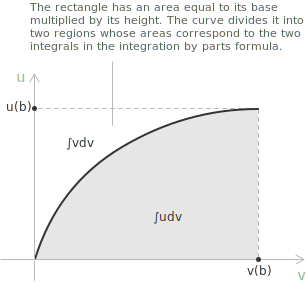

## The method of integration by parts

Integration by parts rewrites the integral of a product of two [functions](../functions/) by transferring a derivative from one factor to the other. For [indefinite integrals](../indefinite-integrals/), the formula is:

$$\int f(x)g'(x) \ dx = f(x)g(x) - \int f'(x)g(x) \ dx + c$$

For [definite integrals](../definite-integrals/), the formula is:

$$\int_a^b f(x)g'(x) \ dx = [f(x)g(x)]_a^b - \int_a^b f'(x)g(x) \ dx$$

The bracket $[f(x)g(x)]_a^b = f(b)g(b) - f(a)g(a)$ is the boundary term and must be evaluated explicitly. In both cases, $f$ and $g$ are assumed to be continuously differentiable on the [interval](../intervals/) of integration. The choice of which factor to differentiate determines whether the remaining integral is simpler than the original.

> The formula can be applied more than once. Each application has a new product term and a new integral, so the signs should be simplified before the next application.

## Derivation of the formula

The integration by parts formula is a rearrangement of the [product rule](../differentiation-rules/):

$$\frac{d}{dx}(f(x)g(x)) = f'(x)g(x) + f(x)g'(x)$$

Integrating both sides with respect to $x$ gives:

$$\int \frac{d}{dx}(f(x)g(x)) \ dx = \int f'(x)g(x) \ dx + \int f(x)g'(x) \ dx$$

The left-hand side has $f(x)g(x)$ as an antiderivative. Choosing one representative from each family of antiderivatives gives:

$$f(x)g(x) = \int f'(x)g(x) \ dx + \int f(x)g'(x) \ dx$$

Solving for the second integral gives the integration by parts formula:

$$\int f(x)g'(x) \ dx = f(x)g(x) - \int f'(x)g(x) \ dx + c$$

With $u = f(x)$ and $dv = g'(x) \ dx,$ the formula is:

$$\int u \ dv = uv - \int v \ du$$

> The new integral is simpler when differentiation reduces one factor and the other factor has an elementary antiderivative. Otherwise, a different assignment or a different integration method is needed.

## Geometric interpretation

The derivation from the product rule is sufficient to prove the formula. The purpose of this section is to make the formula more intuitive and concrete by interpreting its terms as [areas in the plane](../finding-areas-by-integration/). This interpretation is valid under stronger hypotheses than the formula itself. Let $a < b,$ and suppose that the real-valued functions $u,v\colon [a,b] \to \mathbb{R}$ are continuously differentiable, [strictly increasing](../increasing-and-decreasing-functions/), and satisfy $u(a) = v(a) = 0.$ These conditions imply that $u$ and $v$ are nonnegative on $[a,b].$ In this section, the differential notation abbreviates the corresponding integrals with respect to $x:$

$$
\begin{align}
\int_a^b u \ dv &= \int_a^b u(x)v'(x) \ dx \\[6pt]
\int_a^b v \ du &= \int_a^b v(x)u'(x) \ dx
\end{align}
$$

The parametric curve $x \mapsto (v(x),u(x))$ joins $(0,0)$ to $(v(b),u(b)).$ Since both functions are strictly increasing, each has an [inverse](../inverse-function/) on its image. The curve is therefore the graph of an increasing function when either $u$ or $v$ is used as the independent coordinate. It divides the rectangle $[0,v(b)] \times [0,u(b)]$ into two regions.

Vertical slices give the area of the lower region:

$$A_1 = \int_0^{v(b)} u(v^{-1}(t)) \ dt = \int_a^b u(x)v'(x) \ dx = \int_a^b u \ dv$$

Horizontal slices give the area of the upper-left region:

$$A_2 = \int_0^{u(b)} v(u^{-1}(s)) \ ds = \int_a^b v(x)u'(x) \ dx = \int_a^b v \ du$$

The two regions have disjoint interiors and fill the rectangle, whose area is $u(b)v(b).$ Their areas therefore satisfy:

$$\int_a^b u \ dv + \int_a^b v \ du = u(b)v(b)$$

Rearranging this equality gives:

$$\int_a^b u \ dv = u(b)v(b) - \int_a^b v \ du$$

Since $u(a)v(a) = 0,$ the factor $u(b)v(b)$ is the boundary term $[uv]_a^b.$ Nonzero initial values have the same interpretation under the same differentiability and strict monotonicity assumptions when $u(a),v(a) \geq 0.$ Define $R_t = [0,v(t)] \times [0,u(t)]$ for $t \in \{a,b\}.$ Strict monotonicity gives $R_a \subset R_b,$ and the area of $R_b \setminus R_a$ is:

$$u(b)v(b) - u(a)v(a) = [uv]_a^b$$

The curve segment from $(v(a),u(a))$ to $(v(b),u(b))$ divides this difference into regions of areas $\int_a^b u \ dv$ and $\int_a^b v \ du.$ The resulting identity is the definite integration by parts formula with its full boundary term.

> Monotonicity and nonnegativity are assumptions for this interpretation as ordinary area, not for the integration by parts formula. If $u$ or $v$ changes sign or direction, the planar regions no longer give two disjoint unsigned areas. For arbitrary real-valued functions $u,v \in C^1([a,b]),$ the integrals are signed quantities and the formula still follows from the product rule.

## How to choose $u$ and $dv$

The new integral $\int v \ du$ should be simpler than the original. Two conditions guide the assignment of $u$ and $dv:$

+ Choose $u$ as the factor that becomes simpler when differentiated.
+ Choose $dv$ as the remaining factor, so that $v = \int dv$ can be computed directly.

- - -

The LIATE heuristic gives the following initial order for the selection of $u:$

+ Logarithmic functions
+ Inverse trigonometric functions
+ Algebraic expressions
+ Trigonometric functions
+ Exponential functions

The derivatives of [logarithmic](../logarithmic-function/) and inverse trigonometric functions are often simpler than the original functions, so these factors are common choices for $u.$ An [exponential function](../exponential-function/) of the form $e^{kx},$ where $k \neq 0$ is constant, has the antiderivative $e^{kx}/k,$ so it is often assigned to $dv.$

> LIATE is a heuristic, not a theorem. If its suggested assignment gives a harder integral, choose a different assignment or use another method.

## Most common mistakes

Four errors recur in applications of integration by parts.

An unsuitable assignment may give a $dv$ with no elementary antiderivative, or it may make the remaining integral $\int v \ du$ harder than the original. In either case, choose a different assignment.

In the definite integral formula, the boundary term $[uv]_a^b$ must be evaluated explicitly. If it is omitted, the equality is false unless the boundary term is zero.

The derivatives of $\sin(x)$ and $\cos(x)$ introduce alternating signs in cyclic applications. Write $du$ before substituting into the formula so that each minus sign remains explicit.

In the indefinite case, one constant of integration $c$ must be present in the result. Constants from intermediate antiderivatives are absorbed into this constant, so $c$ can be added after the last algebraic simplification.

## Example 1

Consider the integral on an interval contained in $(0,\infty):$

$$\int x^2\ln(x) \ dx$$

The integrand has a logarithmic factor and a [power](../powers/) of $x.$ Differentiating $\ln(x)$ gives $1/x,$ while $x^2$ has an elementary antiderivative. Set $f(x) = \ln(x)$ and $g'(x) = x^2:$

$$f(x) = \ln(x) \quad \rightarrow \quad f'(x) = \frac{1}{x}$$

$$g'(x) = x^2 \quad \rightarrow \quad g(x) = \frac{x^3}{3}$$

The formula gives:

$$
\begin{align}
\int x^2\ln(x) \ dx &= \frac{x^3}{3}\ln(x) - \int \frac{x^3}{3x} \ dx + c \\[6pt]
                     &= \frac{x^3}{3}\ln(x) - \int \frac{x^2}{3} \ dx + c
\end{align}
$$

The remaining integral has the power-rule antiderivative $x^3/9.$ The antiderivative is therefore:

$$\frac{x^3}{3}\ln(x) - \frac{x^3}{9} + c$$

After factoring $x^3/3,$ the result is:

$$\int x^2\ln(x) \ dx = \frac{x^3}{3}\left(\ln(x) - \frac{1}{3}\right) + c$$

## Example 2

A second application of integration by parts may reproduce the original integral. The integral then satisfies an algebraic equation. Consider:

$$\int e^x\sin(x) \ dx$$

Denote the integral by $I:$

$$I = \int e^x\sin(x) \ dx$$

Since the exponential factor $e^x$ has the antiderivative $e^x$ and $\sin(x)$ has the derivative $\cos(x),$ choose $u = \sin(x)$ and $dv = e^x \ dx.$ The derivative and antiderivative are:

$$du = \cos(x) \ dx \qquad v = e^x$$

The formula gives:

$$I = e^x\sin(x) - \int e^x\cos(x) \ dx$$

The new integral still has the product of $e^x$ and a [trigonometric function](../sine-and-cosine/). A second application of integration by parts is needed. Define:

$$J = \int e^x\cos(x) \ dx$$

Use $u = \cos(x)$ and $dv = e^x \ dx$ in this integral. The derivative and antiderivative are:

$$du = -\sin(x) \ dx \qquad v = e^x$$

The formula gives:

$$J = e^x\cos(x) + \int e^x\sin(x) \ dx = e^x\cos(x) + I$$

The original integral $I$ has reappeared. Substitution in the equation for $I$ gives:

$$I = e^x\sin(x) - (e^x\cos(x) + I)$$

Adding $I$ to both sides gives:

$$2I = e^x\sin(x) - e^x\cos(x)$$

Since the coefficient of $I$ is $2,$ we divide both sides by $2$ and add the constant of integration:

$$I = \frac{e^x}{2}(\sin(x) - \cos(x)) + c$$

> If the original integral returns with a nonzero net coefficient, the result is a [linear equation](../linear-equations/) in $I.$ Its solution is determined up to the constant of integration.

## Example 3

Consider the [improper definite integral](../improper-integrals/):

$$\int_0^1 x\ln(x) \ dx$$

For $\varepsilon \in (0,1),$ the integrand is [continuous](../continuous-functions/) on $[\varepsilon,1].$ Differentiating $\ln(x)$ gives $1/x,$ while $x$ has an elementary antiderivative. Set $f(x) = \ln(x)$ and $g'(x) = x:$

$$f(x) = \ln(x) \quad \rightarrow \quad f'(x) = \frac{1}{x}$$

$$g'(x) = x \quad \rightarrow \quad g(x) = \frac{x^2}{2}$$

The definite integral formula on $[\varepsilon,1]$ gives:

$$
\begin{align}
\int_\varepsilon^1 x\ln(x) \ dx &= \left[\frac{x^2}{2}\ln(x)\right]_\varepsilon^1 - \int_\varepsilon^1 \frac{x^2}{2x} \ dx \\[6pt]
                                  &= \left[\frac{x^2}{2}\ln(x)\right]_\varepsilon^1 - \frac{1}{2}\int_\varepsilon^1 x \ dx
\end{align}
$$

The improper integral is the limit as $\varepsilon \to 0^+.$ Since $\ln(1) = 0$ and $\varepsilon^2\ln(\varepsilon) \to 0,$ the boundary term has limit:

$$\lim_{\varepsilon \to 0^+}\left[\frac{x^2}{2}\ln(x)\right]_\varepsilon^1 = 0$$

The power rule gives the limit of the remaining integral:

$$\lim_{\varepsilon \to 0^+}\frac{1}{2}\int_\varepsilon^1 x \ dx = \frac{1}{4}$$

Therefore:

$$\int_0^1 x\ln(x) \ dx = -\frac{1}{4}$$

> The [limit](../limits/) $\lim_{x \to 0^+} x^2\ln(x) = 0$ follows directly from the substitution $x = e^{-t}.$ As $x \to 0^+,$ one has $t \to \infty$ and $x^2\ln(x) = -te^{-2t} \to 0.$

## Decision procedure

For an integral that contains a product of two factors, use the following procedure.

+ Identify the integrand as a product $u(x)v'(x).$ If no useful product is visible, first try expansion, factoring, [trigonometric identities](../trigonometric-identities/), or [partial fractions](../partial-fraction-decomposition/), and then reassess whether integration by parts applies.
+ Use LIATE as an initial guide for choosing $u$ and $dv.$ Confirm that $u$ becomes simpler when differentiated and that $v = \int dv$ can be computed directly.
+ Compute $du = u'(x) \ dx$ and $v = \int dv.$
+ Apply the compact formula:

$$\int u \ dv = uv - \int v \ du$$

+ Examine the new integral $\int v \ du.$ Three outcomes are possible:

The first outcome is that the new integral is harder than the original. In this case, return to the choice of $u$ and $dv$ and try a different assignment. If no assignment gives a simpler integral, use another method.

The second outcome is that the original integral reappears, possibly after another application of the formula. Collecting all occurrences of the integral on one side gives a linear equation. The equation is solvable when the resulting coefficient of the integral is nonzero.

The third outcome is that the new integral has a standard antiderivative or requires another application of integration by parts. In the definite case, evaluate the boundary term $[uv]_a^b = u(b)v(b) - u(a)v(a)$ and the remaining definite integral. In the indefinite case, evaluate the remaining integral and add one constant of integration $c$ after the last algebraic simplification.

> When the integrand is a rational expression in $\sin(x)$ and $\cos(x)$ rather than a product suited to integration by parts, the [Weierstrass substitution](../the-weierstrass-substitution/) or a [direct substitution](../integration-by-substitution/) such as $u = \sin(x)$ or $u = \cos(x)$ may give an [integral of a rational function](../integral-of-rational-functions/).
