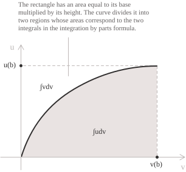

## The method of integration by parts

Together with [integration by substitution](../integration-by-substitution/), integration by parts is one of the most useful techniques for reducing an integral that is not entirely straightforward to a simpler form, through a series of rearrangements designed to transfer differentiation from one factor to the other, so that the new integral has an antiderivative that is easier to determine than one for the original integral. The method generally applies to integrals of the following form:

$$\int f(x)g'(x) \ dx $$

With a suitable rearrangement, these integrals can be written as follows:

$$\int u \ dv = uv - \int v \ du \tag{1}$$

In general, this method is less straightforward than substitution because the difficulty lies precisely in choosing $u$ and $dv$ appropriately so that the resulting integral is simpler. A typical application of the method is given by the following integral:

$$\int x e^x\,dx$$

This integral can be rewritten by setting $u=x$ and $dv=e^x\,dx$, which gives $du=dx$ and $v=e^x.$ Applying $(1)$ gives:

$$\begin{aligned}  \int xe^x\,dx &= xe^x-\int e^x\,dx \\[6pt] &= xe^x-e^x+C \\[12pt]  &= e^x(x-1)+C \end{aligned}$$

For [indefinite integrals](../indefinite-integrals/), the formula is:

$$\int f(x)g'(x) \ dx = f(x)g(x) - \int f'(x)g(x) \ dx + c \tag{2}$$

For [definite integrals](../definite-integrals/), we must, as one would expect, take the limits of integration into account.

$$\int_a^b f(x)g'(x) \ dx = [f(x)g(x)]_a^b - \int_a^b f'(x)g(x) \ dx \tag{3}$$

The method can be applied several times with the aim of obtaining a simpler integral at each iteration, and it can also be alternated, where useful and possible, with substitution.

- - -

Formula $(1)$ is derived from the [product rule](../differentiation-rules/) for differentiation. We begin with:

$$\frac{d}{dx}(f(x)g(x)) = f'(x)g(x) + f(x)g'(x)$$

Integrating both sides with respect to $x$ gives:

$$\int \frac{d}{dx}(f(x)g(x)) \ dx = \int f'(x)g(x) \ dx + \int f(x)g'(x) \ dx \tag{4}$$

An antiderivative of the integrand on the left-hand side is simply $f(x)g(x)$, so we can rewrite the preceding expression as:

$$f(x)g(x) = \int f'(x)g(x) \ dx + \int f(x)g'(x) \ dx$$

Moving the terms from one side of the equals sign to the other gives the integration-by-parts formula:

$$\int f(x)g'(x) \ dx = f(x)g(x) - \int f'(x)g(x) \ dx + c$$

Finally, setting $u = f(x)$ and $dv = g'(x) \ dx,$ the formula becomes precisely $(1)$:

$$\int u \ dv = uv - \int v \ du$$

When applying the method, we must always check that the resulting integral is actually simpler than the original one. This generally happens when differentiation simplifies one of the factors and the other has an elementary antiderivative. Otherwise, we risk obtaining an even more complicated integral instead of simplifying the calculation, and the path we have taken is probably not the most effective. In any case, as with integration by substitution, experience will make it almost second nature to find an effective substitution that makes the integral easy to evaluate.

## Geometric interpretation

We generally tend to accept a priori the results presented in mathematical theory, and in some respects this is a good thing. It means that we place genuine trust in those who came before us, but it is also proof that the instinct for self-preservation inherent in each of us is doing its job. Otherwise, most of us would probably go mad.

There are, however, some things worth exploring in greater depth because they are sometimes omitted from traditional curricula, yet they make certain formulas intuitive and concrete. This is the case with the geometric interpretation of the integration-by-parts formula, which interprets the terms of the formula as [areas in the plane](../finding-areas-by-integration/).

Consider two points $a$ and $b$ such that $a < b,$ and let $u,v\colon [a,b] \to \mathbb{R}$ be [real-valued functions](../functions/), continuously differentiable, [strictly increasing](../increasing-and-decreasing-functions/), and such that $u(a) = v(a) = 0$, so that $u$ and $v$ are nonnegative throughout $[a,b].$ We can write:

$$
\begin{align}
\int_a^b u \ dv &= \int_a^b u(x)v'(x) \ dx \\[6pt]
\int_a^b v \ du &= \int_a^b v(x)u'(x) \ dx
\end{align}
$$

The parametric curve $x \mapsto (v(x),u(x))$ joins the origin to the point $(v(b),u(b))$ and divides the rectangle $[0,v(b)] \times [0,u(b)]$ into two regions.

The area of the lower region is given by the following integral:

$$A_1 = \int_0^{v(b)} u(v^{-1}(t)) \ dt = \int_a^b u(x)v'(x) \ dx = \int_a^b u \ dv$$

The area of the upper region, on the other hand, is given by:

$$A_2 = \int_0^{u(b)} v(u^{-1}(s)) \ ds = \int_a^b v(x)u'(x) \ dx = \int_a^b v \ du$$

Since the two regions fill the rectangle, we have:

$$\int_a^b u \ dv + \int_a^b v \ du = u(b)v(b)$$

Rearranging this equality gives:

$$\int_a^b u \ dv = u(b)v(b) - \int_a^b v \ du \tag{5}$$

Since $u(a)=v(a)=0,$ we have:

$$[uv]_a^b=u(b)v(b)$$

Equality $(5)$ therefore becomes precisely the integration-by-parts formula we saw above:

$$\int_a^b u \ dv = [uv]_a^b - \int_a^b v \ du$$

> The assumptions that the functions are strictly increasing and nonnegative allow the two integrals to be interpreted as unsigned geometric areas, but they are not necessary for the validity of the general formula. Indeed, if $u$ or $v$ changes sign or is not increasing, this construction no longer provides, in general, two separate regions whose areas coincide with the two integrals.

## How to choose $u$ and $dv$

We have said several times so far that, for the method to be genuinely useful, its application must make the resulting integral simpler than the original one. But how can $u$ and $dv$ be chosen so that they are actually useful for our purpose? In principle, we can identify two ways of making this choice:

+ Take $u$ to be the factor that becomes simpler when differentiated.
+ Take $dv$ to be the remaining factor, so that $v = \int dv$ can be calculated directly.

The LIATE heuristic suggests an order in which to try possible choices for $u.$ The order is:

+ Logarithmic functions
+ Inverse trigonometric functions
+ Algebraic functions
+ Trigonometric functions
+ [Exponential functions](../exponential-function/)

Be careful, however, because this rule is not always useful. In general, a [logarithmic](../logarithmic-function/) factor or an inverse trigonometric function is often chosen as $u,$ because differentiation tends to simplify its form. However, if the choice produces a more difficult integral, the problem must be approached differently, by making another substitution or using another method. Unfortunately, that is the nature of integrals, but the good news is that they require more practice than intuition, and with regular practice the substitutions will come readily and naturally.

- - -

Some fairly typical errors recur in applications of integration by parts, the most common being a choice of factors that makes the original integral more complicated instead of simplifying it.

In the indefinite case, the constant of integration must always appear in the result. Constants arising from intermediate antiderivatives can be absorbed into this constant, so a single $c$ may be added after the final algebraic simplification.

For definite integrals, the boundary term $[uv]_a^b$ must be evaluated explicitly, a step that is often overlooked. If it is omitted, equality $(3)$ holds only when the boundary term is zero (a condition that cannot be taken for granted).

When a trigonometric function is chosen as $u,$ the differential $du$ must be calculated carefully. The derivative of $\sin(x)$ is $\cos(x),$ whereas the derivative of $\cos(x)$ is $-\sin(x),$ which produces an inevitable alternation of signs in successive differentiations. Writing $du$ explicitly before applying the formula prevents sign errors.

## Example 1

We now put the method into practice with some examples. We begin by considering the following integral:

$$\int x^2\ln(x) \ dx$$

The integrand contains the product of a [power](../powers/) and a logarithm. Both factors have elementary antiderivatives, and the choice is fairly straightforward. Set:

$$f(x) = \ln(x) \quad \rightarrow \quad f'(x) = \frac{1}{x}$$

$$g'(x) = x^2 \quad \rightarrow \quad g(x) = \frac{x^3}{3}$$

Applying formula $(2)$ gives:

$$
\begin{align}
\int x^2\ln(x) \ dx &= \frac{x^3}{3}\ln(x) - \int \frac{x^3}{3x} \ dx + c \\[6pt]
                     &= \frac{x^3}{3}\ln(x) - \int \frac{x^2}{3} \ dx + c\\[6pt]
                     & = \frac{x^3}{3}\ln(x) - \frac{x^3}{9} + c
\end{align}
$$

Now we only need to factor out the common term to obtain:

$$\frac{x^3}{3}\left(\ln(x) - \frac{1}{3}\right) + c$$

## Example 2

We now give another example showing how a second application of integration by parts can lead back to the original integral. Consider, for example, the following integral:

$$\int e^x\sin(x) \ dx$$

Denote this integral by $I.$ Since the factor $e^x$ has $e^x$ as an antiderivative and $\sin(x)$ has $\cos(x)$ as its derivative, choose $u = \sin(x)$ and $dv = e^x \ dx.$ Calculating the derivative and the antiderivative gives:

$$du = \cos(x) \ dx \qquad v = e^x$$

Using formula $(2)$, we write:

$$I = e^x\sin(x) - \int e^x\cos(x) \ dx$$

Notice that the new integral still contains the product of $e^x$ and a [trigonometric function](../sine-and-cosine/), so integration by parts must be applied a second time by defining:

$$J = \int e^x\cos(x) \ dx$$

Choose $u = \cos(x)$ and $dv = e^x \ dx$ and calculate the derivative and the antiderivative:

$$du = -\sin(x) \ dx \qquad v = e^x$$

Again using formula $(2)$, we write:

$$J = e^x\cos(x) + \int e^x\sin(x) \ dx = e^x\cos(x) + I$$

The original integral $I$ has reappeared. Substituting the expression for $J$ into the equation for $I$ gives:

$$I = e^x\sin(x) - (e^x\cos(x) + I)$$

Adding $I$ to both sides gives:

$$2I = e^x\sin(x) - e^x\cos(x)$$

Therefore:

$$I = \frac{e^x}{2}(\sin(x) - \cos(x)) + c$$

## Example 3

We now consider the following [improper integral](../improper-integrals/):

$$\int_0^1 \ln(x) \ dx$$

We can regard the integral as the product of a logarithm and a constant function equal to 1. Differentiating $\ln(x)$ simply gives $1/x,$ whereas an antiderivative of the constant function $1$ is $x.$ We therefore make the following substitution:

$$f(x) = \ln(x) \quad \rightarrow \quad f'(x) = \frac{1}{x}$$

$$g'(x) = 1 \quad \rightarrow \quad g(x) = x$$

To exclude the singular endpoint $0,$ we choose $\varepsilon \in (0,1)$ and apply formula $(3)$ over the [interval](../intervals/) $[\varepsilon,1]:$

$$
\begin{align}
\int_\varepsilon^1 \ln(x) \ dx &= [x\ln(x)]_\varepsilon^1 - \int_\varepsilon^1 \frac{x}{x} \ dx \\[6pt]
                                  &= [x\ln(x)]_\varepsilon^1 - \int_\varepsilon^1 1 \ dx
\end{align}
$$

As we know, the improper integral is the [limit](../limits/) as $\varepsilon \to 0^+.$ Since $\ln(1) = 0$ and $\varepsilon\ln(\varepsilon) \to 0,$ the limit of the first term is:

$$\lim_{\varepsilon \to 0^+}[x\ln(x)]_\varepsilon^1 = 0$$

The limit of the integral, on the other hand, is:

$$\lim_{\varepsilon \to 0^+}\int_\varepsilon^1 1 \ dx = 1$$

Therefore, we obtain:

$$\int_0^1 \ln(x) \ dx = -1$$

## Selection procedure

We have seen so far that, when the integrand is the product of two factors, we can use the following integration-by-parts procedure, applying it as described below.

We first identify the integrand as the product $u(x)v'(x).$ If no product is apparent at first sight, we can try to manipulate the original integral by factoring it, using [trigonometric identities](../trigonometric-identities/), or resorting to [partial fraction decomposition](../partial-fraction-decomposition/), and then reassess whether integration by parts is applicable.

Once the integral has been reduced to a product of factors compatible with the method, the LIATE procedure is used as an initial guide for choosing $u$ and $dv.$ The first criterion is to check that differentiation simplifies the factor $u$ and that $v = \int dv$ can be calculated directly. The first condition is not necessary when further applications reproduce the original integral or yield a reduction formula.

We then calculate $du = u'(x) \ dx$ and $v = \int dv$ and apply formula $(1).$ At this point, we examine the new integral $\int v \ du$ and the following cases may arise.

+ The new integral is more difficult than the original one. We then return to the choice of $u$ and $dv$ and try a different choice. If no choice simplifies the calculation or produces a useful relation with the original integral, another method must be used.

+ The original integral reappears, as in Example 2, possibly after another application of the formula. Collecting all occurrences of the integral on one side gives a [linear equation](../linear-equations/) that can be solved when the coefficient of the integral is nonzero.

+ Finally, the integrand of the new integral has a known antiderivative, or the new integral requires another application of integration by parts. In the definite case, we calculate the boundary term $[uv]_a^b = u(b)v(b) - u(a)v(a)$ and the remaining definite integral. In the indefinite case, we calculate the remaining integral and add a single constant of integration $c$ after the final algebraic simplification.

Note: when the integrand is a rational expression in $\sin(x)$ and $\cos(x)$, the [Weierstrass substitution](../the-weierstrass-substitution/) or a [direct substitution](../integration-by-substitution/) such as $u = \sin(x)$ or $u = \cos(x)$ may produce an [integral of a rational function](../integral-of-rational-functions/).

Finally, for some families of integrals parametrized by an integer exponent, integration by parts yields an integral in the same family with a lower index, and the resulting relation is a [reduction formula](../reduction-formulas/) to be applied until a base case is reached.
