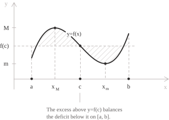

## Statement

Let $f$ be a [continuous function](../continuous-functions/) on a closed and bounded [interval](../intervals/) $[a, b]$ with $a < b.$ Then there exists a point $c \in [a, b]$ such that:

$$\int_a^b f(x) \ dx = f(c)(b - a)$$

The [definite integral](../definite-integrals/) of $f$ over the interval coincides with the integral of the constant function with value $f(c)$ over the same interval. When $f$ is nonnegative, the identity says that the [region between the graph and the horizontal axis](../finding-areas-by-integration/) has the same area as a rectangle of base $b - a$ and height $f(c).$ The identity can also be written as:

$$\int_a^b (f(x) - f(c)) \ dx = 0$$

The total excess of $f$ above $f(c)$ therefore equals its total deficit below $f(c)$ on $[a, b].$ In the figure, $M = f(x_M)$ is the maximum value of $f$ on the interval, and $m = f(x_m)$ is its minimum value.

> The only hypothesis on $f$ is continuity. [Differentiability](../derivatives/) is not required, and the conclusion remains valid when $f$ is nowhere differentiable on $(a, b).$

## Proof

A continuous function on a closed and bounded interval is Riemann-integrable. By the [Weierstrass theorem](../weierstrass-theorem/), $f$ also attains a [minimum and a maximum](../maximum-minimum-and-inflection-points/) on $[a, b],$ say at the points $x_m$ and $x_M:$

$$m = f(x_m) \qquad M = f(x_M)$$

Every value of $f$ lies between these two numbers, so $m \leq f(x) \leq M$ for every $x \in [a, b].$ The comparison property of definite integrals, applied to the constant functions $m$ and $M,$ gives:

$$m(b - a) \leq \int_a^b f(x) \ dx \leq M(b - a)$$

Dividing by the positive number $b - a$ gives:

$$m \leq \frac{1}{b - a} \int_a^b f(x) \ dx \leq M$$

Denote by $\mu$ the middle term. The number $\mu$ lies between $f(x_m)$ and $f(x_M),$ two values that $f$ actually takes. By the [intermediate value theorem](../intermediate-value-theorem/), there is a point $c$ in the closed interval with endpoints $x_m$ and $x_M$ such that $f(c) = \mu.$ Since $x_m$ and $x_M$ both belong to $[a, b],$ so does $c.$ Multiplying $f(c) = \mu$ by $b - a$ gives the identity of the statement.

Besides Riemann integrability, the proof uses two consequences of continuity. The bounds $m$ and $M$ are values of the function, and the function takes every value between them.

- - -

The point can always be chosen inside the open interval $(a, b).$ Suppose first that $m < \mu < M.$ Then $f(x_m) \neq \mu$ and $f(x_M) \neq \mu,$ so the point $c$ given by the intermediate value theorem lies strictly between $x_m$ and $x_M.$ Both of these points belong to $[a, b],$ hence $c \in (a, b).$

Suppose instead that $\mu = M.$ The function $M - f$ is continuous and nonnegative on $[a, b],$ and its integral is $M(b - a) - \mu(b - a) = 0.$ If $M - f$ were positive at some $x_0,$ continuity would give a subinterval $J \subseteq [a, b]$ of positive length $\ell$ on which:

$$M - f(x) \geq \frac{1}{2}(M - f(x_0)).$$ 
It would follow that:

$$\int_a^b (M - f(x)) \ dx \geq \int_J (M - f(x)) \ dx \geq \frac{M - f(x_0)}{2} \ell > 0$$

This contradicts the fact that the integral is zero. Hence $f$ is constant and equal to $M,$ and every interior point satisfies $f(c) = \mu.$ The case $\mu = m$ is symmetric.

## The average value of a function

For a [Riemann-integrable](../riemann-integrability-criteria/) function $f$ on $[a, b],$ the quantity in the proof is the average value of $f$ on the interval, also called its integral mean:

$$\mu = \frac{1}{b - a} \int_a^b f(x) \ dx$$

With this terminology the theorem says that a continuous function attains its average value at some point of the interval.

The definition extends the [arithmetic mean](../arithmetic-mean/) from finite lists of numbers to functions of a continuous variable, and the passage from one to the other is a limit of Riemann sums. Split $[a, b]$ into $n$ parts of equal length $\Delta x = (b - a)/n,$ and sample $f$ at the right endpoint $x_k = a + k \Delta x$ of each part. Since $\Delta x/(b - a) = 1/n,$ the arithmetic mean of the $n$ sampled values can be rewritten as:

$$\frac{1}{n} \sum_{k=1}^{n} f(x_k) = \frac{1}{b - a} \sum_{k=1}^{n} f(x_k) \Delta x$$

The expression on the right is a Riemann sum of $f$ on $[a, b],$ divided by the length of the interval. As $n \to \infty,$ it converges to $\mu.$ Hence the average value is the limit of the arithmetic means of increasingly fine samples. This construction extends the [notion of mean](../introduction-to-the-mean/) from finite samples to a function on an interval.

If $t_1 < t_2$ and $v(t)$ is the [velocity](../velocity/) of a point moving along a line, the integral of $v$ over $[t_1, t_2]$ is the displacement in that time interval. The average velocity over the interval is:

$$\mu = \frac{1}{t_2 - t_1} \int_{t_1}^{t_2} v(t) \ dt$$

This value is the constant velocity that would produce the same displacement in the same time. When the velocity is continuous, there is an instant $c \in [t_1, t_2]$ at which $v(c) = \mu.$

## The two mean value theorems

Two distinct results share almost the same name but have different hypotheses and conclusions. [Lagrange's theorem](../lagrange-theorem/), commonly called the mean value theorem, assumes that $f$ is continuous on $[a, b]$ and differentiable on $(a, b),$ and gives a point where the derivative equals the [average rate of change](../difference-quotient/):

$$f'(c) = \frac{f(b) - f(a)}{b - a}$$

The mean value theorem for integrals assumes only that $f$ is continuous on $[a, b],$ and its conclusion is that the function equals its average value at some point:

$$f(c) = \frac{1}{b - a} \int_a^b f(x) \ dx$$

The conclusions concern different quantities. Lagrange's theorem compares $f'(c)$ with the secant slope determined by $f(a)$ and $f(b).$ The integral theorem compares $f(c)$ with the average obtained by integrating $f$ over the whole interval. The hypotheses reflect this distinction. Lagrange's theorem requires differentiability, whereas the integral theorem requires continuity of the integrand.

The link between them is the [fundamental theorem of calculus](../fundamental-theorem-of-calculus/). Let $f$ be continuous on $[a, b]$ and let $F$ be any [antiderivative](../indefinite-integrals/) of $f.$ The endpoint formula gives $\int_a^b f(x) \ dx = F(b) - F(a),$ so the identity of the integral version becomes:

$$F(b) - F(a) = F'(c)(b - a)$$

This is Lagrange's theorem applied to $F.$ Conversely, Lagrange's theorem applied to an antiderivative of a continuous $f$ gives the integral theorem. For a function $F$ with a continuous derivative, the two theorems are therefore equivalent. This equivalence does not extend to every function that is continuous on $[a, b]$ and differentiable on $(a, b).$ Lagrange's theorem still applies when $F'$ is discontinuous or unbounded, whereas the integral theorem requires a continuous integrand.

## What happens without continuity

For a bounded [Riemann-integrable](../riemann-integrability-criteria/) function the same inequalities hold, with the [infimum and supremum](../supremum-and-infimum/) in place of the minimum and maximum:

$$\inf_{[a, b]} f \leq \frac{1}{b - a} \int_a^b f(x) \ dx \leq \sup_{[a, b]} f$$

The average value remains defined and lies between these bounds, but the function need not attain it. Consider the following function on $[0, 2]:$

$$
f(x) = \begin{cases} 0 & \text{if } 0 \leq x < 1 \\[6pt] 1 & \text{if } 1 \leq x \leq 2 \end{cases}
$$

It is bounded and has a single [discontinuity](../discontinuities-of-real-functions/), hence it is Riemann-integrable, and its integral over $[0, 2]$ equals $1.$ The average value is therefore $1/2,$ but the function never takes this value because its range is $\{\ 0, 1 \ \}.$ Thus boundedness and Riemann integrability do not suffice for the conclusion.

This function attains its infimum and supremum, so the extremal-value step of the proof remains valid. The missing step is the intermediate value property. Without it, the fact that the average lies between the bounds does not imply that it belongs to the range of $f.$

> Continuity is sufficient here, not necessary. The proof applies to any Riemann-integrable function that attains its extrema and has the intermediate value property. [Darboux's theorem](../darboux-theorem/) shows that the latter property can hold without continuity. Every derivative has the intermediate value property, even when the derivative is discontinuous.

## The weighted form

The theorem also has a form in which the values of $f$ are averaged against a weight. Let $f$ be continuous on $[a, b]$ and let $g$ be Riemann-integrable and nonnegative on the same interval. Then there exists $c \in [a, b]$ such that:

$$\int_a^b f(x) g(x) \ dx = f(c) \int_a^b g(x) \ dx$$

The choice $g(x) = 1$ recovers the statement of the first section. The proof follows the same two steps. Multiplying the inequalities $m \leq f(x) \leq M$ by the nonnegative number $g(x)$ preserves their direction:

$$m g(x) \leq f(x) g(x) \leq M g(x)$$

The product $fg$ is Riemann-integrable, and integrating the three terms gives:

$$m \int_a^b g(x) \ dx \leq \int_a^b f(x) g(x) \ dx \leq M \int_a^b g(x) \ dx$$

Write $G = \int_a^b g(x) \ dx,$ a nonnegative number since $g \geq 0.$ If $G = 0,$ the preceding inequalities imply that the integral of $fg$ is zero, so the identity holds for every choice of $c.$ If $G > 0,$ dividing by $G$ places the quotient between $m$ and $M,$ and the intermediate value theorem gives a point $c$ with:

$$f(c) = \frac{1}{G} \int_a^b f(x) g(x) \ dx$$

When $g$ is nonpositive throughout the interval, $-g$ is nonnegative. We apply the nonnegative case to $-g$ and multiply the resulting identity by $-1.$ Thus the result holds for weights of either constant sign.

> The sign condition cannot be removed. On $[-1, 1]$ take $f(x) = x$ and $g(x) = x.$ The left-hand side is $\int_{-1}^{1} x^2 \ dx = 2/3,$ while $\int_{-1}^{1} x \ dx = 0,$ so the right-hand side is zero for every $c.$

- - -

The statement above is the first mean value theorem for integrals. In the second form, [monotonicity](../increasing-and-decreasing-functions/) replaces the constant-sign hypothesis on $g,$ and $f$ need only be Riemann-integrable. Under these hypotheses there exists $\xi \in [a, b]$ such that:

$$\int_a^b f(x) g(x) \ dx = g(a) \int_a^{\xi} f(x) \ dx + g(b) \int_{\xi}^b f(x) \ dx$$

This form is used in proofs of the [Dirichlet and Abel tests](../convergence-tests-for-improper-integrals/) for the convergence of [improper integrals](../improper-integrals/) with an oscillating integrand.

## Use in the fundamental theorem of calculus

The mean value theorem expresses the difference quotient of an accumulation function as a value of the integrand. Let $f$ be continuous on $[a, b]$ and define:

$$F(x) = \int_a^x f(t) \ dt$$

Fix $x \in (a, b)$ and take $h \neq 0$ small enough that $x + h \in [a, b].$ Additivity of the integral over adjacent intervals gives:

$$F(x + h) - F(x) = \int_x^{x + h} f(t) \ dt$$

By the mean value theorem on the interval with endpoints $x$ and $x + h,$ there is a point $c_h$ between them for which the integral equals $f(c_h) h.$ Therefore:

$$\frac{F(x + h) - F(x)}{h} = f(c_h)$$

Since $c_h$ lies between $x$ and $x + h,$ we have $|c_h - x| \leq |h|,$ and hence $c_h \to x$ as $h \to 0.$ Continuity of $f$ gives $f(c_h) \to f(x),$ and the difference quotient converges to $f(x).$ This proves $F'(x) = f(x),$ the first statement of the [fundamental theorem of calculus](../fundamental-theorem-of-calculus/).

> For $h < 0$ the interval of integration is $[x + h, x].$ With the orientation convention $\int_x^{x + h} f(t) \ dt = -\int_{x + h}^{x} f(t) \ dt,$ the identity $\int_{x + h}^{x} f(t) \ dt = f(c_h)(-h)$ gives the same difference quotient, so the two cases need not be treated separately.

## Example 1

We look for the average value of the [square root function](../radicals/) on $[0, 9]$ and for a point where that value is attained. The function is continuous on the interval, so the theorem applies and such a point exists. An antiderivative of $\sqrt{x}$ is $\frac{2}{3} x^{3/2},$ which gives:

$$\int_0^9 \sqrt{x} \ dx = \left[ \frac{2}{3} x^{3/2} \right]_0^9 = \frac{2}{3} \cdot 27 = 18$$

The interval has length $9,$ so the average value is:

$$\mu = \frac{1}{9} \int_0^9 \sqrt{x} \ dx = \frac{18}{9} = 2$$

To locate the point, we solve $f(c) = \mu,$ that is $\sqrt{c} = 2.$ [Squaring both sides](../irrational-equations/), which is legitimate here because both are nonnegative, gives $c = 4.$ This value lies inside $(0, 9).$

The point $c = 4$ lies to the left of $4.5,$ the midpoint of the interval. Since $\sqrt{x} > 2$ for $x \in (4, 9],$ the function is above its average value on an interval of length $5,$ which is more than half the length of $[0, 9].$

## Example 2

The theorem guarantees existence but not uniqueness. Take $f(x) = \sin x$ on $[0, \pi],$ where the [sine function](../sine-function/) is continuous. An [antiderivative of the sine function](../integral-of-trigonometric-functions/) is $-\cos x,$ hence:

$$\int_0^{\pi} \sin x \ dx = \left[ -\cos x \right]_0^{\pi} = -\cos \pi + \cos 0 = 1 + 1 = 2$$

The interval has length $\pi,$ so the average value is:

$$\mu = \frac{2}{\pi} \approx 0.6366$$

The admissible points are the solutions of $\sin c = 2/\pi$ on $[0, \pi].$ On this interval the sine takes each value in $(0, 1)$ exactly twice, at two points symmetric with respect to $\pi/2,$ so its two solutions can be written using the [arcsine](../arcsine-function/):

$$c_1 = \arcsin \frac{2}{\pi} \approx 0.690 \qquad c_2 = \pi - \arcsin \frac{2}{\pi} \approx 2.451$$

Both belong to $(0, \pi)$ and both satisfy the conclusion of the theorem. The set of admissible points $c$ can be a single point, a finite set, or an entire interval when $f$ is constant.

> The number $2/\pi \approx 0.637$ is the average value over a half-period of a sinusoid with peak value $1.$ For a full-wave rectified sinusoidal signal with peak value $A,$ the mean value is $2A/\pi.$

## Example 3

In this example, the weighted form changes both the average and the point at which it is attained. Take the [power function](../power-function/) $f(x) = x^2$ with the weight $g(x) = x$ on $[0, 2].$ The function $f$ is continuous and $g$ is nonnegative on the interval, so the hypotheses hold. The two integrals are:

$$\int_0^2 x^2 \cdot x \ dx = \left[ \frac{x^4}{4} \right]_0^2 = 4 \qquad \int_0^2 x \ dx = \left[ \frac{x^2}{2} \right]_0^2 = 2$$

The weighted average of $f$ is the quotient of the first by the second, that is $4/2 = 2.$ Imposing $f(c) = 2$ leads to $c^2 = 2,$ whose solutions are $\pm \sqrt{2}.$ Only the positive one lies in the interval, so:

$$c = \sqrt{2} \approx 1.414$$

For comparison, the unweighted average of the same function on the same interval is:

$$\frac{1}{2} \int_0^2 x^2 \ dx = \frac{1}{2} \cdot \frac{8}{3} = \frac{4}{3}$$

This value is attained where $c^2 = 4/3,$ that is at $c = 2/\sqrt{3} \approx 1.155.$ The weight $x$ counts the right part of the interval more heavily than the left, and $f$ is larger there, so the weighted average exceeds the unweighted average and the point where it is reached moves to the right.
