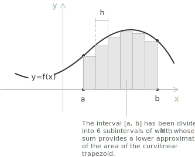
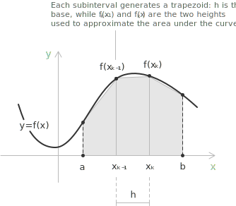

## Integrals without elementary antiderivatives

The [Fundamental Theorem of Calculus](../fundamental-theorem-of-calculus/) gives a way for evaluating a [definite integral](../definite-integrals/). If an antiderivative exists, the value of the integral becomes the difference between the interval endpoints.  However, many integrands do not have a primitive expressible by elementary [functions](../functions) and method such as [substitution](../integration-by-substitution/), [integration by parts](../integration-by-parts/), and [Weierstrass substitution](../the-weierstrass-substitution/) often cannot yield a closed form.

A typical example is provided by the following integral, which appears in the theory of the [normal distribution](../normal-distribution) and whose integrand has no antiderivative within the elementary functions:

$$\int_0^1 e^{-x^2}\\\,dx$$

The same difficulty occurs with integrals containing $\sin(x)/x$, with elliptic integrals, and with a wide class of expressions involving combinations of algebraic and transcendental terms.

The numerical evaluation of such integrals follows a different conceptual route. Instead of looking for an exact symbolic expression, one builds an approximation whose accuracy can be controlled and improved as needed. The branch of analysis that studies these procedures is called numerical integration, the latter term being a remembrance of the geometric origin of the integral as the area of a planar region.

> Numerical methods become indispensable when the analytical route is unavailable or prohibitively expensive but when a primitive exists and is reasonably accessible, the exact evaluation through the Fundamental Theorem of Calculus remains the method of choice.
> 
## General principle of a quadrature formula

Numerical integration rests on the same construction that defines the [Riemann integral](../riemann-integrability-criteria/): the interval of integration is partitioned into a finite number of subintervals, the integrand is replaced on each subinterval by a simpler function whose integral is known exactly, and the total area is approximated by summing the contributions of the individual pieces. The quality of the approximation is determined by two factors: the width of the subintervals and the order of accuracy of the local rule. 

Consider a uniform partition of the interval $[a,b]$:

$$
a = x_0 < x_1 < \cdots < x_n = b \quad x_k = a + k h
$$

with constant step size:

$$
h = \frac{b-a}{n}
$$

A quadrature formula approximates the integral by a finite linear combination of values of the integrand at the nodes of the partition:

$$
F_1 = \int_a^b f(x)\\\,dx \approx \sum_{k=0}^{n} w_k\\\,f(x_k)
$$

The coefficients $w_k$ are called weights, and their choice determines the specific method. The simplest schemes arise by interpolating the integrand on each subinterval, or on each group of consecutive subintervals, by a low-degree polynomial, and then integrating that polynomial exactly. The degree of the interpolating polynomial determines both the form of the resulting formula and its order of accuracy.

**Definition 1.** A quadrature rule is said to have degree of exactness $m$ if it integrates exactly every polynomial of degree at most $m$. 

> This notion provides a useful theoretical measure of the precision of a method, and it is the starting point for the construction of more refined formulas such as the Gauss quadrature rules.

## The rectangle and midpoint rules

The most elementary quadrature rule approximates the integrand on each subinterval by a constant. Depending on whether one chooses the value of the integrand at the left endpoint, the right endpoint, or the midpoint, three variants of the rectangle rule are obtained. The left and right versions reproduce the Riemann sums already encountered in the construction of the definite integral. The midpoint version deserves particular attention because of its superior accuracy and the symmetry of its construction. Introducing the midpoints of the subintervals:

$$
\bar{x}_k = \frac{x_{k-1} + x_k}{2}
$$

the midpoint rule on a single subinterval reads:

$$
\int_{x_{k-1}}^{x_k} f(x)\\\,dx \approx h\\\,f(\bar{x}_k)
$$

Summing the local contributions over all subintervals, one obtains the composite midpoint formula:

$$
F_2 = \int_a^b f(x)\\\,dx \approx h \sum_{k=1}^{n} f(\bar{x}_k)
$$

**Theorem 1.** When the integrand is of class $C^2$ on $[a,b]$, the error committed by the formula $F_2$ satisfies the bound:

$$
\left| \int_a^b f(x)\\\,dx - h\sum_{k=1}^{n} f(\bar{x}_k) \right| \le \frac{(b-a)\\\,h^2}{24} \max_{x \in [a,b]} |f''(x)|
$$

The error therefore decreases as $h^2$ and halving $h$ reduces the bound by a factor of 4. This is already a clear improvement over the left and right rectangle rules, whose error scales linearly with $h$ and which therefore converge much more slowly to the exact value of the integral.

> The midpoint rule integrates exactly every polynomial of degree at most one. The geometric reason is that the area of a rectangle whose base coincides with the subinterval and whose height equals the value of an affine function at the midpoint is exactly the integral of the affine function over the subinterval. This degree of exactness is the source of the second-order convergence.

## The trapezoidal rule

A more accurate approximation is obtained by replacing the integrand on each subinterval not by a constant but by an affine function, namely the segment joining the two graph points $(x_{k-1}, f(x_{k-1}))$ and $(x_k, f(x_k))$. The region underneath this segment is a trapezoid, and its area equals the average of the two ordinates multiplied by the base. 

The local formula reads:

$$
\int_{x_{k-1}}^{x_k} f(x)\\\,dx \approx \frac{h}{2}\bigl[f(x_{k-1}) + f(x_k)\bigr]
$$

Summing over all subintervals and observing that each internal node belongs to two adjacent subintervals, and therefore appears with multiplicity two in the global sum, one obtains the composite trapezoidal formula:

$$
F_3 = \int_a^b f(x)\\\,dx \approx \frac{h}{2}\Bigl[f(a) + f(b) + 2 \sum_{k=1}^{n-1} f(x_k)\Bigr]
$$

**Theorem 2.** If the integrand is of class $C^2$ on $[a,b]$, the error of the composite trapezoidal formula admits the bound:

$$
\left| \int_a^b f(x)\\\,dx - \frac{h}{2}\Bigl[f(a) + f(b) + 2 \sum_{k=1}^{n-1} f(x_k)\Bigr] \right| \le \frac{(b-a)\\,h^2}{12} \max_{x \in [a,b]} |f''(x)|
$$

The decay is again of order $h^2$, and the asymptotic behaviour coincides with that of the midpoint rule. The constant appearing in the trapezoidal bound is, however, twice as large as that for the midpoint rule, so the two methods are comparable in convergence order, but the midpoint rule is slightly more accurate in the leading constant.

> The trapezoidal and midpoint rules share the same degree of exactness, namely one. The reason why the trapezoidal formula carries a larger error constant lies in the fact that it samples the integrand only at the endpoints of each subinterval, where the error of polynomial interpolation tends to be larger, while the midpoint rule samples at the centre, where this error is naturally smaller. This observation already suggests that not all sampling strategies are equally efficient, an idea that lies at the heart of the Gauss quadrature rules.

## Simpson's rule

A substantial gain in accuracy is achieved by approximating the integrand on a pair of consecutive subintervals by a polynomial of degree two, rather than by a piecewise affine function. The construction proceeds as follows. Consider three consecutive equally spaced nodes $x_{k-1}, x_k, x_{k+1}$, and let $P(x)$ denote the unique polynomial of degree at most two passing through the three points $(x_{k-1}, f(x_{k-1}))$, $(x_k, f(x_k))$, $(x_{k+1}, f(x_{k+1}))$. The integral of this polynomial over the pair of subintervals can be computed in closed form, for instance by integrating the Lagrange representation of $P(x)$, and the result reads:

$$
\int_{x_{k-1}}^{x_{k+1}} P(x)\\\,dx = \frac{h}{3}\bigl[f(x_{k-1}) + 4 f(x_k) + f(x_{k+1})\bigr]
$$

Substituting this expression in place of the exact integral one obtains Simpson's formula on a single pair of subintervals. For the composite version, the number of subdivisions $n$ must be even, so that the whole interval can be covered by $n/2$ non-overlapping consecutive pairs. Grouping the nodes accordingly, one arrives at the composite Simpson formula:

$$
F_4 = \int_a^b f(x)\\\,dx \approx \frac{h}{3}\Bigl[f(a) + f(b) + 4 \sum_{k \text{ odd}} f(x_k) + 2 \sum_{k \text{ even}} f(x_k)\Bigr]
$$

where the odd-indexed sum extends over $k = 1, 3, \dots, n-1$ and the even-indexed sum extends over the interior even nodes $k = 2, 4, \dots, n-2$. When the integrand is of class $C^4$ on $[a,b]$, the error of the composite Simpson formula satisfies:

$$
\left| \int_a^b f(x)\\\,dx - S_n \right| \le \frac{(b-a)\\,h^4}{180} \max_{x \in [a,b]} |f^{(4)}(x)|
$$

where $S_n$ stands for the right-hand side of formula $F_4$. The error now decreases as the fourth power of the step size, and halving $h$ reduces the bound by a factor of sixteen. This represents a dramatic improvement over the second-order behaviour of the trapezoidal and midpoint rules, and it explains why Simpson's formula has historically occupied a central role in numerical quadrature.

> Although Simpson's rule is built by interpolating a [polynomial](../polynomials) of degree two, an additional cancellation of symmetric terms in the error expansion makes the rule exact on polynomials of degree three as well. The degree of exactness is therefore three, not two, and the gain of two orders of accuracy with respect to the trapezoidal rule is the manifestation of this fortunate phenomenon.

## Comparison and order of convergence

The three formulas just discussed belong to the family of Newton-Cotes rules of low order, characterised by the use of equally spaced nodes and by the integration of a polynomial interpolant of fixed degree. The order of convergence summarises in a single number the rate at which the error decreases as the number of subdivisions grows. The following table collects the relevant information.

| Rule         | Degree of exactness | Global error    |
| ------------ | ------------------- | --------------- |
| Midpoint     | 1                   | $O(h^2)$ |
| Trapezoidal  | 1                   | $O(h^2)$ |
| Simpson      | 3                   | $O(h^4)$ |

The qualitative consequence is striking. To divide the error by a factor of one hundred it is sufficient to roughly triple the number of subdivisions when using Simpson's method, while the trapezoidal rule would require multiplying that number by ten. Since the cost of a quadrature method is dominated by the number of evaluations of the integrand, and since each evaluation can be expensive in real applications, the practical advantage of Simpson's rule is considerable.

> The qualitative difference between second-order and fourth-order convergence is decisive in any setting where high precision is required from a limited budget of function evaluations. This is why Simpson's rule, and the higher-order Newton-Cotes formulas obtained by analogous constructions, occupy a privileged position among elementary quadrature methods.

## Example 1

We illustrate the use of the trapezoidal and Simpson rules on the integral:

$$
\int_0^1 e^{-x^2}\\\,dx
$$

The integrand is the kernel of the Gauss error function and admits no antiderivative expressible in elementary form, so the integral cannot be evaluated by the [Fundamental Theorem of Calculus](../fundamental-theorem-of-calculus/) in any direct way. The reference value, obtained with arbitrary precision, is approximately $0.7468241328$, and it provides a yardstick against which our approximations can be tested.

We choose $n = 4$ subintervals of equal width $h = 1/4$. The nodes of the partition and the corresponding values of the integrand are listed in the following table.

|  k  | $x_k$ | $f(x_k) = e^{-x_k^2}$ |
| --- | ----------- | ---------------------------- |
| 0   | 0.00        | 1.000000                     |
| 1   | 0.25        | 0.939413                     |
| 2   | 0.50        | 0.778801                     |
| 3   | 0.75        | 0.569783                     |
| 4   | 1.00        | 0.367879                     |

Applying the composite trapezoidal formula $(3)$, the endpoint values contribute with weight one and the three interior values contribute with weight two. A direct substitution gives:

$$
\begin{align}
T_4
&= \frac{0.25}{2} \, \Bigl[1.000000 + 0.367879 + 2(0.939413 + 0.778801 + 0.569783)\Bigr] \\\\[0pt]
&= 0.125 \, (1.367879 + 4.575994) \\\\[3pt]
&= 0.742984
\end{align}
$$

The discrepancy with the reference value is approximately $3.84 \times 10^{-3}$, which is consistent with the second-order error bound that governs the trapezoidal rule.

Applying the composite Simpson formula $(4)$, the odd-indexed nodes $x_1$ and $x_3$ contribute with weight four and the even-indexed interior node $x_2$ contributes with weight two. A direct substitution gives:

$$
\begin{align}
S_4
&= \frac{0.25}{3} \, \Bigl[1.000000+0.367879+4(0.939413 + 0.569783)+2(0.778801)\Bigr] \\\\[0pt]
&= \frac{1}{12} \, (1.367879+6.036784+1.557602) \\\\[3pt]
&= 0.746855
\end{align}
$$

The discrepancy with the reference value is now approximately $3.1 \times 10^{-5}$, more than two orders of magnitude smaller than the trapezoidal error obtained with the same number of nodes. The comparison confirms, in a concrete setting, the theoretical prediction that Simpson's rule produces results of much higher quality than the trapezoidal rule at the same computational cost.

## Beyond Newton-Cotes

The methods presented above are the simplest representatives of a much larger landscape of quadrature techniques. The Newton-Cotes family can be extended to higher-degree interpolants, although the resulting formulas develop oscillatory weights and lose stability beyond degree seven or so, and are therefore rarely used in practice. A more powerful idea is to abandon the assumption of equally spaced nodes and to choose both the nodes and the weights so as to maximise the degree of exactness for a fixed number of evaluations. 

The result is the family of Gauss quadrature rules, in which $n$ nodes are sufficient to integrate exactly every polynomial of degree at most $2n - 1$. Closely related are the adaptive methods, which subdivide the interval of integration more finely in the regions where the integrand varies rapidly and more coarsely where it is well behaved, and the Romberg method, which combines several trapezoidal estimates with different step sizes to extract a much more accurate value through Richardson extrapolation.

Numerical quadrature also requires care when applied to [improper integrals](../improper-integrals/), to integrands with rapidly oscillating behaviour, or to functions that approach a singularity within or at the boundary of the interval. In all these cases, the elementary rules introduced in this lecture lose accuracy and must be modified, either by a preliminary analytical transformation that removes the singularity or by specialised methods tailored to the specific situation.

The framework outlined here, nonetheless, contains the essential conceptual ingredients on which the more advanced techniques are built, and it is the natural starting point for any deeper study of numerical analysis.
