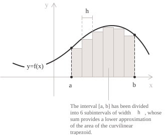
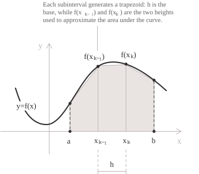

## Integrals without elementary antiderivatives

I have often observed that integrals, at least those encountered in secondary school or the first years of university, are on the whole less problematic than they may seem at first, and that evaluating them depends less on intuition than on applying fairly structured and largely mechanical procedures.

We know that the [Fundamental Theorem of Calculus](../fundamental-theorem-of-calculus/) provides a method for evaluating a [definite integral](../definite-integrals/) from an [antiderivative](../indefinite-integrals/) of the integrand. Finding the antiderivative is the main part of the work, which may be more or less complicated depending on the form of the original integral, but once it is found, the value of the integral follows easily as the difference between the values of the antiderivative at the endpoints. Many integrands, however, do not admit an antiderivative expressible through elementary [functions](../functions/), and methods such as [integration by substitution](../integration-by-substitution/), [integration by parts](../integration-by-parts/), and the [Weierstrass substitution](../the-weierstrass-substitution/) often fail to produce a closed-form expression.

A typical example is the following integral, which appears in the [normal distribution](../normal-distribution/) and whose integrand has no elementary antiderivative:

$$\int_0^1 e^{-x^2} \ dx$$

The same difficulty arises with integrals containing $\sin(x)/x,$ with elliptic integrals, and with a broad class of expressions combining algebraic and transcendental terms.

The numerical evaluation of these integrals therefore follows a different route from the techniques presented in the preceding chapters. The aim is to construct an approximation whose accuracy can be improved to meet the needs of the problem. The branch of analysis that studies these procedures is called numerical integration, or numerical quadrature, a term that recalls the geometric origin of the integral as the [area of a planar region](../finding-areas-by-integration/).

On this page, we will therefore examine the main numerical methods, which become indispensable when analytical evaluation is impossible or requires excessive work. This treatment goes beyond the topics covered in a standard first university course in calculus, but the subject is worth exploring to give an early indication of how complex integration theory is and how far it extends beyond the elementary integration techniques discussed so far.

As a general rule, remember that when an antiderivative can be found readily, it is always preferable to evaluate the integral exactly through the Fundamental Theorem of Calculus and reserve numerical methods, which are far from trivial, for other kinds of problems.

## General principle

In general terms, numerical integration rests on the same construction that defines the [Riemann integral](../riemann-integrability-criteria/). The interval of integration is partitioned into a finite number of subintervals, the integrand is replaced on each one by a simpler function whose integral is known exactly, and the total area is approximated by summing the individual contributions. The quality of the approximation depends on the width of the subintervals and the order of accuracy of the local rule.

Consider, for example, a uniform partition of the [interval](../intervals/) $[a,b],$ whose subintervals are defined by the following points, or nodes, of the partition:

$$
a = x_0 < x_1 < \cdots < x_n = b \quad x_k = a + kh
$$

The step size, which is the width of the base of each rectangle, is constant and is given by:

$$
h = \frac{b-a}{n}
$$

To approximate the integral, we evaluate the integrand at the nodes $x_0, x_1, \dots, x_n,$ multiply each value $f(x_k)$ by a coefficient $w_k,$ and add the results. This gives a quadrature formula of the form:

$$  
\int_a^b f(x) \ dx \approx \sum_{k=0}^{n} w_k f(x_k) \tag{1}  
$$

The coefficients $w_k$ are called weights and determine the contribution of each function value to the approximation of the integral. Their choice also determines the specific quadrature method, since it specifies how the function values at the nodes are combined to approximate the integral.

The simplest formulas are obtained by interpolating the integrand on each subinterval, or on each group of consecutive subintervals, with a [polynomial](../polynomials/) of relatively low degree, and then integrating it. The degree of the interpolating polynomial determines the form of the resulting formula and helps determine its order of accuracy.

Accordingly, a quadrature formula is said to have degree of exactness $m$ if it integrates exactly every polynomial of degree at most $m,$ but not every polynomial of degree $m+1.$ This notion provides a theoretical measure of the accuracy of a method and is the starting point for constructing more accurate formulas.

## The rectangle and midpoint rules

The most elementary quadrature rule approximates the integrand on each subinterval by a constant. Choosing the value of the function at the left endpoint, the right endpoint, or the midpoint gives three variants of the rectangle rule. The first two reproduce the Riemann sums already encountered in the construction of the definite integral, whereas the midpoint rule has greater accuracy because of the symmetry of its construction. We focus on the latter and denote the midpoints of the subintervals by the following equality:

$$
\bar{x}_k = \frac{x_{k-1} + x_k}{2}
$$

The midpoint quadrature rule on a single subinterval is:

$$
\int_{x_{k-1}}^{x_k} f(x) \ dx \approx hf(\bar{x}_k)
$$

On each subinterval, we approximate the integral by the product $hf(\bar{x}_k),$ where $h$ is the width of the subinterval (the base of the rectangle) and $f(\bar{x}_k)$ is the value of the function at its midpoint (the height). Since the integral over $[a,b]$ is the sum of the integrals over the individual subintervals, we add these approximations and factor out the common factor $h.$ This gives the midpoint rule:

$$  
\int_a^b f(x) \ dx \approx \sum_{k=1}^{n} hf(\bar{x}_k) = h \sum_{k=1}^{n} f(\bar{x}_k) \tag{2}  
$$

If the integrand is of class $C^2,$ meaning that it has [first and second derivatives](../higher-order-derivatives/) that are both continuous on $[a,b],$ the error in formula $(2)$ satisfies the bound:

$$
\left| \int_a^b f(x) \ dx - h\sum_{k=1}^{n} f(\bar{x}_k) \right| \le \frac{(b-a)h^2}{24} \max_{x \in [a,b]} |f''(x)|
$$

The error is therefore of order $h^2$ and if, for example, we halve the step size $h,$ the upper bound decreases to one quarter of its original value. This gives a significant improvement over the left and right rectangle rules, whose error is of order $h$ and which therefore converge more slowly to the exact value of the integral.

> The error bound, like all the analogous bounds for the formulas below, depends on the maximum of the absolute value of a higher derivative of $f$ on $[a,b].$ The finiteness of this maximum is guaranteed by [Weierstrass' theorem](../weierstrass-theorem/), which states that a [continuous function](../continuous-functions/) on a closed and bounded interval attains its maximum and minimum.

## The trapezoidal rule

We now examine another approach that uses trapezoids instead of rectangles. On each subinterval, we replace the graph of the integrand with the line segment joining the points $(x_{k-1}, f(x_{k-1}))$ and $(x_k, f(x_k)).$ This gives a more accurate approximation than the rectangle rules that use the endpoints.

When both ordinates are positive, the segment, the horizontal axis, and the vertical lines through the endpoints enclose a trapezoid. Its area is calculated by multiplying the average of the two ordinates by the width of the subinterval. The same formula remains valid for ordinates of either sign, provided that areas below the horizontal axis are counted as negative.

The local formula in this case is:

$$
\int_{x_{k-1}}^{x_k} f(x) \ dx \approx \frac{h}{2}\bigl[f(x_{k-1}) + f(x_k)\bigr]
$$

To approximate the integral over $[a,b],$ we now sum the contributions of the individual trapezoids. Each interior value $f(x_k)$ appears in two contributions, because the node $x_k$ is the right endpoint of one subinterval and the left endpoint of the next. The values $f(a)$ and $f(b)$ appear only once. Factoring out the common factor $h/2,$ we therefore obtain the composite trapezoidal rule:

$$  
\int_a^b f(x) \ dx \approx \frac{h}{2}\Bigl[f(a) + f(b) + 2 \sum_{k=1}^{n-1} f(x_k)\Bigr] \tag{3}  
$$

If the integrand is of class $C^2$ on $[a,b],$ the error in formula $(3)$ satisfies the following bound:

$$
\left| \int_a^b f(x) \ dx - \frac{h}{2}\Bigl[f(a) + f(b) + 2 \sum_{k=1}^{n-1} f(x_k)\Bigr] \right| \le \frac{(b-a)h^2}{12} \max_{x \in [a,b]} |f''(x)|
$$

The error is again of order $h^2,$ as with the midpoint rule, but the constant in the trapezoidal bound is twice that in the midpoint bound. The two methods therefore have the same order of convergence, but the midpoint rule has a smaller error constant.

## Simpson's rule

Simpson's rule is a method for increasing accuracy by approximating the integrand on a pair of consecutive subintervals with a quadratic polynomial. Consider three consecutive equally spaced nodes $x_{k-1}, x_k, x_{k+1}$ and let $P(x)$ denote the unique polynomial of degree at most two that passes through the three points $(x_{k-1}, f(x_{k-1})),$ $(x_k, f(x_k)),$ $(x_{k+1}, f(x_{k+1})).$ The integral of this polynomial over the pair of subintervals can be evaluated in closed form, giving:

$$
\int_{x_{k-1}}^{x_{k+1}} P(x) \ dx = \frac{h}{3}\bigl[f(x_{k-1}) + 4 f(x_k) + f(x_{k+1})\bigr]
$$

Substituting this expression for the integral of the integrand gives Simpson's rule on a single pair of subintervals. To apply Simpson's rule to the entire interval, we group the subintervals in pairs, the first with the second, the third with the fourth, and so on, so the number of subdivisions $n$ must be even.

When we sum the formulas for the individual pairs, the midpoint values retain a coefficient of $4,$ whereas the values at the interior endpoints have a coefficient of $2,$ because they appear in two adjacent pairs. The values at $a$ and $b$ appear only once and therefore have a coefficient of $1.$ This gives Simpson's rule:

$$  
\int_a^b f(x) \ dx \approx \frac{h}{3}\Bigl[f(a) + f(b) + 4 \sum_{j=1}^{n/2} f(x_{2j-1}) + 2 \sum_{j=1}^{n/2-1} f(x_{2j})\Bigr] \tag{4}  
$$

The first sum includes the values at the nodes $x_1, x_3, \dots, x_{n-1},$ whereas the second includes those at the interior nodes $x_2, x_4, \dots, x_{n-2}.$

The sum over odd indices runs over $k = 1, 3, \dots, n-1,$ whereas the sum over even indices includes only the interior nodes $k = 2, 4, \dots, n-2.$ If the integrand is of class $C^4$ on $[a,b],$ the error in the composite Simpson rule satisfies the bound:

$$
\left| \int_a^b f(x) \ dx - S_n \right| \le \frac{(b-a)h^4}{180} \max_{x \in [a,b]} |f^{(4)}(x)|
$$

Here $S_n$ denotes the approximating expression on the right-hand side of formula $4.$ The error is now of the order of the fourth power of the step size, and halving $h$ reduces the upper bound by a factor of sixteen! The error bound for Simpson's rule therefore decreases more rapidly as the step size decreases than the second-order bounds for the trapezoidal and midpoint rules, but this does not guarantee a smaller actual error for every function and every step size.

## Comparison and order of convergence

The three formulas just discussed belong to the family of so-called low-order Newton-Cotes rules, which are characterised by the use of equally spaced nodes and the integration of a polynomial interpolant of fixed degree. The order of convergence describes how rapidly the error decreases as the number of subdivisions increases. We can summarise these properties in the following table:

| Rule        | Degree of exactness | Global error |
| ----------- | ------------------- | ------------ |
| Midpoint    | 1                   | $O(h^2)$     |
| Trapezoidal | 1                   | $O(h^2)$     |
| Simpson     | 3                   | $O(h^4)$     |

The notation $O(h^p),$ called [big O notation](../big-o-notation/), means that, for sufficiently small $h,$ the [absolute value](../absolute-value/) of the error is bounded above by $Ch^p,$ where $C$ is a constant independent of $h.$

According to these orders of convergence, reducing the upper error bound by a factor of one hundred requires multiplying the number of subdivisions by approximately $\sqrt[4]{100} \approx 3.16$ for Simpson's rule and by ten for the trapezoidal rule, so Simpson's rule may require fewer evaluations of the integrand to achieve a prescribed accuracy.

## Example 1

As a practical example, we apply the trapezoidal and Simpson rules to the integral:

$$
\int_0^1 e^{-x^2} \ dx
$$

We know that the integrand has no antiderivative expressible in elementary form, so the Fundamental Theorem of Calculus does not allow us to evaluate the integral directly through an elementary antiderivative. We therefore apply numerical integration and choose $n = 4$ subintervals of equal width $h = 1/4.$ The nodes of the partition and the corresponding values of the integrand are listed in the following table.

| $k$ | $x_k$ | $f(x_k) = e^{-x_k^2}$ |
| --- | --- | --- |
| 0 | 0.00 | 1.000000 |
| 1 | 0.25 | 0.939413 |
| 2 | 0.50 | 0.778801 |
| 3 | 0.75 | 0.569783 |
| 4 | 1.00 | 0.367879 |

Applying the trapezoidal rule $(3)$ gives:

$$  
\begin{align}  
\int_0^1 e^{-x^2} \ dx  
&\approx \frac{0.25}{2}\Bigl[1.000000 + 0.367879 + 2(0.939413 + 0.778801 + 0.569783)\Bigr] \\[6pt]  
&= 0.125(1.367879 + 4.575994) \\[14pt]  
&\approx 0.742984  
\end{align}  
$$

To compare the results, we use the approximate value of the integral $0.7468241328,$ obtained with a more accurate numerical calculation than those used in this example. The difference from the reference value is approximately $3.84 \times 10^{-3},$ consistent with the second-order error bound for the trapezoidal rule.

In Simpson's rule $(4),$ the odd-indexed nodes $x_1$ and $x_3$ have weight four, whereas the even-indexed interior node $x_2$ has weight two. Substituting the values gives:

$$
\begin{align}
S_4
&= \frac{0.25}{3}\Bigl[1.000000 + 0.367879 + 4(0.939413 + 0.569783) + 2(0.778801)\Bigr] \\[6pt]
&= \frac{1}{12}(1.367879 + 6.036784 + 1.557602) \\[12pt]
&\approx 0.746855
\end{align}
$$

The difference from the reference value is now approximately $3.1 \times 10^{-5},$ more than two orders of magnitude smaller than the error obtained with the trapezoidal rule using the same number of nodes, showing that Simpson's rule gives a more accurate approximation with the same number of evaluations.

## Beyond Newton-Cotes

To offer some reassurance, the methods presented on this page are the simplest among the many quadrature techniques available. The Newton-Cotes family can be extended to interpolating polynomials of higher degree, but as the degree increases, weights of alternating signs and stability problems may appear, which is why high-degree formulas are rarely used in practice.

Another possibility is to give up equally spaced nodes and choose both the nodes and the weights to maximise the degree of exactness for a fixed number of evaluations, although this of course makes the problem more complicated. This choice underlies the family of Gauss quadrature rules, in which $n$ nodes are sufficient to integrate exactly every polynomial of degree at most $2n - 1.$

Other techniques also exist, such as Romberg's method, but they require more advanced tools that are beyond our scope.

Finally, I want to mention that numerical quadrature requires some care when applied to [improper integrals](../improper-integrals/), rapidly oscillating integrands, or functions with a singularity inside the interval or at its endpoints. In these cases, the elementary rules introduced here may lose accuracy and must be adapted, either through a preliminary analytical transformation that removes the singularity or through methods tailored to the specific problem.