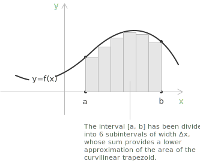
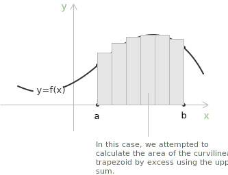
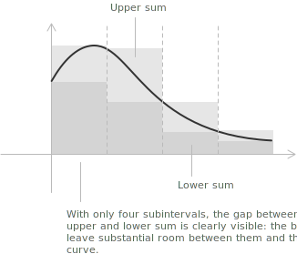
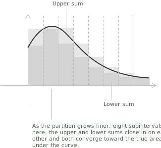

## Partitions, upper sums, lower sums

The Riemann integral is built to measure the net area under a bounded [function](../functions/) on a [closed interval](../intervals/) by approximating it with rectangles. The subtle point is not computing the integral once it exists, but deciding when the [limiting](../limits/) process is well defined. This page collects the most useful criteria for Riemann integrability, in a form that is easy to apply when the function under consideration is not obviously [continuous](../continuous-functions/).

> The definition and the basic properties of the definite integral are treated on the page on [definite integrals](../definite-integrals/).

- - -

**Definition 1.** Let $f:[a,b]\to\mathbb{R}$ be bounded. A partition $P$ of $[a,b]$ is a finite collection of points:

$$P = \\{\ x_0, x_1, \dots, x_n \ \\}$$

$$a = x_0 < x_1 < \cdots < x_n = b$$

On each subinterval $[x_{i-1}, x_i]$ the highest and the lowest values reached by the function are recorded. Since $f$ is bounded, both quantities are well defined:

$$M_i = \sup_{x \in [x_{i-1}, x_i]} f(x)$$

$$m_i = \inf_{x \in [x_{i-1}, x_i]} f(x)$$

The quantity $M_i$ is the least upper bound of $f$ on that subinterval: the smallest value that is still at least as large as every value $f$ takes there. The quantity $m_i$ is the greatest lower bound: the largest value that is still no greater than any value $f$ takes there.

The diagram above shows the lower sum: each rectangle is built using the infimum of $f$ on its subinterval, so every rectangle fits entirely below the curve. The diagram below shows the upper sum: each rectangle uses the supremum, so the rectangles overshoot the curve and cover more area than is actually there. The true area under the curve lies between the two.

As the partition gets finer and the subintervals shrink, the rectangles in both sums become thinner and more numerous, and the two approximations are forced closer together.

- - -

When $f$ is continuous, $M_i$ and $m_i$ coincide with the actual maximum and minimum on the subinterval. For a general bounded function, the supremum and infimum are used because a maximum or minimum may not be attained. Using $M_i$ and $m_i$, the Darboux upper and lower sums are defined as:

$$U(f, P) = \sum_{i=1}^n M_i (x_i - x_{i-1})$$

$$L(f, P) = \sum_{i=1}^n m_i (x_i - x_{i-1})$$

Two facts keep the construction coherent. First, refining a partition by adding points to it can only push upper sums down and lower sums up. Second, no matter which partition is chosen, the lower sum never exceeds the upper sum:

$$L(f, P) \leq U(f, P)$$

Together, these mean that as partitions get finer, the upper and lower sums are squeezed toward each other. When they meet at a common limit, the function is integrable and that limit is the integral.

## The Darboux criterion

Before stating the criterion, two numbers that summarise all possible upper and lower sums at once need to be fixed. The upper and lower integrals of $f$ are defined as:

$$U(f) = \inf_{P} U(f, P)$$

$$L(f) = \sup_{P} L(f, P)$$

where the infimum and the supremum range over all partitions $P$ of $[a, b]$. The quantity $U(f)$ is the smallest value the upper sums can be pushed down to, by choosing finer and finer partitions. The quantity $L(f)$ is the largest value the lower sums can be pushed up to. One can show that $L(f) \leq U(f)$ always holds, regardless of the function.

- - -

**Definition 1.** A bounded function $f$ is Riemann integrable on $[a, b]$ if and only if these two numbers coincide:

$$U(f) = L(f)$$

In that case, their common value is the integral:

$$\int_a^b f(x) \ dx = U(f) = L(f)$$

This is clean as a definition, but in practice it is difficult to compute $U(f)$ and $L(f)$ directly. The following equivalent formulation is far more useful when integrability has to be established explicitly: a bounded function $f$ is Riemann integrable on $[a, b]$ if and only if for every $\varepsilon > 0$ there exists a partition $P$ such that:

$$U(f, P) - L(f, P) < \varepsilon$$

The difference between the two situations is clear from the diagrams. With a coarse partition, each rectangle is wide enough to leave a noticeable gap between the upper and the lower bound. Narrowing the subintervals forces both sums to track the curve more closely, and the space between them shrinks accordingly.

A partition can therefore always be found that forces the upper and lower sums as close together as desired. This is the criterion to reach for when integrability has to be proven by squeezing the two sums toward each other.

- - -

On each subinterval $[x_{i-1}, x_i]$, the difference $M_i - m_i$ represents the range of values taken by $f$ on that portion of the interval, that is, its oscillation over that segment. A direct computation gives:

$$U(f, P) - L(f, P) = \sum_{i=1}^n (M_i - m_i)(x_i - x_{i-1})$$

This is the central idea. A function is integrable when the interval can be divided into sufficiently small pieces so that the variation of the function on each piece contributes only a negligible error to the total sum. When, on the contrary, the function keeps oscillating in an uncontrolled way on every subinterval, no matter how fine the partition, this condition cannot be met and the function fails to be integrable in the Riemann sense.

> Once a function is known to be Riemann integrable, the [Fundamental Theorem of Calculus](../fundamental-theorem-of-calculus/) provides the main tool for evaluating it.

## Common sufficient conditions

The Darboux criterion is the foundation, but in practice most functions encountered fall into one of three categories that guarantee integrability without any direct computation of sums. A function $f$ on $[a, b]$ is Riemann integrable if it satisfies any one of the following conditions.

+ If $f$ is [continuous](../continuous-functions/) on $[a, b]$, integrability follows from uniform continuity: on a closed bounded interval, continuity forces the oscillation $M_i - m_i$ to be uniformly small on every sufficiently short subinterval, which is exactly what the Darboux criterion requires.
+ If $f$ is monotone on $[a, b]$, the oscillation on each subinterval reduces to a difference of endpoint values. These differences telescope when summed across the partition, and the total $U(f, P) - L(f, P)$ can be made small simply by taking the mesh fine enough.
+ If $f$ is bounded and has only finitely many [discontinuities](../discontinuities-of-real-functions/), each can be enclosed in a subinterval of arbitrarily small length, while the function remains continuous and well-behaved everywhere else.

> These three conditions are independent: a function can be monotone without being continuous, and can have finitely many discontinuities without being monotone. What they share is that none of them allows discontinuities to accumulate densely, and that is the key.

## The discontinuity-set criterion

A bounded function $f:[a,b]\to\mathbb{R}$ is Riemann integrable if and only if its set of discontinuities has Lebesgue measure zero. A set $D \subset [a, b]$ has measure zero when for every $\varepsilon > 0$ it can be covered by a countable collection of intervals whose total length is less than $\varepsilon$. The discontinuities can be hidden inside intervals that, taken together, occupy as little of the real line as desired. Two examples show what this means in practice.

> Lebesgue measure is the standard way of assigning length to subsets of the real line. For an interval $[c, d]$ it equals $d - c$. A set has measure zero when it can be covered by intervals of arbitrarily small total length, so it occupies no space on the line in any meaningful sense. Finite and countable sets, such as the rationals, all have measure zero.

- - -

The [Dirichlet function](../dirichlet-function/) is defined as:

$$
f(x) =
\begin{cases}
1 & x \in \mathbb{Q} \\[6pt]
0 & x \notin \mathbb{Q}
\end{cases}
$$

It is [discontinuous](../discontinuities-of-real-functions/) at every point of $[a, b]$, so its discontinuity set is the entire interval, which does not have measure zero. The Dirichlet function is therefore not Riemann integrable. Every subinterval contains both rationals and irrationals, so every $M_i = 1$ and every $m_i = 0$, which gives $U(f, P) - L(f, P) = b - a$ for every partition $P$, regardless of how fine it is.

- - -

Thomae's function is defined as:

$$
t(x) =
\begin{cases}
0 & x \notin \mathbb{Q} \\[6pt]
\dfrac{1}{q} & x = \dfrac{p}{q} \text{ in lowest terms}
\end{cases}
$$

It is discontinuous exactly at the rationals and continuous at every irrational. The rationals in $[a, b]$ form a countable set, and every countable set has measure zero. Thomae's function is therefore Riemann integrable and its integral over any interval is zero, despite being discontinuous at infinitely many points.

## Recognising Riemann integrability

When a bounded function $f$ on $[a, b]$ is presented and integrability has to be decided, the following sequence of checks usually settles the question quickly.

+ If $f$ is continuous on $[a, b]$, then it is integrable.
+ If $f$ is monotone on $[a, b]$, then it is integrable.
+ If $f$ has only finitely many discontinuities, then it is integrable.
+ If the discontinuities of $f$ form a set of measure zero, then it is integrable.
+ If $f$ is discontinuous on a set that cannot be made small, the strategy is to show that $U(f, P) - L(f, P)$ stays bounded away from zero for every partition $P$. The function is then not Riemann integrable.

> Once integrability is established, the actual evaluation of the integral is carried out through the [Fundamental Theorem of Calculus](../fundamental-theorem-of-calculus/) and the standard techniques discussed on the pages on [integration by substitution](../integration-by-substitution/) and [integration by parts](../integration-by-parts/). When no antiderivative is available in closed form, the value can still be approximated by means of [numerical integration](../numerical-integration/).
