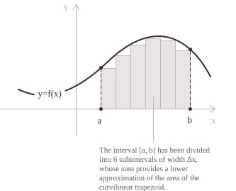
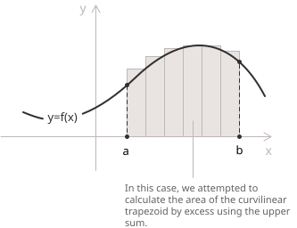
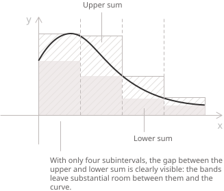
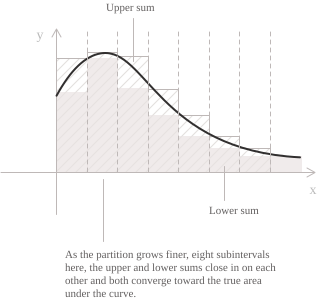

## Partitions, upper sums, lower sums

The Riemann integral of a bounded [function](../functions/) on a [closed interval](../intervals/) measures the signed area under its graph when the rectangular approximations converge to a common value. The main question is how to decide whether this [limiting](../limits/) process is well defined. The criteria below answer this question even when the function is not obviously [continuous](../continuous-functions/). The [definite integrals](../definite-integrals/) page gives the definition and basic properties.

- - -

Let $a < b$ and let $f:[a,b]\to\mathbb{R}$ be bounded. A partition $P$ of $[a,b]$ is a finite set of points:

$$P = \{\ x_0, x_1, \dots, x_n \ \}$$

The points are listed in increasing order:

$$a = x_0 < x_1 < \cdots < x_n = b$$

On each subinterval $[x_{i-1}, x_i],$ define the supremum and infimum of $f.$ Since $f$ is bounded, both quantities are finite:

$$M_i = \sup_{x \in [x_{i-1}, x_i]} f(x)$$

$$m_i = \inf_{x \in [x_{i-1}, x_i]} f(x)$$

The quantity $M_i$ is the [least upper bound](../supremum-and-infimum/) of $f$ on that subinterval, namely the smallest value that is at least as large as every value $f$ takes there. The quantity $m_i$ is the greatest lower bound, namely the largest value that is no greater than any value $f$ takes there.

The first diagram shows the lower sum for the nonnegative function displayed. On each subinterval, the top edge of the rectangle has height $m_i$ and lies at or below the graph. The second diagram shows the upper sum. The top edge of each rectangle has height $M_i$ and lies at or above the graph. When $f$ is Riemann integrable, the lower and upper sums bound its integral.

For the continuous function shown, refining the partition splits some rectangles and decreases or preserves the gap between the two approximations.

- - -

When $f$ is continuous, $M_i$ and $m_i$ coincide with the actual maximum and minimum on the subinterval. For a general bounded function, the supremum and infimum are used because a maximum or minimum may not be attained. Using $M_i$ and $m_i,$ the Darboux upper and lower sums are defined by:

$$U(f, P) = \sum_{i=1}^n M_i(x_i - x_{i-1})$$

$$L(f, P) = \sum_{i=1}^n m_i(x_i - x_{i-1})$$

Darboux sums have two order properties. Refining a partition can only decrease its upper sum and increase its lower sum. Moreover, every lower sum is at most every upper sum, even when they come from different partitions, because both can be compared through a common refinement. In particular:

$$L(f, P) \leq U(f, P)$$

Thus a refinement narrows the gap between the upper and lower sums or leaves it unchanged, but the gap need not tend to zero. A bounded function is integrable precisely when suitable partitions make this gap arbitrarily small.

## The Darboux criterion

To state the criterion, define the upper integral and lower integral of $f$ by taking the infimum of all upper sums and the supremum of all lower sums:

$$U(f) = \inf_{P} U(f, P)$$

$$L(f) = \sup_{P} L(f, P)$$

Here $P$ ranges over all partitions of $[a, b]$ in both definitions. The quantity $U(f)$ is the greatest lower bound of the upper sums, and $L(f)$ is the least upper bound of the lower sums. The order properties above give $L(f) \leq U(f)$ for every bounded $f.$

A bounded function $f$ is Riemann integrable on $[a, b]$ if and only if these two numbers coincide:

$$U(f) = L(f)$$

In that case, their common value is the integral:

$$\int_a^b f(x) \ dx = U(f) = L(f)$$

This equality gives the definition but rarely permits a direct computation. The equivalent Darboux criterion states that a bounded function $f$ is Riemann integrable on $[a, b]$ if and only if every $\varepsilon > 0$ admits a partition $P$ such that:

$$U(f, P) - L(f, P) < \varepsilon$$

The diagrams illustrate the criterion for the continuous function shown. A coarse partition leaves a visible gap between the upper and lower rectangles. Refining it narrows that gap because the oscillation of this function is small on short subintervals.

For an integrable function, a partition can be found that makes the upper and lower sums as close as prescribed. To prove integrability, it is enough to construct such a partition for every $\varepsilon > 0.$

On each subinterval $[x_{i-1}, x_i],$ the difference $M_i - m_i$ is the oscillation of $f$ on that subinterval. A direct computation gives:

$$U(f, P) - L(f, P) = \sum_{i=1}^n (M_i - m_i)(x_i - x_{i-1})$$

The identity expresses the Darboux gap as a weighted sum of oscillations. A bounded function is integrable exactly when, for every $\varepsilon > 0,$ some partition makes this sum less than $\varepsilon.$ If the sum has a positive lower bound over all partitions, the function is not Riemann integrable.

## Common sufficient conditions

The following three conditions imply Riemann integrability and often avoid a direct estimate of the Darboux sums. A bounded function $f$ on $[a, b]$ is Riemann integrable if it satisfies any one of them.

+ If $f$ is [continuous](../continuous-functions/) on $[a, b],$ then it is uniformly continuous. Its oscillation $M_i - m_i$ is therefore uniformly small on every sufficiently short subinterval, and the Darboux criterion gives integrability.
+ If $f$ is monotone on $[a, b],$ let $\lVert P\rVert$ denote the largest subinterval length. Bounding each subinterval length by $\lVert P\rVert$ gives $U(f, P) - L(f, P) \leq \lVert P\rVert|f(b) - f(a)|$ because the absolute endpoint differences telescope. The gap can therefore be made arbitrarily small.
+ If $f$ is bounded and has only finitely many [discontinuities](../discontinuities-of-real-functions/), those points can be covered by intervals of arbitrarily small total length. Boundedness controls the contribution on these intervals. On the remaining compact pieces, $f$ is uniformly continuous, which controls the rest of the Darboux gap. This condition includes [piecewise continuous functions](../piecewise-functions/) on closed bounded intervals.

> These conditions overlap and are sufficient rather than necessary. A monotone function can have a dense countable set of jump discontinuities, so density alone does not decide Riemann integrability. The exact condition concerns the measure of the discontinuity set.

## The discontinuity-set criterion

A bounded function $f:[a,b]\to\mathbb{R}$ is Riemann integrable if and only if its set of discontinuities has Lebesgue measure zero. A set $D \subset [a, b]$ has measure zero if, for every $\varepsilon > 0,$ it can be covered by a countable collection of intervals with total length less than $\varepsilon.$ The discontinuity set may therefore be infinite or dense, provided it has measure zero. The two examples below contrast a discontinuity set of positive measure with one of measure zero.

> Lebesgue measure extends the usual notion of length beyond intervals. The interval $[c, d]$ has measure $d - c.$ A set has measure zero when intervals of arbitrarily small total length cover it. Every finite or countable set has measure zero. In particular, $\mathbb{Q} \cap [a, b]$ has measure zero.

- - -

The [Dirichlet function](../dirichlet-function/) is defined by:

$$
f(x) =
\begin{cases}
1 & x \in \mathbb{Q} \\[6pt]
0 & x \notin \mathbb{Q}
\end{cases}
$$

It is [discontinuous](../discontinuities-of-real-functions/) at every point of $[a, b],$ so its discontinuity set is the entire interval and has positive measure. The Dirichlet function is therefore not Riemann integrable. Every subinterval contains both rational and irrational numbers, so $M_i = 1$ and $m_i = 0$ for every $i.$ Hence $U(f, P) - L(f, P) = b - a$ for every partition $P,$ regardless of how fine it is.

- - -

Thomae's function is defined by:

$$
t(x) =
\begin{cases}
0 & x \notin \mathbb{Q} \\[6pt]
\dfrac{1}{q} & x = \dfrac{p}{q}\ \text{in lowest terms, with }q > 0
\end{cases}
$$

It is discontinuous exactly at the rational numbers and continuous at every irrational number. The rationals in $[a, b]$ form a countable set, so Thomae's function is Riemann integrable. Since $t \geq 0$ and every subinterval contains an irrational number, every lower Darboux sum is zero. The common value of the upper and lower integrals is therefore zero.

## Recognising Riemann integrability

To decide whether a bounded function $f$ on $[a, b]$ is Riemann integrable, use the following checks.

+ If $f$ is continuous on $[a, b],$ then it is integrable.
+ If $f$ is monotone on $[a, b],$ then it is integrable.
+ If $f$ has only finitely many discontinuities, then it is integrable.
+ If the discontinuities of $f$ form a set of measure zero, then it is integrable.
+ If the discontinuity set of $f$ has positive Lebesgue measure, then $f$ is not Riemann integrable. A direct Darboux proof instead finds a constant $\eta > 0$ such that $U(f, P) - L(f, P) \geq \eta$ for every partition $P.$

> For a continuous integrand with a known antiderivative $F,$ the [Fundamental Theorem of Calculus](../fundamental-theorem-of-calculus/) gives $\int_a^b f(x) \ dx = F(b) - F(a).$ The antiderivative may be found by [integration by substitution](../integration-by-substitution/) or [integration by parts](../integration-by-parts/). If no closed form is available, [numerical integration](../numerical-integration/) can approximate the integral.
