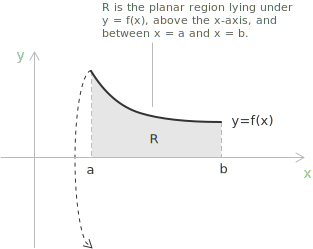
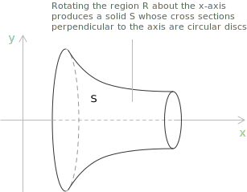
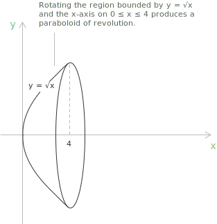

## Solids generated by rotation

A solid of revolution is the region of space swept out when a plane region turns around a fixed line, called the axis of revolution. If the region lies in the $xy$-plane and the axis is the $x$-axis, every point of the region traces a circle whose plane is perpendicular to the axis. The union of all these circles fills the solid.

The disc method computes the volume of such a solid when the rotation acts on the region lying below the graph of a function and the axis coincides with the axis of the independent variable. 

Let $f$ be [continuous](../continuous-functions/) on $[a, b]$ with $f(x) \geq 0$, and let $R$ be the region bounded above by $y = f(x)$, below by the $x$-axis, and on the sides by the lines $x = a$ and $x = b$. 

Rotating $R$ about the $x$-axis produces a solid $S$ whose cross sections perpendicular to the axis are circular discs. 

The starting point is the volume of a right circular cylinder. A cylinder of height $h$ standing on a circular base of radius $r$ has volume

$$V = \pi r^2 h$$

Every approximation that follows rests on this single formula, applied to thin slices of the solid.

Partition the interval $[a, b]$ into $n$ subintervals, each of width $\Delta x = (b - a)/n$, with division points $a = x_0 < x_1 < \dots < x_n = b$. A typical subinterval $[x_{k-1}, x_k]$ cuts from $S$ a slab perpendicular to the $x$-axis. Inside this subinterval choose any point at which to measure the height of the graph, and denote it $x_k^{*}$, where the star marks a sample point selected within the $k$-th subinterval rather than one of the partition endpoints. 

The slab is nearly a disc, a flat cylinder whose thickness is $\Delta x$ and whose circular face has radius equal to the height of the graph at $x_k^{*}$, that is $f(x_k^{*})$. Applying the cylinder formula to this disc, with base radius $f(x_k^{*})$ and height $\Delta x$, gives its volume:

$$\Delta V_k = \pi \big(f(x_k^{*})\big)^2 \Delta x$$

Summing the contributions of all the slabs approximates the volume of $S$:

$$V \approx \sum_{k=1}^{n} \pi \big(f(x_k^{*})\big)^2 \Delta x$$

The right-hand side is a [Riemann sum](../riemann-integrability-criteria/) for the function $\pi(f(x))^2$ on $[a, b]$. As the partition is refined and $\Delta x \to 0$, the discs become thinner and follow the profile of the solid ever more closely, so the sum converges to the [definite integral](../definite-integrals/). The volume of the solid of revolution generated by rotating $R$ about the $x$-axis is

$$V = \int_a^b \pi \big(f(x)\big)^2 \ dx$$

The radius of the disc at position $x$ is the value $f(x)$, and squaring it inside the integral reproduces the area $\pi r^2$ of each circular face. The integral accumulates these areas across the thickness of the solid.

- - -

The same construction works when the axis of revolution is the $y$-axis. If a region is bounded by $x = g(y)$ for $c \leq y \leq d$ with $g(y) \geq 0$, rotating it about the $y$-axis produces discs perpendicular to that axis, and the volume becomes

$$V = \int_c^d \pi \big(g(y)\big)^2 \ dy$$

The roles of the two variables are exchanged, while the principle is unchanged: integrate the area of a variable circular cross section along the axis of rotation.

## Conditions for applicability

The volume formula rests on assumptions that decide when the disc method can be used and when a different construction is needed.

The first assumption is the continuity of $f$ on $[a, b]$. Continuity makes $f$ [integrable](../riemann-integrability-criteria/), so the Riemann sum built from the slabs converges to a definite integral. Without it the limit that defines the volume may fail to exist, and the passage from the approximating sum to the integral is no longer justified.

The second assumption concerns the position of the axis. The disc method applies when the axis of revolution forms one side of the rotated region, so that each cross section perpendicular to the axis is a full disc. When a gap separates the region from the axis, rotation opens a cavity along the axis and the cross sections become annuli rather than discs. The volume is then a difference of two integrals, one for the outer radius and one for the inner radius, which is the content of the washer method.

The sign of $f$ does not affect the result. The radius of each disc is the distance from the axis to the curve, equal to $|f(x)|$, and this distance enters the volume through its square. 

Since $\big(f(x)\big)^2 = \big(|f(x)|\big)^2$, the formula holds whether $f$ is positive or negative on part of the interval. The condition $f(x) \geq 0$ serves only to describe the region conveniently and is not required for the formula itself.

> The same reasoning extends to rotation about any line parallel to a coordinate axis. If the region turns about the horizontal line $y = c$ with $f(x) \geq c$, the radius at position $x$ is the distance $f(x) - c$, and the volume becomes $\int_a^b \pi\big(f(x) - c\big)^2 \ dx$. The structure of the formula is preserved, with the radius measured from the actual axis of rotation.

## Example

Consider the curve $y = \sqrt{x}$ on the interval $0 \leq x \leq 4$, together with the region $R$ that lies between this curve and the $x$-axis. Rotating $R$ about the $x$-axis generates a solid whose silhouette widens as $x$ increases, since the radius $\sqrt{x}$ grows with $x$. This solid is a paraboloid of revolution, the shape of a smooth bowl.

At a position $x$ the cross section perpendicular to the axis is a disc of radius $f(x) = \sqrt{x}$, so its area is $\pi(\sqrt{x})^2 = \pi x$. Because the axis of rotation is the axis of the independent variable, the disc method applies directly, and the volume is:

$$V = \int_0^4 \pi \big(\sqrt{x}\big)^2 \ dx$$

The square of the radius simplifies the integrand to a linear function:

$$V = \int_0^4 \pi x \ dx = \pi \int_0^4 x \ dx$$

The [antiderivative](../indefinite-integrals/) of $x$ is $x^2/2$, so by the [fundamental theorem of calculus](../fundamental-theorem-of-calculus/) we evaluate

$$
\begin{align}
V &= \pi \left[ \frac{x^2}{2} \right]_0^4 \\[6pt]
  &= \pi \left( \frac{16}{2} - \frac{0}{2} \right) \\[6pt]
  &= 8\pi
\end{align}
$$

The paraboloid bowl obtained by rotating $y = \sqrt{x}$ over $[0, 4]$ about the $x$-axis has volume $8\pi$ cubic units.

> A useful check compares the solid with the cylinder that just contains it. That cylinder has radius $\sqrt{4} = 2$ and height $4$, so its volume is $\pi \cdot 2^2 \cdot 4 = 16\pi$. The paraboloid fills exactly half of this enclosing cylinder, which is consistent with a cross-sectional area $\pi x$ that grows linearly from $0$ to its maximum.
