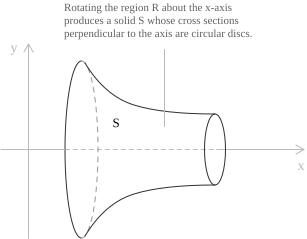
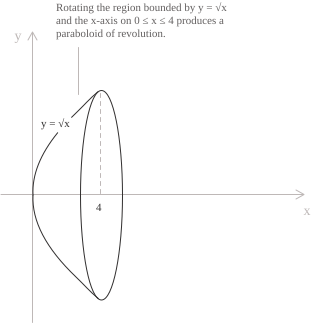

## Solids generated by rotation

The disc method is used to calculate the volume of solids of revolution, which are generated by rotating a plane region about a fixed line. During the rotation, each point of the region traces a [circle](../circumference/) whose plane is perpendicular to the axis of rotation, and the union of all these circles forms the solid.

Let $f$ be a [continuous](../continuous-functions/) function on $[a, b]$ with $f(x) \geq 0,$ and let $R$ be the region bounded above by the graph $y = f(x),$ below by the $x$-axis, and on the sides by the lines $x = a$ and $x = b.$ In this case, the $x$-axis is the axis of rotation.

Rotating the region $R$ about the $x$-axis produces a solid, which we call $S,$ whose [cross sections perpendicular to the axis](../volumes-by-parallel-cross-sections/) are circular discs.

We have obtained a solid that resembles a cylinder that widens as $x$ decreases. How can we calculate its volume? First, we recall the formula for the volume of a right circular cylinder of radius $r$ and height $h,$ given by:

$$V = \pi r^2h \tag{1}$$

We now divide the interval $[a, b]$ into $n$ subintervals, each of width $\Delta x = (b - a)/n,$ with division points satisfying:

$$a = x_0 < x_1 < \dots < x_n = b.$$

A typical subinterval $[x_{k-1}, x_k]$ determines a slice of $S$ perpendicular to the $x$-axis. Within this subinterval, we choose a point $x_k^{*}$ at which to measure the height of the graph (excluding the endpoints). We then approximate the slice by a cylinder of thickness $\Delta x$ whose circular base has a radius equal to the height of the graph at $x_k^{*},$ namely $f(x_k^{*}).$ Applying the cylinder volume formula $(1)$ to this disc gives:

$$\Delta V_k = \pi \big(f(x_k^{*})\big)^2 \Delta x$$

Extending this procedure and summing the contributions of all the slices into which we can conceptually divide the solid over the interval gives the following approximation to the volume of $S$:

$$V \approx \sum_{k=1}^{n} \pi \big(f(x_k^{*})\big)^2 \Delta x \tag{2}$$

The right-hand side is a [Riemann sum](../riemann-integrability-criteria/) for the function $\pi(f(x))^2$ on $[a, b].$ As $\Delta x$ tends to $0$ in the partition, the discs become thinner and follow the profile of the solid more closely, so the sum converges to the [definite integral](../definite-integrals/). We can therefore express the volume of the solid of revolution generated by rotating $R$ about the $x$-axis as the following integral over the interval:

$$V = \int_a^b \pi \big(f(x)\big)^2 \ dx \tag{3}$$

The radius of the disc at $x$ is the value $f(x),$ and its square, multiplied by $\pi,$ gives the area $\pi r^2$ of each circular base.

- - -

The same construction also applies when the axis of rotation is the $y$-axis. If a region lies between the graph $x = g(y)$ and the $y$-axis, for $c \leq y \leq d$ with $g(y) \geq 0,$ rotating it about the $y$-axis produces discs perpendicular to that axis, and $(3)$ can be rewritten as:

$$V = \int_c^d \pi \big(g(y)\big)^2 \ dy \tag{4}$$

As you can see, the roles of the variables are reversed, while the principle used to construct the volume remains the same.

## Example

As an example, we calculate the volume of the solid generated by rotating about the $x$-axis the region $R$ between the curve $y = \sqrt{x}$ and the $x$-axis, over the interval $0 \leq x \leq 4.$ The resulting solid is a [paraboloid of revolution](../surface-area-of-revolution/) and resembles a bowl with a smooth surface.

At $x,$ the cross section perpendicular to the axis is a disc of radius $f(x) = \sqrt{x},$ so its area is $\pi(\sqrt{x})^2 = \pi x.$ Since the axis of rotation coincides with the $x$-axis, we can apply the disc method directly to calculate the volume using $(3),$ obtaining:

$$V = \int_0^4 \pi \big(\sqrt{x}\big)^2 \ dx$$

Carrying out the calculations gives:

$$V = \int_0^4 \pi x \ dx = \pi \int_0^4 x \ dx$$

We then use the [fundamental theorem of calculus](../fundamental-theorem-of-calculus/) to calculate the volume by evaluating the integral at the endpoints of our interval:

$$V = \pi \left[ \frac{x^2}{2} \right]_0^4 = \pi \left( \frac{16}{2} - \frac{0}{2} \right) = 8\pi$$

Thus, the paraboloid obtained by rotating $R$ has volume $8\pi.$

## When the method applies

Under what conditions can we use $(3)$ and $(4)$ to calculate the volume of a solid of revolution? We used two main assumptions in the preceding construction.

The first is the continuity of $f$ on $[a, b],$ which ensures that $f$ is [integrable](../riemann-integrability-criteria/) and that its square is also integrable, so the Riemann sums converge to the integral that gives the volume. Continuity is a sufficient condition, but it is not necessary. The method also applies, for example, to bounded functions with a finite number of [discontinuities](../discontinuities-of-real-functions/).

The second assumption concerns the position of the region relative to the axis. The disc method applies when every cross section of the solid perpendicular to the axis of rotation is a full disc, but if the region is separated from the axis, the cross sections are annuli, and the [washer method](../the-washer-method/) can be used in these cases. Alternatively, the [shell method](../the-shell-method/) can be used.

- - -

The condition $f(x) \geq 0$ can be dropped when the region to be rotated lies between the graph and the $x$-axis. If $f(x) < 0,$ the segment joining the axis to the graph lies below the axis, but its rotation still generates a disc. Its radius is the length of the segment, given by the [absolute value](../absolute-value/) of $f(x).$

For example, consider one point on the graph with ordinate $2$ and another with ordinate $-2.$ In each case, rotating the segment joining the point to the axis generates a disc of radius $2$ and area $4\pi.$ Thus, the radius of the disc is always positive.

In general, then, the area of the cross section is $\pi|f(x)|^2 = \pi(f(x))^2,$ so the volume formula remains valid even when $f$ takes negative values or changes sign within the interval.

The same reasoning applies to rotation about any line parallel to a coordinate axis. If the region between the graph $y = f(x)$ and the horizontal line $y = c,$ for $a \leq x \leq b$ with $f(x) \geq c,$ rotates about that line, the radius at $x$ is the distance $f(x) - c,$ and the volume becomes:

$$\int_a^b \pi\big(f(x) - c\big)^2 \ dx$$

The structure of the formula remains essentially the same as in $(3)$ and $(4),$ but the radius is measured from the actual axis of rotation.
