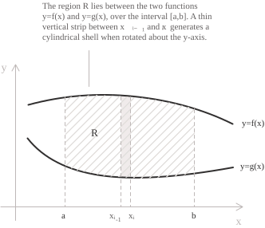
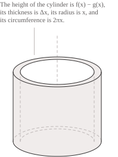
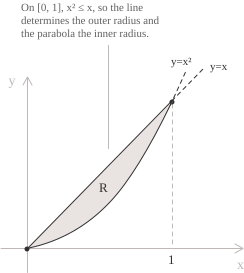

## There is always a way

Andrew Wiles is a British mathematician known for having proved Fermat's last theorem. In very simple terms, the theorem concerns the solutions of the following equation:

$$x^n + y^n = z^n \tag{1}$$

At first sight it looks harmless, but remember that in mathematics the complexity of an expression is inversely proportional to the simplicity with which it is written ($E=mc^2$ ring a bell?).

Fermat lived in the seventeenth century, and by that time equation $(1)$ was widely known. Back in the fifth century BC, Pythagoras was already handling it with a certain nonchalance in his celebrated theorem, which states that the sum of the squares built on the legs of a right triangle equals the area of the square built on the hypotenuse.

So far, nothing new. The problem lies elsewhere.

The theorem asserts that for $n>2$ the equation has no positive integer solutions, only real ones, which can be found without much trouble. Fermat is said to have noted in the margin of a book that he had found a proof of his theorem, but that the space was too narrow to contain it. I do not know whether the story has any historical basis, but I found it curious, so I have reported it and left the burden of verification to the historians. In any case, nobody has ever found that proof, and the problem stayed open until the 1990s.

Wiles seems to have learned of Fermat's theorem in the 1960s, and he was so taken with it that he devoted a large part of his professional life to it. He was only ten years old at the time, an age at which most children are still struggling with the nine times table. I confess that, while reading up on this episode, my self-esteem took a slight hit. I can assure you, though, that the sources attesting to it are numerous enough to make further checking unnecessary even for the more sceptical readers.

To cut a long story short, Wiles tried to prove the theorem as a boy and did not succeed. Later he spent years trying again, and failed. In 1993 he announced that he had solved it, but one of the referees, Nicholas Katz, dampened his enthusiasm by showing that the method he had used did not work. Two years later Wiles finally got to the bottom of it, changing method and so providing the support needed for the proof of the theorem that had occupied him for so long.

All this is to say that in mathematics there is almost always one method that works, among dozens that do not. The point is to find out which one. Luckily for us, in most of the problems met at school we do not have to invent anything, because the bulk of the work has already been done by others. We do have to be equipped well enough to spot the method that is most effective in terms of computation and solution.

- - -

To determine the volume of a solid of revolution we have already introduced [the disc method](../the-disc-method/) and [the washer method](../the-washer-method/), which offer two simple computational procedures through definite integrals over a given interval.

Matters become more complicated when the axis of revolution is not the $x$-axis but the $y$-axis. In that case the radius of the cross sections perpendicular to the $y$-axis is measured horizontally, and for this reason we must be able to express $x$ as a function of $y.$ In analytical terms, we have to invert the functions $f$ and $g$ that bound the plane region $R,$ and that operation is more often than not anything but painless.

Take, for instance, the region between the $x$-axis and the curve $y=2x^2-x^3$ on the interval $[0,2].$ To apply the washer method we would have to solve a cubic equation for $x,$ which is not exactly convenient. Since the curve is not injective on $[0,2],$ the inverse would also have to be built piece by piece, complicating the picture even further. This situation is unfortunately rather common in practice, because functions with no inverse in elementary form are the rule and not the exception.

To sidestep the problem entirely we have to change the way we decompose the solid. Instead of cutting it into [slices perpendicular to the axis of revolution](../volumes-from-parallel-cross-sections/), we picture it as made of many thin concentric shells, one inside the other. Since a vertical strip is described directly by the variable $x,$ we can compute the volume without rewriting the function in terms of $y.$

## The volume of a cylindrical shell

For uniformity, we set up the problem with the same notation used for washers. Let $f$ and $g$ be two functions continuous on $[a,b],$ with $0 \leq a$ and $g(x) \leq f(x)$ for every $x$ in the interval, and let $R$ be the plane region between the two graphs.

We call the solid between two coaxial cylinders of equal height $h$ and radii $r_1<r_2$ a cylindrical shell. Its volume is the difference between the volumes of the two cylinders:

$$V = \pi r_2^2h - \pi r_1^2h = \pi h\left(r_2^2-r_1^2\right)$$

The expression $r_2^2-r_1^2$ is a [difference of squares](../notable-products/) that factors as $(r_2+r_1)(r_2-r_1).$ With a few simple algebraic steps we obtain:

$$
\begin{align}
V &= \pi h(r_2+r_1)(r_2-r_1) \\[6pt]
  &= 2\pi \cdot \frac{r_1+r_2}{2} \cdot h \cdot (r_2-r_1)
\end{align}
$$

Here $(r_1+r_2)/2$ is the mean radius of the shell, $h$ is its height, $r_2-r_1$ is its thickness. The volume of a cylindrical shell is therefore given by the following expression:

$$V = 2\pi \cdot (\text{mean radius}) \cdot (\text{height}) \cdot (\text{thickness})$$

We now divide the interval $[a,b]$ into $n$ equal subintervals of width $\Delta x=(b-a)/n,$ determined by the points:

$$a = x_0 < x_1 < \cdots < x_n = b$$

On the generic subinterval $[x_{k-1},x_k]$ we take its midpoint $x_k^{*}$ as a reference point, and we consider the vertical strip $R_k$ of the region lying above that subinterval. If $\Delta x$ is small, the strip differs little from the rectangle of base $\Delta x$ and height $f(x_k^{*})-g(x_k^{*}).$

Rotating that rectangle about the $y$-axis gives exactly a cylindrical shell of inner radius $x_{k-1},$ outer radius $x_k$ and height $f(x_k^{*})-g(x_k^{*}).$ The choice of the midpoint turns out to be particularly convenient here, because the mean radius of the shell is precisely:

$$\frac{x_{k-1}+x_k}{2} = x_k^{*}$$

The volume of the shell then follows by substituting the mean radius $x_k^{*},$ the height $f(x_k^{*})-g(x_k^{*})$ and the thickness $\Delta x$ into the formula obtained just above, which gives:

$$\Delta V_k = 2\pi x_k^{*}\left[f(x_k^{*})-g(x_k^{*})\right]\Delta x$$

Adding the contributions of all the subintervals gives the following approximation to the volume of the solid:

$$V \approx \sum_{k=1}^{n} 2\pi x_k^{*}\left[f(x_k^{*})-g(x_k^{*})\right]\Delta x$$

The right-hand side is a [Riemann sum](../riemann-integrability-criteria/) of the function $2\pi x[f(x)-g(x)],$ which is continuous on $[a,b]$ because it is a product and a difference of continuous functions. The sum therefore converges to the [definite integral](../definite-integrals/) as $\Delta x \to 0,$ and the volume of the solid becomes:

$$V = 2\pi\int_a^b x\left[f(x)-g(x)\right] \ dx \tag{2}$$

When the region is bounded below by the $x$-axis, that is when $g$ is identically zero, the formula reduces to:

$$V = 2\pi\int_a^b xf(x) \ dx$$

## Rotation about other axes

As with washers, the construction does not require the axis of revolution to be a coordinate axis. Only the radius and the height of the strip appear in the formula, so it is enough to measure the radius from the actual axis.

If the rotation is about the vertical line $x=c$ with $c \leq a,$ the region lies entirely to the right of the axis and the radius of the strip is the difference $x-c.$ From this we obtain that the volume equals:

$$V = 2\pi\int_a^b (x-c)\left[f(x)-g(x)\right] \ dx$$

If instead $c \geq b,$ the region lies entirely to the left of the axis, distances are measured in the opposite direction and the radius becomes $c-x,$ hence:

$$V = 2\pi\int_a^b (c-x)\left[f(x)-g(x)\right] \ dx$$

When the rotation is about the $x$-axis the roles of the two variables are exchanged. The region has to be described in the form $q(y) \leq x \leq p(y)$ for $y \in [a,b],$ with $0 \leq a.$ The strips are now horizontal and the radius of each one is the ordinate $y,$ so the volume is:

$$V = 2\pi\int_a^b y\left[p(y)-q(y)\right] \ dy$$

If the axis of revolution cuts through the region, the solid generated by the left part overlaps the one generated by the right part. The sum of the volumes of the two pieces would then count the common zone twice, and its volume must therefore be subtracted.

## Example 1

By analogy, we repeat the example already seen in the entry on the [washer method](../the-washer-method/) and compute the volume of the solid generated by rotating the region between the line $y=x$ and the [parabola](../parabola/) $y=x^2$ about the $y$-axis.

The two curves meet when $x=x^2,$ that is at $x=0$ and $x=1,$ and on the interval $[0,1]$ we have $x^2 \leq x.$ The line is therefore the upper boundary of the region, with $f(x)=x,$ and the parabola is the lower boundary, with $g(x)=x^2.$

The vertical strip at $x$ has height $x-x^2$ and lies at distance $x$ from the axis of revolution. Using the formula we obtain:

$$
\begin{align}
V &= 2\pi\int_0^1 x\left(x-x^2\right) \ dx \\[6pt]
  &= 2\pi\int_0^1 \left(x^2-x^3\right) \ dx \\[6pt]
  &= 2\pi\left[\frac{x^3}{3}-\frac{x^4}{4}\right]_0^1 \\[6pt]
  &= 2\pi\left(\frac{1}{3}-\frac{1}{4}\right) \\[6pt]
  &= \frac{\pi}{6}
\end{align}
$$

The solid therefore has volume $\pi/6.$ The same value came out of the washer method, as it could hardly be otherwise.

## Example 2

We now go back to a slightly more awkward region, the one between the $x$-axis and the curve $y=2x^2-x^3,$ and rotate it about the $y$-axis.

The curve vanishes when $x^2(2-x)=0,$ that is at $x=0$ and $x=2,$ and on $[0,2]$ both factors are positive, so the curve lies above the axis. Our $f$ and our $g$ are therefore $f(x)=2x^2-x^3$ and $g(x)=0.$

When formula $(2)$ is applied, multiplying the height of the strip by the radius $x$ raises the degree of the polynomial by one:

$$
\begin{align}
V &= 2\pi\int_0^2 x\left(2x^2-x^3\right) \ dx \\[6pt]
  &= 2\pi\int_0^2 \left(2x^3-x^4\right) \ dx \\[6pt]
  &= 2\pi\left[\frac{x^4}{2}-\frac{x^5}{5}\right]_0^2 \\[6pt]
  &= 2\pi\left(8-\frac{32}{5}\right) \\[6pt]
  &= \frac{16\pi}{5}
\end{align}
$$

Note what has happened, because it is the central point of the method. The cubic that would have forced us to look for an inverse has stayed exactly as it was, multiplied by $x,$ and the resulting integral is the integral of a fourth-degree polynomial, which is very simple to evaluate. The shell method has not solved a hard problem, it has simply avoided creating one.

## Example 3

Consider again the region between $y=x$ and $y=x^2$ on $[0,1]$ from Example 1, but rotate it about the vertical line $x=2.$ The region lies entirely to the left of the axis, since $1 \leq 2,$ so the radius of the strip is measured from right to left and equals $2-x.$ The height does not change, because it depends only on the two curves, and remains $x-x^2.$ The volume is therefore:

$$V = 2\pi\int_0^1 (2-x)\left(x-x^2\right) \ dx$$

Carrying out the computation gives:

$$
\begin{align}
V &= 2\pi\int_0^1 \left(x^3-3x^2+2x\right) \ dx \\[6pt]
  &= 2\pi\left[\frac{x^4}{4}-x^3+x^2\right]_0^1 \\[6pt]
  &= 2\pi\left(\frac{1}{4}-1+1\right) \\[6pt]
  &= \frac{\pi}{2}
\end{align}
$$

The volume obtained, equal to $\pi/2,$ is larger than the value $\pi/6$ obtained in Example 1, for the same reason as in the corresponding washer example. Moving the region away from the axis of revolution makes each of its points describe a circle of larger radius, and this gives a larger volume.

## How to choose the method

We have now come to contemplate three different methods for the same family of problems, each with its own features, and it is reasonable to ask which one to use. Luckily for us the criterion is fairly simple.

Discs and washers cut the region perpendicularly to the axis of revolution, so the variable of integration is the one measured parallel to the axis. Shells cut the region parallel to the axis, so the variable of integration is the one measured perpendicular to the axis. Set out in practical terms, the whole thing can be summarised in the following points:

+ Discs or washers are used for a rotation about the $x$-axis with a region described by $y=f(x),$ or for a rotation about the $y$-axis with a region described by $x=p(y)$
+ Shells are used for a rotation about the $y$-axis with a region described by $y=f(x).$ The same holds for a rotation about the $x$-axis with a region described by $x=p(y).$

Always keep in mind that, when choosing a method, one should lean towards the one that avoids inverting the functions.

- - -

One last case remains, the one where shells are not merely convenient to set up but indispensable. Consider the region between the $x$-axis and the curve $y=\sin(x^2)$ for $x \in [0,\sqrt{\pi}],$ rotated about the $y$-axis. Applying the shell method the volume becomes:

$$V = 2\pi\int_0^{\sqrt{\pi}} x\sin(x^2) \ dx$$

This is a typical integral solved by [substitution](../integration-by-substitution/), setting $u=x^2,$ from which $du=2x \ dx.$ The integral becomes:

$$\pi\int_0^{\pi}\sin(u) \ du$$

The computation is immediate and gives $2\pi.$ Here the shell method made the variable $x$ appear in the formula, and that factor is what made the substitution possible. Had we used the washer method instead, we would have had to invert $\sin(x^2)$ (which has no elementary inverse), and we would have been left bogged down in the computation with no way out.
