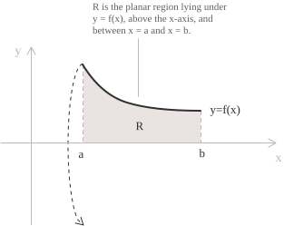
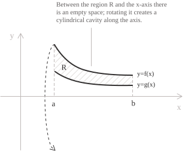
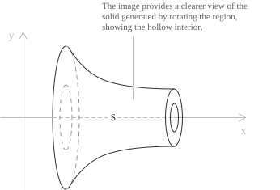
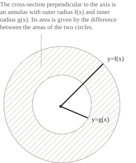

## Plane regions separated from the axis of revolution

The washer method is used to compute the volume of a solid of revolution that contains a cavity. Before introducing the procedure and formulas, however, we need to make a preliminary observation.

If you have had the patience to make it this far, you will agree that integrals are not merely analytical tools devised to make students' lives difficult. Their geometric usefulness is clear and far from negligible. We must also admit that the types of integrals considered so far are less daunting than the beginning of this section suggested. This does not make them inherently friendly objects. It means only that the topics covered so far have treated us with a certain courtesy, one that, as we shall see, will quickly wear thin as we move on.

When we introduced [definite integrals](../definite-integrals/), we learned that they measure the signed area between a curve $\gamma$ and the $x$-axis. Regions above the $x$-axis contribute positively, whereas regions below it contribute negatively.

As the discussion continued, we saw that integrals can also be used to compute volumes, especially those of solids obtained by rotating a plane region $R$ about the $x$-axis. One way to determine such a volume is the [disc method](../the-disc-method/). In its most compact form, the method expresses the volume as the following definite integral:

$$V = \int_a^b \pi \big(f(x)\big)^2 \ dx$$

Notice that rotating the plane region about the $x$-axis produces a solid with no cavity. Its volume is therefore relatively straightforward to compute.

The figure shows the graph of a single function $f(x).$ Together with the $x$-axis, it bounds a region $R$ lying entirely above the axis.

How would the situation change if another curve $g(x)$ lay between the $x$-axis and the graph of $f(x)?$ Suppose that $f$ and $g$ are continuous on $[a,b],$ and that $0 \lt g(x) \lt f(x)$ for every $x$ in this interval.

In this case too, the two curves enclose a plane region $R$ similar to the one shown in the first figure. One difference is immediately apparent. Since $g(x)>0,$ the region $R$ is separated from the $x$-axis. Rotating it about that same axis therefore produces a hollow solid whose outer profile is determined by $f(x)$ and whose inner profile is determined by $g(x).$

At each point $x_0,$ a plane perpendicular to the $x$-axis cuts $S$ in an annulus bounded by two concentric circles. The outer circle has radius $f(x_0),$ and the inner circle has radius $g(x_0).$

The area of an annulus is the difference between the areas of the discs with radii $f(x)$ and $g(x).$ Therefore:

$$A(x) = \pi(f(x))^2 - \pi(g(x))^2 = \pi\left[(f(x))^2 - (g(x))^2\right]$$

Keep in mind that the difference is taken between the squares of the two radii, not between the radii themselves, because we are subtracting areas.

## Determining the volume

We now come to the heart of the volume computation. First, we divide the interval $[a,b]$ into $n$ equal subintervals of width $\Delta x = (b-a)/n,$ using the partition points:

$$a = x_0 < x_1 < \cdots < x_n = b$$

We can denote a typical subinterval by $[x_{k-1}, x_k]$ and choose a point $x_k^{*}$ inside it, at which to measure the two radii.

When $\Delta x$ is small, the portion of $S$ over $[x_{k-1},x_k]$ differs little from an elementary solid. More precisely, it can be approximated by a cylinder of radius $f(x_k^{*})$ from which a smaller inner cylinder of radius $g(x_k^{*})$ has been removed. Both cylinders have height $\Delta x.$ It is easy to see that the volume of this washer is simply the difference between the volumes of the two cylinders:

$$
\begin{align}
\Delta V_k &= \pi(f(x_k^{*}))^2\Delta x - \pi(g(x_k^{*}))^2\Delta x \\[6pt]
           &= \pi\left[(f(x_k^{*}))^2 - (g(x_k^{*}))^2\right]\Delta x
\end{align}
$$

Summing the contributions of all the portions obtained from the individual subintervals gives an approximation of the volume of $S$:

$$V \approx \sum_{k=1}^{n} \pi\left[(f(x_k^{*}))^2 - (g(x_k^{*}))^2\right]\Delta x$$

The right-hand side is a [Riemann sum](../riemann-integrability-criteria/) of the function $\pi(f^2 - g^2).$ Since $f$ and $g$ are continuous on $[a,b],$ their difference $f^2 - g^2$ is continuous as well. Therefore the integrand is Riemann integrable and the sum converges to the [definite integral](../definite-integrals/) as $\Delta x \to 0.$

As $n$ increases the individual portions become thinner and approximate the profile of the solid better. In this case the volume of $S$ is:

$$V = \pi\int_a^b \left[f^2(x) - g^2(x)\right] \ dx$$

By the linearity of the integral we can also write:

$$V = \pi \left[\int_a^b f^2(x) \ dx - \int_a^b g^2(x) \ dx\right]$$

As in the preceding construction, the term involving $f(x)^2$ gives the volume of the solid generated by the graph of $f,$ whereas the term involving $g(x)^2$ gives the volume of the cavity.

When $g$ is zero the annulus degenerates into a full disc and the formula reduces to that of the disc method, which is a limiting case of the washer method.

- - -

This construction does not require the axis of revolution to be a coordinate axis. The formula contains only the two radii of the annulus, so their lengths need only be measured from the actual axis of revolution rather than, for example, from the $x$-axis. In the simple case of rotation about a horizontal line $y = c$ with $c \leq g(x) \leq f(x),$ the outer radius of the annulus is $f(x) - c$ and the inner radius is $g(x) - c.$ The volume can therefore be written as:

$$V = \pi\int_a^b \left[(f(x)-c)^2 - (g(x)-c)^2\right] \ dx$$

When instead the axis lies above $f$ and $g$, that is $g(x) \leq f(x) \leq c,$ the distances are measured in the opposite direction and the two radii become $c - g(x)$ and $c - f(x).$ In this case it is as if $f$ and $g$ were interchanged, so that $g$ gives the outer radius and $f$ the inner one. The volume must therefore be rewritten as in the following formula:

$$V = \pi\int_a^b \left[(c-g(x))^2 - (c-f(x))^2\right] \ dx$$

When the rotation takes place about the $y$-axis, the roles of the two variables are exchanged and the region must be described in the form $0 \leq q(y) \leq x \leq p(y)$ for $y \in [a,b].$ In this case the volume is determined by:

$$V = \pi\int_a^b \left[(p(y))^2 - (q(y))^2\right] \ dy$$

For a generic vertical line $x = c,$ the radii must instead be measured from that line. If $c \leq q(y) \leq p(y),$ the volume is:

$$V = \pi\int_a^b \left[(p(y)-c)^2 - (q(y)-c)^2\right] \ dy$$

If instead $q(y) \leq p(y) \leq c,$ the outer radius is $c-q(y)$ and the inner one is $c-p(y),$ so the volume is:

$$V = \pi\int_a^b \left[(c-q(y))^2 - (c-p(y))^2\right] \ dy$$

The underlying principle is much the same as for rotation about the $x$-axis. Although these procedures may now seem almost mechanical, you should remain alert to avoid simple errors when solving exercises. It is quite possible to choose the correct method and still make a mistake in the details, and in an examination even a small lapse can prove fatal.

## Example 1

We now work through a few typical examples, computing the volume of the solid generated by rotating the region between the line $y = x$ and the [parabola](../parabola/) $y = x^2$ about the $x$-axis.

The two curves meet when $x = x^2,$ that is at $x = 0$ and $x = 1,$ and on the interval $[0,1]$ we have $x^2 \leq x.$ Thus $f(x)=x$ gives the outer radius, while $g(x)=x^2$ gives the inner radius.

Using the formula for the annulus we obtain

$$V = \pi\int_0^1 \left[x^2 - (x^2)^2\right] \ dx = \pi\int_0^1 \left(x^2 - x^4\right) \ dx$$

As noted above, linearity allows us to split the integral into two terms and evaluate them separately. The resulting calculation is straightforward, and its steps are shown below.

$$
\begin{align}
V &= \pi\left[\frac{x^3}{3} - \frac{x^5}{5}\right]_0^1 \\[6pt]
  &= \pi\left(\frac{1}{3} - \frac{1}{5}\right) \\[6pt]
  &= \pi \cdot \frac{5-3}{15} \\[6pt]
  &= \frac{2\pi}{15}
\end{align}
$$

The solid generated by rotating the region between $y = x$ and $y = x^2$ about the $x$-axis therefore has volume exactly $2\pi/15.$

## Example 2

We now consider the same region as in the previous example, but we rotate it about the line $y = -1.$ This rotation obviously produces a solid different from the one obtained in Example 1, with a cavity that now runs through its whole length. Note that the two curves lie above the line $y = -1,$ so the distances are measured upwards. The outer radius is therefore given by the distance between the axis and the farther curve, that is the line $y = x$:

$$f(x) - c = x - (-1) = x+1$$

Applying the same procedure to the parabola gives the inner radius:

$$g(x) - c = x^2 - (-1) = x^2+1$$

The volume is computed by substituting the two radii into the formula:

$$V = \pi\int_0^1 \left[(x+1)^2 - (x^2+1)^2\right] \ dx$$

Expanding the squares gives, without difficulty, a fourth-degree [polynomial](../polynomials/) inside the integral sign:

$$
\begin{align}
(x+1)^2 - (x^2+1)^2 &= x^2 + 2x + 1 - x^4 - 2x^2 - 1 \\[6pt]
                    &= -x^4 - x^2 + 2x
\end{align}
$$

This is always good news, since the integral of a polynomial is the simplest kind of integral you can encounter. Do not get too used to such cases, however. In practice, you will almost always meet far less accommodating integrals, which are unlikely to make you smile. For our present purposes, we can enjoy our good fortune while it lasts and obtain:

$$
\begin{align}
V &= \pi\int_0^1 \left(-x^4 - x^2 + 2x\right) \ dx \\[6pt]
  &= \pi\left[-\frac{x^5}{5} - \frac{x^3}{3} + x^2\right]_0^1 \\[6pt]
  &= \pi\left(-\frac{1}{5} - \frac{1}{3} + 1\right) \\[6pt]
  &= \pi \cdot \frac{-3-5+15}{15} \\[6pt]
  &= \frac{7\pi}{15}
\end{align}
$$

Notice a point that is interesting and not entirely obvious. The volume $7\pi/15$ is greater than the volume $2\pi/15$ found in Example 1. How can this happen if the same curves define the region in both cases? The reason lies in elementary geometry, and it is perfectly natural not to see it at once. Mathematics can make a simple fact look complicated until we examine it more closely. Moving the region farther from the axis makes each point trace a circle of larger radius and therefore produces a larger volume.

## Example 3

We finish with one standard example. Consider a sphere of radius $R$ from which a ring is formed by drilling a cylindrical hole of radius $a$ along a diameter, with $0<a<R.$ We shall compute the volume of the remaining solid.

Our sphere is the solid generated by rotating a semicircle $y = \sqrt{R^2-x^2},$ while the hole is generated by rotating the horizontal line $y = a.$ As in the previous cases, the remaining solid is therefore generated by the region between the two curves, with outer radius $f(x) = \sqrt{R^2-x^2}$ and inner radius $g(x) = a.$

The limits of integration are the abscissas at which the two curves meet, so in our case $x = \pm\sqrt{R^2-a^2}$. We set $c = \sqrt{R^2-a^2},$ and obtain:

$$V = \pi\int_{-c}^{c} \left[(R^2-x^2) - a^2\right] \ dx$$

Since $R^2 - a^2 = c^2,$ we can rewrite everything in terms of $c$:

$$V = \pi\int_{-c}^{c} \left(c^2 - x^2\right) \ dx$$

By a fortunate coincidence the function inside the integral sign is even (symmetric with respect to the $y$-axis), so the integral over the interval $[-c,c]$ is exactly twice the integral over $[0,c]$ and is easily computed as:

$$
\begin{align}
V &= 2\pi\int_{0}^{c} \left(c^2 - x^2\right) \ dx \\[6pt]
  &= 2\pi\left[c^2x - \frac{x^3}{3}\right]_0^{c} \\[6pt]
  &= 2\pi\left(c^3 - \frac{c^3}{3}\right) \\[6pt]
  &= \frac{4\pi c^3}{3}
\end{align}
$$

When we substitute the original value for $c,$ the resulting volume is:

$$V = \frac{4\pi}{3}\left(R^2-a^2\right)^{3/2}$$

The result can also be rewritten in terms of the height $h$ of the remaining ring, that is the distance between the two circles bounding the openings of the hole. Since $h = 2c,$ substituting $c = h/2$ gives:

$$V = \frac{4\pi}{3}\left(\frac{h}{2}\right)^3 = \frac{\pi h^3}{6}$$

As can be seen, the volume of the ring depends only on its height, and not on the radius of the original sphere, so two rings of the same height have the same volume even if they are obtained from spheres of very different size.

## Some final considerations

So far, our treatment has considered only the condition $g(x) \leq f(x),$ which must hold throughout $[a,b].$ In applications, however, less accommodating situations can arise. If the two curves intersect at $x=c,$ divide the interval into $[a,c]$ and $[c,b]$ and write a separate integral over each subinterval, following the same principle used for [finding areas](../finding-areas-by-integration/).

The choice of method for determining the volume of a solid of revolution depends mainly on the position of the axis relative to the region and on the variable used to describe the region. When the axis of revolution forms part of the boundary, the rotation produces a solid with no central cavity, so the [disc method](../the-disc-method/) applies.

When a region naturally described in terms of $x$ is rotated about a vertical axis, or a region naturally described in terms of $y$ is rotated about a horizontal axis, the washer method requires the boundary curves to be rewritten in terms of the other variable.

Finally, when the cross sections perpendicular to the axis are not annuli, the washer formula does not apply. In that case, one must use the general cross-section method, which requires only the area $A(x)$ of each section.
