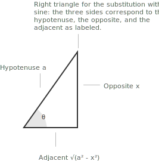

## How trigonometric substitution works

Trigonometric substitution is a method for evaluating [integrals](../indefinite-integrals/) that contain [square roots](../radicals/) of quadratic expressions. Certain algebraic forms become considerably easier to handle once they are rewritten through the [Pythagorean identities](../pythagorean-identity/) of trigonometry. The method consists in a change of variables $x = \phi(\theta)$ chosen so that the quadratic expression under the radical is transformed into the square of a trigonometric function in the new variable.

After an appropriate algebraic manipulation, many integrals in elementary calculus can be reduced to one of the following canonical forms, with $a > 0$:

$$\sqrt{a^2 - x^2} \qquad \sqrt{x^2 + a^2} \qquad \sqrt{x^2 - a^2}$$

For the radical to be real-valued, the variable $x$ must lie in the corresponding domain:

+ $\sqrt{a^2 - x^2}$ requires $x \in [-a, a]$.
+ $\sqrt{x^2 + a^2}$ is defined for every $x \in \mathbb{R}$.
+ $\sqrt{x^2 - a^2}$ requires $x \in (-\infty, -a] \cup [a, +\infty)$.

These restrictions are essential, since they determine not only where the integrand is defined, but also the admissible range of the auxiliary angle $\theta$ introduced in the substitution. In particular, the choice of the [interval](../intervals/) for $\theta$ ensures that inverse trigonometric functions are well defined and that absolute values arising from square roots can be handled consistently. Each of these expressions is naturally linked to a Pythagorean identity:

$$1 - \sin^2\theta = \cos^2\theta$$

$$1 + \tan^2\theta = \sec^2\theta$$

$$\sec^2\theta - 1 = \tan^2\theta$$

> The substitution in each case is chosen so that the term inside the square root matches the left-hand side of one of these identities, which turns the radical into an expression without radicals. Integrals involving rational functions of $\sin x$ and $\cos x$ are instead usually treated through the [Weierstrass substitution](../weierstrass-substitution/), which transforms trigonometric expressions into rational functions of a new variable.

- - -

In practice, the expression under the square root is rarely presented in one of the three canonical forms straight away. A common preliminary step is to rewrite a general quadratic $ax^2 + bx + c$ in a form that matches one of the standard patterns, by [completing the square](../completing-the-square/). For instance, $x^2 + 4x + 5$ becomes $(x + 2)^2 + 1$ after completing the square, which is of the form $u^2 + a^2$ with $u = x + 2$ and $a = 1$. Once the quadratic has been rewritten in this way, a simple substitution $u = x + k$ reduces the integral to one of the three cases described below, and the appropriate trigonometric substitution can then be applied.

> Recognising this preliminary step often determines which substitution is needed. When the integrand does not immediately match a familiar pattern, the rewriting by completing the square is what makes the correct case visible.

## From substitutions to geometry

From a geometric point of view, these substitutions can be interpreted as parametrisations of conic sections. The correspondence between each Pythagorean identity and the curve it describes is the following.

+ The identity $\sin^2\theta + \cos^2\theta = 1$ corresponds to the [unit circle](../unit-circle/) and underlies the case $\sqrt{a^2 - x^2}$.
+ The identities $1 + \tan^2\theta = \sec^2\theta$ and $\sec^2\theta - 1 = \tan^2\theta$ are related to the geometry of the [hyperbola](../hyperbola/) $x^2 - y^2 = a^2$, and underlie the forms $\sqrt{x^2 + a^2}$ and $\sqrt{x^2 - a^2}$.

Trigonometric substitution can therefore be understood as a geometric reparametrisation of quadratic curves, and not only as an algebraic device.

## The form $\sqrt{a^2 - x^2}$

When the integrand contains an expression of the form $\sqrt{a^2 - x^2}$, the appropriate trigonometric substitution reflects the Pythagorean identity $1 - \sin^2\theta = \cos^2\theta$, which itself follows from the fundamental relation between [sine and cosine](../sine-and-cosine/). Set:

$$x = a\sin\theta$$

so that the algebraic quantity under the square root can be rewritten in terms of a trigonometric [function](../functions/). Differentiating both sides with respect to $\theta$:

$$dx = a\cos\theta \ d\theta$$

Substituting $x = a\sin\theta$ into the radical expression:

$$\sqrt{a^2 - x^2} = \sqrt{a^2 - a^2\sin^2\theta}$$

Factoring $a^2$ from the expression inside the radical yields:

$$\sqrt{a^2(1 - \sin^2\theta)}$$

Using the identity $1 - \sin^2\theta = \cos^2\theta$, this becomes:

$$\sqrt{a^2\cos^2\theta} = a\sqrt{\cos^2\theta} = a|\cos\theta|$$

To avoid ambiguity related to the absolute value, the angle $\theta$ is customarily restricted to the interval:

$$\theta \in \left[-\frac{\pi}{2}, \frac{\pi}{2}\right]$$

since on this interval $\cos\theta \geq 0$. Under this restriction, the absolute value is no longer necessary, and the radical simplifies to:

$$\sqrt{a^2 - x^2} = a\cos\theta$$

Returning to the original variable $x$, the relationships implied by the substitution can be written explicitly as:

$$\sin\theta = \frac{x}{a} \qquad \cos\theta = \frac{\sqrt{a^2 - x^2}}{a}$$

The angle can be expressed through the [arcsine](../arcsine-and-arccosine/):

$$\theta = \arcsin\left(\frac{x}{a}\right)$$

These relations allow the final result of the integration to be expressed entirely in terms of the original variable.

> A geometric interpretation is often helpful. If $\sin\theta = x/a$, a [right triangle](../right-triangle-trigonometry/) with hypotenuse $a$, opposite side $x$, and adjacent side $\sqrt{a^2 - x^2}$ encodes the relevant identities.

The standard correspondences for $\sqrt{a^2 - x^2}$ can be summarised as follows:

+ Radical form: $\sqrt{a^2 - x^2}$.
+ Substitution: $x = a\sin\theta$.
+ Identity used: $1 - \sin^2\theta = \cos^2\theta$.

## Geometric interpretation

When working with trigonometric substitutions, it is often useful to visualise the relationship between $\theta$ and $x$ through a right triangle. Reading the values of the trigonometric functions directly from the sides of the triangle removes the need to solve for $\theta$ explicitly.

From $x = a\sin\theta$, a right triangle is constructed where:

+ the hypotenuse is $a$,
+ the opposite side is $x$,
+ the adjacent side is $\sqrt{a^2 - x^2}$.

Since $\sin\theta = x/a$, it follows that $\cos\theta = \sqrt{a^2 - x^2}/a$. This geometric representation allows all trigonometric functions of $\theta$ to be rewritten directly in terms of $x$.

> The same construction applies to the other two standard forms. For $\sqrt{x^2 + a^2}$ the triangle has opposite side $x$, adjacent side $a$, and hypotenuse $\sqrt{x^2 + a^2}$; for $\sqrt{x^2 - a^2}$ the hypotenuse becomes $x$, the adjacent side $a$, and the opposite side $\sqrt{x^2 - a^2}$. In each case the triangle is built directly from the substitution and serves as a guide for the back-substitution step.

## Example 1

Evaluate the following integral:

$$\int \sqrt{a^2 - x^2} \ dx \qquad (a > 0)$$

Since the integrand contains the expression $\sqrt{a^2 - x^2}$, introduce the trigonometric substitution:

$$x = a\sin\theta \qquad \theta \in \left[-\frac{\pi}{2}, \frac{\pi}{2}\right]$$

so that the identity $1 - \sin^2\theta = \cos^2\theta$ applies with $\cos\theta \geq 0$ on this interval. Differentiating the substitution gives:

$$dx = a\cos\theta \ d\theta$$

The radical rewrites as:

$$\sqrt{a^2 - x^2} = \sqrt{a^2 - a^2\sin^2\theta} = a\sqrt{1 - \sin^2\theta} = a\cos\theta$$

Substituting everything into the integral:

$$
\begin{align}
\int \sqrt{a^2 - x^2} \ dx &= \int (a\cos\theta)(a\cos\theta \ d\theta) \\[6pt]
                          &= a^2 \int \cos^2\theta \ d\theta
\end{align}
$$

To integrate $\cos^2\theta$, use the [double-angle identity](../reduction-formulas-and-reference-angles/):

$$\cos^2\theta = \frac{1 + \cos 2\theta}{2}$$

Therefore:

$$a^2 \int \cos^2\theta \ d\theta = \frac{a^2}{2}\int (1 + \cos 2\theta) \ d\theta$$

Integrating term by term:

$$\frac{a^2}{2}\theta + \frac{a^2}{4}\sin 2\theta + c$$

Returning to the variable $x$, the substitution $x = a\sin\theta$ gives:

$$\theta = \arcsin\left(\frac{x}{a}\right)$$

Using the identity $\sin 2\theta = 2\sin\theta\cos\theta$ together with:

$$\sin\theta = \frac{x}{a} \qquad \cos\theta = \frac{\sqrt{a^2 - x^2}}{a}$$

one obtains:

$$\sin 2\theta = 2 \cdot \frac{x}{a} \cdot \frac{\sqrt{a^2 - x^2}}{a} = \frac{2x\sqrt{a^2 - x^2}}{a^2}$$

Substituting back:

$$\frac{a^2}{2}\theta + \frac{a^2}{4}\sin 2\theta = \frac{a^2}{2}\arcsin\left(\frac{x}{a}\right) + \frac{x}{2}\sqrt{a^2 - x^2}$$

The result is:

$$\int \sqrt{a^2 - x^2} \ dx = \frac{x}{2}\sqrt{a^2 - x^2} + \frac{a^2}{2}\arcsin\left(\frac{x}{a}\right) + c$$

> The integral has been reduced to a trigonometric form, evaluated through standard identities, and finally rewritten entirely in terms of the original variable $x$.

## The form $\sqrt{x^2 + a^2}$

When the integrand contains an expression of the form $\sqrt{x^2 + a^2}$, a substitution based on the Pythagorean identity:

$$1 + \tan^2\theta = \sec^2\theta$$

is convenient. This identity relates the [tangent](../tangent-and-cotangent/) and the [secant](../secant-and-cosecant/). Set $x = a\tan\theta$ so that the quadratic expression inside the square root can be rewritten in terms of a trigonometric function. Differentiating both sides with respect to $\theta$:

$$dx = a\sec^2\theta \ d\theta$$

Substituting $x = a\tan\theta$ into the radical expression:

$$\sqrt{x^2 + a^2} = \sqrt{a^2\tan^2\theta + a^2}$$

Factoring $a^2$ from the expression inside the square root:

$$\sqrt{a^2(\tan^2\theta + 1)}$$

Using the identity $1 + \tan^2\theta = \sec^2\theta$, this becomes:

$$\sqrt{a^2\sec^2\theta} = a\sqrt{\sec^2\theta} = a|\sec\theta|$$

To eliminate the ambiguity introduced by the absolute value, the angle $\theta$ is restricted to:

$$\theta \in \left(-\frac{\pi}{2}, \frac{\pi}{2}\right)$$

since on this interval $\cos\theta > 0$ and therefore $\sec\theta > 0$. Under this restriction, the radical simplifies to:

$$\sqrt{x^2 + a^2} = a\sec\theta$$

Returning to the original variable $x$, the relationships implied by the substitution can be written explicitly as:

$$\tan\theta = \frac{x}{a} \qquad \sec\theta = \frac{\sqrt{x^2 + a^2}}{a} \qquad \theta = \arctan\left(\frac{x}{a}\right)$$

> The geometric interpretation is immediate. From the relation $\tan\theta = x/a$, a right triangle can be constructed in which the adjacent side has length $a$, the opposite side has length $x$, and the hypotenuse, by the [Pythagorean theorem](../pythagorean-theorem/), has length $\sqrt{x^2 + a^2}$. The triangle provides a geometric picture of the substitution and clarifies why the radical expression collapses into a trigonometric function.

The standard correspondences for $\sqrt{x^2 + a^2}$ can be summarised as follows:

+ Radical form: $\sqrt{x^2 + a^2}$.
+ Substitution: $x = a\tan\theta$.
+ Identity used: $1 + \tan^2\theta = \sec^2\theta$.

## Example 2

Evaluate the following integral:

$$\int \frac{dx}{\sqrt{x^2 + a^2}} \qquad (a > 0)$$

Since the integrand contains $\sqrt{x^2 + a^2}$, introduce the trigonometric substitution:

$$x = a\tan\theta \qquad \theta \in \left(-\frac{\pi}{2}, \frac{\pi}{2}\right)$$

so that the identity $1 + \tan^2\theta = \sec^2\theta$ applies with $\sec\theta > 0$ on this interval. Differentiating the substitution gives:

$$dx = a\sec^2\theta \ d\theta$$

The radical rewrites as:

$$
\begin{align}
\sqrt{x^2 + a^2} &= \sqrt{a^2\tan^2\theta + a^2} \\[6pt]
                 &= a\sqrt{\tan^2\theta + 1} \\[6pt]
                 &= a\sec\theta
\end{align}
$$

Substituting everything into the integral:

$$\int \frac{dx}{\sqrt{x^2 + a^2}} = \int \frac{a\sec^2\theta}{a\sec\theta} \ d\theta = \int \sec\theta \ d\theta$$

To evaluate $\int \sec\theta \ d\theta$, multiply the integrand by $(\sec\theta + \tan\theta)/(\sec\theta + \tan\theta)$:

$$
\begin{align}
\int \sec\theta \ d\theta &= \int \frac{\sec\theta(\sec\theta + \tan\theta)}{\sec\theta + \tan\theta} \ d\theta \\[6pt]
                          &= \int \frac{\sec^2\theta + \sec\theta\tan\theta}{\sec\theta + \tan\theta} \ d\theta
\end{align}
$$

Setting $u = \sec\theta + \tan\theta$ gives $du = (\sec^2\theta + \sec\theta\tan\theta) \ d\theta$, so the numerator is exactly $du$ and the integral reduces to:

$$\int \frac{du}{u} = \ln|u| + c = \ln|\sec\theta + \tan\theta| + c$$

Returning to the variable $x$, using:

$$\tan\theta = \frac{x}{a} \qquad \sec\theta = \frac{\sqrt{x^2 + a^2}}{a}$$

one obtains:

$$\ln|\sec\theta + \tan\theta| + c = \ln\left|\frac{\sqrt{x^2 + a^2} + x}{a}\right| + c$$

Since $\sqrt{x^2 + a^2} > |x|$ for every $x \in \mathbb{R}$, the quantity $\sqrt{x^2 + a^2} + x$ is strictly positive, and the absolute value can be dropped. Moreover:

$$\ln\left|\frac{\sqrt{x^2 + a^2} + x}{a}\right| = \ln\!\left(\sqrt{x^2 + a^2} + x\right) - \ln a$$

and $\ln a$ is a constant that can be absorbed into $c$. The result is:

$$\int \frac{dx}{\sqrt{x^2 + a^2}} = \ln\!\left(\sqrt{x^2 + a^2} + x\right) + c$$

> The integral has been reduced to a trigonometric form, evaluated through a standard manipulation of the secant, and finally rewritten entirely in terms of the original variable $x$.

## The form $\sqrt{x^2 - a^2}$

When the integrand contains an expression of the form $\sqrt{x^2 - a^2}$, the natural substitution is based on the Pythagorean identity:

$$\sec^2\theta - 1 = \tan^2\theta$$

which is equivalent to the fundamental relation $1 + \tan^2\theta = \sec^2\theta$. Set:

$$x = a\sec\theta$$

so that the quadratic expression inside the square root can be rewritten in terms of trigonometric functions. Differentiating both sides with respect to $\theta$:

$$dx = a\sec\theta\tan\theta \ d\theta$$

Substituting $x = a\sec\theta$ into the radical expression:

$$\sqrt{x^2 - a^2} = \sqrt{a^2\sec^2\theta - a^2}$$

Factoring $a^2$ inside the square root:

$$\sqrt{a^2(\sec^2\theta - 1)}$$

Using the identity $\sec^2\theta - 1 = \tan^2\theta$, this becomes:

$$\sqrt{a^2\tan^2\theta} = a\sqrt{\tan^2\theta} = a|\tan\theta|$$

The presence of the absolute value reflects the fact that the sign of $\tan\theta$ depends on the chosen domain for $\theta$. Working under the assumption $x \geq a$, a convenient restriction is:

$$\theta \in \left[0, \frac{\pi}{2}\right)$$

since on this interval $\sec\theta \geq 1$ and $\tan\theta \geq 0$. Under this restriction, the radical simplifies to:

$$\sqrt{x^2 - a^2} = a\tan\theta$$

> When $x \leq -a$, the corresponding restriction is $\theta \in \left(\frac{\pi}{2}, \pi\right]$, so that $\sec\theta \leq -1$ and $\tan\theta \leq 0$; in that case $|\tan\theta| = -\tan\theta$. For most textbook problems it suffices to assume $x \geq a$ and work with the interval $\left[0, \frac{\pi}{2}\right)$.

- - -

Returning to the original variable $x$, the relationships implied by the substitution can be written explicitly as:

$$\sec\theta = \frac{x}{a} \qquad \tan\theta = \frac{\sqrt{x^2 - a^2}}{a}$$

Equivalently, the angle itself can be expressed through an inverse trigonometric function:

$$\theta = \operatorname{arcsec}\left(\frac{x}{a}\right)$$

on a suitable domain. In many practical situations, however, it is sufficient to rewrite $\tan\theta$ and $\sec\theta$ directly in terms of $x$ and $\sqrt{x^2 - a^2}$, without explicitly solving for $\theta$.

> The geometric interpretation follows directly from the relation $\sec\theta = x/a$. A [right triangle](../right-triangle-trigonometry/) can be constructed in which the hypotenuse has length $x$, the adjacent side has length $a$, and the opposite side, by the Pythagorean theorem, has length $\sqrt{x^2 - a^2}$. This triangle makes the substitution geometrically transparent and provides a way to read off the values of $\sec\theta$ and $\tan\theta$ directly from the sides, without solving for $\theta$ explicitly.

## Example 3

Evaluate the following integral:

$$\int \frac{dx}{\sqrt{x^2 - a^2}} \qquad (a > 0, \ x > a)$$

Since the integrand contains $\sqrt{x^2 - a^2}$, introduce the trigonometric substitution:

$$x = a\sec\theta \qquad \theta \in \left[0, \frac{\pi}{2}\right)$$

so that the identity $\sec^2\theta - 1 = \tan^2\theta$ applies with $\tan\theta \geq 0$ on this interval. Differentiating the substitution gives:

$$dx = a\sec\theta\tan\theta \ d\theta$$

The radical rewrites as:

$$
\begin{align}
\sqrt{x^2 - a^2} &= \sqrt{a^2\sec^2\theta - a^2} \\[6pt]
                 &= a\sqrt{\sec^2\theta - 1} \\[6pt]
                 &= a\tan\theta
\end{align}
$$

Substituting everything into the integral:

$$\int \frac{dx}{\sqrt{x^2 - a^2}} = \int \frac{a\sec\theta\tan\theta}{a\tan\theta} \ d\theta = \int \sec\theta \ d\theta$$

Evaluating $\int \sec\theta \ d\theta$ as in Example 2:

$$\int \sec\theta \ d\theta = \ln|\sec\theta + \tan\theta| + c$$

Returning to the variable $x$, using:

$$\sec\theta = \frac{x}{a} \qquad \tan\theta = \frac{\sqrt{x^2 - a^2}}{a}$$

one obtains:

$$\ln|\sec\theta + \tan\theta| + c = \ln\!\left|\frac{x + \sqrt{x^2 - a^2}}{a}\right| + c$$

Since $x > a > 0$ and $\sqrt{x^2 - a^2} \geq 0$, the quantity $x + \sqrt{x^2 - a^2}$ is strictly positive, and the absolute value can be dropped. Moreover:

$$\ln\!\left(\frac{x + \sqrt{x^2 - a^2}}{a}\right) = \ln\!\left(x + \sqrt{x^2 - a^2}\right) - \ln a$$

and $\ln a$ is a constant that can be absorbed into $c$. The result is:

$$\int \frac{dx}{\sqrt{x^2 - a^2}} = \ln\!\left(x + \sqrt{x^2 - a^2}\right) + c$$

> The structure of the derivation closely mirrors that of Example 2. In both cases the substitution reduces the integral to $\int \sec\theta \ d\theta$, and the difference lies entirely in the back-substitution step, where the expressions for $\sec\theta$ and $\tan\theta$ in terms of $x$ reflect the geometry of the two distinct radical forms.

## Example 4

The previous examples all began with a radical already written in one of the three canonical forms. In practice the quadratic under the square root is often a general trinomial, and the substitution becomes visible only after completing the square. Consider the following integral:

$$\int \frac{dx}{\sqrt{x^2 + 4x + 5}}$$

The expression under the radical is not yet in a canonical form. The first step is to complete the square in the quadratic:

$$x^2 + 4x + 5 = (x + 2)^2 + 1$$

This rewriting shows that the radical has the form $\sqrt{u^2 + a^2}$ with $u = x + 2$ and $a = 1$. Introduce the auxiliary substitution:

$$u = x + 2 \qquad du = dx$$

which transforms the integral into:

$$\int \frac{dx}{\sqrt{x^2 + 4x + 5}} = \int \frac{du}{\sqrt{u^2 + 1}}$$

The integral on the right is exactly the canonical form treated in Example 2, with $a = 1$. Applying the trigonometric substitution $u = \tan\theta$ with $\theta \in \left(-\frac{\pi}{2}, \frac{\pi}{2}\right)$, the same derivation gives:

$$\int \frac{du}{\sqrt{u^2 + 1}} = \ln\!\left(\sqrt{u^2 + 1} + u\right) + c$$

Substituting $u = x + 2$ back into the result:

$$\int \frac{dx}{\sqrt{x^2 + 4x + 5}} = \ln\!\left(\sqrt{x^2 + 4x + 5} + x + 2\right) + c$$

> The decisive step is the initial completion of the square, which exposes the canonical form hidden inside the general quadratic. Once the radical has been rewritten as $\sqrt{u^2 + a^2}$, the problem reduces to a case already solved, and the trigonometric substitution proceeds as before.

## Decision procedure

The following stepwise procedure summarises the application of trigonometric substitution to a generic integral containing a radical of a quadratic.

+ Examine the expression under the square root. When the quadratic is not in a canonical form, complete the square to rewrite it as $u^2 \pm a^2$ or $a^2 - u^2$, and introduce the auxiliary substitution $u = x + k$ to reduce to a standard radical.
+ Identify the canonical form and choose the corresponding trigonometric substitution: $x = a\sin\theta$ for $\sqrt{a^2 - x^2}$, $x = a\tan\theta$ for $\sqrt{x^2 + a^2}$, $x = a\sec\theta$ for $\sqrt{x^2 - a^2}$.
+ Differentiate the substitution to obtain $dx$ in terms of $d\theta$, and apply the relevant Pythagorean identity so that the radical collapses to a single trigonometric function on the chosen interval for $\theta$.
+ Evaluate the resulting trigonometric integral. For the definite version of the problem, update the limits of integration according to the substitution, as discussed on the page on [integration by substitution](../integration-by-substitution/).
+ For an indefinite integral, back-substitute through the right triangle, or through the inverse trigonometric function, to return to the original variable $x$.

> When the integrand is a [rational function](../rational-functions/) of $x$ rather than the radical of a quadratic, [partial fraction decomposition](../partial-fraction-decomposition/) and the techniques on the page on [integrals of rational functions](../integral-of-rational-functions/) are the appropriate tools. For rational functions of $\sin x$ and $\cos x$, the [Weierstrass substitution](../weierstrass-substitution/) provides a systematic alternative.
