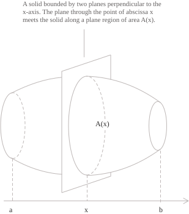
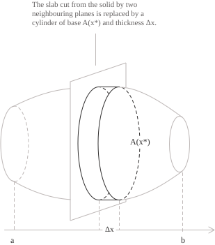
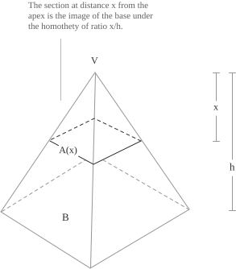

## Volume as a sum of cross sections

Suppose we have a very simple solid, such as a cube, a rectangular box or a cylinder. Its volume is simply the product of its base area and its height. Nothing more. This formula holds for any solid obtained by translating a polygon (or a circle, in the case of a cylinder) along a direction perpendicular to its plane. It is rather like piling up, one on top of the other, a great many infinitesimal slices of the same figure, so that the thickness of each one contributes to the height of the solid and therefore to its volume. 

As I said a moment ago, finding the volume of these figures is a routine operation learned as early as primary school, since it calls for no great level of abstraction. In general, though, the simpler and the more apparently trivial a thing is, the more it tends to become unexpectedly complicated because of variations that look harmless at first sight.

Take the case of a solid of revolution with variable radius. Despite the intimidating name, it is nothing more than a solid whose circular cross-sectional radius varies along an axis perpendicular to its base. We can picture it as a sort of hourglass or, in the simplest case, as a cone, when the cross-sectional radius decreases linearly along that axis. If you have ever worked at a lathe, you will know what I mean. Anyone studying mechanical engineering should try it at least once, since it is a useful way to see for yourself the power of rotational processes. To digress briefly, it is fascinating to discover that, with cutting tools of a suitable profile, one can obtain cavities with a triangular cross section by rotation. Think for a second about a triangle produced by rotation. Does it not sound like a contradiction? For now, take my word for it, and let us return to the topic before the discussion strays too far from the aim of this entry.

To find the volume of a solid such as the ones we have just discussed, the simple product is no longer enough and we have to turn to integrals. When we introduced [indefinite integrals](../indefinite-integrals/) and [definite integrals](../definite-integrals/) we described them essentially as analytical tools, but their connection with geometry is far closer than it appears at the beginning of their study.
 
Consider, for example, a solid $S$ lying between two planes perpendicular to a fixed line, which we take as the $x$-axis, and suppose that the two planes meet that axis at the points of abscissa $a$ and $b,$ with $a<b.$ For every $x$ in the interval $[a,b]$ the plane perpendicular to the axis cuts the solid, describing a plane section of $S$ whose area is denoted by $A(x).$

We now divide $[a,b]$ into $n$ subintervals of equal width $\Delta x=(b-a)/n,$ determined by the following points.

$$a=x_0 \lt x_1 \lt \dots \lt x_n=b$$

The planes $x=x_{k-1}$ and $x=x_k$ cut a slice of thickness $\Delta x$ from $S.$ We now choose in the subinterval $[x_{k-1},x_k]$ a point $x_k^{*}$ different from the endpoints. As we said in the introduction, if the cross section remained unchanged as $x$ varied over the subinterval, the slice we have just delimited would be a solid of constant cross section, with base area $A(x_k^{*})$ and height $\Delta x,$ and its volume would be the product of the base area and the thickness:

$$\Delta V_k=A(x_k^{*})\Delta x$$

Summing the contributions of all the slices gives an approximate value for the volume of $S,$ which we can write with the following formula:

$$V\approx\sum_{k=1}^{n}A(x_k^{*})\Delta x$$

The right-hand side is exactly a [Riemann sum](../riemann-integrability-criteria/) of the function $A$ on the interval $[a,b],$ and it should be familiar by now, since we have discussed it several times since the beginning of the section devoted to integrals. We know that if $A$ is [continuous](../continuous-functions/) on $[a,b]$ the function is integrable, and as $\Delta x$ tends to zero the slices grow thinner and thinner, following the profile of the solid and improving the approximation to that profile. The limit of these sums is then the definite integral of $A$ between the two endpoints of the interval:

$$V=\int_a^b A(x) \ dx \tag{1}$$

For this procedure to be viable, however, two conditions must hold:

+ The first is that every cross section is a figure that has an area.
+ The second is that the function $A$ is integrable on $[a,b].$ Recall that the continuity of $A$ guarantees integrability but is not necessary, since $A$ may have finitely many discontinuities and still be integrable (for example with solids obtained by joining together elements of different shape).

- - -

Notice that the volume depends only on the areas of the cross sections and not on their shape. One consequence of this statement concerns oblique solids. If a cylinder is tilted while its base and its height are kept, its volume does not change. The same observation holds for oblique prisms and pyramids, which is why the formulas of solid geometry never refer to the inclination of the edges (something that simplifies matters considerably).

Below we shall see how to compute the volume of some typical solid figures, whose results are summarised here in brief:

[class="table-1"]

| | | |
| --- | --- | --- |
| Pyramid | $$\int_0^h \frac{B}{h^2}x^2 \ dx$$ | $$\frac{1}{3}Bh$$ |
| Right circular cone | $$\int_0^h \frac{\pi r^2}{h^2}x^2 \ dx$$ | $$\frac{1}{3}\pi r^2h$$ |
| Sphere | $$\int_{-r}^{r}\pi(r^2-x^2) \ dx$$ | $$\frac{4}{3}\pi r^3$$ |
| Solid with square cross sections | $$\int_{-1}^{1}(1-x^2)^2 \ dx$$ | $$\frac{16}{15}$$ |
| Cylindrical wedge | $$\int_0^r 2y\sqrt{r^2-y^2}\tan\alpha \ dy$$ | $$\frac{2}{3}r^3\tan\alpha$$ |

[/class]

## The volume of a pyramid and of a cone

Consider the case of a pyramid of height $h$ and base area $B.$ We place the $x$-axis along the altitude of the pyramid, with the origin at the apex. The plane perpendicular to this axis at a distance $x$ from the apex is parallel to the base and cuts the pyramid in a polygon which, in simple terms, is a copy of the base obtained by a homothety centred at the apex with ratio $x/h$.

By a homothety of ratio $k$ we mean a transformation that enlarges or shrinks a figure by a factor $k$ while leaving its shape unchanged. This transformation multiplies lengths by $k$ and areas by $k^2,$ from which we can derive the following relation:

$$A(x)=B\left(\frac{x}{h}\right)^2=\frac{B}{h^2}x^2$$

At this point the volume is obtained by integrating from the apex to the base with respect to $x$. Taking the factor $B/h^2$ outside the integral sign, the computation is immediate:

$$
\begin{align}
V &= \int_0^h \frac{B}{h^2}x^2 \ dx \\[6pt]
  &= \frac{B}{h^2}\int_0^h x^2 \ dx \\[6pt]
  &= \frac{B}{h^2}\left[\frac{x^3}{3}\right]_0^h \\[6pt]
  &= \frac{B}{h^2}\cdot\frac{h^3}{3} \\[6pt]
  &= \frac{1}{3}Bh
\end{align}
$$

A pyramid with base area $B$ and height $h$ therefore has volume equal to one third of the product of the base area and the height! A small historical aside is in order. The idea of homothety is very old indeed. If we date the construction of the pyramids to the third millennium BC, the ancient Egyptians were already using this concept when they built them (and no, I do not think it was aliens who built them...).

- - -

Coming back to matters closer to our own day, the volume of a right circular cone is computed in the same way as that of the pyramid. The cross section at a distance $x$ from the apex is a circle of radius $rx/h,$ where $r$ is the base radius, and its area is $\pi r^2x^2/h^2.$ The integral is the one just evaluated, with the factor $B/h^2$ rewritten using $B=\pi r^2$. Carrying out the computation we obtain: 

$$V=\frac{1}{3}\pi r^2h$$

The same result holds for every solid with an apex whose cross sections parallel to the base are obtained by homotheties centred at the apex. At a distance $x$ from the apex the ratio of the homothety is $x/h,$ so the volume is $Bh/3,$ whatever the base.

## Solids of revolution

A computation similar to the one just described applies to solids obtained by rotating a plane region $R$ about an axis (in particular about the $x$-axis). In more formal terms, suppose that a function $f$ is continuous and non-negative on $[a,b],$ and let $R$ be the region bounded by the graph of $f,$ by the $x$-axis and by the lines $x=a$ and $x=b.$ Rotating $R$ about the $x$-axis gives a solid whose cross sections perpendicular to that axis are discs of radius $f(x)$ with area $A(x)$:

$$A(x)=\pi\big(f(x)\big)^2$$

The general formula returns the expression of the [disc method](../the-disc-method/):

$$V=\int_a^b\pi\big(f(x)\big)^2 \ dx$$

If instead a second curve $g,$ with $0\le g(x)\le f(x)$ on $[a,b],$ separates the region from the axis, the rotation opens a cavity and the cross section becomes an annulus with outer radius $f(x)$ and inner radius $g(x).$ In this case we obtain the formula of the [washer method](../the-washer-method/):

$$V=\int_a^b\pi\left[\big(f(x)\big)^2-\big(g(x)\big)^2\right] \ dx$$

The [shell method](../the-shell-method/) does not fit this scheme, because it decomposes the solid not into slices perpendicular to the axis of revolution but into coaxial cylindrical shells. Note that the choice among these methods is made purely according to how simple the resulting integrals are, but beyond computational aspects they lead to the same value of the volume. For a fuller treatment of each method I suggest going straight to the individual entries, which are more detailed and contain worked examples.

- - -

The sphere is a separate case and is handled with the general formula, without going through the idea of rotation. We place the coordinate origin at the centre of the sphere and take a diameter as the $x$-axis. The plane perpendicular to the axis at coordinate $x,$ with $-r\le x\le r,$ intersects the solid sphere in a disc. The radius of this disc and the distance $|x|$ from the centre are the legs of a right triangle with hypotenuse $r,$ and by the [Pythagorean theorem](../pythagorean-theorem/) the radius of the cross section is $\sqrt{r^2-x^2}.$ The area of the cross section is therefore:

$$A(x)=\pi(r^2-x^2)$$

Integrating $A(x)$ between the two poles of the sphere gives the volume:

$$
\begin{align}
V &= \int_{-r}^{r}\pi(r^2-x^2) \ dx \\[6pt]
  &= \pi\left[r^2x-\frac{x^3}{3}\right]_{-r}^{r} \\[6pt]
  &= \pi\left[\left(r^3-\frac{r^3}{3}\right)-\left(-r^3+\frac{r^3}{3}\right)\right] \\[6pt]
  &= \pi\left(\frac{2}{3}r^3+\frac{2}{3}r^3\right) \\[6pt]
  &= \frac{4}{3}\pi r^3
\end{align}
$$

## Solids that are not solids of revolution

We now consider a different case, taking the region $R$ between the parabola of equation $y=1-x^2$ and the $x$-axis, and building the solid $S$ that has $R$ as its base and whose cross sections perpendicular to the $x$-axis are squares.

The parabola $y=1-x^2$ meets the $x$-axis at the points of abscissa $-1$ and $1,$ which bound the interval of integration. For a generic $x$ in $[-1,1],$ the plane perpendicular to the axis cuts the base along the segment joining the axis to the graph of the parabola, of length $1-x^2,$ which is the side of the square of our cross section. We can therefore write the area $A(x)$ of the square as:

$$A(x)=(1-x^2)^2$$

The computation is quite straightforward and leads to the following result:

$$
\begin{align}
V &= \int_{-1}^{1}(1-x^2)^2 \ dx \\[6pt]
  &= \int_{-1}^{1}(1-2x^2+x^4) \ dx \\[6pt]
  &= \left[x-\frac{2}{3}x^3+\frac{x^5}{5}\right]_{-1}^{1} \\[6pt]
  &= 2\left(1-\frac{2}{3}+\frac{1}{5}\right) \\[6pt]
  &= \frac{16}{15}
\end{align}
$$

Remember that $A(x)=(1-x^2)^2$ is an [even function](../even-and-odd-functions/), so its integral over $[-1,1]$ is twice the integral over $[0,1].$ The solid with square cross sections built on the parabolic region therefore has volume $16/15.$

- - -

We now give a further example showing that the direction in which the solid is sliced can be chosen freely, and that different slicing directions produce cross sections of different shapes but determine the same volume.

Take a right circular cylinder of radius $r$ and choose a diameter of its base. Imagine now rotating a plane about this diameter, tilting it by an angle $\alpha$ with respect to the base plane, with $0<\alpha<\pi/2$. Suppose the cylinder has height $H\ge r\tan\alpha,$ so that the upper base does not truncate the wedge. The plane obtained in this way cuts the cylinder, and the part of the cylinder between the base and the inclined plane is called a cylindrical wedge.

We introduce a Cartesian coordinate system in the base plane, with origin at the centre, and place the $x$-axis along the diameter about which the cutting plane rotates, with the $y$-axis perpendicular to it. In the half-plane $y\ge0$ the height grows linearly with $y$ and is given by $z=y\tan\alpha$ (for brevity, take it as a given).

We now cut the wedge we have obtained with planes perpendicular to the $y$-axis. For a fixed $y$ in $[0,r],$ the chord of the base circle at distance $y$ from the centre has length $2\sqrt{r^2-y^2},$ while the vertical distance from the base plane to the inclined plane, as we have already seen, is $y\tan\alpha$ and is the same at every point of the chord. The cross section is therefore a rectangle of area:

$$A(y)=2y\sqrt{r^2-y^2}\tan\alpha$$

This is a typical integral solved [by substitution](../integration-by-substitution/), setting $u=r^2-y^2,$ so that $du=-2y \ dy.$ Carrying out the computation we obtain the following value of the volume:

$$
\begin{align}
V &= \int_0^r 2y\sqrt{r^2-y^2}\tan\alpha \ dy \\[6pt]
  &= \tan\alpha\int_0^r 2y\sqrt{r^2-y^2} \ dy \\[6pt]
  &= \tan\alpha\left[-\frac{2}{3}(r^2-y^2)^{3/2}\right]_0^r \\[6pt]
  &= \tan\alpha\left(0+\frac{2}{3}r^3\right) \\[6pt]
  &= \frac{2}{3}r^3\tan\alpha
\end{align}
$$

The wedge cut from a cylinder of radius $r$ by a plane inclined at $\alpha$ and passing through any diameter of the base therefore has volume $2/3 \cdot r^3\tan\alpha.$ As in the cases seen above, this is a general formula.

Take, for example, the case in which we cut the same wedge with planes perpendicular to the $x$-axis. The cross sections change shape, and for a fixed $x$ in $[-r,r]$ the section is the right triangle with one leg of length $\sqrt{r^2-x^2}$ on the base plane and the other leg vertical, of length $\sqrt{r^2-x^2}\tan\alpha.$ Its area is base times height divided by 2:

$$\frac{1}{2}(r^2-x^2)\tan\alpha$$

Evaluating the integral we obtain, with no difficulty, $2/3 \cdot r^3\tan\alpha,$ the same result found just above.

## Conditions of applicability

This method is quite simple to put into practice once the underlying mechanism is clear. There are, however, conditions of applicability, summarised below.

The direction along which the solid is sliced must be chosen by considering the cross sections the cut produces. The cylindrical wedge, for example, admits two equally valid decompositions, into rectangles and into triangles, and the two integrals that follow are of comparable difficulty. In other cases the difference is sharper and deserves more attention. A cone cut perpendicularly to its own axis gives circles, whereas planes with different inclinations can produce elliptic, parabolic or [hyperbolic](../hyperbola/) sections, whose integrals are generally more laborious.

Note that when we replace each slice of the solid with a small cylinder or prism of base area $A(x_i)$ and thickness $\Delta x$, we are only approximating its volume. If $A$ is sufficiently regular, the error produced by each slice becomes smaller and smaller as $\Delta x$ decreases and, in the limit, the total error tends to zero, so the Riemann sums converge to the volume of the solid.

This construction does not, on the other hand, provide an approximation of the lateral surface, since the edges of the individual slices do not reconstruct, in the limit, the area of the surface of the solid. A separate procedure is needed to compute it.

Keep in mind, finally, that all of this requires the function $A(x)$, which describes the area of the cross sections, to be integrable on the interval considered. If the shape of the cross sections changes along the axis, it is often enough to divide the solid into several parts. For example, if a solid is formed by a cone and a cylinder, $A(x)$ will have different expressions on the intervals corresponding to the two components, and the volume is computed by splitting the integral into the corresponding pieces.
