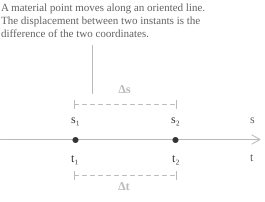
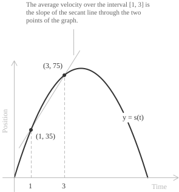
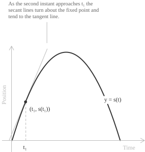
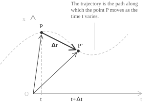

## Kinematics and the position function

Kinematics describes the motion of a body in terms of position, velocity, and [acceleration](../acceleration/) as functions of time, without investigating the forces that produce it. The setting has three basic notions.

+ A material point is an idealized body whose dimensions are negligible compared with the distances covered during its motion.
+ The trajectory is the curve traced by the material point as it moves through space.
+ A motion is rectilinear when its trajectory lies on a straight line.

On a rectilinear trajectory a single coordinate locates the body. Once an origin and a positive direction are fixed on the line, the position at time $t$ is a real number $s(t),$ and the [function](../functions/) $s$ is a complete description of the motion. Velocity has units of length divided by time, and its SI unit is the metre per second $(\mathrm{m/s}),$ also written $\mathrm{m\ s^{-1}}.$

> The graph of $s$ is drawn in the time-position plane, with time on the horizontal axis and position on the vertical axis. This graph is not the trajectory. A body thrown vertically upward travels along a segment, while its position graph is a parabola.

## Position and displacement on a line

A material point $P$ moves along the line. Its position at the instant $t_1$ is the coordinate $s_1 = s(t_1),$ and at a later instant $t_2$ it is $s_2 = s(t_2).$ The displacement over the interval is the difference of the two coordinates, and the elapsed time is the difference of the two instants:

$$\Delta s = s_2 - s_1 \qquad \Delta t = t_2 - t_1$$

The displacement has a sign. It is positive when the point moves in the positive direction of the line, negative when the point moves the other way, and zero when the two coordinates coincide, whatever path the point has covered between the two instants. The ratio of the two quantities measures how fast the coordinate changes:

$$\frac{\Delta s}{\Delta t} = \frac{s_2 - s_1}{t_2 - t_1}$$

When the point has equal displacements over equal time intervals, this ratio has the same value $v$ for every choice of $t_1$ and $t_2,$ and $v$ is the signed scalar component of velocity along the oriented line. In every other case the ratio depends on the interval, so it describes the interval as a whole and not a single instant. For a fixed time $t,$ consider intervals whose duration $\Delta t$ tends to zero. If the corresponding ratios have a finite limit, that limit is the instantaneous scalar velocity:

$$v(t) = \lim_{\Delta t \to 0} \frac{\Delta s}{\Delta t} = \lim_{\Delta t \to 0} \frac{s(t + \Delta t) - s(t)}{\Delta t}$$

The [limit](../limits/) of the [difference quotient](../difference-quotient/) is, by definition, the [derivative](../derivatives/) of $s$ with respect to time. Thus $v(t)$ exists exactly when $s$ is differentiable at $t,$ and at such an instant $s$ is also [continuous](../continuous-functions/). Average velocity belongs to a finite interval, while instantaneous velocity belongs to a single time.

## Average velocity

The ratio $\Delta s/\Delta t$ taken over a finite interval is the average velocity of the motion, the displacement divided by the time elapsed:

$$v_{\mathrm{avg}} = \frac{\text{displacement}}{\text{elapsed time}}$$

A train covers the $216\ \mathrm{km}$ separating two stations, leaving at 9:00 and arriving at 11:30. The elapsed time is $2.5\ \mathrm{h},$ so the average velocity is:

$$v_{\mathrm{avg}} = \frac{216\ \mathrm{km}}{2.5\ \mathrm{h}} = 86.4\ \mathrm{km/h}$$

This number is an average over the complete journey. The train is stationary in the stations and runs faster than $86.4\ \mathrm{km/h}$ on the open track, so the average does not determine its velocity at any single moment.

- - -

If $s(t)$ is the position at time $t,$ the average velocity between the instants $t_1$ and $t_2,$ with $t_1 < t_2,$ is:

$$v_{\mathrm{avg}} = \frac{s(t_2) - s(t_1)}{t_2 - t_1}$$

The right-hand side is the [difference quotient](../difference-quotient/) of $s$ over $[t_1, t_2],$ so the average velocity is the slope of the secant line through the points $(t_1, s(t_1))$ and $(t_2, s(t_2))$ of the position graph.

The numerator is a displacement and not a length of path. When the body returns to its starting position the numerator vanishes, and the average velocity is zero over an interval in which the body has moved.

## Average velocity along a parabolic graph

A body leaves the ground moving straight upward with initial speed $40\ \mathrm{m/s}.$ With air resistance disregarded and the gravitational acceleration taken as $10\ \mathrm{m/s^2},$ its height above the launch point is:

$$s(t) = -5t^2 + 40t \qquad 0 \leq t \leq 8$$

Here $s$ is measured in metres and $t$ in seconds. The body reaches its greatest height of $80\ \mathrm{m}$ at $t = 4$ and comes back to the launch point at $t = 8.$ Three intervals that start at $t = 1,$ where the height is $s(1) = 35\ \mathrm{m},$ give three different average velocities.

Over the interval $[1, 3],$ where $s(3) = 75\ \mathrm{m},$ the average velocity is:

$$v_{\mathrm{avg}} = \frac{s(3) - s(1)}{3 - 1} = \frac{75 - 35}{2} = 20\ \mathrm{m/s}$$

Over the interval $[1, 5],$ where $s(5) = 75\ \mathrm{m},$ the average velocity is:

$$v_{\mathrm{avg}} = \frac{s(5) - s(1)}{5 - 1} = \frac{75 - 35}{4} = 10\ \mathrm{m/s}$$

Over the interval $[1, 7],$ where $s(7) = 35\ \mathrm{m},$ the average velocity is:

$$v_{\mathrm{avg}} = \frac{s(7) - s(1)}{7 - 1} = \frac{35 - 35}{6} = 0\ \mathrm{m/s}$$

The first two intervals have the same displacement of $40\ \mathrm{m},$ because the body is at the same height at $t = 3$ and at $t = 5.$ The second interval lasts twice as long, so its average velocity is half of the first.

The third interval is symmetric about the instant of greatest height. The body rises $45\ \mathrm{m}$ and falls back $45\ \mathrm{m},$ covering $90\ \mathrm{m}$ of path with zero displacement, so the average velocity vanishes although the body is moving at every instant of the interval.

## Instantaneous velocity

An average velocity does not tell how fast the body moves at a single instant. Fix $t_1$ and let the second instant $t$ approach $t_1.$ The intervals shrink around $t_1,$ and the corresponding average velocities have a [limit](../limits/) that defines the instantaneous velocity at $t_1$:

$$v(t_1) = \lim_{t \to t_1} \frac{s(t) - s(t_1)}{t - t_1}$$

Each ratio under the limit sign is the slope of a secant line through the fixed point $(t_1, s(t_1))$ and a second point of the graph. As $t \to t_1$ the second point slides along the curve toward the first, and the secant lines turn about the fixed point until they reach the tangent line. The instantaneous velocity is the slope of the tangent to the position graph at $t_1.$

For the body launched upward, the limit can be computed at $t_1 = 1.$ Approaching from the right, the intervals $[1, t]$ give:

| Interval | $v_{\mathrm{avg}}$ in $\mathrm{m/s}$ |
| --- | --- |
| $[1, 3]$ | $20$ |
| $[1, 2]$ | $25$ |
| $[1, 1.1]$ | $29.5$ |
| $[1, 1.01]$ | $29.95$ |

Approaching from the left, the intervals $[t, 1]$ give:

| Interval | $v_{\mathrm{avg}}$ in $\mathrm{m/s}$ |
| --- | --- |
| $[0, 1]$ | $35$ |
| $[0.9, 1]$ | $30.5$ |
| $[0.99, 1]$ | $30.05$ |

The entries in the two tables approach $30\ \mathrm{m/s}$ from below and from above. A single computation confirms the value. For a second instant $1 + h$ with $h \neq 0,$ the difference quotient is:

$$
\begin{align}
\frac{s(1+h) - s(1)}{h} &= \frac{-5(1+h)^2 + 40(1+h) - 35}{h} \\[6pt]
&= \frac{-5 - 10h - 5h^2 + 40 + 40h - 35}{h} \\[6pt]
&= \frac{30h - 5h^2}{h} \\[6pt]
&= 30 - 5h
\end{align}
$$

The factor $h$ cancels because the numerator vanishes at $h = 0.$ The resulting expression holds for negative $h$ as well, so it covers both approaches recorded in the tables. Letting $h$ tend to zero gives the instantaneous velocity:

$$v(1) = \lim_{h \to 0} (30 - 5h) = 30\ \mathrm{m/s}$$

At an arbitrary instant $t,$ the same algebra gives the difference quotient $40 - 10t - 5h,$ so the velocity function is:

$$v(t) = \lim_{h \to 0} (40 - 10t - 5h) = 40 - 10t$$

The scalar velocity is $40\ \mathrm{m/s}$ at the launch, vanishes at $t = 4$ when the body reaches its greatest height, and equals $-40\ \mathrm{m/s}$ on the return, where the negative sign indicates the downward direction. The speed is the absolute value $|v(t)|.$ It is nonnegative and has no direction. Hence it equals $v(t)$ when $v(t) \geq 0$ and $-v(t)$ when $v(t) < 0.$

- - -

The velocity function is therefore the derivative of the position function on every time [interval](../intervals/) where this derivative exists:

$$v(t) = \frac{ds}{dt}$$

For the projectile, the [differentiation rules](../differentiation-rules/) give the derivative $-10t + 40,$ the same expression obtained above from the limit. The [acceleration](../acceleration/) is the derivative of $v,$ so it is the [second derivative](../higher-order-derivatives/) of the position.

## The velocity vector

For a motion along a curve in space, the position at time $t$ is the [vector](../vectors/) $\mathbf{r}(t)$ from a fixed origin to the point occupied by the body. Between $t$ and $t + \Delta t$ the body moves by:

$$\Delta \mathbf{r} = \mathbf{r}(t + \Delta t) - \mathbf{r}(t)$$

The ratio $\Delta\mathbf{r}/\Delta t$ is the average velocity vector, and it is parallel to the chord joining the two positions. Its limit defines the velocity vector:

$$\mathbf{v}(t) = \lim_{\Delta t \to 0} \frac{\Delta \mathbf{r}}{\Delta t} = \frac{d\mathbf{r}}{dt}$$

As $\Delta t$ decreases, the chord aligns with the trajectory. When $\mathbf{v}(t) \neq \mathbf{0},$ the vector is tangent to the trajectory at the point occupied at time $t$ and points in the direction of motion. Its magnitude is the speed. For a rectilinear motion along the unit vector $\mathbf{i}$ the position is $\mathbf{r}(t) = s(t)\mathbf{i},$ and the definition reduces to:

$$\mathbf{v}(t) = \frac{ds(t)}{dt}\mathbf{i}$$

The scalar $v(t) = \frac{ds(t)}{dt}$ is the component of $\mathbf{v}(t)$ along the oriented line, and the speed satisfies $\|\mathbf{v}(t)\| = |v(t)|.$

## Uniform rectilinear motion

Uniform rectilinear motion has a straight-line trajectory and constant velocity, so equal displacements correspond to equal time intervals. Let $v$ be the constant value of the velocity and $s_0$ the position at $t = 0.$ The position function is:

$$s(t) = s_0 + vt$$

The position graph is a [straight line](../lines/) of slope $v.$ Every secant of a line has the slope of the line itself, so average and instantaneous velocity agree over every interval, and uniform rectilinear motion is the only motion with this property.

A vehicle travelling on a straight road at $v = 12\ \mathrm{m/s}$ from the initial position $s_0 = 6\ \mathrm{m}$ has position function $s(t) = 6 + 12t,$ which gives the following values.

| $t$ in $\mathrm{s}$ | $s$ in $\mathrm{m}$ |
| --- | --- |
| $0$ | $6$ |
| $1$ | $18$ |
| $2$ | $30$ |
| $3$ | $42$ |
| $4$ | $54$ |

The vehicle advances $12\ \mathrm{m}$ during each second. Over any interval $[t_1, t_2]$ the difference quotient is:

$$\frac{s(t_2) - s(t_1)}{t_2 - t_1} = \frac{(6 + 12t_2) - (6 + 12t_1)}{t_2 - t_1} = \frac{12(t_2 - t_1)}{t_2 - t_1} = 12$$

The result does not depend on the interval, so the limit as $t_2 \to t_1$ is again $12,$ and the velocity function is the constant $v(t) = 12\ \mathrm{m/s}.$
