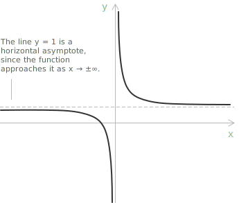
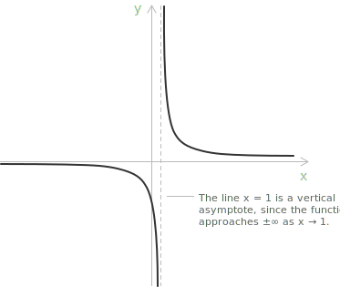
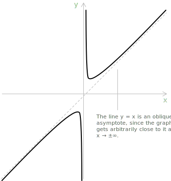

## Horizontal asymptotes

Asymptotes are a fundamental concept in mathematical analysis. They are lines that the graph of a [function](../functions/) approaches indefinitely without ever reaching, and they help to characterise the function's behaviour, particularly near infinity or at points of discontinuity. Their definition relies entirely on the notion of [limit](../limits/), and they play a central role in the qualitative study of a function's graph.

> In general terms, an asymptote describes the limiting behaviour of a function by means of a straight line.

- - -

**Definition 1.** Let $y = f(x)$ be a real-valued function defined on an interval of the form $[a, +\infty)$, $(-\infty, b]$, or on $\mathbb{R}$. The line with [equation](../equations/) $y = L$ is a horizontal asymptote of $f$ if:

$$\lim_{x \to +\infty} f(x) = L \quad \text{or} \quad \lim_{x \to -\infty} f(x) = L$$

In other words, the function approaches the horizontal line $y = L$ as $x$ tends to positive or negative infinity. As an example, consider the function:

$$y = \frac{x + 1}{x}$$

By computing the limit as $x \to \pm\infty$, we obtain:

$$\lim_{x \to \pm\infty} \frac{x + 1}{x} = \lim_{x \to \pm\infty} \left( 1 + \frac{1}{x} \right) = 1$$

The function therefore admits the horizontal asymptote $y = 1$. Both branches of the graph approach the line $y = 1$ as $x$ tends to $+\infty$ or $-\infty$, confirming that $y = 1$ is indeed a horizontal asymptote.

## Vertical asymptotes

**Definition 2.** Let $y = f(x)$ be a real-valued function defined on $[a, b] \setminus \\{ x_0 \\}$, where $x_0 \in [a, b]$. The line with equation $x = x_0$ is a vertical asymptote of $f$ if:

$$\lim_{x \to x_0^-} f(x) = \pm \infty \quad \text{or} \quad \lim_{x \to x_0^+} f(x) = \pm \infty$$

In other words, the function diverges as $x$ approaches $x_0$ from the left or from the right, becoming arbitrarily large in [absolute value](../absolute-value/). Consider, for instance, the function:

$$y = \frac{1}{x - 1}$$

This rational expression is undefined at $x = 1$, since the denominator becomes zero. To analyse the behaviour of $f(x)$ near $x = 1$, we compute the one-sided limits:

$$\lim_{x \to 1^-} \frac{1}{x - 1} = -\infty \qquad \lim_{x \to 1^+} \frac{1}{x - 1} = +\infty$$

The function diverges to $-\infty$ when approaching $1$ from the left, and to $+\infty$ when approaching from the right. The line $x = 1$ is therefore a vertical asymptote of $f$.

> [Rational functions](../rational-functions/) often have vertical asymptotes at the points where the denominator vanishes and the function is undefined. These points correspond to non-removable discontinuities, and their detailed analysis fits naturally into the theory of [continuous functions](../continuous-functions/).

## Oblique asymptotes

**Definition 3.** Let $y = f(x)$ be a real-valued function defined on a half-line of the form $(-\infty, a]$ or $[a, +\infty)$. The line with equation $y = p x + q$ is an oblique asymptote of $f$ if:

$$
\begin{align}
\lim_{x \to -\infty} \big[ f(x) - (p x + q) \big] &= 0 \\[6pt]
\lim_{x \to +\infty} \big[ f(x) - (p x + q) \big] &= 0
\end{align}
$$

In other words, the difference between the function and the line $y = p x + q$ tends to zero as $x$ tends to $\pm\infty$. The function behaves more and more like the straight line $y = p x + q$ for large values of $|x|$.

- - -

The equation of the oblique asymptote $y = p x + q$ associated with a function $f(x)$ is determined by computing two specific limits. The slope $p$ is found by evaluating:

$$p = \lim_{x \to \pm\infty} \frac{f(x)}{x}$$

Once the slope is known, the vertical offset $q$ is obtained from:

$$q = \lim_{x \to \pm\infty} \big[ f(x) - p x \big]$$

If both limits exist and are finite, then the line $y = p x + q$ is the oblique asymptote of the function.

- - -

As an illustration, consider the function:

$$f(x) = \frac{x^2 + 1}{x}$$

To determine whether this function admits an oblique asymptote as $x \to \pm\infty$, we begin with the limit of $f(x)/x$:

$$\frac{f(x)}{x} = \frac{x^2 + 1}{x^2} = 1 + \frac{1}{x^2}$$

As $x \to \pm\infty$, the term $\dfrac{1}{x^2}$ tends to zero, so:

$$\lim_{x \to \pm\infty} \frac{f(x)}{x} = 1$$

The slope of the asymptote is therefore $p = 1$. Next, we compute the limit of the difference $f(x) - p x$:

$$f(x) - x = \frac{x^2 + 1}{x} - x = \frac{x^2 + 1 - x^2}{x} = \frac{1}{x}$$

Since $\frac{1}{x} \to 0$ as $x \to \pm\infty$, we obtain:

$$\lim_{x \to \pm\infty} [f(x) - x] = 0$$

The function therefore admits an oblique asymptote with equation:

$$y = x$$

> In this case the oblique asymptote passes through the origin, which gives $q = 0$, a degenerate configuration. In general, the vertical offset $q$ need not be zero.

## Example 1

Consider, as an additional example that extends the discussion beyond the degenerate case, the function:

$$f(x) = \frac{2 x^2 - x + 3}{2 x}$$

To determine the oblique asymptote, we first compute the slope $p$:

$$
\begin{align}
p &= \lim_{x \to \pm\infty} \frac{f(x)}{x} \\[6pt]
  &= \lim_{x \to \pm\infty} \frac{2 x^2 - x + 3}{2 x^2} \\[6pt]
  &= 1
\end{align}
$$

Next, we evaluate the vertical offset $q$:

$$
\begin{align}
q &= \lim_{x \to \pm\infty} \big( f(x) - x \big) \\[6pt]
  &= \lim_{x \to \pm\infty} \frac{2 x^2 - x + 3 - 2 x^2}{2 x} \\[6pt]
  &= \lim_{x \to \pm\infty} \frac{- x + 3}{2 x} \\[6pt]
  &= -\frac{1}{2}
\end{align}
$$

The equation of the oblique asymptote is therefore:

$$y = x - \frac{1}{2}$$

## Key properties of asymptotes

Asymptotes come in different forms and obey a few specific rules that are worth keeping in mind. Some of these properties are immediately intuitive, others become clear only after working through a few examples. The following points summarise the most important facts.

+ Not every function admits asymptotes.
+ For horizontal asymptotes, several configurations are possible: a function may have none, it may approach the same horizontal line as $x \to +\infty$ and $x \to -\infty$, or it may approach two distinct horizontal lines in the two directions.
+ Different types of asymptotes can coexist. A single function may simultaneously exhibit horizontal, vertical, and oblique asymptotes, depending on its behaviour near discontinuities and at infinity.
+ Vertical asymptotes typically occur at points where the function is undefined as a result of division by zero. They correspond to non-removable discontinuities.
+ Horizontal asymptotes describe the end behaviour of a function as it stabilises near a constant value when $x$ becomes very large in absolute value.
+ Oblique asymptotes occur when the degree of the numerator of a [rational function](../rational-functions/) exceeds that of the denominator by exactly one, causing the function to approach a slanted line as $x \to \pm\infty$.

The notions introduced here connect naturally with [Landau symbols](../big-o-notation/), used to compare the growth rates of functions, and with [little-o notation](../little-o-notation/), which provides a precise way to quantify how rapidly the difference $f(x) - (p x + q)$ vanishes.
