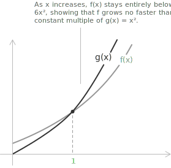

## Definition

The symbol $O(g(x))$, read as "big-O of $g(x)$", belongs to the family of Landau symbols, which are used to characterise asymptotic relationships between [functions](../functions/). This notation expresses the idea that one function is bounded, up to a multiplicative constant, by another as the input approaches a given value. In this sense, $O(g(x))$ formalises [asymptotic](../asymptotes/) control by signifying that the growth of one function does not exceed that of the other in the [limit](../limits/).

**Definition 1.** Let $f, g : A \to \mathbb{R}$ (or $\mathbb{C}$) be two functions defined on a set $A$, and let $x_0$ be a limit point of $A$. We say that $f(x)$ is big-O of $g(x)$ as $x \to x_0$ if there exist constants $M > 0$ and $\delta > 0$ such that, whenever $0 < |x - x_0| < \delta$, the inequality $|f(x)| \leq M \cdot |g(x)|$ holds. In symbols:

$$f(x) = O(g(x)) \ \text{ as } \ x \to x_0 \quad \iff \quad \exists \ M > 0, \ \delta > 0 \ : \ 0 < |x - x_0| < \delta \implies |f(x)| \leq M|g(x)|$$

The relation $f(x) = O(g(x))$ states that $f(x)$ grows asymptotically no faster than $g(x)$ near $x_0$. 

The equality sign here is a conventional abuse of notation: $O(g(x))$ stands for the class of all functions satisfying the bound above, so the symbol $=$ should be read as "belongs to".

> The same definition applies to limits at infinity by replacing $x \to x_0$ with $x \to \infty$, in which case the condition $0 < |x - x_0| < \delta$ is replaced by $|x| > N$ for some $N > 0$. It also extends to [sequences](../sequences/), where the continuous variable $x$ is replaced by the integer index $n$ and the limit is taken as $n \to \infty$.

## Example

To make the concept concrete, consider the polynomial:

$$f(x) = 3x^2 + 2x + 1 \quad \text{as} \quad x \to \infty$$

The aim is to show that $f(x) = O(x^2)$. For large values of $x$, the ratio between $f(x)$ and $x^2$ admits a uniform upper bound:

$$\frac{3x^2 + 2x + 1}{x^2} = 3 + \frac{2}{x} + \frac{1}{x^2}$$

As $x \to \infty$, this expression approaches $3$. More precisely, for $x \geq 1$ each of the two fractions on the right is bounded by $1$, so:

$$\frac{3x^2 + 2x + 1}{x^2} \leq 3 + 2 + 1 = 6$$

Choosing $M = 6$ and any $\delta$-condition compatible with $x \geq 1$, the inequality $|f(x)| \leq 6 x^2$ holds. The conclusion is:

$$3x^2 + 2x + 1 = O(x^2) \quad \text{as} \quad x \to \infty$$

A numerical comparison reinforces the bound:

+ if $x = 10$, then $f(x) = 321$ and $6x^2 = 600$;
+ if $x = 100$, then $f(x) = 30201$ and $6x^2 = 60000$;
+ if $x = 1000$, then $f(x) = 3002001$ and $6x^2 = 6000000$.

In every case $f(x) \leq 6x^2$, which captures the essence of the big-O notation: one function grows at most as fast as a constant multiple of another as the input approaches a particular value.

## The meaning of $O(1)$

The symbol $O(1)$ represents the class of functions that remain bounded as $x$ approaches a specific point $x_0$. A function $f(x)$ belongs to $O(1)$ when it stays bounded by a constant in the limit $x \to x_0$. Formally, $f(x) = O(1)$ as $x \to x_0$ if and only if:

$$\exists \ M > 0, \ \delta > 0 \ : \ 0 < |x - x_0| < \delta \implies |f(x)| \leq M$$

The set of all functions that belong to $O(1)$ can be written as:

$$O_{x_0}(1) = \\{\ f : B(x_0, \delta) \setminus \\{x_0\\} \to \mathbb{R} \mid \exists \ M > 0 \ : \ |f(x)| \leq M \text{ for } x \text{ near } x_0 \ \\}$$

The components of this expression have the following meaning:

+ The functions considered are defined on a neighbourhood of $x_0$, excluding the point $x_0$ itself.
+ The function must remain bounded as $x$ approaches $x_0$.
+ The notation $O(1)$ identifies the set of all functions that are bounded with respect to the constant $1$.
+ The symbol $B(x_0, \delta)$ denotes an open neighbourhood of $x_0$ with radius $\delta$, on which the function is defined.

## Example: $\sin(x)/x$ near zero

A classical illustration of the $O(1)$ class is the function:

$$f(x) = \frac{\sin x}{x} \quad \text{as} \quad x \to 0$$

Using the Taylor expansion of $\sin x$ near the origin:

$$\sin x = x - \frac{x^3}{6} + O(x^5) \quad \text{as} \quad x \to 0$$

Dividing both sides by $x$, the function admits the representation:

$$\frac{\sin x}{x} = 1 - \frac{x^2}{6} + O(x^4) \quad \text{as} \quad x \to 0$$

Both the term $\dfrac{x^2}{6}$ and the remainder $O(x^4)$ remain bounded as $x \to 0$. The same conclusion applies to the constant $1$, so the whole expression is bounded near the origin:

$$\frac{\sin x}{x} = O(1) \quad \text{as} \quad x \to 0$$

> This expression shows that the function remains bounded near $x = 0$, even though it is not defined at that point. The actual value of the limit, equal to $1$, is one of the [remarkable limits](../remarkable-limits/).

## Properties

A fundamental property of the big-O notation follows directly from the definition. If $f(x) = O(g(x))$ as $x \to x_0$, then the ratio of the two functions remains bounded:

$$\limsup_{x \to x_0} \left|\frac{f(x)}{g(x)}\right| < \infty$$

- - -

The relation $f(x) = O(g(x))$ is reflexive but not symmetric. For any nonzero function $f$:

$$f(x) = O(f(x)) \quad \text{as} \quad x \to x_0$$

The converse statement $g(x) = O(f(x))$ is in general not implied by $f(x) = O(g(x))$: for instance, $x = O(x^2)$ as $x \to \infty$, but $x^2 \neq O(x)$ as $x \to \infty$.

- - -

Multiplying a function by a nonzero constant does not affect its asymptotic behaviour in big-O notation. For any constant $c \neq 0$ and any function $g(x)$, as $x \to x_0$:

$$O(c \cdot g(x)) = O(g(x))$$

$$c \cdot O(g(x)) = O(g(x))$$

> Big-O notation absorbs constant factors: scaling by a nonzero constant does not affect the asymptotic upper bound near $x_0$.

- - -

Big-O terms behave predictably under addition. The sum of two big-O terms of the same function remains a big-O term of that function. Formally, as $x \to x_0$:

$$O(f(x)) + O(f(x)) = O(f(x))$$

> Adding two functions that are each asymptotically bounded by $f(x)$ produces a sum that is still asymptotically bounded by $f(x)$, possibly with a larger constant.

- - -

When multiplying a big-O term by a function, the result is a new big-O term whose asymptotic order scales accordingly. For functions $f(x)$ and $g(x)$, as $x \to x_0$:

$$f(x) \cdot O(g(x)) = O(f(x) g(x))$$

For example, if $g(x) = x$ and $O(g(x)) = O(x)$, then multiplying by $f(x) = x^2$ gives:

$$x^2 \cdot O(x) = O(x^3) \quad \text{as} \quad x \to x_0$$

- - -

Another important property concerns powers of functions. If $f(x) = O(g(x))$ as $x \to x_0$, then raising both functions to the same positive power preserves the big-O relationship. For $a > 0$:

$$f(x) = O(g(x)) \implies [f(x)]^a = O([g(x)]^a) \quad \text{as} \quad x \to x_0$$

The asymptotic upper bound scales consistently under positive powers: if $|f(x)| \leq M|g(x)|$, then $|f(x)|^a \leq M^a |g(x)|^a$. For example, if $f(x) = O(x)$ as $x \to \infty$, then:

$$[f(x)]^2 = O(x^2) \quad \text{as} \quad x \to \infty$$

- - -

Big-O notation exhibits transitivity. If $f(x) = O(g(x))$ and $g(x) = O(h(x))$ as $x \to x_0$, then:

$$f(x) = O(h(x)) \quad \text{as} \quad x \to x_0$$

The proof is straightforward. By assumption, there exist positive constants $M_1$ and $M_2$, and a neighbourhood of $x_0$, such that $|f(x)| \leq M_1 |g(x)|$ and $|g(x)| \leq M_2 |h(x)|$ both hold. Combining the two inequalities gives $|f(x)| \leq M_1 M_2 |h(x)|$, so $f(x) = O(h(x))$ with constant $M = M_1 M_2$. For example, $x^3 = O(x^4)$ and $x^4 = O(x^5)$ as $x \to \infty$, so by transitivity $x^3 = O(x^5)$ as $x \to \infty$.

> Transitivity enables the chaining of asymptotic bounds: if $f$ is bounded by $g$ and $g$ is bounded by $h$, then $f$ is also bounded by $h$.

## Big-O notation in Taylor expansions

The big-O notation frequently arises in the context of [Taylor expansions](../taylor-series/) to describe the remainder term. Given a function $f(x)$ that is $n+1$ times differentiable in a neighbourhood of $x_0$, its Taylor expansion to order $n$ takes the form:

$$f(x) = f(x_0) + f'(x_0)(x - x_0) + \frac{f''(x_0)}{2!}(x - x_0)^2 + \cdots + \frac{f^{(n)}(x_0)}{n!}(x - x_0)^n + O\big((x - x_0)^{n+1}\big)$$

The remainder $O((x - x_0)^{n+1})$ conveys precise asymptotic information: the error is bounded by a constant multiple of $(x - x_0)^{n+1}$ as $x \to x_0$, and is therefore controlled by the first omitted power of the expansion.

A concrete instance is the Taylor expansion of $\cos x$ near zero:

$$\cos x = 1 - \frac{x^2}{2} + \frac{x^4}{24} - \cdots$$

Truncating the series after the second term yields a remainder that is bounded by a constant multiple of $x^4$ for $x$ near zero. The result can be expressed as:

$$\cos x = 1 - \frac{x^2}{2} + O(x^4) \quad \text{as} \quad x \to 0$$

This means there exists a constant $M > 0$ such that:

$$\left| \cos x - 1 + \frac{x^2}{2} \right| \leq M x^4$$

for all $x$ in a neighbourhood of zero. Since the next term in the series is $x^4/24$, the value $M = 1/24$ is sufficient for sufficiently small $x$. The procedure is typical of asymptotic analysis: instead of retaining the entire infinite series, only the terms of interest are kept, and all higher-order contributions are incorporated into a single remainder term.

- - -

The following table collects the Taylor expansions of common functions near $x = 0$, each expressed with an explicit big-O remainder:

[class="table-1"]

|                  |                                                                       |
| ---------------- | --------------------------------------------------------------------- |
| $e^x$            | $1 + x + \dfrac{x^2}{2!} + \dfrac{x^3}{3!} + O(x^4)$                  |
| $\sin x$         | $x - \dfrac{x^3}{6} + O(x^5)$                                         |
| $\cos x$         | $1 - \dfrac{x^2}{2} + \dfrac{x^4}{24} + O(x^6)$                       |
| $\ln(1+x)$       | $x - \dfrac{x^2}{2} + \dfrac{x^3}{3} + O(x^4)$                        |
| $(1+x)^\alpha$   | $1 + \alpha x + \dfrac{\alpha(\alpha-1)}{2} x^2 + O(x^3)$              |

[/class]

These expansions are an effective tool for handling [indeterminate forms](../indeterminate-forms/) in conjunction with the [algebra of limits](../algebra-of-limits/), since the big-O remainder absorbs all higher-order contributions while preserving rigorous control of the approximation.

## Big-O notation for sequences

The big-O notation extends naturally to [sequences](../sequences/). A sequence $\\{a_n\\}$ is said to be big-O of a sequence $\\{b_n\\}$ as $n \to \infty$, written $a_n = O(b_n)$, if there exist constants $M > 0$ and $N \in \mathbb{N}$ such that:

$$|a_n| \leq M |b_n| \quad \text{for all } n \geq N$$

This condition mirrors the continuous case with the role of $\delta$ played by the threshold $N$. The notation is widely used to describe the rate at which a sequence grows or decays, and to compare it with reference sequences such as $1/n$, $n^k$, or $\log n$. For instance:

$$\frac{1}{n} + \frac{2}{n^2} = O\\!\left(\frac{1}{n}\right) \quad \text{as} \quad n \to \infty$$

because $|1/n + 2/n^2| \leq 3/n$ for every $n \geq 1$.

## Relationship with little-o notation

The big-O notation is closely related to [little-o notation](../little-o-notation/). Both belong to the family of Landau symbols, but they describe distinct asymptotic behaviours. Big-O provides an upper bound up to a constant multiple, whereas little-o imposes a stricter requirement: the ratio of the two functions must approach zero in the limit.

The two relations are connected by a one-way implication:

+ if $f(x) = o(g(x))$ as $x \to x_0$, then $f(x) = O(g(x))$ as $x \to x_0$;
+ the converse is in general false: $f(x) = O(g(x))$ does not imply $f(x) = o(g(x))$.

A simple counterexample is given by $f(x) = x$ and $g(x) = x$ as $x \to \infty$. The bound $|f(x)| \leq 1 \cdot |g(x)|$ is trivially satisfied, so $f(x) = O(g(x))$. The little-o condition, however, requires:

$$\lim_{x \to \infty} \frac{x}{x} = 0$$

which fails because the ratio is identically equal to $1$. The relationship can be summarised in terms of set inclusion: the class of functions satisfying $f = o(g)$ is strictly contained within the class of functions satisfying $f = O(g)$.

> Big-O records that one function is dominated by another up to a constant, while little-o records that one function becomes negligible compared to the other. The two notations complement each other in asymptotic analysis, and are routinely combined when describing the structure of [Taylor expansions](../taylor-series/) and the resolution of [indeterminate forms](../indeterminate-forms/).
