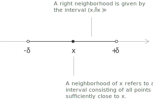
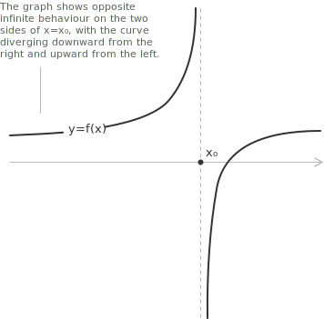
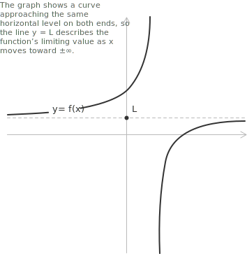

## Introduction

The concept of a limit is fundamental in mathematical analysis. Intuitively, the limit of a [function](../functions/) $f(x)$ as $x$ approaches a point $x_0$ allows us to describe the behaviour of the function as the values of $x$ get arbitrarily close to $x_0$, without necessarily reaching that point.

A neighbourhood of $x$ refers to an interval consisting of all points sufficiently close to $x$. More formally, a neighbourhood of $x$ is any open interval $(x - \delta, x + \delta)$ with $\delta > 0$. This notion is essential for defining limits and for describing the local behaviour of a function near a given point.

The smaller the neighbourhood, the closer the points are to $x$. As the interval $(x - \delta, x + \delta)$ becomes narrower, that is, as $\delta$ approaches zero, the distance between the points of the neighbourhood and $x$ decreases accordingly.

## Definition

**Definition 1.** Let $f(x)$ be a function whose behaviour we wish to study as $x$ approaches the point $x_0$. We say that, as $x$ tends to $x_0$, the function $f(x)$ has limit $\ell$, and we write:

$$\lim_{x \to x_0} f(x) = \ell$$

Formally, this statement asserts that for every tolerance $\varepsilon > 0$, there exists a corresponding distance $\delta > 0$ such that, whenever:

$$0 < |x - x_0| < \delta$$

it follows that:

$$|f(x) - \ell| < \varepsilon$$

In other words, for every neighbourhood of $\ell$, there exists a sufficiently small neighbourhood of $x_0$ such that all corresponding function values remain within this neighbourhood. This formal $\varepsilon$-$\delta$ definition makes precise the intuitive idea that the limit represents the value approached by $f(x)$ as $x$ becomes arbitrarily close to $x_0$.

- - -

When the definition is applied only to a right neighbourhood or only to a left neighbourhood of $x_0$, we refer to the right-hand limit and the left-hand limit, respectively. They are denoted as follows:

$$\lim_{x \to x_0^+} f(x) \quad \text{and} \quad \lim_{x \to x_0^-} f(x)$$

## Asymptotes and infinite limits

In general, the value of $x$ in a limit can approach a real number $x_0$ or $\pm \infty$:

$$\lim_{x \to x_0} f(x) = \ell \quad \text{or} \quad \lim_{x \to x_0} f(x) = \pm \infty$$

Additionally, the value of the limit itself can be either a finite number or $\pm \infty$:

$$\lim_{x \to \pm \infty} f(x) = \ell \quad \text{or} \quad \lim_{x \to \pm \infty} f(x) = \pm \infty$$

- - -

When the limit of $f(x)$ exists and tends to $\pm \infty$ as $x$ approaches a finite real number $x_0$, the behaviour of the function near that point determines a [vertical asymptote](../asymptotes/) of equation $x = x_0$. 

A typical configuration is the one in which the one-sided limits diverge in opposite directions:

$$\lim_{x \to x_0^+} f(x) = -\infty \quad \text{and} \quad \lim_{x \to x_0^-} f(x) = +\infty$$

- - -

When the limit of $f(x)$ exists and approaches a finite value $L$ as $x$ tends to $\pm\infty$, the line $y = L$ is a [horizontal asymptote](../asymptotes/) of the function. 

A representative case occurs when both one-sided limits at infinity converge to the same value:

$$\lim_{x \to +\infty} f(x) = L \quad \text{and} \quad \lim_{x \to -\infty} f(x) = L$$

> An asymptote is a line that the graph of a function approaches arbitrarily closely as either the $x$-value or the $y$-value increases or decreases without bound. The distance between the curve and the asymptote tends to zero as the graph extends toward the extremes of the coordinate plane. A systematic treatment of horizontal, vertical, and [oblique asymptotes](../asymptotes/) is developed in the dedicated page.

## Conditions for limit existence and continuity

When the left-hand and right-hand limits of a function both exist and are finite, but have different values $\ell_1 \neq \ell_2$, we have:

$$
\begin{cases}
\lim\limits_{x \to x_0^-} f(x) = \ell_1 \in \mathbb{R} \\[6pt]
\lim\limits_{x \to x_0^+} f(x) = \ell_2 \in \mathbb{R}
\end{cases} \implies \nexists \lim\limits_{x \to x_0} f(x)
$$

In this scenario, the limit of $f(x)$ as $x$ approaches $x_0$ does not exist, because the function approaches two distinct values depending on the direction of approach. The two one-sided limits, however, are well defined and finite when considered separately.

- - -

According to the uniqueness theorem of limits, if the limit of a function $f(x)$ as $x$ approaches $x_0$ exists, whether finite or infinite, then such a limit is unique. The statement can be formalised as:

$$\lim_{x \to x_0} f(x) = \ell \in \overline{\mathbb{R}} \implies \ell \text{ is unique}$$

The theorem guarantees that if a limit exists, there cannot be two different values satisfying the definition for the same function and the same point.

- - -

The concept of a limit is the foundation for the notion of a [continuous function](../continuous-functions/). A function $y = f(x)$ is continuous at a point $x_0$ if the limit of the function as $x$ approaches $x_0$ exists, is finite, and equals the value of the function at that point:

$$\lim_{x \to x_0} f(x) = f(x_0)$$

## Properties

The following properties of limits are the operational core of any practical computation. They establish the rules for combining limits under algebraic operations and provide the foundation for more advanced techniques. A systematic treatment, with proofs and worked examples, is given in the page on the [algebra of limits](../algebra-of-limits/).

- - -

The limit of the product of a constant and a function is equal to the product of the constant and the limit of the function, provided the limit exists.

$$\lim_{x \to x_0} \big( c f(x) \big) = c \lim_{x \to x_0} f(x) = c \cdot \ell$$

Multiplying a function by a constant does not affect the process of taking the limit, other than scaling the result by that constant.

- - -

The limit of the algebraic sum of two functions is equal to the sum of their individual limits, provided both limits exist.

$$\lim_{x \to x_0} \big( f(x) + g(x) \big) = \lim_{x \to x_0} f(x) + \lim_{x \to x_0} g(x) = \ell_1 + \ell_2$$

The limits of each function can therefore be evaluated separately and then added. This rule is particularly useful when working with [polynomials](../polynomials/), with trigonometric functions such as [sine and cosine](../sine-and-cosine/), and with other common elementary expressions.

- - -

The limit of the product of two functions is equal to the product of their individual limits, provided both limits exist.

$$\lim\limits_{x \to x_0} \big( f(x) g(x) \big) = \lim\limits_{x \to x_0} f(x) \cdot \lim\limits_{x \to x_0} g(x) = \ell_1 \cdot \ell_2$$

- - -

The limit of the quotient of two functions is equal to the quotient of their individual limits, provided both limits exist and the limit of the denominator is not zero.

$$\lim\limits_{x \to x_0} \left( \frac{f(x)}{g(x)} \right) = \frac{\lim\limits_{x \to x_0} f(x)}{\lim\limits_{x \to x_0} g(x)} = \frac{\ell_1}{\ell_2}$$

## When standard properties do not apply

The properties stated above are valid only when all relevant limits exist and are finite, and the denominator remains nonzero. In practical applications it is common to encounter expressions where direct substitution produces an undefined result, such as:

$$\frac{0}{0} \qquad \frac{\infty}{\infty} \qquad \infty - \infty$$

Such expressions are classified as [indeterminate forms](../indeterminate-forms/). Resolving them requires specialised techniques that go beyond standard algebraic manipulation, including factorisation, asymptotic comparison, [L'Hôpital's rule](../hopital-rule/), and the use of [Taylor expansions](../taylor-series/) combined with [little-o notation](../little-o-notation/). A classical example illustrates the point:

$$\lim_{x \to 0} \frac{\sin x}{x}$$

Direct substitution of $x = 0$ yields $\frac{0}{0}$, which is undefined. The quotient property cannot be applied because the limit of the denominator is zero. The correct value is $1$, and this is one of the [remarkable limits](../remarkable-limits/) that recur throughout analysis.

## Fundamental limits of elementary functions

The following limits characterise the asymptotic behaviour of common elementary functions at infinity. They provide foundational tools for evaluating more complex limits and are frequently encountered in mathematical analysis.

- - -

For the constant function $f(x) = k$ with $k \in \mathbb{R}$, we have:

$$
\begin{align}
\lim_{x \to -\infty} k &= k \\[6pt]
\lim_{x \to +\infty} k &= k
\end{align}
$$

- - -

For the identity function $f(x) = x$, we have:

$$
\begin{align}
\lim_{x \to -\infty} x &= -\infty \\[6pt]
\lim_{x \to +\infty} x &= +\infty
\end{align}
$$

- - -

For the [exponential function](../exponential-function/) with base $a > 1$, we have:

$$
\begin{align}
\lim_{x \to -\infty} a^x &= 0 \\[6pt]
\lim_{x \to +\infty} a^x &= +\infty
\end{align}
$$

For the exponential function with base $0 < a < 1$, we have:

$$
\begin{align}
\lim_{x \to -\infty} a^x &= +\infty \\[6pt]
\lim_{x \to +\infty} a^x &= 0
\end{align}
$$

> If the base is greater than $1$, the exponential function increases without bound in one direction and approaches zero in the other. If the base is strictly between $0$ and $1$, this behaviour is reversed.

- - -

For the [power function](../powers/) $f(x) = x^n$ with even exponent $n \in \mathbb{N}$, we have:

$$
\begin{align}
\lim_{x \to -\infty} x^n &= +\infty \\[6pt]
\lim_{x \to +\infty} x^n &= +\infty
\end{align}
$$

For the power function with odd exponent, we have:

$$
\begin{align}
\lim_{x \to -\infty} x^n &= -\infty \\[6pt]
\lim_{x \to +\infty} x^n &= +\infty
\end{align}
$$

- - -

For the [root function](../radicals/) $f(x) = \sqrt[n]{x}$ with even index, we have:

$$\lim_{x \to +\infty} \sqrt[n]{x} = +\infty$$

> For even indices, the root function is defined only for $x \geq 0$. The limit as $x \to -\infty$ is therefore not applicable.

For the root function with odd index, we have:

$$
\begin{align}
\lim_{x \to -\infty} \sqrt[n]{x} &= -\infty \\[6pt]
\lim_{x \to +\infty} \sqrt[n]{x} &= +\infty
\end{align}
$$

- - -

For the [logarithmic function](../logarithms/) with base $a > 1$, we have:

$$
\begin{align}
\lim_{x \to 0^+} \log_a x &= -\infty \\[6pt]
\lim_{x \to +\infty} \log_a x &= +\infty
\end{align}
$$

For the logarithmic function with base $0 < a < 1$, we have:

$$
\begin{align}
\lim_{x \to 0^+} \log_a x &= +\infty \\[6pt]
\lim_{x \to +\infty} \log_a x &= -\infty
\end{align}
$$

- - -

For the [absolute value](../absolute-value/) function $f(x) = |x|$, we have:

$$
\begin{align}
\lim_{x \to -\infty} |x| &= +\infty \\[6pt]
\lim_{x \to +\infty} |x| &= +\infty
\end{align}
$$

- - -

For the [sign function](../sign-function/) $\mathrm{sgn}(x)$, we have:

$$
\begin{align}
\lim_{x \to -\infty} \mathrm{sgn}(x) &= -1 \\[6pt]
\lim_{x \to +\infty} \mathrm{sgn}(x) &= 1
\end{align}
$$ 
