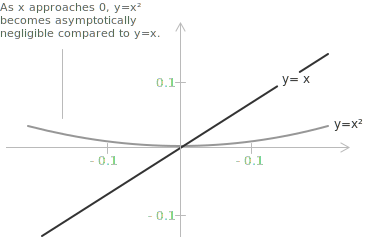

## What is little-o notation

The symbol $o(x)$, read as "little-o of $x$", belongs to the family of Landau symbols, which are used to characterise asymptotic relationships between functions. This notation expresses the idea that one function is negligible compared to another as the input approaches a given value. In this sense, $o(x)$ formalises [asymptotic](../asymptotes/) control by signifying that the growth rate of one function is insignificant relative to the other in the [limit](../limits/).

**Definition 1.** Let $f, g : A \to \mathbb{R}$ (or $\mathbb{C}$) be two [functions](../functions/), and let $x_0$ be a limit point of $A$. We say that $f(x)$ is little-o of $g(x)$ as $x \to x_0$ if $g(x) \neq 0$ on a neighbourhood of $x_0$ (except possibly at $x_0$ itself) and:

$$\lim_{x \to x_0} \frac{f(x)}{g(x)} = 0$$

Equivalently, for every $\varepsilon > 0$ there exists $\delta > 0$ such that, whenever $0 < |x - x_0| < \delta$, the inequality $|f(x)| \leq \varepsilon \cdot |g(x)|$ holds. This definition expresses the fact that $f(x)$ grows asymptotically more slowly than $g(x)$ near $x_0$.

> The same notation applies to limits at infinity by replacing $x \to x_0$ with $x \to \infty$. It also applies to [sequences](../sequences/), where the continuous variable $x$ is replaced by the integer index $n$ and the limit is taken as $n \to \infty$.

## Example 1

To make the concept concrete, consider the following limit:

$$\lim_{x \to 0} \frac{x^2}{x} = \lim_{x \to 0} x = 0$$

This shows that $x^2$ grows asymptotically more slowly than $x$ as $x \to 0$. We can therefore write:

$$x^2 = o(x) \quad \text{as} \quad x \to 0$$

A direct comparison clarifies the reason. As $x \to 0$, both $x$ and $x^2$ tend to zero, but at different rates. Near the origin, $x^2$ is much smaller than $x$:

+ if $x = 0.1$, then $x = 0.1$ and $x^2 = 0.01$;
+ if $x = 0.01$, then $x = 0.01$ and $x^2 = 0.0001$;
+ if $x = 0.001$, then $x = 0.001$ and $x^2 = 0.000001$.

The ratio $x^2/x$ shrinks rapidly as $x$ approaches zero. This is the essence of the little-o notation: it captures the fact that one function becomes asymptotically negligible compared to another as the input approaches a particular value.

## Example 2

Little-o notation remains applicable when the input increases without bound. The following limit illustrates this regime as $x \to \infty$:

$$\lim_{x \to \infty} \frac{x}{x^2} = \lim_{x \to \infty} \frac{1}{x} = 0$$

Because the ratio approaches zero, the following expression holds:

$$x = o(x^2) \quad \text{as} \quad x \to \infty$$

This indicates that $x$ grows asymptotically more slowly than $x^2$ as $x$ increases without bound. More generally, for any two power functions $x^a$ and $x^b$ with $a < b$:

$$x^a = o(x^b) \quad \text{as} \quad x \to \infty$$

A further example compares a [logarithmic function](../logarithms/) with a power function. Since:

$$\lim_{x \to \infty} \frac{\log x}{x} = 0$$

it follows that $\log x = o(x)$ as $x \to \infty$. This result is particularly relevant in algorithm analysis, where it confirms that logarithmic growth is strictly dominated by linear growth.

> The little-o condition at infinity parallels the condition at a finite point: the ratio of the two functions must approach zero as the input increases without bound, rather than as it approaches a fixed value.

## The meaning of $o(1)$

The symbol $o(1)$ represents the class of functions that tend to zero as $x$ approaches a specific point $x_0$. A function $f(x)$ belongs to $o(1)$ when it becomes infinitesimally small compared to a constant, specifically to $1$, in the limit $x \to x_0$. Formally, we write $f(x) = o(1)$ as $x \to x_0$ if and only if:

$$\lim_{x \to x_0} \frac{f(x)}{1} = \lim_{x \to x_0} f(x) = 0$$

The set of all functions belonging to $o(1)$ can be described as:

$$o_{x_0}(1) = \\{\ f : B(x_0, \delta) \setminus \\{x_0\\} \to \mathbb{R} \mid \lim_{x \to x_0} f(x) = 0 \ \\}$$

The components of this expression have the following meaning:

+ The functions considered are defined on a neighbourhood of $x_0$, excluding the point $x_0$ itself.
+ The function must tend to zero as $x$ approaches $x_0$.
+ The notation $o(1)$ identifies the set of all functions that are infinitesimal compared to the constant $1$.
+ The symbol $B(x_0, \delta)$ denotes an open neighbourhood of $x_0$ with radius $\delta$, where the function is defined and the limit is taken.

## Example 3

Consider the limit:

$$\lim_{x \to 0} \frac{\sin x}{x}$$

Using the Taylor expansion of $\sin x$ near zero:

$$\sin x = x - \frac{x^3}{6} + o(x^3) \quad \text{as} \quad x \to 0$$

- - -

Dividing both sides by $x$:

$$\frac{\sin x}{x} = 1 - \frac{x^2}{6} + o(x^2) \quad \text{as} \quad x \to 0$$

Both the term $\dfrac{x^2}{6}$ and the remainder $o(x^2)$ tend to zero as $x \to 0$. As $x \to 0$, we can therefore write:

$$\frac{\sin x}{x} = 1 + o(1)$$

> This expression shows that the difference between $\dfrac{\sin x}{x}$ and the constant $1$ tends to zero in the limit, with correction terms that are asymptotically smaller than $1$. The value of the limit recovered in this way is one of the [remarkable limits](../remarkable-limits/).

## Properties

A fundamental property of little-o notation follows directly from the definition. If $g(x) = o(f(x))$ as $x \to x_0$, the ratio of the two functions tends to zero:

$$\lim_{x \to x_0} \frac{o(f(x))}{f(x)} = 0$$

- - -

Multiplying a function by a nonzero constant does not affect its asymptotic behaviour in little-o notation. For any constant $c \in \mathbb{R}$ and any function $g(x)$, as $x \to x_0$:

$$o(c \cdot g(x)) = o(g(x))$$

$$c \cdot o(g(x)) = o(g(x))$$

> Little-o notation describes relative growth: scaling by a nonzero constant factor does not affect the asymptotic behaviour near $x_0$.

- - -

Little-o terms behave predictably under addition. The sum of two little-o terms of the same function remains a little-o term of that function. Formally, as $x \to x_0$:

$$o(f(x)) + o(f(x)) = o(f(x))$$

> Adding two functions that are each asymptotically smaller than $f(x)$ produces a function that is still asymptotically smaller than $f(x)$.

- - -

When multiplying a little-o term by a function, the result is a new little-o term whose asymptotic order scales accordingly. For functions $f(x)$ and $g(x)$, as $x \to x_0$:

$$f(x) \cdot o(g(x)) = o(f(x) g(x))$$

For example, if $g(x) = x$ and we have $o(g(x)) = o(x)$, then multiplying by $f(x) = x^2$ gives:

$$x^2 \cdot o(x) = o(x^3)$$

- - -

Another important property concerns powers of functions. If a function $f(x)$ is asymptotically smaller than $g(x)$ as $x \to x_0$, then raising both functions to the same positive power preserves the little-o relationship. Formally, for $a > 0$, if $f(x) = o(g(x))$ as $x \to x_0$, then $[f(x)]^a = o([g(x)]^a)$ as $x \to x_0$.

This property shows that asymptotic behaviour is preserved when both functions are scaled by the same positive power. If $f(x)$ becomes negligible compared to $g(x)$, then $[f(x)]^a$ is also negligible compared to $[g(x)]^a$ as $x \to x_0$. For example, if $f(x) = o(x)$ as $x \to 0$, then as $x \to 0$:

$$[f(x)]^2 = o(x^2)$$

- - -

Little-o notation exhibits transitivity. If $f(x) = o(g(x))$ and $g(x) = o(h(x))$ as $x \to x_0$, then:

$$f(x) = o(h(x)) \quad \text{as} \quad x \to x_0$$

This follows directly from the definition: since both ratios approach zero, their product also approaches zero, and therefore $f(x)/h(x) \to 0$. For example, since $x^3 = o(x^2)$ and $x^2 = o(x)$ as $x \to 0$, it follows that $x^3 = o(x)$ as $x \to 0$.

> Transitivity allows the composition of chains of asymptotic comparisons: if $f$ grows more slowly than $g$, and $g$ grows more slowly than $h$, then $f$ grows more slowly than $h$.

- - -

The composition of two little-o terms reduces to a single term. If $h(x) = o(g(x))$ and $g(x) = o(f(x))$ as $x \to x_0$, then any function that is little-o of $g$ is also little-o of $f$. In compact notation:

$$o(o(f(x))) = o(f(x)) \quad \text{as} \quad x \to x_0$$

This result follows directly from transitivity: if $h = o(g)$ and $g = o(f)$, then $h = o(f)$. For example, since $x^2 = o(x)$ as $x \to 0$, any function that is $o(x^2)$ is also $o(x)$.

> This property is especially useful for simplifying nested asymptotic expressions, since iterated little-o terms can be represented by a single one.

## Distinction between little-o and big-O notation

Little-o and [Big-O notation](../big-o-notation/) are both members of the family of Landau symbols, but they describe distinct asymptotic behaviours. Big-O notation provides an upper bound up to a constant multiple, whereas little-o notation imposes a stricter requirement: the ratio of the two functions must approach zero in the limit.

Formally, $f(x) = O(g(x))$ as $x \to x_0$ if there exist constants $M > 0$ and $\delta > 0$ such that $|f(x)| \leq M |g(x)|$ whenever $0 < |x - x_0| < \delta$. The distinction is illustrated by the following example.

As $x \to 0$, $x^2 = o(x)$, which also implies $x^2 = O(x)$. However, $x = O(x)$ does not imply $x = o(x)$, as the following limit shows:

$$\lim_{x \to 0} \frac{x}{x} = 1 \neq 0$$

The limit fails to vanish, so the little-o condition is not satisfied. This asymmetry is the heart of the distinction: little-o requires the ratio to go to zero, while Big-O requires only that it stay bounded.

The relationship can be visualised in terms of set inclusion: the class of functions satisfying $f = o(g)$ is strictly contained within the class of functions satisfying $f = O(g)$. Every little-o relationship is also a Big-O relationship, but the converse fails.

> Little-o notation excludes functions that merely keep pace with $g$, admitting only those that fall strictly behind in the limit.

## Little-o notation in Taylor expansions

In [Taylor expansions](../taylor-series/), little-o notation provides a rigorous framework for quantifying the error introduced by truncating an infinite series at a finite order. Rather than enumerating each remaining term, the remainder is represented by a single symbol that records its precise asymptotic order. Given a function $f(x)$ that is $n$ times differentiable at $x_0$, its Taylor expansion to order $n$ takes the form:

$$f(x) = f(x_0) + f'(x_0)(x - x_0) + \frac{f''(x_0)}{2!}(x - x_0)^2 + \cdots + \frac{f^{(n)}(x_0)}{n!}(x - x_0)^n + o\big( (x - x_0)^n \big)$$

The remainder $o((x - x_0)^n)$ conveys precise asymptotic information: the error decreases more rapidly than $(x - x_0)^n$ as $x \to x_0$, and is therefore negligible compared to the last explicit term in the expansion.

- - -

The following table collects the Taylor expansions of common functions near $x = 0$, each expressed with an explicit little-o remainder:

[class="table-1"]

|                  |                                                                       |
| ---------------- | --------------------------------------------------------------------- |
| $e^x$            | $1 + x + \dfrac{x^2}{2!} + \dfrac{x^3}{3!} + o(x^3)$                  |
| $\sin x$         | $x - \dfrac{x^3}{6} + o(x^3)$                                         |
| $\cos x$         | $1 - \dfrac{x^2}{2} + \dfrac{x^4}{24} + o(x^4)$                       |
| $\ln(1+x)$       | $x - \dfrac{x^2}{2} + \dfrac{x^3}{3} + o(x^3)$                        |
| $(1+x)^\alpha$   | $1 + \alpha x + \dfrac{\alpha(\alpha-1)}{2} x^2 + o(x^2)$              |

[/class]

These expansions are particularly effective for evaluating limits involving [indeterminate forms](../indeterminate-forms/). Replacing the original function with its Taylor expansion transforms the problem into an algebraic manipulation, where the little-o remainder vanishes in the limit. The following example illustrates the technique:

$$\lim_{x \to 0} \frac{e^x - 1 - x}{x^2} = \lim_{x \to 0} \frac{\dfrac{x^2}{2} + o(x^2)}{x^2} = \frac{1}{2}$$

As $x \to 0$, the little-o term becomes negligible and the limit is determined by the leading coefficient.

> In a Taylor expansion, the little-o remainder does not simply indicate omitted terms; it specifies the rate at which the approximation improves, thereby anchoring the truncation to a precise asymptotic scale. This perspective complements the [algebra of limits](../algebra-of-limits/) and the techniques developed for [remarkable limits](../remarkable-limits/).
