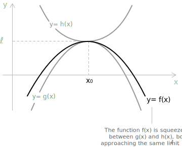

## What is the squeeze theorem

The squeeze theorem, also called the sandwich theorem, provides a method for determining the [limit](../limits/) of a [function](../functions/) when direct evaluation is challenging or when the function exhibits complex oscillatory behaviour near a specific point. The theorem is frequently applied to functions involving [sine and cosine](../sine-and-cosine/), particularly when these trigonometric terms oscillate in such a way that direct limit evaluation is impossible, as in:

$$\sin\left( \frac{1}{x} \right) \qquad \frac{\sin}{x} \qquad \cos\left( \frac{1}{x} \right)$$

In these situations, the function is constrained between two other functions with known and equal limits, which makes the evaluation of the target limit accessible.

## Statement

**Theorem.** Let $x_0 \in \mathbb{R} \cup \{ \pm\infty \}$ be a limit point, that is, a point such that every neighbourhood of $x_0$ contains at least one point of the [domain](../functions/) different from $x_0$. Let $f$, $g$, and $h$ be real-valued functions defined on a neighbourhood $I$ of $x_0$, and assume that for every $x \in I$ the inequality:

$$g(x) \leq f(x) \leq h(x)$$

holds. Suppose, in addition, that the limits of $g(x)$ and $h(x)$ as $x \to x_0$ both exist and coincide with the same value $\ell$:

$$\lim_{x \to x_0} g(x) = \lim_{x \to x_0} h(x) = \ell$$

Under these hypotheses, the function $f(x)$ also admits a limit as $x \to x_0$, and that limit is:

$$\lim_{x \to x_0} f(x) = \ell$$

- - -

Graphically, the curve representing $f(x)$ lies entirely between the lower bound $g(x)$ and the upper bound $h(x)$. As both bounding functions tend to $\ell$, the function $f(x)$ is forced to approach the same limit.

This expresses the geometric intuition behind the theorem: if a function is bounded above and below by two functions that both converge to the same value, then it must converge to that value.

## Proof of the squeeze theorem

Let $\varepsilon > 0$ be arbitrary. The goal is to prove that the function $f(x)$, which lies between $g(x)$ and $h(x)$, tends to the same limit $\ell$ as $x \to x_0$.

By assumption, $\lim_{x \to x_0} g(x) = \ell$. This means that there exists a positive number $\delta_1$ such that, for every $x$ sufficiently close to $x_0$, specifically for all $x$ satisfying $0 < |x - x_0| < \delta_1$:

$$|g(x) - \ell| < \varepsilon \quad \implies \quad \ell - \varepsilon < g(x) < \ell + \varepsilon$$

Similarly, since $\lim_{x \to x_0} h(x) = \ell$, there exists another positive number $\delta_2$ such that:

$$|h(x) - \ell| < \varepsilon \quad \implies \quad \ell - \varepsilon < h(x) < \ell + \varepsilon$$

Set $\delta = \min(\delta_1, \delta_2)$. For every $x$ such that $0 < |x - x_0| < \delta$, both inequalities above are satisfied. Since $f(x)$ is squeezed between $g(x)$ and $h(x)$:

$$g(x) \leq f(x) \leq h(x)$$

Combining this with the bounds on $g(x)$ and $h(x)$:

$$\ell - \varepsilon < f(x) < \ell + \varepsilon \quad \implies \quad |f(x) - \ell| < \varepsilon$$

Since this inequality holds for every $\varepsilon > 0$, we conclude:

$$\lim_{x \to x_0} f(x) = \ell$$

## Example 1

The following example illustrates how the theorem is applied to compute the limit:

$$\lim_{x \to 0} x \cdot \sin\left( \frac{1}{x} \right)$$

- - -

The term $\sin\left( \frac{1}{x} \right)$ does not admit a limit as $x \to 0$, since it oscillates indefinitely between $-1$ and $1$. For every [real number](../real-numbers/) $x \neq 0$, however, the inequality:

$$-1 \leq \sin\left( \frac{1}{x} \right) \leq 1$$

holds. Multiplying through by $x$ and using the [absolute value](../absolute-value/) to symmetrise the inequality, we obtain:

$$-|x| \leq x \cdot \sin\left( \frac{1}{x} \right) \leq |x|$$

- - -

For $x > 0$, the inequality is preserved; for $x < 0$, the direction reverses, but the absolute value ensures that the comparison remains symmetric with respect to zero. Both bounding functions $-|x|$ and $|x|$ tend to zero as $x \to 0$:

$$\lim_{x \to 0} -|x| = 0 \qquad \lim_{x \to 0} |x| = 0$$

Since $x \sin(1/x)$ is squeezed between two functions that both approach zero, the squeeze theorem applies and gives:

$$\lim_{x \to 0} x \cdot \sin\left( \frac{1}{x} \right) = 0$$

In many problems, when an oscillating function is multiplied by a power of $x$ that approaches zero, the overall limit is zero. The reason is that the oscillation remains bounded, as is the case for sine and cosine, which are confined to the interval $[-1, 1]$. The factor $x^n$ approaches zero rapidly enough to dominate the oscillation, so the entire product converges to zero.

## Example 2

Evaluate the limit:

$$\lim_{x \to +\infty} \frac{\ln(3 + \sin x)}{x^3}$$

- - -

The sine function is bounded between $-1$ and $1$ for every real $x$:

$$-1 \leq \sin x \leq 1$$

Adding $3$ to each term gives:

$$2 \leq 3 + \sin x \leq 4 \quad \text{for all } x \in \mathbb{R}$$

- - -

Since the [logarithmic function](../logarithms/) is strictly increasing, the same chain of inequalities is preserved under $\ln$:

$$\ln 2 \leq \ln(3 + \sin x) \leq \ln 4$$

Dividing all three terms by $x^3$ (which is positive for $x > 0$):

$$\frac{\ln 2}{x^3} \leq \frac{\ln(3 + \sin x)}{x^3} \leq \frac{\ln 4}{x^3} \quad \forall x > 0$$

Both bounding functions tend to zero as $x \to +\infty$. Applying the squeeze theorem:

$$\lim_{x \to +\infty} \frac{\ln(3 + \sin x)}{x^3} = 0$$

## Example 3

Evaluate the limit:

$$\lim_{x \to 0} \left( x^4 \cdot \cos\left( \frac{2}{x} \right) + 2 \right)$$

We analyse the behaviour of the function $x^4 \cdot \cos\left( \frac{2}{x} \right)$ separately. The cosine function is bounded between $-1$ and $1$ for all real values:

$$-1 \leq \cos\left( \frac{2}{x} \right) \leq 1$$

Multiplying all three terms by $x^4$, which is non-negative, gives:

$$-x^4 \leq x^4 \cdot \cos\left( \frac{2}{x} \right) \leq x^4$$

- - -

Taking the limit of the left and right bounds as $x \to 0$:

$$\lim_{x \to 0} (-x^4) = 0 \qquad \lim_{x \to 0} x^4 = 0$$

By the squeeze theorem:

$$\lim_{x \to 0} x^4 \cdot \cos\left( \frac{2}{x} \right) = 0$$

The original expression can now be evaluated by applying the sum rule from the [algebra of limits](../algebra-of-limits/):

$$\lim_{x \to 0} \left( x^4 \cdot \cos\left( \frac{2}{x} \right) + 2 \right) = 0 + 2 = 2$$

## Example 4

The squeeze theorem provides the classical justification of the trigonometric fundamental limit:

$$\lim_{x \to 0} \frac{\sin x}{x} = 1$$

This limit is the cornerstone of the differentiation of the trigonometric functions and appears among the [remarkable limits](../remarkable-limits/) in standard calculus references. The argument below establishes the limit for $x \to 0^+$, and the case $x \to 0^-$ is then deduced by symmetry.

- - -

Consider an angle $x \in (0, \pi/2)$ together with the [unit circle](../unit-circle/) centred at the origin. Let $O$ denote the centre, $A$ the point $(1, 0)$ on the positive $x$-axis, and $P$ the point on the unit circle determined by the angle $x$ measured counterclockwise from $OA$. Let $T$ be the intersection of the ray $OP$ extended with the vertical tangent line passing through $A$. Three regions are then compared: the triangle $OAP$, the circular sector bounded by $OA$, $OP$, and the arc $AP$, and the triangle $OAT$.

The triangle $OAP$ has base $OA = 1$ and height equal to the ordinate of $P$, which is $\sin x$. Its area is therefore:

$$\mathrm{Area}(OAP) = \frac{1}{2} \sin x$$

The circular sector has radius $1$ and central angle $x$ measured in radians, so its area is:

$$\mathrm{Area}(\text{sector}) = \frac{1}{2} x$$

The triangle $OAT$ has base $OA = 1$ and height $AT = \tan x$, since $T = (1, \tan x)$ by definition of tangent. Its area is:

$$\mathrm{Area}(OAT) = \frac{1}{2} \tan x$$

- - -

The triangle $OAP$ is contained in the circular sector, which is in turn contained in the triangle $OAT$. The corresponding chain of strict inequalities between the three areas is:

$$\frac{1}{2} \sin x < \frac{1}{2} x < \frac{1}{2} \tan x$$

Multiplying every term by $2$ removes the common factor and yields:

$$\sin x < x < \tan x$$

Since $x \in (0, \pi/2)$, the value $\sin x$ is strictly positive, so dividing the chain by $\sin x$ preserves the order of the terms:

$$1 < \frac{x}{\sin x} < \frac{1}{\cos x}$$

Taking the reciprocal of each member reverses the inequality:

$$\cos x < \frac{\sin x}{x} < 1$$

- - -

The function $\sin(x)/x$ is now confined between the lower bound $\cos x$ and the constant upper bound $1$. Both bounds admit a limit as $x \to 0^+$:

$$\lim_{x \to 0^+} \cos x = 1 \qquad \lim_{x \to 0^+} 1 = 1$$

The squeeze theorem applies directly and gives the right-hand limit:

$$\lim_{x \to 0^+} \frac{\sin x}{x} = 1$$

The function $\sin(x)/x$ is even, because $\sin(-x) = -\sin x$ and the denominator changes sign in the same way, leaving the ratio invariant under $x \mapsto -x$. The left-hand limit at $0$ therefore equals the right-hand limit, and the two-sided limit follows:

$$\lim_{x \to 0} \frac{\sin x}{x} = 1$$

> The geometric inequality $\sin x < x < \tan x$ on $(0, \pi/2)$ is the central ingredient of this argument. The same inequality underlies the derivation of related trigonometric limits, such as $\lim_{x \to 0} (1 - \cos x)/x^2 = 1/2$, which is obtained from the identity $1 - \cos x = 2 \sin^2(x/2)$ combined with the fundamental limit above.

The squeeze theorem complements the techniques developed for [indeterminate forms](../indeterminate-forms/) and is often the simplest route whenever a function can be controlled between two functions with a common limit.
