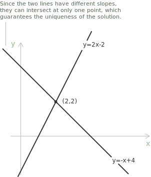

## Introduction

A system of [linear equations](../linear-equations/) in two variables is a pair of [equations](../equations) imposed on the same unknowns. Its general form is:

$$
\begin{cases}
a_1x + b_1y = c_1 \\[6pt]
a_2x + b_2y = c_2
\end{cases}
$$

In each equation at least one coefficient of the unknowns is nonzero. A solution is an ordered pair $(x,y)$ that satisfies both equations. The solution [set](../sets/) of every linear equation in two variables is a [line](../lines/) in the coordinate plane, so the solutions of the system are the points shared by the two lines.

Three outcomes are possible. Two distinct intersecting lines have one common point, two distinct parallel lines have no common points, and coincident lines have every point in common. The general classification of these cases and their matrix formulation are in the entry on [systems of linear equations](../systems-of-linear-equations/). This entry treats three methods for finding and classifying the solutions in two variables.

## The graphical method

In the graphical method, both lines are drawn on the same coordinate plane and the solution is read from their intersection. The graph shows the number of solutions, but the coordinates read from it may be approximate. An exact solution must be checked in the original equations. Consider the system:

$$
\begin{cases}
x + y = 4 \\[6pt]
2x - y = 2
\end{cases}
$$

We write each equation in explicit form to graph its line:

$$
\begin{align}
y &= -x + 4 \\[6pt]
y &= 2x - 2
\end{align}
$$

The points $(0,4)$ and $(4,0)$ are on the first line, while $(0,-2)$ and $(1,0)$ are on the second. The first line has slope $-1,$ and the second has slope $2.$ Since the slopes are different, the lines have one point of intersection. On the graph this point is $(2,2),$ and substitution verifies its coordinates in both equations:

$$
\begin{align}
2 + 2 &= 4 \\[6pt]
2(2) - 2 &= 2
\end{align}
$$

Both equalities hold, so the solution is:

$$
(x,y) = (2,2)
$$

A graph is useful for reading the geometry of a system. It is less reliable when the intersection has fractional coordinates or is outside the viewing window, since a small reading error changes the proposed solution.

## The substitution method

After one variable is substituted, the remaining equation has one unknown. We isolate one variable in either equation, replace that variable in the other equation with the resulting expression, and then recover the remaining variable. The method is shortest when one equation has a variable with coefficient $1$ or $-1.$ Consider the system:

$$
\begin{cases}
x + 2y = 7 \\[6pt]
3x - y = 7
\end{cases}
$$

The first equation contains $x$ with coefficient $1,$ so we isolate it:

$$x = 7 - 2y$$

Every solution of the system must satisfy this relation. After replacing $x$ by $7-2y,$ the second equation has only the unknown $y$:

$$
\begin{align}
3(7 - 2y) - y &= 7 \\[6pt]
21 - 6y - y &= 7 \\[6pt]
-7y &= -14 \\[6pt]
y &= 2
\end{align}
$$

We substitute $y=2$ into the expression for $x$:

$$x = 7 - 2(2) = 3$$

The pair $(3,2)$ satisfies the two original equations, since $3+2(2)=7$ and $3(3)-2=7.$ The solution of the system is:

$$
(x,y) = (3,2)
$$

The result after substitution may instead be an identity or a contradiction. These outcomes are not failed calculations.

## The elimination method

In the elimination method, the system is replaced by an [equivalent system](../equations/) in which one equation has only one unknown. An equation has the same solutions after both sides are multiplied by a nonzero constant. Replacing one equation by the sum of itself and a multiple of the other equation leaves the solution set unchanged. We choose the multiples so that one variable has opposite coefficients in the two equations. Consider the system:

$$
\begin{cases}
3x + 2y = 12 \\[6pt]
5x - 3y = 1
\end{cases}
$$

The least common multiple of $2$ and $3$ is $6.$ After multiplying the first equation by $3$ and the second by $2,$ the coefficients of $y$ are $6$ and $-6$:

$$
\begin{cases}
9x + 6y = 36 \\[6pt]
10x - 6y = 2
\end{cases}
$$

Adding the equations eliminates $y$:

$$
\begin{align}
19x &= 38 \\[6pt]
x &= 2
\end{align}
$$

We substitute $x=2$ into the first original equation:

$$
\begin{align}
3(2) + 2y &= 12 \\[6pt]
2y &= 6 \\[6pt]
y &= 3
\end{align}
$$

The equality $5(2)-3(3)=1$ holds in the second original equation, so the calculation is consistent. The solution is:

$$
(x,y) = (2,3)
$$

Subtraction is the same procedure with a sign change. If the coefficients of one variable are equal rather than opposite, subtracting one equation from the other eliminates that variable. This method for two equations is the elementary form of [Gaussian elimination](../gaussian-elimination/).

## Contradictions and identities

An elimination may remove both unknowns. The remaining statement is either a contradiction or an identity. Consider first:

$$
\begin{cases}
2x + 3y = 5 \\[6pt]
4x + 6y = 13
\end{cases}
$$

After multiplying the first equation by $-2$ and adding it to the second, the result is:

$$0 = 3$$

This contradiction cannot be satisfied by any pair $(x,y).$ No ordered pair satisfies the system, so it is inconsistent. The first equation doubled is $4x+6y=10,$ while the second is $4x+6y=13.$ The coefficients of $x$ and $y$ are equal, but the constant terms are different, so the lines are distinct and parallel. Now consider:

$$
\begin{cases}
3x - y = 4 \\[6pt]
6x - 2y = 8
\end{cases}
$$

After multiplying the first equation by $-2$ and adding it to the second, the result is:

$$0 = 0$$

The identity places no further restriction on the unknowns because the second equation is twice the first. Both equations have the same line as their solution set, so the system is consistent and undetermined, with infinitely many solutions. Setting $x=t$ in the first equation gives $y=3t-4,$ and the complete solution set is:

$$
(x,y) = (t,3t-4), \qquad t \in \mathbb{R}
$$

An identity after a reversible sequence of substitutions or eliminations means that the original equations impose the same constraint. A contradiction means that the two constraints are incompatible.

For systems with any number of equations and unknowns, the [Rouché-Capelli theorem](../rouche-capelli-theorem/) expresses the distinction between one solution, no solution, and infinitely many solutions through the ranks of the coefficient and augmented matrices.

## Choosing a method

The form of the equations often suggests the shortest procedure:

+ A graph is useful when we need the number of intersections and their approximate positions.
+ Substitution is shortest when one equation is solved for an unknown or has a coefficient equal to $1$ or $-1.$
+ Elimination is shortest when one pair of coefficients is equal, opposite, or has a small least common multiple.

The solution set is the same with all three methods. In the graphical method, a solution is a common point of two lines. In substitution, one equation supplies an expression that is inserted into the other. In elimination, the equations are replaced by equivalent [linear combinations](../linear-combinations/). For larger systems, elimination is carried out through row operations on a [matrix](../matrices/). When the coefficient matrix is square and has nonzero determinant, [Cramer's rule](../cramers-rule/) is another exact method.
