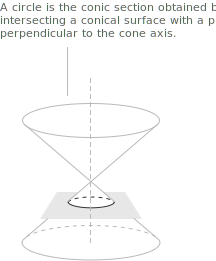
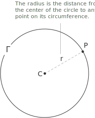
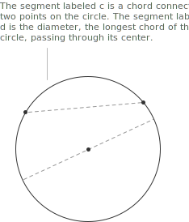
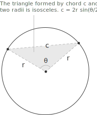
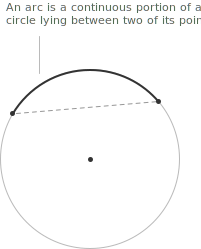
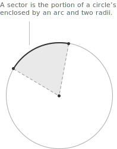
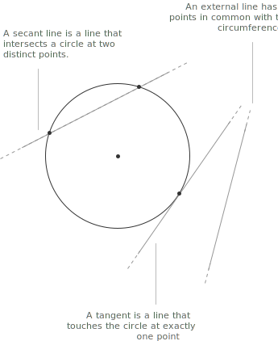

## Introduction to conic sections

When introducing the [parabola](../parabola/), we observed that the intersection of a plane with a cone produces, once projected onto the plane, one of four possible curves: a circumference, a parabola, an [ellipse](../ellipse/), or a [hyperbola](../hyperbola/). These four curves are collectively known as conics. A conic is a second-degree algebraic curve in the plane, defined as the set of points $(x, y) \in \mathbb{R}^2$ whose coordinates satisfy a general quadratic equation in the variables $x$ and $y$. This [equation](../equations/) takes the following form:

$$f(x, y) = a_{11}x^2 + 2a_{12}xy + a_{22}y^2 + 2a_{13}x + 2a_{23}y + a_{33} = 0$$

+ The coefficients $a_{ij}$ are real numbers.
+ The factor $2$ in front of the mixed and linear terms is a conventional choice that simplifies the matrix representation of the conic.

For the equation to describe a quadratic curve, at least one of $a_{11}$, $a_{12}$, and $a_{22}$ must be different from zero; otherwise the expression reduces to a [linear equation](../linear-equations/) and the locus degenerates into a line.

- - -

The specific type of conic obtained depends on the relative values of these coefficients, in particular on the sign of the [discriminant](../quadratic-formula/) associated with the quadratic part. The circumference corresponds to the simplest and most symmetric case, in which the coefficients of $x^2$ and $y^2$ are equal and the mixed term $a_{12}xy$ vanishes.

This algebraic symmetry comes from the way the plane intersects the cone. When the cutting plane is perpendicular to the axis of the cone, the resulting section is a circumference, whose points are all equidistant from the axis itself. Any deviation from this perpendicularity breaks the symmetry between the two quadratic coefficients and produces one of the other conic sections.

## What is a circumference

Given a point $C$ in the plane, called the center, the circumference is defined as the set of all points in the plane equidistant from $C$. Consider a circumference $\Gamma$ with center $C$ and radius $r$. For every point $P$ belonging to $\Gamma$ the following relation holds:

$$d(P, C) = r \qquad r \in \mathbb{R},\ r > 0$$

Let $C = (x_0, y_0)$ be the coordinates of the center and $P = (x, y)$ a generic point of the circumference. Using the formula for the distance between two points in the plane, the condition $d(P, C) = r$ becomes:

$$\sqrt{(x - x_0)^2 + (y - y_0)^2} = r$$

Since both sides are non-negative, squaring does not introduce spurious solutions, and we obtain the standard form of the equation of a circumference:

$$(x - x_0)^2 + (y - y_0)^2 = r^2$$

Expanding the squares of the two binomials, we obtain:

$$x^2 - 2xx_0 + x_0^2 + y^2 - 2yy_0 + y_0^2 = r^2$$

We move all terms to the left-hand side and introduce the following substitutions:

$$
\begin{align}
a &= -2x_0 \\[6pt]
b &= -2y_0 \\[6pt]
c &= x_0^2 + y_0^2 - r^2
\end{align}
$$

With this choice of coefficients, the equation takes the compact form known as the general form of the equation of a circumference:

$$x^2 + y^2 + ax + by + c = 0$$

## Center and radius from the general form

In the general form $x^2 + y^2 + ax + by + c = 0$ the center and the radius do not appear explicitly, as they do in the standard form. Given the coefficients $a$, $b$, and $c$, we can recover the center and the radius directly and determine the conditions under which the equation describes a circumference. We compare the general form with the coefficients obtained earlier:

$$
\begin{align}
a &= -2x_0 \\[6pt]
b &= -2y_0 \\[6pt]
c &= x_0^2 + y_0^2 - r^2
\end{align}
$$

The first two relations give immediately the coordinates of the center:

$$x_0 = -\frac{a}{2} \qquad y_0 = -\frac{b}{2}$$

Substituting these values into the third relation and solving for $r^2$, we find:

$$r^2 = \frac{a^2}{4} + \frac{b^2}{4} - c$$

Since $r$ is a length, it must be a non-negative real number, so the right-hand side of the previous equation cannot be negative. We denote the right-hand side by $\rho$:

$$\rho = \frac{a^2}{4} + \frac{b^2}{4} - c$$

The nature of the locus described by the equation $x^2 + y^2 + ax + by + c = 0$ depends entirely on the sign of $\rho$, and three distinct situations arise.

+ For $\rho > 0$ the equation describes a proper circumference, with center $\left(-\frac{a}{2}, -\frac{b}{2}\right)$ and radius $r = \sqrt{\rho}$. This is the only case in which the locus is an actual curve in the plane.

+ The value $\rho = 0$ collapses the radius to zero, so the equation is satisfied by the single point $\left(-\frac{a}{2}, -\frac{b}{2}\right)$. The locus degenerates into a point, sometimes called a degenerate circumference of zero radius.

+ A negative $\rho$ leaves no real pair $(x, y)$ satisfying the equation, because a sum of two squares can never equal a negative quantity. The locus is empty, and the equation, though still second-degree in form, does not describe any real curve in the plane.

The condition $\rho > 0$ is thus the condition of existence of a real circumference expressed in general form. Whenever it holds, the equation $x^2 + y^2 + ax + by + c = 0$ can be converted back into the standard form by completing the square, and the center and radius can be read off directly from the formulas above.

## Circle and circumference

The terms circle and circumference are often used interchangeably, but they denote two distinct objects.

+ The circumference is the curve formed by all points of the plane equidistant from a fixed point called the center. It is a one-dimensional object, a closed curve with no interior.
+ The circle is the region of the plane bounded by a circumference, including all the points in its interior. It is a two-dimensional object, a surface.
+ The length of a circumference of radius $r$ is $L = 2\pi r$, where $\pi$ is the ratio between the length of any circumference and its diameter.
+ The area of a circle of radius $r$ is $A = \pi r^2$. The circumference is a curve and has no area, so the phrase area of a circumference has no meaning.

## Radius, chord, diameter, and circle

Several basic elements are associated with a circumference, all defined in terms of its center and its points.

+ A radius is any [line](../lines/) segment that connects the center of the circumference to a point on the circumference itself.
+ A chord is any segment whose endpoints both lie on the circumference.
+ A diameter is any chord that passes through the center of the circumference; it is therefore the longest possible chord, and its length is exactly twice the radius.
+ A circle is the set containing all the points on the circumference together with all the points in its interior.

- - -

Among these elements, the chord has a length that can be expressed directly in terms of the radius and of the angle it subtends at the center. If $\theta$ denotes the central angle subtended by the chord, measured in [radians](../angles-and-angular-measure/), the length $c$ of the chord is given by the following formula, which involves the [sine function](../sine-function/):

$$c = 2r\sin\left(\frac{\theta}{2}\right)$$

The chord, together with the two radii joining its endpoints to the center, forms an isosceles triangle whose apex angle is $\theta$, and the expression $2r\sin(\theta/2)$ is the length of the base of that triangle.

## Arcs and circular sectors

An arc is a portion of a circumference bounded by two of its points. The endpoints of a chord divide the circumference into two arcs, and we say that the chord subtends the two arcs, or equivalently that each arc is subtended by the chord.

If $\theta$ denotes the central angle corresponding to the arc, measured in radians, and $r$ the radius of the circumference, the length of the arc is given by the formula:

$$\text{Arc length} = r\theta$$

- - -

A circular sector is the portion of a circle enclosed between an arc and the two radii connecting the center to the endpoints of the arc. Using the same notation, the area $A$ of a circular sector is given by the formula:

$$A = \frac{1}{2}r^2\theta$$

## Length of a circumference

The distance between two points measures the length of a straight segment, so it does not by itself assign a length to a curved line. The length of a circumference is defined through a [limiting process](../limits/): inscribe in it a regular polygon with $n$ sides, measure the perimeter of that polygon, and let $n$ increase beyond every bound. As $n$ increases, the vertices of the polygon distribute themselves ever more densely along the curve and the perimeter approaches a finite value, which is taken as the length of the circumference.

The chord-length formula makes this limit explicit. In a circumference of radius $r$, a regular polygon with $n$ sides has $n$ equal chords, each subtending a central angle $2\pi/n$. Setting $\theta = 2\pi/n$ in the chord formula, each side has length $2r\sin(\pi/n)$, so the perimeter of the inscribed polygon is:

$$p_n = 2nr\sin\left(\frac{\pi}{n}\right)$$

To evaluate the limit as $n \to \infty$, write $x = \pi/n$, so that $n = \pi/x$ and $x \to 0$. The perimeter becomes:

$$p_n = 2\pi r\cdot\frac{\sin x}{x}$$

The ratio $\sin(x)/x$ tends to $1$ as $x \to 0$, one of the [remarkable limits](../remarkable-limits/), and the perimeters converge to:

$$L = \lim_{n \to \infty} 2nr\sin\left(\frac{\pi}{n}\right) = 2\pi r$$

The length of a circumference of radius $r$ is thus $L = 2\pi r$, equivalently $L = \pi d$ in terms of the diameter $d = 2r$. The constant $\pi$ is the ratio $L/d$ between the length of a circumference and its diameter, and it takes the same value for every circumference, independently of the radius. Its decimal expansion begins $3.14159\ldots$ and does not terminate.

> Archimedes estimated $\pi$ by squeezing a circumference between two regular polygons, one drawn inside the curve and one around it, and comparing their perimeters. Working with polygons of $96$ sides he reached the bounds $3 + \frac{10}{71} < \pi < 3 + \frac{1}{7}$, the first rigorous numerical estimate of the constant.

The same value follows from the arc-length formula. A full circumference is the arc corresponding to a central angle of $2\pi$, so substituting $\theta = 2\pi$ into $\text{Arc length} = r\theta$ returns $2\pi r$, in agreement with the limit computed above.

## Example 1

For the circumference centered at the origin with radius $r = 1$, substituting $x_0 = 0$, $y_0 = 0$, and $r = 1$ into the standard form $(x - x_0)^2 + (y - y_0)^2 = r^2$ gives:

$$x^2 + y^2 = 1$$

To express the same circumference in general form, we compare this equation with:

$$x^2 + y^2 + ax + by + c = 0$$

By direct inspection, the coefficients are:

$$a = 0 \qquad b = 0 \qquad c = -1$$

The equation of the unit circumference in general form is therefore:

$$x^2 + y^2 - 1 = 0$$

This equation coincides with that of the [unit circle](../unit-circle/), used in trigonometry to define the sine and cosine of an angle.

## Circumferences and lines

The position of a line with respect to a circumference depends on the distance between the line and the center. A [line](../lines/) can be classified as secant, tangent, or external to the circumference, and denoting by $D$ the distance from the center to the line and by $r$ the radius, the three cases are mutually exclusive and cover all possibilities.

The line is secant when it meets the circumference at two distinct points, corresponding to $D < r$. As the line recedes from the center the two intersections draw together, and at $D = r$ they merge into a single point of contact, where the line is tangent. Once $D > r$ the line no longer reaches the curve and is external to it.

- - -

This geometric classification has a purely algebraic counterpart. The intersection points between a line and a circumference are the solutions of the system formed by their equations:

$$
\begin{cases}
x^2 + y^2 + ax + by + c = 0 \\[6pt]
y = mx + q
\end{cases}
$$

Substituting the expression for $y$ from the second equation into the first leads to a quadratic equation in the unknown $x$, whose number of real solutions coincides with the number of intersection points. Its discriminant $\Delta$ reproduces the geometric trichotomy: a positive $\Delta$ gives two distinct roots and a secant line, a vanishing $\Delta$ a single double root and a tangent line, and a negative $\Delta$ no real root and an external line.

## Example 2

We are given the circumference of equation $x^2 + y^2 - 2x - 2y - 3 = 0$ and the line of equation $y = -x + 3$, and we want to determine whether the line is secant, tangent, or external to it, and in the first two cases find the coordinates of the intersection points.

The intersection points are the solutions of the system formed by the two equations:

$$
\begin{cases}
x^2 + y^2 - 2x - 2y - 3 = 0 \\[6pt]
y = -x + 3
\end{cases}
$$

We rewrite the first equation using the method of [completing the square](../completing-the-square/):

$$(x - 1)^2 - 1 + (y - 1)^2 - 1 - 3 = 0$$

> The method of completing the square transforms a quadratic [polynomial](../polynomials/) or equation into an equivalent form in which a perfect square [trinomial](../trinomials/) appears isolated on one side of the equation.

- - -

Moving the constants to the right-hand side, the system becomes:

$$
\begin{cases}
(x - 1)^2 + (y - 1)^2 = 5 \\[6pt]
y = -x + 3
\end{cases}
$$

The first equation now reveals that the given curve is a circumference with center $(1, 1)$ and radius $r = \sqrt{5}$. Substituting the expression for $y$ from the second equation into the first, we obtain:

$$(x - 1)^2 + (-x + 2)^2 = 5$$

Expanding both squares, we obtain:

$$x^2 - 2x + 1 + x^2 - 4x + 4 = 5$$

Combining like terms and moving all terms to the left-hand side, the equation reduces to:

$$2x^2 - 6x = 0$$

Factoring out $2x$, we obtain the equivalent [quadratic equation](../quadratic-equation/):

$$2x(x - 3) = 0$$

This equation has two distinct real solutions:

$$x = 0 \qquad \text{or} \qquad x = 3$$

The corresponding values of $y$ are obtained by substituting into the equation of the line $y = -x + 3$. For $x = 0$ we get $y = 3$, and for $x = 3$ we get $y = 0$.

Therefore, the points of intersection are:

$$P_1 = (0, 3) \quad \text{and} \quad P_2 = (3, 0)$$

Since there are two distinct solutions, the line is secant to the circumference.
