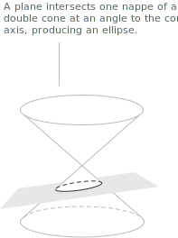
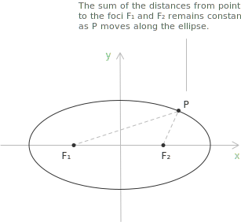
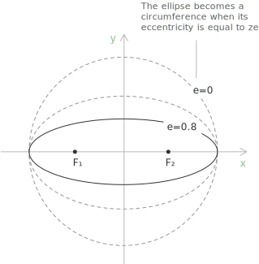

## Introduction to conic sections

When introducing the [parabola](../parabola/), we saw that the intersection of a plane with a cone, projected onto the plane, can be a [circumference](../circumference/), a parabola, an ellipse, or a [hyperbola](../hyperbola/). These curves are the conics. A conic is a second-degree algebraic curve in the plane, defined as the set of points $(x,y)\in\mathbb{R}^2$ that satisfy a general quadratic equation in the variables $x$ and $y$:

$$f(x,y) = a_{11}x^2 + 2a_{12}xy + a_{22}y^2 + 2a_{13}x + 2a_{23}y + a_{33} = 0$$

The coefficients satisfy $a_{ij}\in\mathbb{R},$ and for the curve to be quadratic we require $a_{11}$ and $a_{22}$ nonzero.

## What is an ellipse

The ellipse is the conic section obtained when the cutting plane crosses a single nappe of the cone completely, so the intersection is a single closed curve.

Given two fixed points $F_1$ and $F_2$ in the plane, an ellipse is the set of all points $P$ such that the sum of the distances from $P$ to each focus is constant:

$$\overline{PF_1} + \overline{PF_2} = k$$

The points $F_1$ and $F_2$ are the foci of the ellipse. Taking $F_1$ with coordinates $(-c,0)$ and $F_2$ with coordinates $(c,0),$ the distance between the foci is the focal distance, equal to $2c.$ The midpoint of the segment $\overline{F_1F_2}$ is the center of the ellipse. For the curve to exist the constant $k$ must exceed the focal distance, so $k>2c;$ when $k=2c$ the locus collapses to the segment joining the foci.

- - -

An ellipse has two axes of symmetry and a center of symmetry at their intersection, which is the center defined above. The major axis and the minor axis are, respectively, the longest and shortest diameters through the center. The major axis lies along the direction of maximum extension and passes through both foci. Its length is $2a,$ where $a$ is the semi-major axis. The minor axis is perpendicular to the major axis and also passes through the center. Its length is $2b,$ where $b$ is the semi-minor axis. The two endpoints of the major axis are the vertices of the ellipse, and the two endpoints of the minor axis are the co-vertices.

## Deriving the standard equation

Choosing the point $P=(a,0)$ at the right endpoint of the major axis places $P$ at the farthest horizontal extent of the ellipse. In this configuration the distance from the left focus $F_1=(-c,0)$ to $P$ is $\overline{F_1P}=a+c,$ and the distance from the right focus $F_2=(c,0)$ to $P$ is $\overline{F_2P}=a-c.$ The constant sum of the distances from any point on the ellipse to the two foci is therefore:

$$\overline{F_1P} + \overline{F_2P} = (a+c) + (a-c) = 2a$$

To obtain the equation of the curve we impose this same condition on a general point $P=(x,y).$ Writing each distance with the distance formula gives:

$$\sqrt{(x+c)^2+y^2} + \sqrt{(x-c)^2+y^2} = 2a$$

We isolate one radical and square, then simplify the difference of the two squared binomials:

$$
\begin{align}
\sqrt{(x+c)^2+y^2} &= 2a - \sqrt{(x-c)^2+y^2} \\[6pt]
(x+c)^2+y^2 &= 4a^2 - 4a\sqrt{(x-c)^2+y^2} + (x-c)^2+y^2 \\[6pt]
4cx &= 4a^2 - 4a\sqrt{(x-c)^2+y^2} \\[6pt]
a\sqrt{(x-c)^2+y^2} &= a^2 - cx
\end{align}
$$

Squaring once more removes the remaining radical and collects the terms in $x$:

$$
\begin{align}
a^2\left((x-c)^2+y^2\right) &= a^4 - 2a^2cx + c^2x^2 \\[6pt]
a^2x^2 - 2a^2cx + a^2c^2 + a^2y^2 &= a^4 - 2a^2cx + c^2x^2 \\[6pt]
x^2(a^2-c^2) + a^2y^2 &= a^2(a^2-c^2)
\end{align}
$$

Since $a>c,$ the quantity $a^2-c^2$ is positive, and we set $b^2=a^2-c^2.$ Substituting and dividing by $a^2b^2$ yields the standard form:

$$\frac{x^2}{a^2} + \frac{y^2}{b^2} = 1$$

with $b>0$ and $a>b,$ from which the focal distance follows:

$$c = \sqrt{a^2 - b^2}$$

For this ellipse the vertices are $(\pm a,0),$ the co-vertices $(0,\pm b),$ and the foci $(\pm c,0).$ The larger denominator $a^2$ sits under $x^2,$ so the major axis is horizontal.

## Orientation of the major axis and its graph

When the foci lie on the $y$-axis at $(0,-c)$ and $(0,c),$ the same derivation applies with the roles of $x$ and $y$ exchanged, and the standard form becomes:

$$\frac{x^2}{b^2} + \frac{y^2}{a^2} = 1$$

Here $a>b>0$ and $a$ is again the semi-major axis, so the larger denominator now sits under $y^2.$ The vertices lie at $(0,\pm a),$ the co-vertices at $(\pm b,0),$ and the foci at $(0,\pm c),$ with $c=\sqrt{a^2-b^2}.$

The same reading gives every feature needed to draw the curve. From the center we step $\pm a$ along the major axis to place the vertices and $\pm b$ along the minor axis to place the co-vertices, then mark the foci at distance $c=\sqrt{a^2-b^2}$ from the center along the major axis. Plotting these points and joining them with a smooth closed curve produces the ellipse.

## Eccentricity

The ratio between the focal distance and the length of the major axis is the eccentricity, denoted by $e$ and satisfying:

$$0 \leq e < 1$$

The closer $e$ is to $0,$ the more circular the ellipse. As $e$ approaches $1,$ the ellipse becomes more elongated. The eccentricity is given by:

$$e = \frac{c}{a} = \frac{\sqrt{a^2 - b^2}}{a}$$

> When $e=0$ the two semi-axes are equal, $a=b,$ the foci meet at the center, and the ellipse is a circumference. Because $e$ is a ratio of lengths, it is unchanged under scaling, so it measures shape and not size.

## Parametric and polar equations

The points of the ellipse in standard form have a trigonometric parametrization in the [sine and cosine](../sine-and-cosine/) functions:

$$x = a\cos t, \qquad y = b\sin t, \qquad t\in[0,2\pi)$$

Substituting these into $\frac{x^2}{a^2}+\frac{y^2}{b^2}$ returns the [Pythagorean identity](../pythagorean-identity/) $\cos^2 t+\sin^2 t=1,$ so each pair $(x,y)$ satisfies the standard equation. The parameter $t$ is the angle read on the auxiliary circle of radius $a,$ the eccentric anomaly, and it agrees with the ordinary polar angle at the center only when $a=b.$

- - -

The semi-latus rectum, denoted $\ell,$ is the distance from a focus to the ellipse measured perpendicular to the major axis. Setting $x=c$ in the standard equation and using $b^2=a^2-c^2$ gives $y^2=b^2\left(1-\frac{c^2}{a^2}\right)=\frac{b^4}{a^2},$ so:

$$\ell = \frac{b^2}{a}$$

Placing one focus at the origin and measuring the angle $\theta$ from the major axis, the ellipse has the [polar equation](../polar-coordinates/):

$$r(\theta) = \frac{\ell}{1 \pm e\cos\theta}$$

where the sign depends on the orientation of the axis. As $e\to 0$ the right-hand side reduces to the constant $\ell,$ the equation of a circumference of radius $\ell.$ This form describes the orbit of a body around a focus, as in Kepler's planetary orbits.

## Area and perimeter

The area enclosed by an ellipse is:

$$A = \pi ab$$

Scaling a circle of radius $a$ by the factor $b/a$ in the direction of the minor axis maps it to the ellipse and multiplies every area by $b/a,$ so the disk area $\pi a^2$ becomes $\pi ab.$ When $a=b$ this reduces to the area $\pi a^2$ of a circle.

The perimeter has no expression in elementary functions. Writing it as an [arc-length integral](../arc-length-of-a-curve/) of the parametrization and factoring out $a$ gives:

$$L = 4a\int_0^{\pi/2}\sqrt{1 - e^2\sin^2\theta}\ d\theta = 4aE(e)$$

where $E(e)$ is the complete elliptic integral of the second kind and $e$ the eccentricity. A compact approximation due to Ramanujan is:

$$L \approx \pi\left[3(a+b) - \sqrt{(3a+b)(a+3b)}\right]$$

which is exact for the circle and accurate for ellipses of moderate eccentricity.

## Tangent line and the reflective property

At a point $P_0=(x_0,y_0)$ lying on the ellipse $\frac{x^2}{a^2}+\frac{y^2}{b^2}=1,$ the tangent line is obtained by replacing $x^2$ with $xx_0$ and $y^2$ with $yy_0$:

$$\frac{xx_0}{a^2} + \frac{yy_0}{b^2} = 1$$

Its slope follows from [implicit differentiation](../chain-rule/) of the standard equation, $\frac{2x}{a^2}+\frac{2y}{b^2}\frac{dy}{dx}=0,$ evaluated at $P_0$:

$$m = -\frac{b^2 x_0}{a^2 y_0}$$

The tangent at $P_0$ makes equal angles with the two focal radii $\overline{P_0F_1}$ and $\overline{P_0F_2}.$ A ray leaving one focus therefore reflects off the ellipse and passes through the other focus, whatever its initial direction. This accounts for the elliptical billiard table, where a ball struck from one focus returns through the other, and for whispering galleries, where sound emitted at one focus converges at the other.

- - -

A chord through the center is a diameter of the ellipse. The midpoints of a family of parallel chords are collinear and lie on a diameter, the diameter conjugate to their common direction. Two diameters are conjugate when each bisects the chords parallel to the other, and the tangents at the endpoints of a diameter are parallel to its conjugate. The major and minor axes are the only pair of conjugate diameters that meet at a right angle.

## Writing the equation from vertices and foci

Given the vertices and foci of an ellipse centered at the origin, we first read off the axis, then use $b^2=a^2-c^2.$ Let the vertices be $(\pm 10,0)$ and the foci $(\pm 6,0).$ The vertices and foci lie on the $x$-axis, so the major axis is horizontal and the equation has the form $\frac{x^2}{a^2}+\frac{y^2}{b^2}=1.$ From the vertices $a=10,$ and from the foci $c=6,$ so:

$$b^2 = a^2 - c^2 = 100 - 36 = 64$$

Substituting $a^2=100$ and $b^2=64$ gives the equation:

$$\frac{x^2}{100} + \frac{y^2}{64} = 1$$

> Symmetry lets us reconstruct the ellipse from partial data. The vertices of an ellipse centered at the origin have the form $(\pm a,0)$ or $(0,\pm a),$ and the foci have the form $(\pm c,0)$ or $(0,\pm c),$ so a single vertex and a single focus already fix $a$ and $c,$ and hence $b.$

## Ellipse centered at an arbitrary point

Translating the center from the origin to a point $(h,k)$ replaces $x$ with $x-h$ and $y$ with $y-k.$ An ellipse centered at $(h,k)$ with major axis parallel to the $x$-axis has equation:

$$\frac{(x-h)^2}{a^2} + \frac{(y-k)^2}{b^2} = 1$$

It has vertices $(h\pm a,k),$ co-vertices $(h,k\pm b),$ and foci $(h\pm c,k).$ When the major axis is parallel to the $y$-axis the two denominators exchange roles:

$$\frac{(x-h)^2}{b^2} + \frac{(y-k)^2}{a^2} = 1$$

with vertices $(h,k\pm a),$ co-vertices $(h\pm b,k),$ and foci $(h,k\pm c).$

## Writing the equation of a translated ellipse

When the center is not the origin, the midpoint of the vertices locates it. For an ellipse with vertices $(2,-1)$ and $(2,9)$ and foci $(2,1)$ and $(2,7),$ the vertices share the same $x$-coordinate, so the major axis is parallel to the $y$-axis and the equation has the form $\frac{(x-h)^2}{b^2}+\frac{(y-k)^2}{a^2}=1.$ The center is the midpoint of the vertices:

$$(h,k) = \left(2, \frac{-1+9}{2}\right) = (2,4)$$

The length of the major axis is the distance between the vertices, $2a=10,$ so $a=5$ and $a^2=25.$ The distance from the center to either focus gives $c=|7-4|=3,$ hence:

$$b^2 = a^2 - c^2 = 25 - 9 = 16$$

Substituting $h=2,$ $k=4,$ $a^2=25,$ and $b^2=16$ produces the equation:

$$\frac{(x-2)^2}{16} + \frac{(y-4)^2}{25} = 1$$

## From the general form to the standard form

An ellipse often appears with its square terms not yet isolated, in the general form $Ax^2+By^2+Cx+Dy+E=0$ where $A$ and $B$ are nonzero and share the same sign. Completing the square in each variable returns it to standard form. One such equation is:

$$4x^2 + 9y^2 - 16x + 18y - 11 = 0$$

We group the terms in each variable, move the constant to the right, and factor out the coefficients of the squared terms:

$$4(x^2 - 4x) + 9(y^2 + 2y) = 11$$

Completing the square inside each bracket requires adding $4$ to $x^2-4x$ and $1$ to $y^2+2y.$ Multiplied by the factors outside the brackets, these contribute $16$ and $9$ to the right side:

$$
\begin{align}
4(x^2 - 4x + 4) + 9(y^2 + 2y + 1) &= 11 + 16 + 9 \\[6pt]
4(x-2)^2 + 9(y+1)^2 &= 36
\end{align}
$$

Dividing both sides by $36$ places the equation in standard form:

$$\frac{(x-2)^2}{9} + \frac{(y+1)^2}{4} = 1$$

The center is $(2,-1).$ Since $9>4,$ the major axis is parallel to the $x$-axis, with $a^2=9$ and $b^2=4,$ so $a=3$ and $b=2.$ The focal distance follows from $c^2=a^2-b^2=5,$ giving $c=\sqrt{5}.$ The vertices are $(5,-1)$ and $(-1,-1),$ the co-vertices $(2,1)$ and $(2,-3),$ and the foci $(2\pm\sqrt{5},-1).$

## Determining the equation from the focal definition

We determine the equation of the ellipse with foci $F_1=(1,0)$ and $F_2=(-1,0)$ such that the sum of the distances from any point on the ellipse to the two foci equals $6.$

A point $P(x,y)$ belongs to the ellipse when it satisfies the condition:

$$\sqrt{(x-1)^2 + y^2} + \sqrt{(x+1)^2 + y^2} = 6$$

Each square root is the [Euclidean distance](../pythagorean-theorem/) from $P(x,y)$ to one of the two foci. Isolating one radical and squaring, we obtain:

$$
\begin{align}
(x-1)^2 + y^2 &= 36 + (x+1)^2 + y^2 - 12\sqrt{(x+1)^2 + y^2} \\[6pt]
x^2 - 2x + 1 + y^2 &= 36 + x^2 + 2x + 1 + y^2 - 12\sqrt{(x+1)^2 + y^2} \\[6pt]
-4x - 36 &= -12\sqrt{(x+1)^2 + y^2} \\[6pt]
x + 9 &= 3\sqrt{(x+1)^2 + y^2}
\end{align}
$$

- - -

Squaring both sides again gives:

$$
\begin{align}
(x+9)^2 &= \left(3\sqrt{(x+1)^2 + y^2}\right)^2 \\[6pt]
x^2 + 18x + 81 &= 9x^2 + 18x + 9 + 9y^2 \\[6pt]
8x^2 + 9y^2 &= 72
\end{align}
$$

Dividing both sides by $72$:

$$\frac{8x^2}{72} + \frac{9y^2}{72} = 1$$

Reducing the fractions gives the standard form:

$$\frac{x^2}{9} + \frac{y^2}{8} = 1$$
