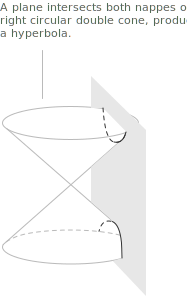
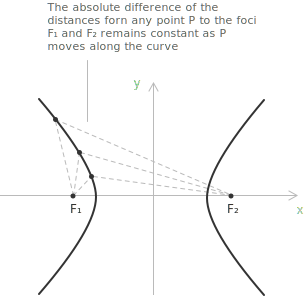
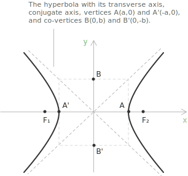
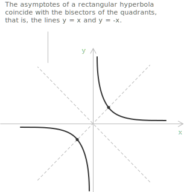
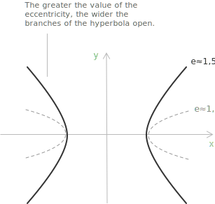

## Conic sections

When a plane cuts a cone, the intersection projected onto the plane is a [circumference](../circumference/), a [parabola](../parabola/), an [ellipse](../ellipse/), or a hyperbola. These curves are the conic sections, or conics. A conic is a second-degree plane algebraic curve, the set of points $(x, y) \in \mathbb{R}^2$ that satisfy a [quadratic equation](../quadratic-equations/) in $x$ and $y$:

$$f(x, y) = a_{11}x^2 + 2a_{12}xy + a_{22}y^2 + 2a_{13}x + 2a_{23}y + a_{33} = 0$$

The coefficients $a_{ij}$ are [real numbers](../real-numbers/), and the curve is quadratic when $a_{11}$ and $a_{22}$ are both nonzero.

## What is a hyperbola

The hyperbola is the conic section obtained when the cutting plane meets both nappes of the cone, so the intersection is two separate unbounded curves, the branches.

Given two fixed points $F_1$ and $F_2$ in the plane, a hyperbola is the set of all points $P$ for which the [absolute value](../absolute-value/) of the difference of the distances to the two foci is constant:

$$\left| PF_1 - PF_2 \right| = k$$

$F_1$ and $F_2$ are the foci and $k$ is the constant. The midpoint of the segment $\overline{F_1F_2}$ is the center, which here coincides with the origin of the Cartesian axes.

The line through the two foci is the transverse axis, the $x$-axis here. It meets the hyperbola at the two vertices $A(a, 0)$ and $A'(-a, 0),$ so $a$ is the semi-transverse axis. The perpendicular line through the center is the conjugate axis, the $y$-axis. The curve does not cross it, and the co-vertices $B(0, b)$ and $B'(0, -b)$ define the semi-conjugate axis $b.$

When $P$ is a vertex, say $(a, 0),$ the difference of its distances from $F_1$ and $F_2$ equals $2a.$ Since $k$ is the same for every point of the hyperbola, $k = 2a$:

$$\left| PF_1 - PF_2 \right| = 2a$$

A hyperbola centered at the origin with a horizontal transverse axis has the standard equation:

$$\frac{x^2}{a^2} - \frac{y^2}{b^2} = 1$$

Its foci are $(\pm c, 0),$ with $b^2 = c^2 - a^2,$ $b > 0,$ and $c > a,$ so that:

$$c = \sqrt{a^2 + b^2}$$

The vertices and co-vertices frame the central rectangle, of sides $2a$ and $2b$ parallel to the axes. Its diagonals have slope $\pm\frac{b}{a}$ and are the [asymptotes](../asymptotes/) of the hyperbola:

$$y = \pm \frac{b}{a}x$$

Each branch approaches its asymptote as $|x|$ grows but never reaches it.

The tangent at a point $(x_0, y_0)$ on the hyperbola follows by replacing $x^2$ with $xx_0$ and $y^2$ with $yy_0$ in the standard equation:

$$\frac{xx_0}{a^2} - \frac{yy_0}{b^2} = 1$$

With the foci on the $y$-axis the roles of $x$ and $y$ exchange. The transverse axis is vertical, the vertices are $(0, a)$ and $(0, -a),$ the foci $(0, \pm c),$ and the standard equation becomes:

$$\frac{y^2}{a^2} - \frac{x^2}{b^2} = 1$$

Now the co-vertices are $(\pm b, 0)$ and the asymptotes are $y = \pm\frac{a}{b}x.$

> With the same $a$ and $b,$ the hyperbola $\frac{x^2}{a^2} - \frac{y^2}{b^2} = -1$ is the conjugate of the horizontal one. It shares the central rectangle and the asymptotes, and its branches open along the $y$-axis.

## Rectangular hyperbola

When $a = b$ in the canonical equation, the hyperbola is rectangular. Its asymptotes are then perpendicular and its eccentricity is $e = \sqrt{2}.$ With the foci on the $x$-axis the equation becomes:

$$\frac{x^2}{a^2} - \frac{y^2}{a^2} = 1 \quad \rightarrow \quad x^2 - y^2 = a^2$$

> For the rectangular hyperbola $x^2 - y^2 = a^2$ the asymptotes are the lines $y = x$ and $y = -x,$ the bisectors of the quadrants.

A rotation of $45^\circ$ carries the asymptotes onto the coordinate axes and the equation into $xy = \frac{a^2}{2}.$ In these axes the rectangular hyperbola is the graph of the [reciprocal function](../rational-functions/) $y = \frac{a^2}{2x}.$

## Eccentricity and directrices

The eccentricity of a hyperbola is the ratio of the focal distance $c$ to the semi-transverse axis $a$:

$$e = \frac{c}{a} = \frac{\sqrt{a^2 + b^2}}{a}$$

Because $c > a,$ the eccentricity is always greater than $1.$ From $b^2 = c^2 - a^2$ it follows that $b/a = \sqrt{e^2 - 1},$ so the eccentricity fixes the slope of the asymptotes.

> The eccentricity measures how open the hyperbola is. When $e$ is close to $1$ the branches are narrow; as $e$ grows the foci move farther from the center and the branches open wider. The eccentricity depends only on the ratio of the distances, not on the size of the hyperbola, so it is a pure measure of shape.

Two directrices, the lines $x = \pm a/e,$ accompany the two foci. For every point of the hyperbola the distance $PF$ to a focus and the distance $Pd$ to the corresponding directrix stay in a constant ratio:

$$\frac{PF}{Pd} = e$$

This focus-directrix ratio is the definition shared by all conics, with $e < 1$ for the ellipse, $e = 1$ for the parabola, and $e > 1$ for the hyperbola.

The chord through a focus perpendicular to the transverse axis is the latus rectum, of length $2b^2/a.$ Its half $\ell = b^2/a = a(e^2 - 1)$ is the semi-latus rectum. Placing a focus at the pole gives the equation of the hyperbola in [polar coordinates](../polar-coordinates/):

$$r = \frac{\ell}{1 \pm e\cos\theta} = \frac{a(e^2 - 1)}{1 \pm e\cos\theta}$$

The same equation describes the ellipse and the parabola for the corresponding values of $e.$

## Circular and hyperbolic trigonometry

Just as the circular [sine and cosine](../sine-and-cosine/) come from the [unit circle](../unit-circle/), the [hyperbolic sine and cosine](../hyperbolic-sine-and-cosine/) come from the rectangular hyperbola:

$$x^{2} - y^{2} = 1$$

A hyperbolic sector determines a parameter $t,$ and the point $P$ on the hyperbola for this sector has coordinates:

$$P_x = \cosh t = \frac{e^{t} + e^{-t}}{2}$$

$$P_y = \sinh t = \frac{e^{t} - e^{-t}}{2}$$

The circular functions satisfy the [Pythagorean identity](../pythagorean-identity/) $\cos^2\theta + \sin^2\theta = 1,$ while the hyperbolic functions satisfy the [hyperbolic identity](../hyperbolic-identities/) $\cosh^2 t - \sinh^2 t = 1,$ the equation of the hyperbola. By the same identity, $x = a\cosh t$ and $y = b\sinh t$ parametrize 

$$\frac{x^2}{a^2} - \frac{y^2}{b^2} = 1$$ 
on its right branch, while $x = -a\cosh t$ gives the left.