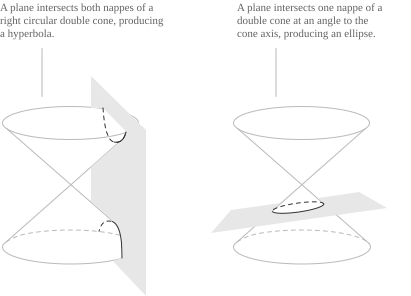

## The general second-degree equation

A conic is defined by a quadratic equation in two variables. In Cartesian coordinates its general equation is:

$$f(x,y) = a_{11}x^2 + 2a_{12}xy + a_{22}y^2 + 2a_{13}x + 2a_{23}y + a_{33} = 0$$

The coefficients $a_{ij}$ are [real numbers](../real-numbers/), and $a_{11},$ $a_{12},$ $a_{22}$ are not all zero. Thus $f$ has degree two. The factors $2$ are a notational convention. With this choice, the off-diagonal entries of the associated [symmetric matrix](../matrices/) are exactly $a_{12},$ $a_{13}$ and $a_{23}.$ A [plane](../planes/) that intersects a circular cone away from its vertex has a [circle](../circumference/), an [ellipse](../ellipse/), a [parabola](../parabola/) or a [hyperbola](../hyperbola/) as its section. 

Each section has an equation of the form above after Cartesian coordinates have been chosen. Here the problem is reversed. Given the six coefficients, we determine the type of conic, its position and its orientation. The entries devoted to the individual conics treat their foci, directrices and eccentricity.

Let $\mathbf{X}$ be the column of homogeneous coordinates, and let $A$ be the symmetric matrix of coefficients:

$$
\mathbf{X} = \begin{pmatrix}
x \\[6pt]
y \\[6pt]
1
\end{pmatrix}
\qquad
A = \begin{pmatrix}
a_{11} & a_{12} & a_{13} \\[6pt]
a_{12} & a_{22} & a_{23} \\[6pt]
a_{13} & a_{23} & a_{33}
\end{pmatrix}
$$

The product $\mathbf{X}^{\mathrm{T}}A\mathbf{X}$ is equal to $f(x,y)$ because each off-diagonal entry occurs twice. Hence the equation of the conic is:

$$\mathbf{X}^{\mathrm{T}}A\mathbf{X} = 0$$

We call $A$ the matrix of the conic. Its leading $2\times2$ submatrix is denoted by $A_0$ and has the form:

$$
A_0 = \begin{pmatrix}
a_{11} & a_{12} \\[6pt]
a_{12} & a_{22}
\end{pmatrix}
$$

The quadratic form associated with $A_0$ is $a_{11}x^2+2a_{12}xy+a_{22}y^2.$ If $\mathbf{v}=(x,y)^{\mathrm{T}}$ is the column of ordinary coordinates and $\mathbf{b}=(a_{13},a_{23})^{\mathrm{T}}$ is the column of linear coefficients, the equation is:

$$\mathbf{v}^{\mathrm{T}}A_0\mathbf{v} + 2\mathbf{b}^{\mathrm{T}}\mathbf{v} + a_{33} = 0$$

This decomposition separates the quadratic part from the lower-degree terms. The matrix $A_0$ determines the quadratic type and, when its eigenvalues are distinct, the principal directions. All the coefficients together determine degeneracy, size or aperture, existence of real points and position.

> Many texts write the general equation as $Ax^2+Bxy+Cy^2+Dx+Ey+F=0.$ In that notation $B=2a_{12},$ $D=2a_{13},$ $E=2a_{23},$ while $A,$ $C,$ $F$ are $a_{11},$ $a_{22},$ $a_{33},$ respectively.

## Degenerate conics

Over the field $\mathbb{C}$ of [complex numbers](../complex-numbers/), the polynomial $f$ may be a product of two linear polynomials:

$$f(x,y) = (\alpha x + \beta y + \gamma)(\alpha'x + \beta'y + \gamma')$$

A conic with such a factorization is degenerate, and its complex locus is the union of two [lines](../lines/), possibly coincident. Its real locus may be two real lines, one double real line, one point or the empty set.

The [determinant](../determinant/) of $A$ is the degeneracy criterion. The conic is degenerate exactly when:

$$\det A = 0$$

For one implication, let $L=(\alpha,\beta,\gamma)^{\mathrm{T}}$ and $L'=(\alpha',\beta',\gamma')^{\mathrm{T}}$ be the coefficient columns of the two factors. The factorization is $f=\mathbf{X}^{\mathrm{T}}LL'^{\mathrm{T}}\mathbf{X}.$ Since a scalar is equal to its transpose, we also have $f=\mathbf{X}^{\mathrm{T}}L'L^{\mathrm{T}}\mathbf{X}.$ The unique symmetric matrix of this quadratic polynomial is therefore:

$$A = \frac{1}{2}\left(LL'^{\mathrm{T}} + L'L^{\mathrm{T}}\right)$$

Every column of this matrix is a linear combination of $L$ and $L',$ so its rank is at most $2$ and its determinant is zero. The converse follows from the reduction later in this entry. If $\det A=0,$ a rigid change of coordinates reduces the equation to $\lambda_1x^2+\lambda_2y^2=0$ or $\lambda_1x^2=k,$ and each polynomial factors over $\mathbb{C}.$

The [rank](../rank-of-a-matrix/) of $A$ distinguishes the possible factorizations over $\mathbb{C}.$ When $\mathrm{rank}(A)=3,$ the conic is non-degenerate. When $\mathrm{rank}(A)=2,$ the two factors are distinct. When $\mathrm{rank}(A)=1,$ they are proportional, so the conic is one line counted twice.

Two lines with complex conjugate coefficients have a product with real coefficients. A real equation may therefore define a degenerate conic with only one real point or with no real points. For example, $x^2+y^2=0$ factors as $(x+iy)(x-iy),$ but its real locus is only the origin. A non-degenerate conic may also have an empty real locus. The equation $x^2+y^2+1=0$ has $\det A=1\neq0$ and no real solutions. The classification below includes all these cases.

## Invariants under rigid motions

Rigid changes of Cartesian coordinates preserve distances and angles. Let $R$ be an orthogonal matrix, so that $R^{\mathrm{T}}R=I,$ and let $\mathbf{t}$ be a translation vector. A rigid change of coordinates has the form:

$$\mathbf{v} = R\mathbf{v}' + \mathbf{t}$$

In homogeneous coordinates the same change is $\mathbf{X}=M\mathbf{X}',$ where $M$ is given by:

$$
M = \begin{pmatrix}
R & \mathbf{t} \\[6pt]
\mathbf{0}^{\mathrm{T}} & 1
\end{pmatrix}
$$

After substitution, the equation is $\mathbf{X}'^{\mathrm{T}}(M^{\mathrm{T}}AM)\mathbf{X}'=0,$ so its matrix in the new coordinates is $A'=M^{\mathrm{T}}AM.$ The matrix $M$ is block triangular and has $\det M=\det R=\pm1.$ By multiplicativity of the determinant, we have:

$$\det A' = (\det M)^2 \det A = \det A$$

The leading block of $A'$ is $R^{\mathrm{T}}A_0R=R^{-1}A_0R,$ so $A_0'$ and $A_0$ are [similar matrices](../change-of-basis-matrix/). They have the same characteristic polynomial, and:

$$\det A_0' = \det A_0 \qquad \mathrm{tr}(A_0') = \mathrm{tr}(A_0)$$

For a fixed defining polynomial, the numbers $\det A,$ $\det A_0$ and $\mathrm{tr}(A_0)$ are invariant under rigid changes of coordinates. They classify all cases below except the boundary case $\det A=\det A_0=0,$ for which one more quantity is needed.

- - -

Multiplying the equation by a nonzero constant $\mu$ does not change its locus, but it replaces $A$ by $\mu A.$ Consequently $\det A,$ $\det A_0$ and $\mathrm{tr}(A_0)$ are replaced by $\mu^3\det A,$ $\mu^2\det A_0$ and $\mu\mathrm{tr}(A_0),$ respectively. Their zero or nonzero status is independent of the chosen equation. The sign of $\det A_0$ and the sign of the product $\det A\cdot\mathrm{tr}(A_0)$ are also independent of that choice, whereas the individual signs of $\det A$ and $\mathrm{tr}(A_0)$ are reversed when $\mu<0.$

In the boundary case, the fourth quantity is the sum $\Delta_2$ of the three principal minors of order two of $A$:

$$\Delta_2 = (a_{22}a_{33} - a_{23}^2) + (a_{11}a_{33} - a_{13}^2) + (a_{11}a_{22} - a_{12}^2)$$

Orthogonal changes of coordinates leave $\Delta_2$ unchanged, whereas a general translation does not. If $\det A=\det A_0=0,$ then $\Delta_2$ is also invariant under translations. We use it only in this boundary case. Multiplication of the equation by $\mu\neq0$ replaces $\Delta_2$ by $\mu^2\Delta_2,$ so its sign is independent of the defining equation.

## Classification by the invariants

The matrix $A_0$ is real and symmetric, so its [eigenvalues](../eigenvalues-and-eigenvectors/) $\lambda_1$ and $\lambda_2$ are real. They satisfy:

$$\det A_0 = \lambda_1\lambda_2 \qquad \mathrm{tr}(A_0) = \lambda_1 + \lambda_2$$

The sign of $\det A_0$ determines whether the two eigenvalues have the same sign, have opposite signs or whether one of them is zero. These alternatives are the elliptic, hyperbolic and parabolic quadratic types. The condition $\det A=0$ is equivalent to degeneracy. Together with $\Delta_2$ when $\det A=\det A_0=0,$ these conditions give the complete classification.

[class="table-1"]

|                                                                     |                                                       |
| ------------------------------------------------------------------- | ----------------------------------------------------- |
| $\det A\neq0,$ $\det A_0>0,$ $\det A\cdot\mathrm{tr}(A_0)<0$        | Ellipse                                               |
| $\det A\neq0,$ $\det A_0>0,$ $\det A\cdot\mathrm{tr}(A_0)>0$        | Ellipse with no real points                           |
| $\det A\neq0,$ $\det A_0<0$                                         | Hyperbola                                             |
| $\det A\neq0,$ $\det A_0=0$                                         | Parabola                                              |
| $\det A=0,$ $\det A_0>0$                                            | Two conjugate imaginary lines meeting at a real point |
| $\det A=0,$ $\det A_0<0$                                            | Two distinct real lines meeting at a point            |
| $\det A=0,$ $\det A_0=0,$ $\Delta_2<0$                              | Two distinct real parallel lines                      |
| $\det A=0,$ $\det A_0=0,$ $\Delta_2>0$                              | Two conjugate imaginary parallel lines                |
| $\det A=0,$ $\det A_0=0,$ $\Delta_2=0$                              | One line counted twice                                |

[/class]

The condition $\det A\cdot\mathrm{tr}(A_0)<0$ in the first row follows from the centered equation $\lambda_1x^2+\lambda_2y^2+k=0.$ When $\lambda_1\lambda_2>0,$ both eigenvalues have the sign of their sum. Real points exist exactly when $k$ has the opposite sign. The reduction below shows that $k=\det A/\det A_0.$ Since $\det A_0>0,$ the sign of $k$ is the sign of $\det A,$ and the real locus is nonempty exactly when $\det A\cdot\mathrm{tr}(A_0)<0.$

In the notation $Ax^2+Bxy+Cy^2+Dx+Ey+F=0,$ the [discriminant](../quadratic-formula/) $B^2-4AC$ is related to the quadratic block by:

$$\det A_0 = a_{11}a_{22} - a_{12}^2 = AC - \frac{B^2}{4} = -\frac{1}{4}\left(B^2 - 4AC\right)$$

Thus the sign of $B^2-4AC$ distinguishes elliptic, parabolic and hyperbolic quadratic parts. When $\det A\neq0,$ these cases correspond, respectively, to an ellipse (possibly without real points), a parabola and a hyperbola. When $\det A=0,$ the conic is degenerate. A non-degenerate ellipse with real points is a circle exactly when $A_0$ is a nonzero multiple of the identity, that is, when $a_{11}=a_{22}\neq0$ and $a_{12}=0.$ In this case the two eigenvalues are equal.

## The center of a conic

A point $C$ with coordinate vector $\mathbf{c}$ is an algebraic center of the conic if $f(\mathbf{c}+\mathbf{w})=f(\mathbf{c}-\mathbf{w})$ for every $\mathbf{w}.$ For a nonempty non-degenerate real conic, this condition is equivalent to invariance under reflection through $C.$ The expansion after the substitution $\mathbf{v}=\mathbf{c}+\mathbf{w}$ is:

$$
\begin{align}
f(\mathbf{c}+\mathbf{w}) &= (\mathbf{c}+\mathbf{w})^{\mathrm{T}}A_0(\mathbf{c}+\mathbf{w}) + 2\mathbf{b}^{\mathrm{T}}(\mathbf{c}+\mathbf{w}) + a_{33} \\[6pt]
&= \mathbf{w}^{\mathrm{T}}A_0\mathbf{w} + 2\left(A_0\mathbf{c}+\mathbf{b}\right)^{\mathrm{T}}\mathbf{w} + f(\mathbf{c})
\end{align}
$$

The map $\mathbf{w}\mapsto-\mathbf{w}$ changes the sign of the linear term and leaves the other two terms unchanged. Thus the expression is even in $\mathbf{w}$ exactly when:

$$A_0\mathbf{c} + \mathbf{b} = \mathbf{0}$$

In coordinates, a center is a solution of the following [linear system](../systems-of-linear-equations-in-two-variables/):

$$
\begin{cases}
a_{11}x_0 + a_{12}y_0 + a_{13} = 0 \\[6pt]
a_{12}x_0 + a_{22}y_0 + a_{23} = 0
\end{cases}
$$

The two left-hand sides are one half of the [partial derivatives](../partial-derivatives/) of $f.$ Hence the centers are exactly the points at which the gradient of $f$ is zero.

The coefficient matrix of the system is $A_0.$ If $\det A_0\neq0,$ the system has one solution, so the conic has a unique center. This case includes ellipses, hyperbolas and degenerate pairs of intersecting lines. If $\det A_0=0,$ the [Rouché-Capelli theorem](../rouche-capelli-theorem/) shows that the system is either inconsistent or has infinitely many solutions. In the inconsistent case the conic is a non-degenerate parabola. In the second case it is a pair of parallel lines over $\mathbb{C},$ possibly coincident. The centers form a line parallel to the factors. For two distinct real lines, this is the line halfway between them.

For a central conic, a translation of the origin to the center removes the linear terms. The equation becomes:

$$\mathbf{w}^{\mathrm{T}}A_0\mathbf{w} + f(\mathbf{c}) = 0$$

The matrix after this translation is block diagonal, with blocks $A_0$ and $f(\mathbf{c}).$ Its determinant is $f(\mathbf{c})\det A_0,$ and it is equal to $\det A.$ Therefore the constant term is:

$$f(\mathbf{c}) = \frac{\det A}{\det A_0}$$

## Asymptotic directions

A nonzero pair $(l,m),$ considered up to multiplication by a nonzero scalar, determines a direction in the plane. The line through $(x_0,y_0)$ with this direction has [parametric equations](../vector-and-parametric-equations-of-a-line/) $x=x_0+lt$ and $y=y_0+mt.$ The coefficient of $t^2$ in the polynomial $f(x_0+lt,y_0+mt)$ is:

$$a_{11}l^2 + 2a_{12}lm + a_{22}m^2$$

If this coefficient is nonzero, the restriction of $f$ to the line is a quadratic polynomial with two complex [roots](../roots-of-a-polynomial/) counted with multiplicity. If it is zero, the restriction has degree at most one, or it is identically zero when the line is a component of a degenerate conic. Unless the line is a component, at least one intersection lies at infinity in the projective closure. This direction is called asymptotic. The condition is independent of $(x_0,y_0)$ and is precisely the vanishing of the quadratic form associated with $A_0.$

As a homogeneous quadratic equation in $l$ and $m,$ the condition has discriminant $4(a_{12}^2-a_{11}a_{22})=-4\det A_0.$ A non-degenerate hyperbola has two distinct real asymptotic directions because $\det A_0<0.$ A parabola has one real asymptotic direction of multiplicity two because $\det A_0=0.$ A real non-degenerate ellipse has none because $\det A_0>0.$ Its real locus is bounded because its quadratic form is definite.

For a hyperbola, the asymptotes are the lines through the center with the two asymptotic directions. In centered coordinates their union has equation $\mathbf{w}^{\mathrm{T}}A_0\mathbf{w}=0,$ which factors into those two lines. Since $f(x,y)-f(\mathbf{c})=\mathbf{w}^{\mathrm{T}}A_0\mathbf{w}$ and $f(\mathbf{c})=\det A/\det A_0,$ their equation in the original coordinates is:

$$f(x,y) - \frac{\det A}{\det A_0} = 0$$

> For an ellipse, this is the equation of two conjugate imaginary lines through the center, in agreement with the absence of real asymptotic directions.

## Reduction to canonical form

By the [spectral theorem](../matrix-diagonalization/), the real symmetric matrix $A_0$ has an [orthonormal basis](../inner-product-spaces/) of eigenvectors. Let $\mathbf{u}_1$ and $\mathbf{u}_2$ be unit eigenvectors for $\lambda_1$ and $\lambda_2,$ respectively. Let $R$ be the matrix whose columns are $\mathbf{u}_1$ and $\mathbf{u}_2.$ After the sign of one eigenvector has been reversed if necessary, $\det R=1,$ so $R$ is a rotation matrix. The diagonalization of $A_0$ is:

$$R^{\mathrm{T}}A_0R = \begin{pmatrix}\lambda_1 & 0 \\[6pt] 0 & \lambda_2\end{pmatrix}$$

Under the change of coordinates $\mathbf{v}=R\mathbf{v}',$ the quadratic part is $\lambda_1x'^2+\lambda_2y'^2.$ The mixed term is zero, and the equation has the form:

$$\lambda_1x'^2 + \lambda_2y'^2 + 2dx' + 2ey' + g = 0$$

Here $d,$ $e,$ $g$ are real coefficients. The new coordinate axes are parallel to $\mathbf{u}_1$ and $\mathbf{u}_2.$ When the eigenvalues are distinct, these vectors are the principal directions. The second step is a translation, obtained by [completing the square](../completing-the-square/) in every variable with a quadratic term. Its form depends on whether an eigenvalue is zero.

If $\det A_0\neq0,$ both squares can be completed. The translation moves the origin to the center, and the constant term has the value computed in the previous section:

$$\lambda_1x''^2 + \lambda_2y''^2 + \frac{\det A}{\det A_0} = 0$$

If $\det A\neq0,$ set $K=-\det A/\det A_0.$ The centered equation is $\lambda_1x''^2+\lambda_2y''^2=K,$ and $K\neq0.$ After division by $K,$ the equation is in elliptic form, possibly with no real points, or in hyperbolic form. For an ellipse with real points or a hyperbola, the semi-axis lengths along $\mathbf{u}_1$ and $\mathbf{u}_2$ are $\sqrt{\lvert K/\lambda_1\rvert}$ and $\sqrt{\lvert K/\lambda_2\rvert},$ respectively. If $\det A=0,$ the constant term is zero and the canonical equation factors over $\mathbb{C}$ into two lines.

Suppose that $\det A_0=0$ and $\det A\neq0.$ One eigenvalue is zero, say $\lambda_2=0,$ and $\lambda_1=\mathrm{tr}(A_0).$ In the rotated equation, $\det A=-\lambda_1e^2.$ Hence $e\neq0.$ The square in $x'$ can be completed, and the constant term can be removed by translating $y'.$ The resulting equation is $\lambda_1x''^2+2ey''=0.$ After the $y''$-axis has been reversed if necessary, the canonical equation is:

$$x''^2 = 2py''$$

The parameter is $p=\lvert e\rvert/\lvert\lambda_1\rvert.$ Since $\lambda_1=\mathrm{tr}(A_0)$ and $e^2=-\det A/\mathrm{tr}(A_0),$ this is:

$$p = \sqrt{-\frac{\det A}{\mathrm{tr}(A_0)^3}}$$

The expression under the radical is positive because $\det A=-\mathrm{tr}(A_0)e^2.$ It is unchanged if the equation is multiplied by a nonzero constant, and $p$ is positive by construction.

It remains to consider $\det A_0=\det A=0.$ Since the quadratic part is not zero, $A_0$ has rank $1.$ After a rotation, the equation has the form $\lambda x'^2+2dx'+2ey'+g=0,$ where $\lambda\neq0.$ Its determinant is $-\lambda e^2,$ so $\det A=0$ implies $e=0.$ After the square in $x'$ has been completed, the equation is:

$$\lambda x''^2 + h = 0$$

In this form $\Delta_2=\lambda h.$ If $\Delta_2<0,$ the equation has two distinct real parallel lines. If $\Delta_2>0,$ it has two conjugate imaginary parallel lines. If $\Delta_2=0,$ it is one line counted twice. This proves the last three rows of the classification table and completes the factorization argument for degenerate conics.

- - -

The eigenvectors determine the directions of the axes in the original coordinates. For a central conic, the center determines their position. If $\lambda_1\neq\lambda_2,$ the two principal axes have directions $\mathbf{u}_1$ and $\mathbf{u}_2.$ If $\lambda_1=\lambda_2,$ every line through the center is an axis, as for a circle. A parabola has one axis, parallel to the eigenvector for the eigenvalue $0,$ which is also its unique asymptotic direction. The translation in the reduction determines the position of this axis.

## Classifying a conic from its invariants

Consider the equation:

$$x^2 - 2xy - 3y^2 + 4y - 1 = 0$$

The coefficients are $a_{11}=1,$ $a_{12}=-1,$ $a_{22}=-3,$ $a_{13}=0,$ $a_{23}=2$ and $a_{33}=-1.$ Hence the two matrices are:

$$
A = \begin{pmatrix}
1 & -1 & 0 \\[6pt]
-1 & -3 & 2 \\[6pt]
0 & 2 & -1
\end{pmatrix}
\qquad
A_0 = \begin{pmatrix}
1 & -1 \\[6pt]
-1 & -3
\end{pmatrix}
$$

The determinant of the quadratic part is:

$$\det A_0 = (1)(-3) - (-1)^2 = -4$$

The three minors in the Laplace expansion of $\det A$ along the first row are:

$$
\begin{vmatrix}
-3 & 2 \\[6pt]
2 & -1
\end{vmatrix} = -1
\qquad
\begin{vmatrix}
-1 & 2 \\[6pt]
0 & -1
\end{vmatrix} = 1
\qquad
\begin{vmatrix}
-1 & -3 \\[6pt]
0 & 2
\end{vmatrix} = -2
$$

With the entries of the first row and the alternating cofactor signs, the expansion is:

$$
\begin{align}
\det A &= (1)(-1) - (-1)(1) + (0)(-2) \\[6pt]
&= -1 + 1 \\[6pt]
&= 0
\end{align}
$$

Since $\det A=0,$ the conic is degenerate. The inequality $\det A_0<0$ shows that it is a pair of distinct real lines meeting at one point. This point is the center, which is the solution of $A_0\mathbf{c}=-\mathbf{b}$:

$$
\begin{cases}
x_0 - y_0 = 0 \\[6pt]
-x_0 - 3y_0 = -2
\end{cases}
$$

The first equation is equivalent to $x_0=y_0.$ After substitution in the second equation, we have $-4y_0=-2.$ Thus the center is $\left(\frac{1}{2},\frac{1}{2}\right).$

The factorization confirms the classification. The quadratic part is $x^2-2xy-3y^2=(x-3y)(x+y),$ so the factors of $f$ have the forms $x-3y+\alpha$ and $x+y+\beta.$ Their product has $\alpha+\beta$ as the coefficient of $x$ and $\alpha-3\beta$ as the coefficient of $y.$ The coefficient equations are $\alpha+\beta=0$ and $\alpha-3\beta=4,$ whose solution is $\alpha=1$ and $\beta=-1.$ The constant term is also correct because $\alpha\beta=-1=a_{33}.$ Therefore the factorization is:

$$x^2 - 2xy - 3y^2 + 4y - 1 = (x - 3y + 1)(x + y - 1)$$

The two lines $x-3y+1=0$ and $x+y-1=0$ intersect at $\left(\frac{1}{2},\frac{1}{2}\right),$ the center computed above.

## Reducing a conic to canonical form

Consider the equation:

$$5x^2 - 4xy + 8y^2 - 16x - 8y - 16 = 0$$

The coefficients are $a_{11}=5,$ $a_{12}=-2,$ $a_{22}=8,$ $a_{13}=-8,$ $a_{23}=-4$ and $a_{33}=-16.$ The corresponding matrices are:

$$
A = \begin{pmatrix}
5 & -2 & -8 \\[6pt]
-2 & 8 & -4 \\[6pt]
-8 & -4 & -16
\end{pmatrix}
\qquad
A_0 = \begin{pmatrix}
5 & -2 \\[6pt]
-2 & 8
\end{pmatrix}
$$

The invariants of the quadratic part are:

$$\det A_0 = 40 - 4 = 36 \qquad \mathrm{tr}(A_0) = 13$$

In the Laplace expansion of $\det A$ along the first row, the three minors are $-144,$ $0$ and $72.$ The expansion is therefore:

$$
\begin{align}
\det A &= (5)(-144) - (-2)(0) + (-8)(72) \\[6pt]
&= -720 - 576 \\[6pt]
&= -1296
\end{align}
$$

The conditions $\det A\neq0$ and $\det A_0>0$ show that the conic is an ellipse. Moreover, $\det A\cdot\mathrm{tr}(A_0)=-16848<0,$ so its real locus is nonempty.

The center is the solution of $A_0\mathbf{c}=-\mathbf{b}$:

$$
\begin{cases}
5x_0 - 2y_0 = 8 \\[6pt]
-2x_0 + 8y_0 = 4
\end{cases}
$$

The second equation is equivalent to $x_0=4y_0-2.$ After substitution, the first equation is $18y_0=18,$ so $y_0=1$ and $x_0=2.$ The center is $(2,1).$

- - -

The eigenvectors of $A_0$ determine the rotation. The characteristic equation of $A_0$ is:

$$\lambda^2 - 13\lambda + 36 = 0$$

Its roots are $\lambda_1=4$ and $\lambda_2=9.$ For $\lambda_1=4,$ the system $(A_0-4I)\mathbf{u}=\mathbf{0}$ is equivalent to $x-2y=0,$ so $(2,1)$ is an eigenvector. For $\lambda_2=9,$ the corresponding equation is $2x+y=0,$ so $(1,-2)$ is an eigenvector. The two eigenvectors are orthogonal. After normalization, the sign of the second is reversed so that the resulting matrix has determinant $1$:

$$
R = \frac{1}{\sqrt5}\begin{pmatrix}
2 & -1 \\[6pt]
1 & 2
\end{pmatrix}
\qquad
\det R = \frac{4+1}{5} = 1
$$

The matrix $R$ is the rotation through the angle $\theta=\arctan\frac{1}{2}\approx26^\circ34'.$ Under the change of coordinates $\mathbf{v}=R\mathbf{v}''+(2,1)^{\mathrm{T}},$ the equation is:

$$4x''^2 + 9y''^2 - 36 = 0$$

After division by $36,$ the standard form is:

$$\frac{x''^2}{9} + \frac{y''^2}{4} = 1$$

The ellipse has semi-axes $a=3$ and $b=2.$ The larger semi-axis corresponds to the smaller eigenvalue, so the major axis has direction $\mathbf{u}_1=(2,1)/\sqrt5$ and the minor axis has direction $\mathbf{u}_2=(-1,2)/\sqrt5.$ The focal distance is $c=\sqrt{a^2-b^2}=\sqrt5,$ so the eccentricity is $e=\frac{\sqrt5}{3}.$

In the original coordinates, the axes are the lines through $(2,1)$ with directions $\mathbf{u}_1$ and $\mathbf{u}_2$:

$$x - 2y = 0 \qquad 2x + y - 5 = 0$$

The foci lie on the major axis at distance $c=\sqrt5$ from the center. Since $\mathbf{u}_1$ is a unit vector, the foci are:

$$F_1 = (4,2) \qquad F_2 = (0,0)$$

> If we substitute $\mathbf{v}=R\mathbf{v}''+(2,1)^{\mathrm{T}}$ into the original polynomial, the result is $4x''^2+9y''^2-36.$ This confirms the reduction and the choice of $R.$
