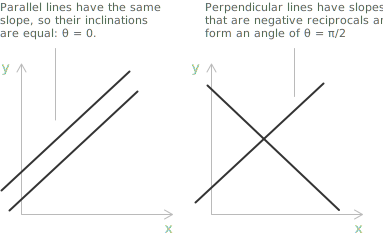
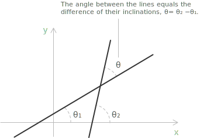
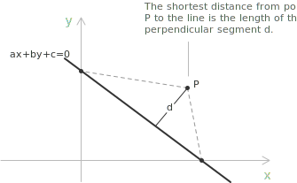

## Lines in the coordinate plane

A line is a set of points extending without end in two opposite directions, with no thickness and no endpoints. Two distinct points determine a unique line. In the Cartesian plane, a line is the solution set of a [first-degree equation](../linear-equations/) in the variables $x$ and $y$. Its implicit form is:

$$ax + by + c = 0$$

The coefficients $a$, $b$, $c$ are [real numbers](../real-numbers/), with at least one of $a$ and $b$ different from zero. The form is called implicit because it is not solved for either variable. When the line is not parallel to the $y$-axis, its equation can be solved for $y$ and written in explicit form:

$$y = mx + q$$

The number $m$ is the slope, which measures the rate of change of $y$ with respect to $x$, and $q$ is the $y$-intercept, the ordinate of the point where the line meets the $y$-axis. This explicit form is a [linear equation](../linear-equations/) in two variables. The $x$-intercept is the value of $x$ for which $y = 0,$ the root of the line's equation.

A point lies on a line exactly when its coordinates satisfy the equation, so substituting them leaves both sides equal. The point $(2, 5)$ lies on the line $y = 2x + 1$ because $2(2) + 1 = 5,$ and the equation holds.

## Intercept form

A line that meets both axes away from the origin can be written through its intercepts. Let it cross the $x$-axis at $(p, 0)$ and the $y$-axis at $(0, q)$, with $p \ne 0$ and $q \ne 0$. Its equation is:

$$\frac{x}{p} + \frac{y}{q} = 1$$

The number $p$ is the $x$-intercept and $q$ is the $y$-intercept. Substituting $(p, 0)$ gives $\frac{p}{p} + \frac{0}{q} = 1,$ and substituting $(0, q)$ gives $\frac{0}{p} + \frac{q}{q} = 1,$ so both points satisfy the equation. The form excludes lines through the origin, where $p$ and $q$ would both be zero and the denominators would vanish, and lines parallel to an axis, which meet only one of the two axes.

As an example, take the line crossing the $x$-axis at $(3, 0)$ and the $y$-axis at $(0, 5)$. With $p = 3$ and $q = 5$ the intercept form is:

$$\frac{x}{3} + \frac{y}{5} = 1$$

Multiplying both sides by $15$ clears the denominators and gives the implicit form $5x + 3y - 15 = 0$.

## Slope and inclination

A line parallel to the $y$-axis is vertical, and all of its points share the same abscissa. Its equation is:

$$x = k$$

A line parallel to the $x$-axis is horizontal, and all of its points share the same ordinate. Its equation is:

$$y = k$$

A horizontal line has slope $0$. A vertical line has no slope, since it cannot be written in the form $y = mx + q$.

Every nonhorizontal line meets the $x$-axis at a point. The inclination of the line is the [angle](../angles-and-angular-measure/) $\theta$, measured counterclockwise from the positive direction of the $x$-axis to the line, taken in the range $0 \le \theta < \pi$. A horizontal line has inclination $0$. The inclination and the slope of a nonvertical line are related by:

$$m = \tan\theta$$

For $\theta = \pi/2$ the [tangent](../tangent-and-cotangent/) is undefined, which matches the fact that a vertical line has no slope. An acute inclination gives a positive slope, and an obtuse inclination gives a negative slope. As an example, find the inclination of the line:

$$5x + 2y = 10$$

Solving for $y$ gives:

$$y = -\frac{5}{2}x + 5$$

so the slope is:

$$m = -\frac{5}{2}$$

The slope is negative, so the inclination is obtuse, and from $\tan\theta = -\frac{5}{2}$ we add $\pi$ to the principal value of the [arctangent](../arctangent-and-arccotangent/):

$$\theta = \pi + \arctan\left(-\frac{5}{2}\right) \approx \pi - 1.190 \approx 1.951$$

The inclination is about $1.951$ radians, or about $111.8°$.

## Parallel and perpendicular lines

Two lines $r$ and $s$ with slopes $m_r$ and $m_s$ are parallel when their slopes are equal:

$$m_r = m_s$$

They are perpendicular when their slopes are negative reciprocals of each other:

$$m_r = -\frac{1}{m_s}$$

The second condition is equivalent to $m_r m_s = -1,$ and it requires both lines to be nonvertical.

> A line parallel to the $y$-axis has no slope, while a line parallel to the $x$-axis has slope $0$. These two lines are perpendicular to each other, a case handled directly rather than through the slope conditions above.

## Angle between two lines

Two distinct lines in the plane are either parallel or intersecting. When they intersect and are not perpendicular, they form two pairs of opposite angles, one acute and one obtuse. The angle between the two lines is the smaller of these, so it lies between $0$ and $\pi/2$.

If the lines have inclinations $\theta_1$ and $\theta_2$ with $\theta_1 < \theta_2,$ the angle between them is $\theta = \theta_2 - \theta_1$. The tangent of a [difference of angles](../trigonometric-identities/) gives:

$$\tan\theta = \tan(\theta_2 - \theta_1) = \frac{\tan\theta_2 - \tan\theta_1}{1 + \tan\theta_1\tan\theta_2}$$

Replacing each tangent by the corresponding slope yields the angle in terms of the slopes $m_1$ and $m_2$:

$$\tan\theta = \left|\frac{m_2 - m_1}{1 + m_1 m_2}\right|$$

The [absolute value](../absolute-value/) selects the acute angle. When $m_1 = m_2$ the numerator vanishes and $\theta = 0,$ the lines are parallel. When $1 + m_1 m_2 = 0$ the expression is undefined and $\theta = \pi/2,$ the lines are perpendicular, which recovers the condition $m_1 m_2 = -1$.

As an example, find the angle between the lines $2x - y - 4 = 0$ and $3x + 4y - 12 = 0$. Their slopes are $m_1 = 2$ and $m_2 = -3/4,$ so the tangent of the angle between them is:

$$\tan\theta = \left|\frac{-\frac{3}{4} - 2}{1 + 2\left(-\frac{3}{4}\right)}\right| = \left|\frac{-\frac{11}{4}}{-\frac{1}{2}}\right| = \frac{11}{2}$$

The angle is $\theta = \arctan\frac{11}{2} \approx 1.391$ radians, or about $79.70°$.

## Line through two points

Consider the line through two points $P(x_P, y_P)$ and $Q(x_Q, y_Q)$. When $x_P = x_Q$ the two points share the same abscissa, the line is parallel to the $y$-axis, and its equation is:

$$x = x_P$$

When $x_P \ne x_Q$ the line has slope:

$$m = \frac{y_Q - y_P}{x_Q - x_P}$$

Using this slope and the point $P$, the equation in point-slope form is:

$$y - y_P = m(x - x_P)$$

Read with $m$ as a free parameter, the point-slope form $y - y_P = m(x - x_P)$ describes the pencil of lines through $P$, the family of all lines sharing that point. Each value of $m$ gives one nonvertical member, and the vertical line $x = x_P$ completes the family. Fixing $m$ as the slope determined above selects the single member that also passes through $Q$.

Eliminating $m$ between the slope formula and the point-slope form gives the symmetric form:

$$\frac{y - y_P}{y_Q - y_P} = \frac{x - x_P}{x_Q - x_P}$$

As an example, find the equation of the line through $P(1, 2)$ and $Q(3, 6)$. The slope is the ratio of the difference of the ordinates to the difference of the abscissas:

$$m = \frac{y_Q - y_P}{x_Q - x_P} = \frac{6 - 2}{3 - 1} = \frac{4}{2} = 2$$

With slope $2$ and the point $P(1, 2)$, the point-slope form gives:

$$y - 2 = 2(x - 1)$$

Expanding and simplifying gives the explicit form:

$$y = 2x - 2 + 2 = 2x$$

The line through $P(1, 2)$ and $Q(3, 6)$ has equation $y = 2x$.

The same line has a [vector and parametric description](../vector-and-parametric-equations-of-a-line/), built from a point on the line and a direction vector rather than a slope. For this line the direction vector is $Q - P = (2, 4)$, parallel to the line.

## Distance from a point to a line

The distance from a point $P(x_P, y_P)$ to a line $r$ with equation $ax + by + c = 0$ is the length of the segment joining $P$ to the foot of the perpendicular dropped from $P$ onto the line. This is the shortest distance from the point to the line, computed by:

$$d = \frac{\left|ax_P + by_P + c\right|}{\sqrt{a^2 + b^2}}$$

The coefficients $a$, $b$, $c$ are those of the implicit form $ax + by + c = 0,$ so the line must be written in this form before the coordinates of $P$ are substituted. 

The denominator $\sqrt{a^2+b^2}$ is the length of the normal vector $\mathbf{n}=(a,b)$ to the line, given by the [Pythagorean theorem](../pythagorean-theorem/). Dividing by this quantity normalizes the expression, so the distance does not depend on the coefficients used to write the equation of the line.

Dividing the implicit equation itself by $\pm\sqrt{a^2+b^2}$, with the sign chosen to make the constant term nonpositive, rewrites the line in normal form:

$$x\cos\alpha + y\sin\alpha = p$$

The coefficients of $x$ and $y$ are now the components of the unit normal vector $(\cos\alpha,\sin\alpha)$, so $\alpha$ is the angle this normal makes with the positive direction of the $x$-axis. The constant $p\ge0$ is the distance from the origin to the line, the value the distance formula returns at $P=(0,0)$, where it reduces to $d=|c|/\sqrt{a^2+b^2}$.

As an example, find the distance from the point $(4, 1)$ to the line $y = x - 1$. Writing the line in implicit form gives $x - y - 1 = 0,$ so $a = 1,$ $b = -1,$ $c = -1$. Substituting the coordinates of the point gives:

$$d = \frac{\left|1(4) - 1 - 1\right|}{\sqrt{1^2 + (-1)^2}} = \frac{2}{\sqrt{2}} = \sqrt{2} \approx 1.41$$

The point lies about $1.41$ units from the line.

## Intersection of two lines

Two lines with equal slopes are parallel and never meet. Two lines with different slopes intersect at a single point, whose coordinates are the solution of the [system](../systems-of-linear-equations/) formed by the two equations.

As an example, consider the lines $y = x + 2$ and $y = -2x + 8$. Their slopes differ, so they intersect at one point, found by solving the system:

$$
\begin{cases}
y = x + 2 \\[6pt]
y = -2x + 8
\end{cases}
$$

Equating the right-hand sides removes $y$ and leaves an equation in $x$:

$$
\begin{align}
x + 2 &= -2x + 8 \\[6pt]
3x &= 6 \\[6pt]
x &= 2
\end{align}
$$

Substituting $x = 2$ into the first equation gives $y = 2 + 2 = 4$. The two lines meet at the point $(2, 4)$.
